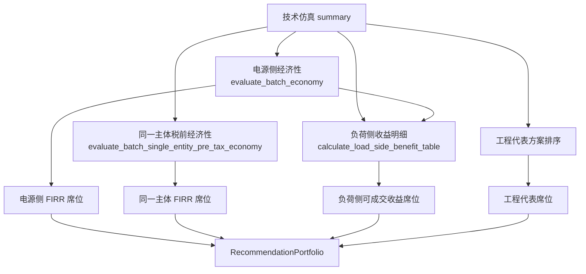

# 经济性评价与推荐 V1 模块导览

状态：2026-06-01 复核版
目标读者：第一次接触本项目、需要快速理解经济性评价和推荐席位如何运行的开发者或复核人员。

本文不是新的计算口径平行版本，而是把已落地代码、权威口径文档和推荐席位串成一张地图。若发现本文与代码不一致，以代码和对应测试为准，并同步修正文档。

## 1. 一句话定位

经济性评价 V1 是技术仿真之后的只读评价层：

```text
技术方案汇总 summary
-> 电源侧年度现金流
-> 同一主体税前年度现金流
-> 负荷侧可成交收益明细
-> 推荐组合 RecommendationPortfolio
```

它不重新调度风、光、储，不修改 SOC、上网、弃电、自发自用等技术结果。所有经济性和推荐计算都通过 `scenario_id` 与技术结果关联。

## 2. 主要代码入口

| 模块 | 作用 | 主要对象 / 函数 |
|---|---|---|
| `src/green_direct/economy/economic_inputs.py` | 经济性输入参数模型 | `EconomicParams`, `AvoidedGridPurchaseParams`, `OtherOperatingRevenueItem` |
| `src/green_direct/economy/economic_evaluator.py` | 电源侧项目投资现金流 | `evaluate_scenario_economy`, `evaluate_batch_economy` |
| `src/green_direct/economy/electricity_saving.py` | 外部购电节费、组价、上网收入辅助函数 | `calc_net_avoided_grid_cost_price`, `calc_avoided_grid_purchase_cash_price`, `calc_self_use_saving` |
| `src/green_direct/economy/single_entity_evaluator.py` | 同一主体税前增量现金流 | `evaluate_single_entity_pre_tax_economy`, `evaluate_batch_single_entity_pre_tax_economy` |
| `src/green_direct/recommendation/recommendation_engine.py` | 四个默认推荐席位 | `build_recommendation_result`, `RecommendationParams` |
| `src/green_direct/services/study_runner.py` | 经济性评价和推荐组合的服务层编排 | `run_economic_study`, `build_recommendation_study`, `RecommendationInputSnapshot` |
| `src/green_direct/ui/app.py` | Streamlit 五阶段工作流、参数收集、计算按钮、展示和下载 | `WORKFLOW_PAGES`, `_render_economy_v1`, `_render_recommendation_analysis_page`, `_render_exports_and_reports_page`, `_render_recommendation_v1` |
| `src/green_direct/ui/field_labels.py` | 字段中文名和显示格式 | `FIELD_LABELS`, `format_display_frame` |

相关测试：

| 测试文件 | 覆盖重点 |
|---|---|
| `tests/test_economy_v1.py` | 电源侧现金流、税费、折旧、储能更换、FIRR 求解 |
| `tests/test_single_entity_economy.py` | 同一主体节费、税前 FIRR、价税分离、环境价值 |
| `tests/test_recommendation_v1.py` | 推荐席位排序、负荷侧可成交门槛、席位合并 |
| `tests/test_study_runner.py` | 服务层经济性编排、推荐输入快照和推荐组合构建 |
| `tests/test_ui_import.py` | UI 导入、页面状态兼容、简版报告和同一主体年度现金流导出结构 |

## 3. 数据流



## 4. 技术 summary 字段如何被使用

| 技术字段 | 单位 | 读取位置 | 用途 |
|---|---:|---|---|
| `scenario_id` | - | 全部经济性和推荐模块 | 跨模块关联主键 |
| `wind_capacity` | 万kW | 电源侧、同一主体、推荐投资估算 | 风电投资、风电运维、折旧、展示 |
| `pv_capacity` | 万kW | 电源侧、同一主体、推荐投资估算 | 光伏投资、光伏运维、折旧、展示 |
| `bess_power` | 万kW | 电源侧、同一主体 | 储能运维成本 |
| `bess_energy` | 万kWh | 电源侧、同一主体 | 储能初始投资、储能更换投资 |
| `grid_export_energy` | 万kWh | 电源侧、同一主体 | 上网售电收入 |
| `self_use_energy` | 万kWh | 电源侧、同一主体、负荷侧 | 绿电结算收入、外部购电节费、负荷侧节费 |
| `annual_equivalent_cycles` | 次/年 | 电源侧、同一主体 | 推导储能循环寿命更换年份 |
| `replacement_year` | 年 | 电源侧、同一主体 | 若存在则优先作为储能更换间隔 |
| `pass_policy` | bool | 推荐引擎 | 默认推荐席位的前置过滤 |
| `green_load_rate` | decimal | 推荐引擎 | 高绿电占比和辅助排序 |
| `self_use_rate` | decimal | 推荐引擎 | 高自发自用排序 |
| `curtail_rate` / `curtail_energy` | decimal / 万kWh | 推荐引擎 | 低弃电工程代表排序 |

当前单位换算约定：

```text
容量（万kW） * 单位造价（元/kW） = 投资（万元）
电量（万kWh） * 电价（元/kWh） = 收入或节费（万元）
```

## 5. 参数总览

### 5.1 `EconomicParams`

`EconomicParams` 是电源侧和同一主体共用的项目经济参数。部分参数只被电源侧完整税后现金流使用，部分参数被同一主体税前现金流复用。

| 参数 | 默认值 | 单位 / 类型 | 含义 | 主要用于 |
|---|---:|---|---|---|
| `operation_years` | 25 | 年 | 运营期年数，Year 0 为建设期 | 电源侧、同一主体 |
| `wind_capex_per_kw_with_vat` | 4500 | 元/kW，含税 | 风电单位造价 | 电源侧、同一主体、推荐投资估算 |
| `pv_capex_per_kw_with_vat` | 2500 | 元/kW，含税 | 光伏单位造价 | 电源侧、同一主体、推荐投资估算 |
| `bess_capex_per_kwh_with_vat` | 900 | 元/kWh，含税 | 储能单位造价 | 电源侧、同一主体、推荐投资估算 |
| `dedicated_connection_line_investment_with_vat` | 0 | 万元，含税 | 送出线路工程投资，Year 0 发生 | 电源侧、同一主体、推荐投资估算 |
| `other_fixed_asset_investment_with_vat` | 0 | 万元，含税 | 其他固定资产投资 | 电源侧、同一主体、推荐投资估算 |
| `construction_input_vat_rate` | 0.10 | decimal | 建设投资进项税率 | 电源侧税费、同一主体投资基础 |
| `construction_input_vat_deductible` | True | bool | 建设投资进项税是否可抵扣 | 电源侧税费、同一主体投资基础 |
| `wind_om_cost_per_kw_year` | 50 | 元/kW/年 | 风电年运维 | 电源侧、同一主体 |
| `pv_om_cost_per_kw_year` | 25 | 元/kW/年 | 光伏年运维 | 电源侧、同一主体 |
| `bess_om_cost_per_kw_year` | 18 | 元/kW/年 | 储能年运维，按功率 | 电源侧、同一主体 |
| `other_operating_cost_with_vat` | 0 | 万元/年 | 其他运行成本，V1 不拆进项税 | 电源侧、同一主体 |
| `grid_export_price_with_vat` | 0.25 | 元/kWh，含税 | 上网电价 | 电源侧、同一主体 |
| `self_use_price_with_vat` | 0.40 | 元/kWh，含税 | 迁移期字段，UI 已解释为绿电结算价 | 电源侧 |
| `output_vat_rate` | 0.13 | decimal | 销项税率 | 电源侧、同一主体上网收入价税分离 |
| `other_operating_revenues` | 空 | tuple | 其他经营收入项，可为负值 | 电源侧、同一主体 |
| `bess_replacement_cost_ratio` | 0.50 | decimal | 储能更换投资占初始储能投资比例 | 电源侧、同一主体 |
| `bess_replacement_input_vat_rate` | 0.13 | decimal | 储能更换进项税率 | 电源侧税费、同一主体更换基础 |
| `bess_replacement_input_vat_deductible` | True | bool | 储能更换进项税是否可抵扣 | 电源侧、同一主体 |
| `bess_cycle_life` | 6000 | 次 | 储能循环寿命 | 储能更换年份 |
| `bess_calendar_life_years` | 15 | 年 | 储能日历寿命 | 储能更换年份 |
| `urban_maintenance_tax_rate` | 0.05 | decimal | 城建税率，按实缴增值税 | 电源侧 |
| `education_surcharge_rate` | 0.03 | decimal | 教育费附加 | 电源侧 |
| `local_education_surcharge_rate` | 0.02 | decimal | 地方教育附加 | 电源侧 |
| `income_tax_rate` | 0.25 | decimal | 企业所得税率 | 电源侧 |
| `loss_carryforward_years` | 5 | 年 | 亏损弥补年限 | 电源侧 |
| `discount_rate` | 0.06 | decimal | 折现率，只用于 FNPV 和动态回收期 | 电源侧、同一主体 |

### 5.2 `AvoidedGridPurchaseParams`

`AvoidedGridPurchaseParams` 是“外部购电节费 / 电费组价”参数。它服务同一主体税前经济性，也可在组价模式下推导负荷侧可减少购网费用现金单价。

| 参数 | 默认值 | 单位 | 含义 | 主要用于 |
|---|---:|---|---|---|
| `net_avoided_grid_cost_price` | None | 元/kWh | 同一主体口径下的外部购电税前净节费单价；简化模式由用户直接输入 | 同一主体 FIRR |
| `energy_market_price_with_vat` | 0 | 元/kWh，含税 | 电能量 / 市场购电价格 | 组价模式 |
| `line_loss_price_with_vat` | 0 | 元/kWh，含税 | 上网环节线损费用 | 组价模式 |
| `system_operation_fee_with_vat` | 0 | 元/kWh，含税 | 系统运行费用 | 组价模式 |
| `transmission_distribution_tariff_with_vat` | 0 | 元/kWh，含税 | 输配电价 | 组价模式 |
| `gov_fund_surcharge` | 0 | 元/kWh | 政府性基金及附加，无增值税 | 组价模式 |
| `green_direct_retained_transmission_distribution_tariff_with_vat` | 0 | 元/kWh，含税 | 自发自用绿电仍需缴纳的输配电价 | 组价模式扣减 |
| `green_direct_retained_gov_fund_surcharge` | 0 | 元/kWh | 自发自用绿电仍需缴纳的政府基金及附加 | 组价模式扣减 |
| `grid_purchase_vat_rate` | 0.13 | decimal | 电网购电增值税率 | 价税分离 |
| `environmental_value_per_kwh` | 0 | 元/kWh | 环境价值，高级项 | 同一主体、负荷侧 |

重要边界：

```text
net_avoided_grid_cost_price
  = 同一主体税前净节费单价
  不等于负荷侧比较绿电结算价时的到户电量费用现金口径。
```

本次复核后，简化固定价模式下 UI 默认只要求用户填写一个“外部购电净成本单价”。程序会用它作为同一主体税前 FIRR 的固定价输入，并在负荷侧可成交收益中作为简化筛选价。若需要更准确地区分两种口径，用户有两条路径：

1. 启用“电费清单组价”，由同一组账单字段内部推导两个口径；
2. 在高级选项中单独覆盖“负荷侧可减少购网费用单价”。

| UI 输入 | 进入字段 | 用途 |
|---|---|---|
| 外部购电净成本单价 | `net_avoided_grid_cost_price` | 同一主体 FIRR |
| 负荷侧可减少购网费用单价 | `load_side_avoided_charge_price` | 负荷侧可成交收益；默认内部推导或复用简化固定价，高级覆盖 |

若启用“按电费清单组价”，组价字段会同时推导：

```text
外部购电净成本单价 =
  (含税电量类费用 - 含税仍缴费用) / (1 + 增值税率)
  + 无税政府基金及附加差额
```

```text
负荷侧可减少购网费用现金单价 =
  含税电量类费用 + 政府基金及附加
  - 绿电直连后仍需支付的含税/无税费用
```

### 5.3 `OtherOperatingRevenueItem`

| 参数 | 含义 |
|---|---|
| `name` | 收入项名称 |
| `amount_with_vat` | 金额，万元/年，含税；负值按收入抵减或经营性支出处理 |
| `vat_rate` | 正值收入的销项税率 |
| `active_rule` | `every_year`、`first_20_years`、`first_25_years`、`specific_years` |
| `specific_years` | 指定运营年列表 |

电源侧中，正值其他收入拆销项税；负值不产生销项税也不产生进项税。同一主体中，其他收入使用不含税金额进入税前现金流。

### 5.4 `RecommendationParams`

| 参数 | 默认值 | 单位 / 类型 | 含义 | 使用席位 |
|---|---:|---|---|---|
| `load_side_avoided_charge_price` | 无默认 | 元/kWh | 负荷侧可减少购网费用现金单价 | 负荷侧可成交收益 |
| `green_power_settlement_price_with_vat` | 无默认 | 元/kWh，含税 | 绿电结算价。电源侧为收入，负荷侧为购电成本，同一主体不作为整体收益 | 电源侧、负荷侧 |
| `environmental_value_per_kwh` | 0 | 元/kWh | 环境价值，高级项 | 负荷侧；同一主体由 `AvoidedGridPurchaseParams` 进入 |
| `min_power_side_acceptable_firr` | 0.07 | decimal 或 None | 电源侧最低可接受 FIRR；为空时负荷侧席位 pending | 负荷侧可成交收益 |
| `single_entity_view` | `firr` | str | 同一主体席位视角；可切换为动态回收期最短 | 同一主体席位 |
| `engineering_view` | `min_investment` | str | 工程代表方案视角 | 工程代表方案 |

## 6. 三个经济性视角

### 6.1 电源侧项目投资现金流

入口：

```text
evaluate_scenario_economy(summary, EconomicParams)
evaluate_batch_economy(summary_df, EconomicParams)
```

适用解释：

```text
电源侧投资方建设风、光、储、送出线路等资产，
通过绿电结算价和上网电价获得售电收入。
```

收入：

```text
含税上网收入 = grid_export_energy * grid_export_price_with_vat
含税自发自用售电收入 = self_use_energy * self_use_price_with_vat
含税营业收入 = 上网收入 + 自发自用售电收入 + 其他经营收入
```

成本：

```text
年运行成本 =
  wind_capacity * wind_om_cost_per_kw_year
  + pv_capacity * pv_om_cost_per_kw_year
  + bess_power * bess_om_cost_per_kw_year
  + other_operating_cost_with_vat
```

Year 0 投资：

```text
建设投资现金流出 =
  风电投资 + 光伏投资 + 储能投资
  + 送出线路工程投资 + 其他固定资产投资
```

税费：

```text
销项税 = 含税收入拆税
进项税 = Year 0 建设投资进项税 + 储能更换进项税
实缴增值税 = max(销项税 - 可用留抵/进项税, 0)
附加税费 = 实缴增值税 * 附加税率
所得税 = max(利润总额 - 可弥补亏损, 0) * 所得税率
```

净现金流：

```text
Year 0:
  net_cash_flow = -construction_cash_outflow

运营期:
  net_cash_flow =
    operating_revenue_with_vat
    - operating_cost_with_vat
    - bess_replacement_cash_outflow
    - vat_payable
    - taxes_and_surcharges
    - income_tax
```

主要输出：

| 输出字段 | 含义 | 推荐使用 |
|---|---|---|
| `firr` / `firr_status` | 电源侧 FIRR 及可靠性状态 | 电源侧 FIRR 席位、负荷侧可成交门槛 |
| `fnpv` | 财务净现值 | 电源侧辅助排序 |
| `static_payback_year` | 静态回收期 | 电源侧辅助排序 |
| `dynamic_payback_year` | 动态回收期 | 电源侧辅助排序 |
| `construction_cash_outflow` | Year 0 建设投资含税现金流出 | 工程代表最小投资、负荷侧辅助排序 |
| `annual_cashflow` | 年度现金流明细表 | 下载和审计 |

### 6.2 同一主体税前增量现金流

入口：

```text
evaluate_single_entity_pre_tax_economy(summary, AvoidedGridPurchaseParams, EconomicParams)
evaluate_batch_single_entity_pre_tax_economy(summary_df, AvoidedGridPurchaseParams, EconomicParams)
```

适用解释：

```text
电源和负荷处在同一经济决策边界内。
绿电结算价只是内部价格，不作为项目整体新增收益。
收益来自少向外部电网购电、上网售电和显式环境价值。
```

核心收益：

```text
自发自用购电节费 =
  self_use_energy * net_avoided_grid_cost_price
```

```text
上网不含税收入 =
  grid_export_energy * grid_export_price_with_vat / (1 + output_vat_rate)
```

Year 0 投资基础：

```text
initial_investment_basis =
  可抵扣时：含税建设投资 / (1 + 建设投资进项税率)
  不可抵扣时：含税建设投资
```

税前净现金流：

```text
Year 0:
  pre_tax_net_cash_flow = -initial_investment_basis

运营期:
  pre_tax_net_cash_flow =
    self_use_saving
    + environmental_value
    + grid_export_revenue_without_vat
    + other_external_revenue_without_vat
    - operating_cost_basis
    - bess_replacement_basis
```

主要输出：

| 输出字段 | 含义 | 推荐使用 |
|---|---|---|
| `single_entity_firr_pre_tax` / `single_entity_firr_status` | 同一主体税前 FIRR 及可靠性状态 | 同一主体 FIRR 席位 |
| `single_entity_fnpv_pre_tax` | 同一主体税前 FNPV | 同一主体辅助排序 |
| `single_entity_static_payback_year` | 同一主体静态回收期 | 同一主体辅助排序 |
| `initial_investment_basis` | 税前评价投资基础 | 同一主体排序和审计 |
| `annual_self_use_saving` | 年自发自用购电节费 | 审计和解释 |
| `annual_avoided_grid_purchase_cash_saving` | 年少付电网电费现金额，仅辅助展示 | 不进入税前 FIRR |
| `annual_cashflow` | 年度税前现金流明细表 | 下载和审计 |

必须记住：

```text
同一主体 FIRR 不使用 green_power_settlement_price_with_vat。
```

### 6.3 负荷侧可成交收益

入口：

```text
calculate_load_side_benefit_table(summary, power_economy_summary, RecommendationParams)
select_load_side_tradable_recommendation(load_side_table)
```

适用解释：

```text
负荷侧不承担初始投资，因此不计算负荷侧 FIRR。
该席位只计算年度用能收益，并要求电源侧 FIRR 达到最低可接受水平。
```

收益单价：

```text
load_side_saving_price =
  load_side_avoided_charge_price
  - green_power_settlement_price_with_vat
```

年度收益：

```text
load_side_annual_benefit =
  self_use_energy * load_side_saving_price
  + self_use_energy * environmental_value_per_kwh
```

默认可成交筛选：

```text
pass_policy == True
load_side_annual_benefit > 0
firr_status == "ok"
firr >= min_power_side_acceptable_firr
```

若 `min_power_side_acceptable_firr` 为空，则该席位为 `pending`，不静默推荐。

主要输出：

| 输出字段 | 含义 |
|---|---|
| `load_side_avoided_charge_price` | 负荷侧可减少购网费用单价 |
| `green_power_settlement_price_with_vat` | 绿电结算价 |
| `load_side_saving_price` | 负荷侧节约电费单价 |
| `load_side_annual_benefit` | 负荷侧年度综合用能收益 |
| `load_side_tradable` | 是否满足可成交筛选 |
| `load_side_tradable_status` | 不可成交或待定原因 |
| `power_side_firr_threshold` | 电源侧最低可接受 FIRR |

## 7. 四个默认推荐席位

`build_recommendation_result()` 会构造以下四个席位，并用 `build_recommendation_portfolio()` 合并命中同一 `scenario_id` 的卡片。

| 席位 | 输入 | 候选过滤 | 主排序 | 辅助排序 |
|---|---|---|---|---|
| 同一主体视角 | 技术 summary + 同一主体经济性汇总 | 政策达标；所选指标可可靠计算 | 默认 `single_entity_firr_pre_tax` 高；可切换为 `single_entity_dynamic_payback_year` 短 | FIRR、回收期、FNPV、投资基础 |
| 电源侧 FIRR 最优 | 技术 summary + 电源侧经济性汇总 | 政策达标；`firr_status == ok` | `firr` 高 | 静态回收期短、动态回收期短、FNPV 高、建设投资低 |
| 负荷侧可成交收益最优 | 技术 summary + 电源侧经济性汇总 + 推荐参数 | 政策达标；负荷侧收益为正；电源侧 FIRR 达标 | `load_side_annual_benefit` 高 | 电源侧 FIRR 高、回收期短、投资低、绿电占比高、弃电率低 |
| 工程代表方案 | 技术 summary + 可选经济性投资 | 政策达标 | 由 `engineering_view` 决定 | 见下表 |

工程代表方案视角：

| `engineering_view` | 中文名 | 排序链 |
|---|---|---|
| `min_investment` | 政策达标最小投资 | 建设投资低、绿电占比高、弃电率低 |
| `low_curtail` | 低弃电工程代表 | 弃电率低、弃电量低、建设投资低、绿电占比高 |
| `high_green_load` | 高绿电占比 | 绿电占比高、自发自用电量高、建设投资低 |
| `high_self_use` | 高自发自用 | 自发自用率高、弃电率低、建设投资低 |

## 8. 当前复核结论

1. 电源侧、同一主体、负荷侧三套经济口径已经分层实现，没有改动技术调度结果。
2. 同一主体税前 FIRR 已经独立于电源侧现金流，不再把绿电结算价当作同一主体整体收益。
3. 本次修正了一个重要口径风险：负荷侧可减少购网费用单价与同一主体净节费单价不是同一个经济含义。默认 UI 不强迫用户输入两次；准确模式通过电费清单组价或高级覆盖实现。
4. 本次修正了工程代表方案排序的健壮性：当候选表缺少部分辅助排序列时，排序列和升降序会一起过滤，避免服务化后因部分字段缺失而崩溃。
5. 工程代表方案默认从“低弃电”调整为“政策达标最小投资”，更适合作为工程基准方案；低弃电、高绿电占比、高自发自用保留为可切换视角。
6. 同一主体席位保留 FIRR 默认视角，同时支持切换为“动态回收期最短”，用于观察更偏快速回收的方案。
7. 仍需后续处理的架构问题：经济性和推荐计算目前仍由 Streamlit 页面编排；未来在线化时，应抽出 `StudyResult` / `ResultStore` / 服务层，避免 UI 承担业务编排。

## 9. 新人阅读顺序

建议按这个顺序读：

1. 先读本文，建立模块地图。
2. 读 `docs/references/economic_evaluation/经济性评价V1计算口径_合并版.md`，理解电源侧年度现金流。
3. 读 `docs/references/recommendation_engine/同一主体购电节费与税前FIRR口径.md`，理解同一主体为何不能复用电源侧模型。
4. 读 `docs/references/recommendation_engine/推荐引擎V1计算口径草案.md`，理解四个默认推荐席位。
5. 最后对照 `tests/test_economy_v1.py`、`tests/test_single_entity_economy.py`、`tests/test_recommendation_v1.py`，确认代码行为。

## 10. 后续建议

短期优先级：

1. 为负荷侧可减少购网费用单价补充更完整的组价和导出说明。
2. 把经济性参数、推荐参数和计算结果整理成更明确的数据对象，减少 UI 直接传参。
3. 增加价格曲线 CSV/Excel 输入模板，先支持 8760 / 8784 小时固定对齐。
4. 引入 `StudyResult` 和 `ResultStore`，让网页端默认只加载 summary 和推荐场景逐时明细。

不建议短期做：

1. 把电价优化直接塞进现有贪心调度。
2. 在没有价格曲线模板前，让用户在网页上逐小时录入价格。
3. 把容需量电费、力调电费、融资、残值、递延所得税等复杂模型混入 V1 默认口径。
