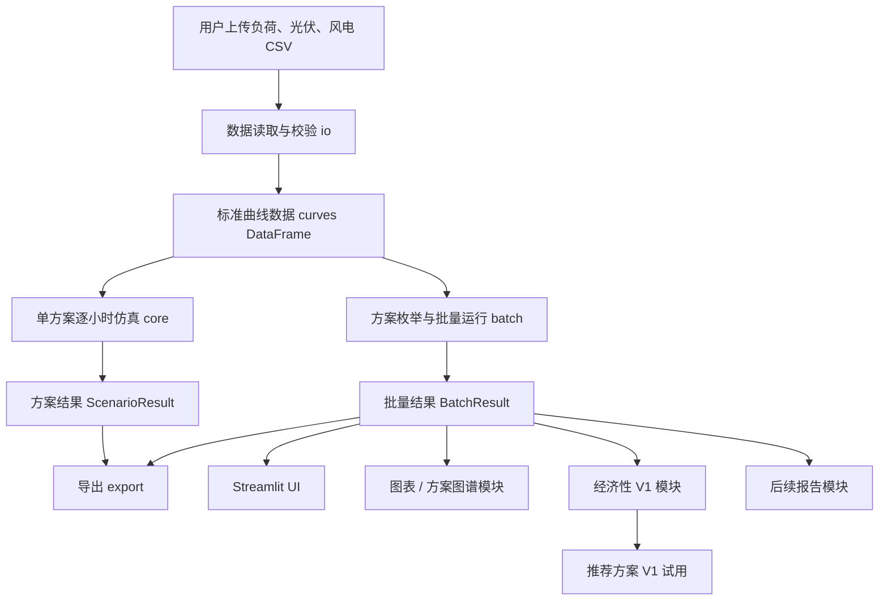
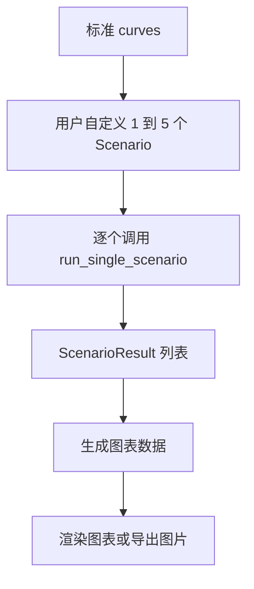

# 绿电直连风光储测算软件总览与接口文档

本文档面向后续模块开发者和 AI 协作上下文，说明当前软件的模块边界、核心计算口径、数据结构和接口契约。后续图表制作、经济性评价、报告生成等模块应优先参考本文档接入当前 V0.1 技术测算模块。

状态：V0.1 技术测算基线 + 经济性 / 推荐 V1 试用接口说明 + 服务层 StudyResult 雏形
最近更新：2026-06-04
适用范围：当前代码位于 `src/green_direct/`

## 1. 软件定位

本软件用于绿电直连项目中风电、光伏、储能多方案配置的技术测算、政策指标筛选、经济性测算和代表方案推荐。

当前 V0.1 风光储技术测算仍是回归基线，核心能力包括：

- 读取负荷、光伏、风电逐小时曲线；
- 支持 8760 小时普通年和 8784 小时闰年；
- 批量枚举风光储容量组合；
- 对每个方案进行逐小时能量平衡；
- 滚动计算储能 SOC；
- 计算自发自用、绿电占比、上网、弃电、下网、站用电等指标；
- 按政策参数判断方案是否达标；
- 导出 Excel 汇总表和逐小时 CSV 明细；
- 提供基础 Streamlit UI；
- 提供经济性评价 V1：电源侧年度现金流、FNPV、FIRR、静态/动态回收期；
- 提供同一主体税前经济性试算：自发自用购电节费、税前 FIRR、年度现金流；
- 提供推荐方案 V1 试用：同一主体 FIRR、电源侧 FIRR、负荷侧可成交收益和工程代表方案四类席位；
- 提供第一版服务层入口：`run_technical_study()`、`run_economic_study()`、`build_recommendation_study()` 和顶层 `StudyResult` 雏形；
- 提供独立方案遍历试用程序：只包装风光储技术遍历和方案概览/详表导出。

当前版本仍明确不做：

- 电价时段优化和储能套利；
- 数学规划优化；
- 自动生成可研报告；
- 完整离网型源网荷储可靠性分析。

## 2. 文档用途

本文档解决的问题是：后续模块如何接上当前技术测算模块。

推荐理解为三类工程文档的合并版：

- 系统架构说明：说明软件由哪些模块组成；
- 模块接口契约：说明模块间传递什么数据、字段口径是什么；
- 集成指南：说明后续模块应该依赖哪些入口，不应该依赖哪些内部实现。

`notes/PRODUCT_POLISH_LOG.md` 记录讨论和决策过程，本文档记录当前应遵守的稳定口径。两者分工不同。

## 3. 总体架构



后续模块的推荐依赖方向：

```text
io -> core -> batch -> export/ui
                  -> visualization/economy/recommendation/report
```

约束：

- 图表、经济性、报告模块应调用 `core`、`batch`、`export` 暴露的数据结果。
- 不应依赖 `src/green_direct/ui/app.py` 里的 Streamlit 控件状态作为业务接口。
- 不应在图表或经济性模块中重复实现风光储逐小时调度逻辑。
- 不应在 V0.1 核心技术测算模块中混入经济性评价。

## 4. 当前目录结构

```text
src/green_direct/
├─ io/
│  ├─ read_curves.py
│  └─ validators.py
├─ models/
│  ├─ params.py
│  ├─ results.py
│  └─ scenario.py
├─ core/
│  ├─ bess_dispatch.py
│  ├─ metrics.py
│  └─ single_scenario_simulator.py
├─ batch/
│  ├─ scenario_generator.py
│  └─ batch_runner.py
├─ services/
│  └─ study_runner.py
├─ export/
│  ├─ csv_exporter.py
│  └─ excel_exporter.py
├─ economy/
│  ├─ economic_inputs.py
│  └─ economic_evaluator.py
├─ ui/
│  └─ app.py
└─ cli.py
```

模块职责：

| 模块 | 职责 | 后续模块是否应直接依赖 |
|---|---|---|
| `io` | CSV 读取、编码识别、列校验、曲线标准化 | 可以 |
| `models` | 参数、方案、结果数据结构 | 可以 |
| `core` | 单方案逐小时仿真、储能调度、指标计算 | 可以，核心依赖 |
| `batch` | 方案枚举、批量仿真、进度回调 | 可以，核心依赖 |
| `services` | 面向 UI / CLI / 后续在线化的业务编排入口，当前包装技术仿真、经济性和推荐组合 | 推荐优先依赖 |
| `export` | Excel、CSV、ZIP、配置快照导出 | 可以 |
| `ui` | Streamlit 用户界面 | 不建议作为业务依赖 |
| `economy` | 经济性评价 V1：年度现金流、税费、折旧、储能更换、FNPV/FIRR/回收期 | 可以，但不得反向修改技术调度 |

## 5. 统一单位

| 数据 | 单位 |
|---|---|
| 负荷功率 | 万千瓦 |
| 光伏容量 | 万千瓦 |
| 风电容量 | 万千瓦 |
| 储能功率 | 万千瓦 |
| 上网、下网功率 | 万千瓦 |
| 储能容量 | 万千瓦时 |
| 每小时电量 | 万千瓦时 |
| 年度电量 | 万千瓦时 |
| 光伏、风电曲线 | 标幺值 |
| SOC、比例指标 | 0 到 1 的小数 |

比例字段在程序内部统一用小数表达，例如 `0.30` 表示 30%。UI 或报告层可以格式化为百分比。

## 6. 标准输入数据契约

技术测算核心使用一个标准化后的 `curves` DataFrame：

| 字段 | 类型 | 说明 |
|---|---|---|
| `timestamp` | datetime-like | 小时时间戳 |
| `load_power` | float | 用户负荷功率，万千瓦，不能为负 |
| `pv_pu` | float | 光伏标幺值，允许为负 |
| `wind_pu` | float | 风电标幺值，允许为负 |

行数要求：

- 支持 8760 行；
- 支持 8784 行；
- 负荷、光伏、风电三条曲线必须行数一致；
- 三条曲线的时间戳必须逐行一致。

光伏、风电负值口径：

- 负值不视为错误；
- 负值不自动截断；
- 负值表示新能源电源在不发电时产生的站用电；
- 站用电参与逐小时能量平衡，并在结果中单独统计。

光伏、风电大于 1 的口径：

- 默认允许参与计算；
- UI 会提示出现点数，供用户复核；
- 当前版本不自动截断。

## 7. 参数模型接口

参数模型位于 `src/green_direct/models/params.py`。

### 7.1 数据清洗参数

```python
DataCleaningParams(
    allow_negative_pu=True,
    allow_small_negative_pu=True,
    small_negative_tolerance=-0.001,
    clip_small_negative_to_zero=False,
    allow_pu_greater_than_one=True,
    clip_pu_greater_than_one=False,
)
```

当前产品口径下，风光负值应按站用电参与计算，因此默认不截断负值。

### 7.2 储能参数

```python
BessParams(
    soc_initial=0.5,
    soc_min=0.1,
    soc_max=0.9,
    eta_charge=0.95,
    eta_discharge=0.95,
    cycle_life=6000.0,
)
```

含义：

| 字段 | 说明 |
|---|---|
| `soc_initial` | 初始 SOC |
| `soc_min` | 最小 SOC |
| `soc_max` | 最大 SOC |
| `eta_charge` | 充电效率 |
| `eta_discharge` | 放电效率 |
| `cycle_life` | 电池循环寿命，用于估算等效循环和更换年份 |

### 7.3 政策参数

```python
PolicyParams(
    self_use_rate_min=0.60,
    green_load_rate_min=0.30,
    export_rate_max=0.20,
    allow_export=True,
    export_power_max=None,
    grid_exchange_power_limit=None,
    export_control_mode="annual_cap_runtime",
)
```

含义：

| 字段 | 说明 |
|---|---|
| `self_use_rate_min` | 新能源自发自用电量占新能源总可用发电量的最低比例 |
| `green_load_rate_min` | 新能源自发自用电量占用户总用电量的最低比例 |
| `export_rate_max` | 上网电量占新能源总可用发电量的最高比例 |
| `allow_export` | 是否允许上网 |
| `export_power_max` | 最大上网功率限制，当前 UI 暂不作为重点入口 |
| `grid_exchange_power_limit` | 与电网交换功率限制，同时约束上网和下网，`None` 表示无限制 |
| `export_control_mode` | 上网比例控制模式，见第 11 节 |

### 7.4 时间参数

```python
TimeParams(
    dt_hours=1.0,
    supported_hours=(8760, 8784),
)
```

当前版本默认 1 小时步长，但核心函数保留 `dt_hours` 参数，便于后续扩展到 15 分钟或其他时间尺度。

### 7.5 性能参数

```python
PerformanceParams(
    warn_if_scenarios_exceed=5000,
    parallel_workers=1,
)
```

用于批量测算时给出大方案数量提醒，并控制技术仿真的可选并行 worker 数。`parallel_workers=1` 为默认串行口径；设置为大于 1 时，`run_batch()` 会使用 `ProcessPoolExecutor` 按方案并行执行单方案调度，结果聚合仍保持 `scenario_id`、warning、error 和进度回调顺序稳定。

02 页 UI 还基于 `warn_if_scenarios_exceed` 做大批量保留策略：候选方案数未超过阈值时保留全部逐小时明细；超过阈值时进入汇总优先模式，只常驻方案汇总和前 N 个方案逐小时明细。N 由 02 页“大批量保留明细数”控制，默认 20。该策略只影响结果常驻内存和后续图表/导出可用明细，不改变任何方案的逐小时调度计算口径。

## 8. 方案模型接口

方案模型位于 `src/green_direct/models/scenario.py`。

```python
Scenario(
    scenario_id="S0001",
    pv_capacity=0.0,
    wind_capacity=0.0,
    bess_power=0.0,
    bess_energy=0.0,
)
```

字段：

| 字段 | 说明 |
|---|---|
| `scenario_id` | 方案编号 |
| `pv_capacity` | 光伏容量，万千瓦 |
| `wind_capacity` | 风电容量，万千瓦 |
| `bess_power` | 储能功率，万千瓦 |
| `bess_energy` | 储能容量，万千瓦时 |

派生属性：

| 属性 | 公式 |
|---|---|
| `bess_duration` | `bess_energy / bess_power`，无储能时为 0 |
| `bess_c_rate` | `bess_power / bess_energy`，无储能时为 0 |

约定：

- 纯光伏、纯风电、风光无储方案均通过容量为 0 表达；
- 无储能方案用 `bess_power=0` 且 `bess_energy=0` 表达；
- 不建议用 `bess_power>0` 且 `bess_energy=0` 表达有效储能方案。

## 9. 数据读取接口

数据读取模块位于 `src/green_direct/io/read_curves.py`。

### 9.1 自动编码读取

```python
read_csv_auto_encoding(source) -> tuple[pd.DataFrame, str]
```

支持的编码：

- `utf-8`
- `utf-8-sig`
- `gbk`
- `gb18030`

`source` 可以是文件路径、字节、或 Streamlit 上传文件等二进制对象。

### 9.2 单条曲线读取

```python
read_load_curve(source, time_col, value_col, ...)
read_pu_curve(source, time_col, value_col, curve_name, ...)
```

输出 `CurveData`：

```python
CurveData(
    data=pd.DataFrame,
    warnings=list[str],
    encoding=str,
)
```

### 9.3 三条曲线合并

```python
read_curve_set(
    load_source,
    pv_source,
    wind_source,
    load_time_col="时间",
    load_value_col="负荷",
    pv_time_col="时间",
    pv_value_col="光伏",
    wind_time_col="时间",
    wind_value_col="风电",
) -> CurveSet
```

输出 `CurveSet`：

```python
CurveSet(
    data=curves,
    warnings=[...],
    encodings={"load": "...", "pv": "...", "wind": "..."},
)
```

其中 `CurveSet.data` 就是第 6 节所述标准 `curves` DataFrame。

## 10. 单方案仿真接口

单方案仿真入口位于 `src/green_direct/core/single_scenario_simulator.py`。

```python
run_single_scenario(
    curves: pd.DataFrame,
    scenario: Scenario,
    *,
    bess_params: BessParams | None = None,
    policy_params: PolicyParams | None = None,
    dt_hours: float = 1.0,
) -> ScenarioResult
```

输出 `ScenarioResult`：

```python
ScenarioResult(
    summary=dict,
    hourly_detail=pd.DataFrame,
    warnings=list[str],
)
```

适用场景：

- 图表模块中用户自定义 1 到 5 个方案后，直接对每个方案调用；
- 批量测算后，用户选择某个方案重新生成逐小时明细；
- 单方案人工复核和测试。

不建议：

- 在后续模块中绕过 `run_single_scenario` 自己重写逐小时调度；
- 直接调用 `dispatch_hour` 作为业务入口。`dispatch_hour` 是内部小时级调度函数，适合测试和维护，不适合作为外部模块接口。

## 11. 当前计算口径

### 11.1 风光出力与站用电

每小时原始出力：

```text
pv_power = pv_pu * pv_capacity
wind_power = wind_pu * wind_capacity
```

拆分为正发电和站用电：

```text
pv_generation_power = max(pv_power, 0)
wind_generation_power = max(wind_power, 0)
pv_station_use_power = max(-pv_power, 0)
wind_station_use_power = max(-wind_power, 0)
```

新能源总可用发电功率：

```text
renewable_generation_power = pv_generation_power + wind_generation_power
```

站用电：

```text
station_use_power = pv_station_use_power + wind_station_use_power
```

用于调度的净新能源：

```text
net_renewable_power = renewable_generation_power - station_use_power
renewable_power = max(net_renewable_power, 0)
station_use_deficit_power = max(-net_renewable_power, 0)
```

参与调度的负荷需求：

```text
dispatch_load_power = load_power + station_use_deficit_power
```

注意：

- `total_load_energy` 只统计用户负荷，不包含站用电；
- `grid_import_energy` 可能包含用户负荷缺口，也可能包含站用电缺口；
- 图表和经济性模块如果需要展示电网购电口径，应明确说明是否包含站用电缺口。

### 11.2 储能调度

当前采用逐小时贪心策略：

1. 新能源先供负荷；
2. 富余新能源优先给储能充电；
3. 储能充不下的富余电量再按政策上网或弃电；
4. 新能源不足时，储能优先放电供负荷；
5. 储能不足后，由电网下网；
6. 若启用电网交换功率限制，下网功率超过限制的部分记录为缺口。

储能硬约束：

- 储能只能从富余新能源充电；
- 储能不能从电网充电；
- 储能不能同小时充电和放电；
- 储能不能放电上网；
- 储能放电只用于补足负荷或站用电缺口；
- SOC 逐小时滚动；
- SOC 受 `soc_min` 和 `soc_max` 限制；
- 充放电受储能功率、容量、效率限制。

### 11.3 上网比例约束

默认模式：

```text
export_control_mode = "annual_cap_runtime"
```

年度允许上网电量：

```text
export_cap_energy = total_renewable_generation * export_rate_max
```

该模式下，程序在逐小时运行中累计上网电量。额度用完后，后续富余新能源只能弃电，不再上网。

可选模式：

```text
export_control_mode = "post_check"
```

该模式下，逐小时先按可上网逻辑运行，最后用 `export_rate <= export_rate_max` 做后验达标判断。

### 11.4 与电网交换功率限制

`grid_exchange_power_limit` 同时约束上网和下网，单位为万千瓦。

当 `grid_exchange_power_limit is None` 时表示无限制。

上网侧：

```text
grid_export_power <= grid_exchange_power_limit
```

超出部分记入：

```text
curtail_due_to_exchange_limit_power
curtail_due_to_exchange_limit_energy
```

下网侧：

```text
grid_import_power <= grid_exchange_power_limit
```

程序先让储能放电降低下网需求。如果仍超过限制，则超出部分记入：

```text
exchange_import_shortfall_power
exchange_import_shortfall_energy
```

只要存在下网缺口，方案判定为不达标。

## 12. 批量测算接口

批量测算入口位于 `src/green_direct/batch/batch_runner.py`。

### 12.1 估算方案数量

```python
estimate_scenario_count(raw_grid: dict) -> int
```

用于 UI 展示“方案数量预估”，也可用于后续大批量模式判断。

### 12.2 批量运行

```python
run_batch(
    curves: pd.DataFrame,
    scenario_grid: dict,
    *,
    bess_params: BessParams | None = None,
    policy_params: PolicyParams | None = None,
    performance_params: PerformanceParams | None = None,
    dt_hours: float = 1.0,
    progress_callback: Callable[[int, int, Scenario], None] | None = None,
) -> BatchResult
```

`scenario_grid` 示例：

```python
scenario_grid = {
    "pv_capacity": {"start": 0, "end": 8, "step": 1},
    "wind_capacity": {"start": 0, "end": 5, "step": 1},
    "bess_power": {"start": 0, "end": 1, "step": 0.25},
    "bess_duration_hours": [0, 2, 4],
}
```

说明：

- `0` 小时储能用于表达无储能方案，UI 中可隐藏为“包含无储能方案”勾选项；
- 当 `pv_capacity <= 0` 且 `wind_capacity <= 0` 时，方案会被跳过，候选池不包含无绿电来源或仅储能方案；
- 当 `bess_power == 0` 且 `duration > 0` 时，方案会被跳过；
- 当 `bess_power > 0` 且 `duration == 0` 时，方案会被跳过。

`progress_callback` 形如：

```python
def progress_callback(index: int, total: int, scenario: Scenario) -> None:
    ...
```

适合 Streamlit 进度条或 CLI 进度显示。

### 12.3 批量结果

```python
BatchResult(
    summary=pd.DataFrame,
    hourly_details=dict[str, pd.DataFrame],
    errors=pd.DataFrame,
    warnings=list[str],
    scenario_count=int,
)
```

字段含义：

| 字段 | 说明 |
|---|---|
| `summary` | 每个成功方案一行的汇总表 |
| `hourly_details` | `scenario_id -> hourly_detail` 的字典 |
| `errors` | 单方案失败记录，不影响其他方案继续运行 |
| `warnings` | 非致命警告 |
| `scenario_count` | 本次枚举方案总数 |

大批量性能注意：

- 当前 `BatchResult.hourly_details` 会保存所有成功方案的逐小时明细；
- 当方案数量达到上万时，内存和 UI 交互可能成为瓶颈；
- 02 页已接入第一版“汇总优先”大批量模式，超过方案数提醒阈值时不再默认常驻全部逐小时明细；
- 后续建议继续增加代表方案按需补算明细，并把技术仿真、经济性测算和图表导出逐步改为后台任务；
- 多人内部试用时，计算任务应通过 `Job` / `ResultStore` 隔离到项目和用户，不能依赖全局 `session_state` 或项目级运行快照；
- 图表模块若只展示 1 到 5 个方案，不应强制依赖所有方案的逐小时明细都已保存在内存中。

### 12.4 服务层技术测算入口

`src/green_direct/services/study_runner.py` 已提供第一版技术测算服务入口：

```python
TechnicalStudyInput(...)
run_technical_study(inputs) -> TechnicalStudyResult
StudyResult.from_technical(technical_result) -> StudyResult
```

当前 `run_technical_study()` 内部仍调用本节所述 `read_curve_set()` 和 `run_batch()`，不改变 V0.1 技术仿真和储能调度口径。它负责把 UI / CLI 收集到的三条曲线、列名、方案池、储能参数、政策参数和性能参数组织成一次技术研究，并输出：

- `TechnicalStudyResult.batch_result`：旧 `BatchResult`，用于兼容现有图表、经济性、推荐和导出模块；
- `TechnicalStudyResult.input_diagnostics`：曲线读取和清洗产生的结构化诊断；
- `TechnicalStudyResult.config_snapshot`：本次测算方案池、储能参数、政策参数、时间参数、编码和 warning 快照；
- `StudyResult`：顶层结果雏形，当前先包装技术结果，并可挂载经济性和推荐结果。

后续新模块建议优先依赖服务层对象，再按需读取其中的 `batch_result` 兼容旧模块；不建议继续把 Streamlit 页面函数作为业务入口。

## 13. 汇总结果字段

汇总表字段由 `src/green_direct/export/excel_exporter.py` 中的 `SUMMARY_COLUMNS` 对齐。

| 字段 | 说明 | 后续模块用途 |
|---|---|---|
| `scenario_id` | 方案编号 | 图表选择、经济性关联、报告引用 |
| `pv_capacity` | 光伏容量，万千瓦 | 容量对比、投资测算 |
| `wind_capacity` | 风电容量，万千瓦 | 容量对比、投资测算 |
| `bess_power` | 储能功率，万千瓦 | 储能配置、投资测算 |
| `bess_energy` | 储能容量，万千瓦时 | 储能配置、投资测算 |
| `bess_duration` | 储能时长，小时 | 储能方案分类 |
| `bess_c_rate` | 储能 C 倍率 | 储能性能分析 |
| `total_load_energy` | 用户总用电量，万千瓦时 | 绿电占比、经济性基准 |
| `total_renewable_generation` | 新能源总可用发电量，万千瓦时 | 自发自用率、上网率、弃电率分母 |
| `pv_station_use_energy` | 光伏站用电，万千瓦时 | 站用电分析 |
| `wind_station_use_energy` | 风电站用电，万千瓦时 | 站用电分析 |
| `station_use_energy` | 风光站用电合计，万千瓦时 | 站用电分析 |
| `direct_self_use_energy` | 新能源直接供负荷电量，万千瓦时 | 电量流向图 |
| `bess_discharge_to_load` | 储能放电供负荷电量，万千瓦时 | 储能利用、绿电占比 |
| `self_use_energy` | 新能源自发自用电量，万千瓦时 | 政策指标、经济性收益 |
| `grid_import_energy` | 下网电量，万千瓦时 | 下网分析、经济性成本 |
| `grid_import_rate` | 下网电量占用户总用电量比例 | 供电依赖分析 |
| `grid_export_energy` | 上网电量，万千瓦时 | 上网收益、政策指标 |
| `export_cap_energy` | 年度允许上网额度，万千瓦时 | 政策边界说明 |
| `curtail_energy` | 弃电量，万千瓦时 | 弃电分析 |
| `curtail_due_to_export_cap_energy` | 因年度上网比例额度导致的弃电，万千瓦时 | 弃电原因分解 |
| `curtail_due_to_exchange_limit_energy` | 因交换功率限制导致的弃电，万千瓦时 | 弃电原因分解 |
| `exchange_import_shortfall_energy` | 下网功率限制导致的缺口电量，万千瓦时 | 方案不可行分析 |
| `bess_charge_energy` | 储能充电电量，万千瓦时 | 储能利用分析 |
| `bess_loss_energy` | 储能损耗，万千瓦时 | 能量平衡、经济性损耗 |
| `self_use_rate` | 自发自用率 | 政策筛选 |
| `green_load_rate` | 绿电占用户用电比例 | 政策筛选 |
| `export_rate` | 上网比例 | 政策筛选 |
| `curtail_rate` | 弃电率 | 技术对比 |
| `annual_equivalent_cycles` | 储能年等效循环次数 | 储能利用分析 |
| `replacement_year` | 按循环寿命估算的更换年份 | 经济性评价会再与电池日历寿命取早 |
| `max_grid_import_power` | 最大下网功率，万千瓦 | 接网分析 |
| `max_grid_export_power` | 最大上网功率，万千瓦 | 接网分析 |
| `grid_exchange_power_limit` | 与电网交换功率限制，万千瓦 | 接网约束说明 |
| `final_soc` | 年末 SOC | 储能状态复核 |
| `export_control_mode` | 上网比例控制模式 | 政策口径说明 |
| `pass_policy` | 是否达标 | 筛选 |
| `fail_reasons` | 不达标原因 | UI、报告、人工复核 |

兼容性约定：

- 后续可以追加新字段；
- 不应随意重命名现有字段；
- 如确需重命名，应保留旧字段一段过渡期，或提供字段映射；
- 下游模块展示中文列名时，应在展示层转换，不建议改变内部字段名。

## 14. 逐小时明细字段

逐小时表字段由 `src/green_direct/core/single_scenario_simulator.py` 中的 `HOURLY_COLUMNS` 定义。

| 字段 | 说明 |
|---|---|
| `scenario_id` | 方案编号 |
| `timestamp` | 时间戳 |
| `hour_index` | 小时序号 |
| `load_power` | 用户负荷功率，万千瓦 |
| `pv_power` | 光伏原始出力，可能为负 |
| `wind_power` | 风电原始出力，可能为负 |
| `pv_generation_power` | 光伏正发电出力 |
| `wind_generation_power` | 风电正发电出力 |
| `renewable_generation_power` | 新能源总可用发电功率 |
| `pv_station_use_power` | 光伏站用电功率 |
| `wind_station_use_power` | 风电站用电功率 |
| `station_use_power` | 风光站用电合计功率 |
| `renewable_power` | 抵扣站用电后的净新能源功率 |
| `direct_self_use_power` | 新能源直接供负荷功率 |
| `bess_charge_power` | 储能充电功率 |
| `bess_discharge_power` | 储能放电供负荷功率 |
| `grid_import_power` | 下网功率 |
| `grid_export_power` | 上网功率 |
| `curtail_power` | 弃电功率 |
| `curtail_due_to_export_cap_power` | 因上网比例额度导致的弃电功率 |
| `curtail_due_to_exchange_limit_power` | 因交换功率限制导致的弃电功率 |
| `exchange_import_shortfall_power` | 下网功率限制导致的缺口功率 |
| `soc_start` | 小时初 SOC |
| `soc_end` | 小时末 SOC |
| `bess_energy_start` | 小时初储能电量，万千瓦时 |
| `bess_energy_end` | 小时末储能电量，万千瓦时 |
| `hour_case` | 小时场景枚举 |

图表模块最应该依赖逐小时明细，因为它能解释“为什么方案达标或不达标”。

## 15. 小时场景枚举

当前可能出现的 `hour_case`：

| 枚举 | 含义 |
|---|---|
| `GEN_BALANCED` | 净新能源与调度负荷平衡 |
| `GEN_SURPLUS_DIRECT_EXPORT` | 新能源富余，直接上网 |
| `GEN_SURPLUS_CHARGE_BESS` | 新能源富余，给储能充电 |
| `GEN_SURPLUS_CHARGE_EXPORT` | 新能源富余，充电后仍有上网 |
| `GEN_SURPLUS_CHARGE_EXPORT_CURTAIL` | 新能源富余，充电、上网后仍弃电 |
| `GEN_SURPLUS_CURTAIL` | 新能源富余但不能上网或不能充电，发生弃电 |
| `GEN_SHORT_GRID_IMPORT` | 新能源不足，由电网补足 |
| `GEN_SHORT_BESS_DISCHARGE` | 新能源不足，由储能补足 |
| `GEN_SHORT_BESS_DISCHARGE_AND_GRID_IMPORT` | 新能源不足，储能和电网共同补足 |
| `NO_RENEWABLE_GRID_IMPORT` | 无净新能源出力，由电网供电 |

后续如增加离网、备用电源、负荷损失等场景，应追加新枚举，并在本文档中同步说明。

## 16. 导出接口

导出模块位于 `src/green_direct/export/`。

### 16.1 汇总 Excel

```python
export_summary_excel(
    summary: pd.DataFrame,
    output_dir: str | Path,
    *,
    config_snapshot: dict | None = None,
    warnings: list[str] | None = None,
    filename_prefix: str = "scenario_summary",
    now: datetime | None = None,
) -> Path
```

Excel 工作表：

- `Summary`
- `Policy_Passed`
- `Policy_Failed`
- `Top_By_Green_Load_Rate`
- `Top_By_Low_Curtail_Rate`
- `Config`
- `Warnings`

### 16.2 逐小时 CSV

```python
export_hourly_detail_csv(hourly, output_dir, *, scenario_id=None, now=None) -> Path
export_hourly_details_zip(hourly_details, output_dir, *, now=None) -> Path
```

### 16.3 配置快照

```python
export_config_snapshot(config_snapshot, output_dir, *, now=None) -> Path
```

配置快照用于记录本次测算使用的容量范围、储能参数、政策参数、数据编码和其他运行参数。后续报告模块应优先复用配置快照，避免用户复盘时缺少上下文。

## 17. 后续图表模块接入建议

图表模块建议保持独立，推荐新增目录：

```text
src/green_direct/charts/
```

推荐两类入口。

当前 Streamlit 入口中，`src/green_direct/visualization/chart_ui.py` 已先按“方案图谱”方式重构为展示层原型：

- 输入仍为 `BatchResult.summary`、`BatchResult.hourly_details` 和可选的经济性 V1 结果；
- 默认围绕系统代表方案展示，不再把全量枚举图表作为主界面；
- 用户可以加入指定 `scenario_id` 参与对比；
- 已提供方案总览、能量流向、运行时序、经济性分析四类图；
- 图表模块只读结果，不修改调度、政策或经济性计算结果。

后续如果形成正式推荐引擎，应把代表方案选择逻辑从 UI 中迁移到 `recommendation/` 或服务层。

### 17.1 直接制图模式

输入：

- 标准 `curves` DataFrame；
- 1 到 5 个 `Scenario`；
- `BessParams`；
- `PolicyParams`；
- `dt_hours`。

流程：



优点：

- 不依赖全量批量遍历；
- 适合人工复核和方案汇报；
- 对大批量性能压力小。

### 17.2 从批量结果选方案制图

输入：

- `BatchResult.summary`；
- 用户选择的 1 到 5 个 `scenario_id`；
- `BatchResult.hourly_details` 或可重新计算明细的 `curves + Scenario`。

建议：

- 如果 `hourly_details` 已有目标方案，直接使用；
- 如果未来大批量模式不保存所有明细，则根据 `summary` 中容量参数重新构造 `Scenario` 并调用 `run_single_scenario`。

### 17.3 图表模块不应做的事

- 不应改变计算结果；
- 不应重新定义政策指标分母；
- 不应把经济性收益混入技术图表；
- 不应只展示汇总指标而不保留逐小时解释能力。

## 18. 经济性模块 V1 接口

经济性模块位于：

```text
src/green_direct/economy/
```

当前 V1 已实现不考虑贷款的年度项目投资现金流评价。权威计算口径见：

```text
docs/references/economic_evaluation/经济性评价V1计算口径_合并版.md
```

输入来自技术测算结果：

- `summary` 中的年度电量、容量、达标状态；
- 用户输入的投资、价格、运维、税率、折现率和其他经营收入等经济参数。

主要接口：

```python
from green_direct.economy import EconomicParams, evaluate_scenario_economy, evaluate_batch_economy

result = evaluate_scenario_economy(summary_row, EconomicParams())
economic_summary, annual_cashflows = evaluate_batch_economy(summary_df, EconomicParams())
```

`EconomicResult.annual_cashflow` 是年度明细表。`EconomicResult.metrics` 包含 FNPV、FIRR、静态投资回收期、动态投资回收期、建设投资现金流出、送出线路工程投资、首次储能更换年、储能更换年列表和更换次数等汇总指标。

V1 已单列 `dedicated_connection_line_investment_with_vat` 作为送出线路工程投资，单位为万元、含税，发生在 Year 0。该字段不应混入 `other_fixed_asset_investment_with_vat`。年度现金流中送出线路按 20 年直线折旧，字段为 `dedicated_connection_line_depreciation`。

经济性模块应遵守：

- 不修改技术测算 `summary` 和 `hourly_detail` 的原始含义；
- 可以生成独立经济性结果表，并通过 `scenario_id` 与技术结果关联；
- V1 不考虑贷款、流动资金、残值回收、无形资产摊销、留抵退税和复杂融资；
- 运行成本 V1 不考虑进项税，建设投资和储能更换按已确认口径处理进项税；
- 储能更换取循环寿命和默认 15 年日历寿命先到者，换后重新开始计算；
- FIRR 多次变号时先判断是否只有唯一稳定 IRR 根，只有多个根或无稳定根时才返回不可可靠计算；
- 经济性排序不应替代技术达标判断，两者应并列展示。

## 19. 后续报告模块接入建议

报告模块建议输入：

- 配置快照；
- 方案汇总表；
- 选定方案逐小时明细；
- 图表模块生成的图片或图表对象；
- 经济性模块结果，若已有。

报告模块输出可以包括：

- Word；
- PDF；
- 阅读体验优化后的 Excel；
- Markdown 技术说明。

报告模块应保留关键口径说明：

- 负荷和电量单位；
- 新能源总可用发电量分母；
- 站用电处理方式；
- 储能不能放电上网；
- 上网比例硬约束或后验校核模式；
- 与电网交换功率限制是否启用。

## 20. 接口稳定性规则

后续开发应遵守以下规则：

1. 内部字段名优先使用英文蛇形命名，展示层再中文化。
2. 不轻易删除或重命名现有输出字段。
3. 如果公式口径发生变化，必须同步更新：
   - `docs/SOFTWARE_OVERVIEW_AND_INTERFACE.md`
   - `notes/PRODUCT_POLISH_LOG.md`
   - 相关测试用例
4. 如果新增约束，应至少输出：
   - 约束参数；
   - 约束导致的电量或功率；
   - 约束导致的不达标原因，若适用。
5. 下游模块引用方案时，应使用 `scenario_id` 作为主键。
6. 对人工复核重要的计算，必须保留逐小时明细。

## 21. 测试与验收基线

当前项目测试命令：

```powershell
python -m pytest
```

后续模块新增后，建议至少覆盖：

- 输入曲线字段和单位校验；
- 负值风光标幺按站用电参与计算；
- 储能不从电网充电；
- 储能不放电上网；
- 储能不同时充放电；
- 年度上网比例硬约束；
- 与电网交换功率限制；
- 汇总字段和逐小时字段完整性；
- 大批量模式下，方案汇总和按需明细的一致性；
- 图表模块选择 1 到 5 个方案时的数据来源一致性；
- 经济性模块通过 `scenario_id` 正确关联技术结果。

## 22. 内部试用后台模型骨架

`src/green_direct/models/pilot_backend.py` 已提供第一版持久化无关模型，用于后续内部 10-20 人试用的账户、项目、任务和结果存储改造。

当前模型包括：

- `User`、`Project`、`ProjectMembership`、`ProjectStudy`；
- `Job`、`JobType`、`JobStatus`；
- `JobArtifact`、`ArtifactKind`、`StudyResultRecord`；
- `AuditLog`、`AuditAction`。

其中 `User.is_platform_admin` 表示平台账号管理员，和项目内 `ProjectRole.ADMIN` 分离：前者可用于全站用户管理，后者只用于某个项目内的成员、任务和产物权限。

这些模型只定义边界和状态，不包含登录页、密码、数据库、任务队列或 Streamlit 管理后台。后续 `ResultStore`、管理员页面和后台 worker 应基于这些对象逐步接入，而不是继续把多人运行态绑定在全局缓存或 `session_state` 上。

`src/green_direct/services/result_store.py` 已提供第一版 `LocalResultStore`：

- `store_artifact()`：按 `project_id` / `study_id` 写入产物 payload，并返回 `JobArtifact`；
- `load_artifact()` / `read_artifact_payload()`：读取产物索引和 payload，读取时校验 SHA256；
- `save_result_record()` / `load_result_record()`：保存和读取 `StudyResultRecord`；
- `append_audit_log()` / `read_audit_log()`：写入和读取项目级或全局审计事件。

`LocalResultStore` 目前是服务层骨架，不接管现有 Streamlit 工作流。后续接入时，技术仿真、经济测算、推荐组合和导出文件应逐步写入该 store 或其数据库/对象存储替代实现。

`src/green_direct/services/pilot_registry.py` 已提供第一版 `LocalPilotRegistry`：

- `save_user()` / `load_user()` / `list_users()` / `disable_user()`；
- `save_project()` / `load_project()` / `list_projects()` / `archive_project()`；
- `grant_project_role()` / `disable_membership()` / `list_project_memberships()`。

`LocalPilotRegistry` 只管理账户、项目和成员关系元数据，不存储密码、不处理登录会话。后续管理员页面可以先调用该服务完成用户停用、项目归档和角色授权；正式部署时再替换为 SQLite/Postgres 或企业身份系统映射。

`src/green_direct/services/pilot_auth.py` 已提供第一版 `LocalPilotAuth`：

- `set_password()`：为活跃用户写入 PBKDF2-SHA256 密码哈希、salt、算法和迭代次数；
- `login()` / `authenticate()`：按 `login_name` 验证密码，登录成功后创建本地会话；
- `require_session()`：校验 `session_id` 和 bearer token，拒绝错误、过期、撤销或停用用户会话；
- `revoke_session()` / `list_user_sessions()`：撤销和列出用户本地会话；
- 登录成功和失败可通过 `LocalResultStore` 写入全局 `AuditLog`。

`LocalPilotAuth` 不把密码写入 `User` 模型，不保存明文密码，也不在会话文件中保存明文 token。它仍只是受控内部试用的本地适配器，不替代企业 IAM、OIDC、LDAP、反向代理认证、CSRF 防护、管理员 UI 或正式数据库会话表。

`src/green_direct/services/pilot_admin.py` 已提供第一版 `LocalPilotAdminService`：

- `bootstrap_platform_admin()`：当系统内还没有平台管理员时，创建首个 `is_platform_admin=True` 用户并设置密码；
- `create_user()`：平台管理员创建用户，可同时设置初始密码；
- `set_user_password()`：平台管理员重置用户本地密码；
- `set_platform_admin()`：授予或撤销平台管理员标记；
- `disable_user()`：停用用户，并撤销其有效本地会话；
- `list_users()`：平台管理员列出用户。

`LocalPilotAdminService` 会写入 `CREATE_USER` / `UPDATE_USER` 审计事件，并阻止停用或降级最后一个活跃平台管理员。它是后续 Streamlit 管理页和数据库适配器应复用的账号管理语义，不是完整管理员 UI。

`src/green_direct/cli.py` 已提供最小 `pilot-admin` 命令行入口，作为管理员 UI 落地前的本地运维工具：

- `bootstrap`：创建首个平台管理员；
- `create-user`：创建用户并可设置初始密码；
- `reset-password`：重置用户密码；
- `disable-user`：停用用户并撤销有效会话；
- `grant-platform-admin` / `revoke-platform-admin`：授予或撤销平台管理员；
- `list-users` / `list-sessions`：查看用户和会话。

密码参数支持 `--password-env`，优先从环境变量读取，避免把密码直接写入命令历史。该 CLI 使用与服务层相同的本地 store，不替代后续 Streamlit 管理员页面。

`src/green_direct/ui/app.py` 已接入可选内部试用登录门禁：

- 默认不启用，保持本地开发和现有桌面启动体验；
- 设置 `GREEN_DIRECT_ENABLE_PILOT_AUTH=1` 后，Streamlit 主界面会先要求登录，未登录用户不能进入六步工作流；
- 设置 `GREEN_DIRECT_PILOT_STORE_DIR` 可指定与 `pilot-admin --store-dir` 相同的账号数据目录，默认 `.runtime/pilot_store`；
- 登录成功会用 `LocalPilotAuth.require_session()` 校验本地 bearer-token 会话；
- 会话失效、token 错误或退出登录时，会清理当前浏览器会话内的测算结果、下载缓存、价格曲线和图表导出缓存，避免下一位用户看到上一位用户的临时结果；
- 平台管理员登录后，侧栏会出现“平台管理”入口，当前支持创建账号、重置密码、停用账号、授予/撤销平台管理员和查看会话；
- 当前门禁和平台管理页只解决内部试用账号控制，还没有项目列表、项目成员权限拦截、数据库会话表或 CSRF 防护。

`src/green_direct/services/job_store.py` 已提供第一版 `LocalJobStore`：

- `submit_job()` / `load_job()`：保存和读取排队任务；
- `list_project_jobs()` / `list_study_jobs()`：按项目或研究列出任务，并支持按状态筛选；
- `start_job()` / `update_job_progress()` / `succeed_job()` / `fail_job()` / `cancel_job()`：持久化任务状态、进度、失败原因和完成时间；
- 任务文件按 `projects/{project_id}/studies/{study_id}/jobs/{job_id}.json` 隔离，路径片段使用白名单校验。

`LocalJobStore` 目前只保存任务元数据，不启动 worker、不做重试、不实现认证或管理员页面。后续接入 Streamlit 或数据库时，应让前台提交 `Job`、轮询 `JobStatus`，由后台 worker 写入 `LocalResultStore` 或其替代存储。

`src/green_direct/services/pilot_access.py` 已提供第一版 `PilotAccessService`：

- `create_project()`：由活跃用户创建项目，并自动授予创建者 `admin` 角色；
- `grant_project_role()` / `disable_project_membership()` / `archive_project()`：项目管理员权限下的成员和项目管理动作；
- `submit_job()` / `list_project_jobs()` / `load_job()` / `cancel_job()`：带项目角色校验的任务操作；
- `load_artifact()` / `read_artifact_payload()`：带项目查看权限校验的产物索引和 payload 读取；
- 创建项目、成员变更、提交任务、取消任务和产物读取会写入 `AuditLog`。

`PilotAccessService` 是权限和审计服务门面，不启动 worker、不做数据库事务或并发锁；后续 Streamlit 管理页、后台任务入口和 SQLite/Postgres 适配器应优先复用这层语义，避免直接绕过角色控制调用底层本地文件 store。

## 23. 本地运行方式

安装依赖：

```powershell
python -m pip install -r requirements.txt
```

运行测试：

```powershell
python -m pytest
```

运行 Streamlit：

```powershell
python -m streamlit run src/green_direct/ui/app.py --server.port=8503
```

内部试用后台账号 CLI 示例：

```powershell
$env:PYTHONPATH = "src"
$env:GREEN_DIRECT_ADMIN_PASSWORD = "change-me-before-use"
python -m green_direct.cli pilot-admin bootstrap `
    --store-dir .runtime/pilot_store `
    --user-id admin `
    --login-name admin@example.local `
    --display-name "平台管理员" `
    --password-env GREEN_DIRECT_ADMIN_PASSWORD

$env:GREEN_DIRECT_USER_PASSWORD = "change-me-before-use"
python -m green_direct.cli pilot-admin create-user `
    --store-dir .runtime/pilot_store `
    --actor-user-id admin `
    --user-id analyst_01 `
    --login-name analyst01@example.local `
    --display-name "试用用户 01" `
    --password-env GREEN_DIRECT_USER_PASSWORD

python -m green_direct.cli pilot-admin list-users `
    --store-dir .runtime/pilot_store `
    --actor-user-id admin
```

上述 `python -m green_direct.cli` 示例按源码树运行，因此需要先把 `src` 加入 `PYTHONPATH`。如已执行 `python -m pip install -e .` 安装为包，也可使用 `green-direct pilot-admin ...`。当前 CLI 是管理员页面前的本地运维入口，不代表正式身份系统已完成。

如果端口已有旧进程，可先停止：

```powershell
Get-NetTCPConnection -LocalPort 8503 -State Listen |
    Select-Object -ExpandProperty OwningProcess |
    ForEach-Object { Stop-Process -Id $_ -Force }
```

## 24. 当前已知扩展方向

后续待设计内容记录在 `notes/TODO.md`，当前主要包括：

- 图表制作模块；
- 大批量方案性能优化；
- 内部试用上线架构、账户后台、任务队列和结果存储，见 `docs/INTERNAL_PILOT_ARCHITECTURE_PLAN.md`；
- 离网型源网荷储模块；
- 经济性评价模块；
- 输出阅读体验优化。

本文档应随这些模块的落地持续更新，作为整个软件的模块接线图和接口基线。
