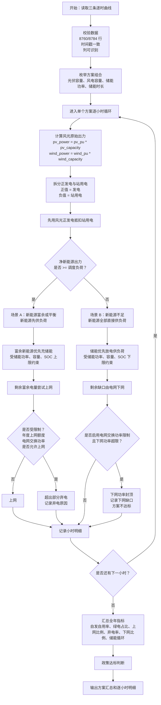

# 产品打磨记录

## 记录原则

- 记录用户提出的问题和建议。
- 记录讨论后形成的产品决策。
- 标记状态：采纳、暂缓、拒绝、已完成。
- 说明原因，沉淀后续可复用的产品/工程经验。

## 当前版本的计算逻辑

本章节记录截至 2026-05-16 的当前版本计算口径，作为后续开发和复核的基准。

### 1. 输入数据口径

- 负荷曲线使用真实功率值，单位为万千瓦。
- 光伏曲线使用标幺值。
- 风电曲线使用标幺值。
- 光伏、风电标幺值允许出现负值。
- 光伏、风电负值不作为异常，也不自动截断。
- 光伏、风电大于 1 的标幺值允许参与计算，但 UI 会提示出现点数，供用户复核。
- 支持 8760 小时普通年和 8784 小时闰年。
- 三条曲线必须行数一致、时间戳一致。

### 2. 风光出力与站用电

每小时先根据容量计算风光原始出力：

```text
pv_power = pv_pu * pv_capacity
wind_power = wind_pu * wind_capacity
```

其中 `pv_power` 和 `wind_power` 可以为负。

当前版本将原始出力拆分为正发电出力和站用电：

```text
pv_generation_power = max(pv_power, 0)
wind_generation_power = max(wind_power, 0)

pv_station_use_power = max(-pv_power, 0)
wind_station_use_power = max(-wind_power, 0)

renewable_generation_power = pv_generation_power + wind_generation_power
station_use_power = pv_station_use_power + wind_station_use_power
```

每小时先用风光正发电抵扣站用电：

```text
net_renewable_power = renewable_generation_power - station_use_power
renewable_power = max(net_renewable_power, 0)
station_use_deficit_power = max(-net_renewable_power, 0)
```

解释：

- `renewable_generation_power` 是新能源总可用发电功率，用于统计新能源总可用发电量。
- `station_use_power` 是风光站用电功率。
- `renewable_power` 是抵扣站用电后的净新能源出力，用于后续供负荷、充储、上网。
- 如果站用电超过当小时风光正发电，则超出部分并入下网需求。

### 3. 负荷与下网需求

用户负荷功率为：

```text
load_power
```

实际参与电网平衡的负荷缺口口径为：

```text
dispatch_load_power = load_power + station_use_deficit_power
```

也就是说，当风光站用电无法由当小时风光正发电覆盖时，缺口会计入下网功率。

汇总中：

```text
total_load_energy = sum(load_power)
grid_import_energy = sum(grid_import_power)
grid_import_rate = grid_import_energy / total_load_energy
```

注意：

- `total_load_energy` 仍表示用户侧总用电量，不包含站用电。
- `grid_import_energy` 表示从电网下网电量，可能包含用户负荷缺口，也可能包含站用电缺口。

### 4. 储能调度逻辑

当前版本采用逐小时贪心调度策略，不做经济性优化。

当净新能源出力大于等于调度负荷时：

```text
direct_self_use = dispatch_load
surplus = renewable_power - dispatch_load
```

富余新能源优先给储能充电：

```text
bess_charge = min(
    surplus,
    bess_power * dt,
    (soc_max * bess_energy - bess_energy_start) / eta_charge
)
```

储能电量更新：

```text
bess_energy_end = bess_energy_start + bess_charge * eta_charge
```

储能充电后剩余电量进入上网或弃电判断。

当净新能源出力小于调度负荷时：

```text
direct_self_use = renewable_power
deficit = dispatch_load - renewable_power
```

储能优先放电：

```text
bess_discharge = min(
    deficit,
    bess_power * dt,
    (bess_energy_start - soc_min * bess_energy) * eta_discharge
)
```

储能电量更新：

```text
bess_energy_end = bess_energy_start - bess_discharge / eta_discharge
```

储能放电后剩余缺口由电网下网，若启用电网交换功率限制，则受该限制约束。

储能约束：

- 储能只能由富余新能源充电。
- 储能不能从电网充电。
- 储能不能同小时充电和放电。
- 储能不能放电上网。
- 储能放电只用于补足调度负荷缺口。
- SOC 逐小时滚动。
- SOC 不得低于 `soc_min`，不得高于 `soc_max`。
- 充放电受储能功率和容量约束。
- 充放电效率参与计算。

### 5. 上网比例硬约束

当前版本默认启用年度上网比例硬约束：

```text
export_control_mode = annual_cap_runtime
```

年度允许上网电量为：

```text
export_cap_energy = total_renewable_generation * export_rate_max
```

默认：

```text
export_rate_max = 20%
```

逐小时计算时累计上网电量：

```text
cumulative_export += grid_export
```

当年度累计上网电量未达到额度时，富余新能源可以上网。

当年度累计上网电量达到额度后，后续富余新能源不能再上网，只能弃电。

因此：

```text
export_rate = grid_export_energy / total_renewable_generation
```

在硬约束模式下，理论上不会超过 `export_rate_max`。

结果中单独记录：

```text
curtail_due_to_export_cap_energy
```

用于表示因年度上网比例额度用完导致的弃电量。

如果用户关闭年度硬约束，则进入后验校核模式：

```text
export_control_mode = post_check
```

该模式下逐小时先正常上网，最后检查：

```text
export_rate <= export_rate_max
```

若超过，则方案不达标。

### 6. 与电网交换功率限制

当前版本支持可选的“与电网交换功率限制”：

```text
grid_exchange_power_limit
```

默认值为 `null`，表示无限制。

用户勾选并输入限制值后，该限制同时作用于上网功率和下网功率。

#### 6.1 上网侧

上网功率不得超过交换功率限制：

```text
grid_export_power <= grid_exchange_power_limit
```

若富余新能源超过可上网功率，则超出部分弃电。

结果中记录：

```text
curtail_due_to_exchange_limit_power
curtail_due_to_exchange_limit_energy
```

#### 6.2 下网侧

下网功率也不得超过交换功率限制：

```text
grid_import_power <= grid_exchange_power_limit
```

当负荷缺口较大时，储能会优先放电降低下网功率。

如果储能能力不足，仍超过交换功率限制，则：

```text
grid_import_power = grid_exchange_power_limit
exchange_import_shortfall_power = 原始下网需求 - grid_exchange_power_limit
```

结果中记录：

```text
exchange_import_shortfall_power
exchange_import_shortfall_energy
```

出现下网缺口时，方案判定为不达标。

### 7. 自发自用与政策指标

新能源自发自用电量口径：

```text
self_use_energy = direct_self_use_energy + bess_discharge_to_load
```

其中：

- `direct_self_use_energy` 为净新能源直接供调度负荷电量。
- `bess_discharge_to_load` 为储能放电供调度负荷电量。
- 储能放电电量只来自此前富余新能源充电。

政策指标：

```text
self_use_rate = self_use_energy / total_renewable_generation
green_load_rate = self_use_energy / total_load_energy
export_rate = grid_export_energy / total_renewable_generation
curtail_rate = curtail_energy / total_renewable_generation
grid_import_rate = grid_import_energy / total_load_energy
```

默认达标条件：

```text
self_use_rate >= 60%
green_load_rate >= 30%
export_rate <= 20%
```

如果启用电网交换功率限制，还要求不能出现下网缺口。

### 8. 储能损耗与循环

储能损耗：

```text
bess_loss_energy
= bess_charge_energy
- bess_discharge_to_load
- (final_bess_energy - initial_bess_energy)
```

年等效循环次数：

```text
annual_equivalent_cycles = bess_discharge_to_load / bess_energy
```

若 `bess_energy = 0`，则循环次数为 0。

预计更换年份：

```text
replacement_year = cycle_life / annual_equivalent_cycles
```

若循环次数为 0，则为无穷大。

### 9. 当前版本不做的事项

当前版本不做经济性评价，包括：

- LCOE；
- IRR；
- NPV；
- 投资回收期；
- 电价优化；
- 储能套利；
- 现货市场收益。

当前版本也不做数学优化，只做批量枚举和逐小时技术测算。

## 当前版本计算流程图与场景说明

本章节把当前版本的计算逻辑整理成“流程图 + 场景表 + 公式说明”，用于人工复核、需求讨论和后续重构。

### 1. 总体流程图



### 2. 每小时输入与中间变量

| 变量 | 含义 | 公式 / 说明 |
|---|---|---|
| `load_power` | 用户负荷功率 | 输入曲线，单位：万千瓦 |
| `pv_pu` | 光伏标幺值 | 输入曲线，可为负 |
| `wind_pu` | 风电标幺值 | 输入曲线，可为负 |
| `pv_power` | 光伏原始出力 | `pv_pu * pv_capacity`，可为负 |
| `wind_power` | 风电原始出力 | `wind_pu * wind_capacity`，可为负 |
| `pv_generation_power` | 光伏正发电功率 | `max(pv_power, 0)` |
| `wind_generation_power` | 风电正发电功率 | `max(wind_power, 0)` |
| `pv_station_use_power` | 光伏站用电功率 | `max(-pv_power, 0)` |
| `wind_station_use_power` | 风电站用电功率 | `max(-wind_power, 0)` |
| `renewable_generation_power` | 新能源总可用发电功率 | `pv_generation_power + wind_generation_power` |
| `station_use_power` | 风光站用电功率 | `pv_station_use_power + wind_station_use_power` |
| `net_renewable_power` | 抵扣站用电后的净新能源 | `renewable_generation_power - station_use_power` |
| `renewable_power` | 参与负荷平衡的净新能源功率 | `max(net_renewable_power, 0)` |
| `station_use_deficit_power` | 站用电缺口功率 | `max(-net_renewable_power, 0)` |
| `dispatch_load_power` | 调度口径负荷 | `load_power + station_use_deficit_power` |

解释：

- `renewable_generation_power` 用于统计新能源总可用发电量。
- `renewable_power` 用于逐小时能量平衡。
- 当风光负值产生站用电时，优先由当小时风光正发电抵扣。
- 如果站用电不能完全抵扣，缺口进入下网需求。

### 3. 场景 A：净新能源大于等于调度负荷

触发条件：

```text
renewable_power >= dispatch_load_power
```

处理流程：

```text
direct_self_use_power = dispatch_load_power
surplus_power = renewable_power - dispatch_load_power
```

储能充电：

```text
bess_charge_power = min(
    surplus_power,
    bess_power,
    (soc_max * bess_energy - bess_energy_start) / eta_charge / dt
)
```

储能电量更新：

```text
bess_energy_end = bess_energy_start + bess_charge_power * dt * eta_charge
```

储能充电后的富余电量：

```text
surplus_after_charge_power = surplus_power - bess_charge_power
```

之后进入上网与弃电判断。

#### 场景 A 的小时标签

| `hour_case` | 触发情况 | 处理逻辑 |
|---|---|---|
| `GEN_BALANCED` | 新能源刚好等于调度负荷 | 全部直接自用，无储能充放电，无上网弃电 |
| `GEN_SURPLUS_CHARGE_BESS` | 有富余新能源，且全部用于充储能 | 储能充电，剩余富余为 0 |
| `GEN_SURPLUS_DIRECT_EXPORT` | 有富余新能源，无储能充电，且全部上网 | 上网，不弃电 |
| `GEN_SURPLUS_CHARGE_EXPORT` | 富余新能源先充储，剩余上网 | 充储 + 上网，不弃电 |
| `GEN_SURPLUS_CHARGE_EXPORT_CURTAIL` | 富余新能源先充储，部分上网，部分弃电 | 充储 + 上网 + 弃电 |
| `GEN_SURPLUS_CURTAIL` | 富余新能源不能上网或上网受限，剩余弃电 | 弃电 |

说明：

- 当前 `hour_case` 是主场景标签。
- 具体弃电原因需要结合以下字段复核：
  - `curtail_due_to_export_cap_power`
  - `curtail_due_to_exchange_limit_power`
  - `curtail_power`

### 4. 上网与弃电判断

富余电量在充储后尝试上网。

如果不允许上网：

```text
grid_export_power = 0
curtail_power = surplus_after_charge_power
```

如果允许上网，则先考虑电网交换功率限制：

```text
exchange_export_limit_power =
    grid_exchange_power_limit if configured else infinity
```

再考虑最大上网功率限制。当前 UI 暂不暴露单独的最大上网功率限制，但底层保留 `export_power_max`：

```text
export_power_limit =
    min(exchange_export_limit_power, export_power_max or infinity)
```

年度上网比例硬约束下：

```text
annual_export_cap_energy = total_renewable_generation * export_rate_max
remaining_export_cap_energy = annual_export_cap_energy - cumulative_export_energy
```

每小时实际上网：

```text
grid_export_energy = min(
    surplus_after_charge_energy,
    export_power_limit * dt,
    remaining_export_cap_energy
)
```

弃电：

```text
curtail_energy = surplus_after_charge_energy - grid_export_energy
```

因年度上网比例额度导致的弃电：

```text
curtail_due_to_export_cap_energy =
    max(export_before_annual_cap_energy - grid_export_energy, 0)
```

因电网交换功率限制导致的弃电：

```text
curtail_due_to_exchange_limit_energy =
    max(surplus_after_charge_energy - min(surplus_after_charge_energy, exchange_limit_energy), 0)
```

解释：

- 年度上网比例硬约束决定“全年最多能上网多少电量”。
- 电网交换功率限制决定“每小时最多能上网多少功率”。
- 两者都可能导致弃电。

### 5. 场景 B：净新能源小于调度负荷

触发条件：

```text
renewable_power < dispatch_load_power
```

处理流程：

```text
direct_self_use_power = renewable_power
deficit_power = dispatch_load_power - renewable_power
```

储能放电：

```text
bess_discharge_power = min(
    deficit_power,
    bess_power,
    (bess_energy_start - soc_min * bess_energy) * eta_discharge / dt
)
```

储能电量更新：

```text
bess_energy_end = bess_energy_start - bess_discharge_power * dt / eta_discharge
```

储能放电后的原始下网需求：

```text
raw_grid_import_power = deficit_power - bess_discharge_power
```

若未启用电网交换功率限制：

```text
grid_import_power = raw_grid_import_power
exchange_import_shortfall_power = 0
```

若启用电网交换功率限制：

```text
grid_import_power = min(raw_grid_import_power, grid_exchange_power_limit)
exchange_import_shortfall_power =
    raw_grid_import_power - grid_import_power
```

如果 `exchange_import_shortfall_power > 0`，说明即使储能已放电，系统仍无法在电网交换功率限制下满足负荷，该方案不达标。

#### 场景 B 的小时标签

| `hour_case` | 触发情况 | 处理逻辑 |
|---|---|---|
| `NO_RENEWABLE_GRID_IMPORT` | 无净新能源，且储能不放电 | 负荷由电网下网 |
| `GEN_SHORT_GRID_IMPORT` | 新能源不足，储能不放电 | 新能源直接供一部分负荷，剩余下网 |
| `GEN_SHORT_BESS_DISCHARGE` | 新能源不足，储能放电后完全覆盖缺口 | 新能源 + 储能满足调度负荷 |
| `GEN_SHORT_BESS_DISCHARGE_AND_GRID_IMPORT` | 新能源不足，储能放电后仍需下网 | 新能源 + 储能 + 电网下网 |

说明：

- 若启用电网交换功率限制，仍需查看 `exchange_import_shortfall_power`。
- 出现下网缺口时，小时标签仍可能是 `GEN_SHORT_BESS_DISCHARGE_AND_GRID_IMPORT`，但方案汇总会记录缺口并判为不达标。

### 6. 储能状态滚动

每小时开始：

```text
soc_start = bess_energy_start / bess_energy
```

每小时结束：

```text
soc_end = bess_energy_end / bess_energy
```

下一小时：

```text
soc_start[t + 1] = soc_end[t]
```

无储能方案：

```text
bess_power = 0
bess_energy = 0
bess_charge_power = 0
bess_discharge_power = 0
soc_start = 0
soc_end = 0
```

### 7. 程序考虑的约束场景汇总

| 约束场景 | 触发条件 | 程序处理 | 记录字段 |
|---|---|---|---|
| 风光负值 | `pv_power < 0` 或 `wind_power < 0` | 按站用电处理 | `pv_station_use_power`、`wind_station_use_power` |
| 站用电超过正发电 | `station_use_power > renewable_generation_power` | 超出部分进入下网需求 | 体现在 `grid_import_power` |
| 储能充电功率受限 | `surplus_power > bess_power` | 充电功率不超过 `bess_power` | `bess_charge_power` |
| 储能充电容量受限 | SOC 接近上限 | 充电不超过剩余可充空间 | `soc_end`、`bess_energy_end` |
| 储能放电功率受限 | `deficit_power > bess_power` | 放电功率不超过 `bess_power` | `bess_discharge_power` |
| 储能放电容量受限 | SOC 接近下限 | 放电不低于 `soc_min` | `soc_end`、`bess_energy_end` |
| 年度上网比例额度用完 | 累计上网达到 `export_cap_energy` | 后续富余新能源弃电 | `curtail_due_to_export_cap_power` |
| 上网交换功率受限 | 富余电力超过 `grid_exchange_power_limit` | 超出部分弃电 | `curtail_due_to_exchange_limit_power` |
| 下网交换功率受限 | 缺口超过 `grid_exchange_power_limit` | 储能先放电，仍不足则记录下网缺口 | `exchange_import_shortfall_power` |
| 不允许上网 | `allow_export = false` | 富余电力弃电 | `curtail_power` |
| 无储能方案 | `bess_power = 0` 或 `bess_energy = 0` | 不充不放，SOC 为 0 | `bess_*` 字段为 0 |

### 8. 汇总指标公式

| 指标 | 公式 | 解释 |
|---|---|---|
| `total_load_energy` | `sum(load_power * dt)` | 用户总用电量，不含站用电 |
| `total_renewable_generation` | `sum(renewable_generation_power * dt)` | 风光正发电总量 |
| `pv_station_use_energy` | `sum(pv_station_use_power * dt)` | 光伏站用电 |
| `wind_station_use_energy` | `sum(wind_station_use_power * dt)` | 风电站用电 |
| `station_use_energy` | `pv_station_use_energy + wind_station_use_energy` | 风光站用电合计 |
| `direct_self_use_energy` | `sum(direct_self_use_power * dt)` | 新能源直接供调度负荷 |
| `bess_discharge_to_load` | `sum(bess_discharge_power * dt)` | 储能放电供调度负荷 |
| `self_use_energy` | `direct_self_use_energy + bess_discharge_to_load` | 新能源自发自用电量 |
| `grid_import_energy` | `sum(grid_import_power * dt)` | 下网电量 |
| `grid_import_rate` | `grid_import_energy / total_load_energy` | 下网电量占用户总用电量比例 |
| `grid_export_energy` | `sum(grid_export_power * dt)` | 上网电量 |
| `export_rate` | `grid_export_energy / total_renewable_generation` | 上网比例 |
| `export_cap_energy` | `total_renewable_generation * export_rate_max` | 年度允许上网电量 |
| `curtail_energy` | `sum(curtail_power * dt)` | 弃电量 |
| `curtail_rate` | `curtail_energy / total_renewable_generation` | 弃电率 |
| `curtail_due_to_export_cap_energy` | `sum(curtail_due_to_export_cap_power * dt)` | 因年度上网额度导致的弃电 |
| `curtail_due_to_exchange_limit_energy` | `sum(curtail_due_to_exchange_limit_power * dt)` | 因交换功率上限导致的弃电 |
| `exchange_import_shortfall_energy` | `sum(exchange_import_shortfall_power * dt)` | 因下网交换功率限制导致的供电缺口 |
| `bess_charge_energy` | `sum(bess_charge_power * dt)` | 储能充电电量 |
| `bess_loss_energy` | `bess_charge_energy - bess_discharge_to_load - (final_bess_energy - initial_bess_energy)` | 储能损耗 |
| `annual_equivalent_cycles` | `bess_discharge_to_load / bess_energy` | 年等效循环次数 |

### 9. 达标判断

方案达标需要满足：

```text
self_use_rate >= self_use_rate_min
green_load_rate >= green_load_rate_min
export_rate <= export_rate_max
```

如果不允许上网：

```text
grid_export_energy == 0
```

如果启用电网交换功率限制：

```text
exchange_import_shortfall_energy == 0
```

不达标原因可能包括：

- 自发自用率不足；
- 绿电占用电比例不足；
- 上网比例超限；
- 不允许上网但出现上网；
- 最大上网功率超限；
- 电网交换功率限制导致下网缺口。

## 2026-05-16 UI 与复核体验优化

### 1. 储能时长选项中的 0 不直观

用户反馈：

- “储能时长为什么要有个 0？我没搞懂。”

讨论结论：

- `0` 的技术含义是“无储能方案”，用于生成纯风光基准方案。
- 但业务用户不应被迫理解这个编码。
- UI 应改为“包含无储能方案”勾选框，默认选中。
- 储能时长选项只展示真实储能时长，如 `2,4`。

状态：已完成。

经验：

- UI 中的特殊数值编码要转译成业务语言，避免让用户猜系统内部约定。

### 2. 自动识别时间列和数值列

用户反馈：

- 输入文件用户通常已经处理好。
- 软件至少应自动识别时间列，另一个数值列自动作为负荷/光伏/风电数值列。
- 不应要求用户每次手动选择。

讨论结论：

- 优先识别时间列名：`时间`、`timestamp`、`time`、`日期时间` 等。
- 排除时间列后，如果只有一个候选数值列，自动使用。
- 只有存在多个候选列或无法识别时，才显示手动选择。

状态：已完成。

经验：

- 能自动识别的输入，不要强迫用户手动操作。
- 手动选择应作为兜底，而不是主流程。

### 3. 批量测算需要进度条

用户反馈：

- 已经有方案数量预估，应在测算过程中用进度条显示当前进度。

讨论结论：

- 批量运行器增加进度回调。
- UI 显示 `已完成 / 总方案数` 和当前方案编号。

状态：已完成。

经验：

- 长耗时任务必须有过程反馈，否则用户无法判断程序是否卡住。

### 4. 数据状态与数据质量提示

用户反馈：

- 除方案数量外，应显示数据加载状态，例如负荷/光伏/风电各有多少小时。
- 对光伏标幺值大于 1 的情况，应提示数量。
- 但本阶段不要自动处理输入曲线，例如小负值不应被软件自动截断。

讨论结论：

- UI 增加数据状态面板，展示行数、时间范围、编码、数值异常提示。
- 保留“大于 1”提示。
- 小负值不再自动截断为 0，本阶段直接报错，由用户在外部处理数据。

状态：已完成。

经验：

- 技术测算软件应帮助用户确认“传入的数据是什么”，但不应在未经用户明确授权时修改输入数据。

### 5. 结果筛选和排序不足

用户反馈：

- “只看达标方案”不够。
- 至少应支持按绿电占比、弃电率、自发自用率、上网比例排序。
- 应支持按方案类型筛选：无储能、纯光伏、纯风电、光储、风储等。
- 勾选和排序应是 AND 关系。

讨论结论：

- 筛选条件之间采用 AND 关系。
- 排序只改变当前筛选结果的显示顺序。
- 增加方案类型筛选。

状态：已完成。

经验：

- 结果表不是只给机器看的输出，还要支持人的复核路径。

### 6. 补充下网电量与下网电量比例

用户反馈：

- 已有负荷总用电量，但缺少下网电量和下网电量比例。
- 电量单位使用万千瓦时，不保留小数。
- CSV 暂时可继续打磨，后续希望输出阅读体验更好的格式。

讨论结论：

- 下网电量等同当前 `grid_import_energy`。
- 新增更直观字段：
  - `grid_import_rate = grid_import_energy / total_load_energy`
- UI 展示中电量按万千瓦时、不保留小数格式化。
- CSV/Excel 格式化输出体验后续继续打磨。

状态：已完成。

经验：

- 输出字段既要满足算法口径，也要贴近业务复核语言。

### 7. 持续更新产品打磨记录

用户反馈：

- 问题解决或用更好的方案解决后，应及时更新 `PRODUCT_POLISH_LOG.md`。

讨论结论：

- 本文档作为产品打磨决策记录持续维护。
- 每轮 UI/算法口径讨论后更新状态。

状态：采纳，进行中。

经验：

- 产品打磨过程本身是可复用资产，可为未来 skill 设计提供素材。

### 8. Codex 内置浏览器中无法下载方案汇总 Excel

用户反馈：

- 在 Codex 中运行程序，方案汇总 Excel 无法下载。

初步判断：

- 当前全局下载按钮位置靠后，可能被大表格和逐小时明细淹没。
- Streamlit rerun 或临时目录生命周期也可能影响下载体验。

讨论结论：

- 将方案汇总 Excel 和全部逐小时 ZIP 下载按钮提前到汇总区。
- 生成下载文件时使用稳定的内存字节，不依赖用户点击后临时文件仍存在。
- 保留单方案 CSV 下载在明细区域。

状态：已完成。

解决方案：

- 下载按钮已移动到汇总指标下方、结果表上方。
- Excel 和 ZIP 下载数据在按钮渲染前转为稳定的内存字节，避免临时目录生命周期影响点击下载。
- 单方案 CSV 下载仍保留在逐小时明细区域。

验证记录：

- `python -m pytest` 通过，44 个测试全部通过。
- 使用干净模拟数据导出 `outputs/scenario_summary_20260516_175415.xlsx`，文件大小 11440 字节。

## 2026-05-16 风光负值曲线与站用电口径修正

### 1. 风电/光伏标幺曲线负值不应视为异常

用户反馈：

- 风电、光伏曲线出现负值是正常的。
- 可理解为新能源电源在不发电时需要用电。
- 这些负值应正常参与计算，并统计到风、光的“站用电”列。

修正结论：

- 风电/光伏标幺曲线负值不再报错，也不自动截断。
- 每小时将风光出力拆分为：
  - 原始出力：`pv_power`、`wind_power`，可为负；
  - 正发电出力：`pv_generation_power`、`wind_generation_power`；
  - 站用电：`pv_station_use_power`、`wind_station_use_power`；
  - 合计站用电：`station_use_power`。
- 调度逻辑为：
  - 先用当小时风光正发电抵扣站用电；
  - 抵扣后的净新能源再供用户负荷、充储、上网；
  - 如果站用电超过当小时正发电，缺口计入下网电量。
- 汇总新增：
  - `pv_station_use_energy`
  - `wind_station_use_energy`
  - `station_use_energy`

状态：已完成。

验证记录：

- `python -m pytest` 通过，46 个测试全部通过。

经验：

- 数据“负值”不一定是错误，技术软件必须先理解业务含义。
- 对输入数据的处理策略应区分“异常数据清洗”和“业务口径计算”。

## 2026-05-16 电网交换功率限制与运行服务重启问题

### 1. Streamlit 旧进程导致新代码未生效

用户反馈：

- 页面测算时报错：`run_batch() got an unexpected keyword argument 'progress_callback'`。

判断：

- 源码中的 `run_batch` 已经包含 `progress_callback` 参数。
- 报错说明当前浏览器连接的 Streamlit 服务仍在使用旧版本代码。
- 仅刷新浏览器不一定能让旧 Python 进程加载新代码，尤其是服务启动在代码修改之前。

结论：

- 修改代码后，应先停止旧 Streamlit 进程，再重新启动。

状态：已说明，待用户按重启步骤验证。

经验：

- 本地 Web 工具调试时，浏览器刷新和服务进程重启是两个动作。

### 2. 新增“与电网交换功率限制”

用户需求：

- 上网政策约束中增加“与电网交换功率限制”。
- 默认无限制。
- 用户勾选并输入值后，系统逐时不得出现下网功率或上网功率超过该值。
- 触及上网限制时，新能源需要弃电。
- 触及下网限制时，应尽量通过储能放电降低下网功率。

实现结论：

- 新增政策参数：`grid_exchange_power_limit`。
- UI 中新增：
  - `设置与电网交换功率限制`
  - `与电网交换功率限制（万千瓦）`
- 上网侧：
  - `grid_export_power` 不超过限制；
  - 超出部分计入 `curtail_power`；
  - 同时记录 `curtail_due_to_exchange_limit_power` 和汇总 `curtail_due_to_exchange_limit_energy`。
- 下网侧：
  - 储能按原有规则优先放电降低下网；
  - 若储能能力不足，`grid_import_power` 封顶在限制值；
  - 未满足部分记录为 `exchange_import_shortfall_power` 和汇总 `exchange_import_shortfall_energy`；
  - 出现下网缺口时方案不达标，原因包含“电网交换功率限制导致下网缺口”。

状态：已完成。

验证记录：

- `python -m pytest` 通过，50 个测试全部通过。

经验：

- “强约束”既要限制结果不越界，也要记录限制造成的代价。
- 上网受限的代价是弃电；下网受限且储能不足的代价是供电缺口，应单独展示并判定方案不可行。

## 2026-05-16 批量上传与导入路径稳定性

### 1. UI 代码更新但参数模型仍是旧版本

用户反馈：

- 仍然报错：`PolicyParams.__init__() got an unexpected keyword argument 'grid_exchange_power_limit'`。

判断：

- UI 页面已经显示新版内容，但导入 `green_direct.models.params` 时可能拿到了环境中旧的已安装包，而不是当前项目 `src` 下的源码。
- 原因是 Streamlit 执行脚本时，`sys.path` 未必总是把项目 `src` 放在第一位。

解决方案：

- 在 `src/green_direct/ui/app.py` 顶部强制把项目 `src` 路径插入 `sys.path` 第一位。
- 避免 UI 文件使用当前源码，而模型/批量/算法模块却混入旧包。

状态：已完成，需重启 Streamlit 后生效。

经验：

- 本地项目若采用 `src/` 布局，Streamlit 脚本入口要显式保证源码路径优先。
- 否则容易出现“页面是新的，导入模块是旧的”的错配问题。

### 2. 批量上传并按文件名自动识别曲线类型

用户建议：

- 数据上传区域希望能一次选择多个文件。
- 软件根据文件名自动识别：
  - 含 `负荷`、`load`、`用电` 的文件作为负荷曲线；
  - 含 `光伏`、`pv`、`solar` 的文件作为光伏标幺曲线；
  - 含 `风电`、`wind` 的文件作为风电标幺曲线。

实现方案：

- 增加“批量上传曲线 CSV”入口，支持一次选择多个 CSV。
- 自动按文件名关键字分配到负荷、光伏、风电。
- 若识别失败或识别冲突，给出提示。
- 保留单独上传入口作为人工覆盖。

状态：已完成。

经验：

- 上传入口应优先支持真实用户的一次性操作习惯。
- 自动识别必须保留人工覆盖，避免文件名不规范时卡死流程。

## 2026-05-16 储能放电上网口径与性能优化

### 1. 储能默认不能放电上网

用户问题：

- 当前计算逻辑是否存在储能放电上网的场景？
- 方案汇总表是否统计储能放电量？
- 默认应为储能不能放电上网。

核查结论：

- 当前调度逻辑不存在储能放电上网。
- 储能只在 `renewable_power < dispatch_load_power` 时放电。
- 储能放电用于补足调度负荷缺口。
- 当 `renewable_power >= dispatch_load_power` 时，储能只可能充电，不会放电。
- 汇总表中的储能放电字段是 `bess_discharge_to_load`，含义为“储能放电供负荷电量”。

加固措施：

- 在“当前版本的计算逻辑”中明确写入“储能不能放电上网”。
- 新增测试：`test_bess_discharge_never_exports_to_grid`，确保储能放电时 `grid_export_energy = 0`。

状态：已完成。

### 2. 批量计算和界面筛选速度优化

用户反馈：

- 计算速度不到 120 个方案/分钟。
- 汇总表生成较慢但还能接受。
- 一旦按规则筛选，界面变灰并长时间等待。
- 未来方案数量可能达到成千上万条。

问题定位：

- 单方案逐小时计算使用 pandas `iterrows()`，每个方案 8760/8784 次逐行构造 dict，性能较低。
- UI 在每次筛选/排序时会重新生成 Excel 和全部逐小时 ZIP 下载数据。
- UI 每次筛选时会对完整结果表做字符串格式化并渲染，方案数大时卡顿明显。

已完成优化：

- 单方案计算改为 NumPy 数组预分配 + 索引循环，避免 `iterrows()` 和逐行 dict append。
- 下载文件使用 `st.session_state` 缓存，只在新测算结果产生后准备一次。
- 筛选/排序时不再重复生成 Excel/ZIP。
- 方案类型从逐行 `apply` 改为向量化赋值。
- 结果表默认只显示筛选后的前 500 行，用户可调整最多显示行数。

状态：已完成第一轮优化。

后续可选优化：

- 批量测算时先只保留汇总表，不保存所有方案逐小时明细。
- 用户点击某个方案后，再按需重算该方案逐小时明细。
- 对大批量方案使用多进程并行。
- 将核心逐小时循环进一步迁移到 `numba` 或 Cython。
- 将结果表分页，避免一次渲染上万行。

验证记录：

- `python -m pytest` 通过，51 个测试全部通过。

经验：

- 大批量技术测算要区分“批量筛选所需数据”和“单方案复核所需明细”。
- UI 卡顿不一定来自计算本身，下载文件准备、全表格式化和全表渲染也可能是主要瓶颈。

经验：

- 下载入口应靠近结果汇总，并使用稳定的数据载体，减少 UI rerun 对下载的影响。

## 2026-05-16 建立软件总览与接口文档

用户问题：

- 当前 V0.1 技术测算模块准备先告一段落。
- 后续还要开发图表制作、经济性评价、报告等下游模块。
- 虽然希望各模块保持独立，但需要一份软件介绍或接口说明，保证后续模块能接得上。

产品判断：

- 需要建立一份稳定的“系统总览 + 模块接口契约”文档。
- `PRODUCT_POLISH_LOG.md` 继续记录产品打磨和决策过程。
- 新文档应放在 `docs/` 下，作为后续模块开发的基线，而不是混在过程日志里。

已完成：

- 新增 `docs/SOFTWARE_OVERVIEW_AND_INTERFACE.md`。
- 文档内容覆盖：
  - 软件定位与当前边界；
  - 总体架构和模块依赖方向；
  - 标准输入数据契约；
  - 参数模型、方案模型、单方案仿真、批量测算、导出接口；
  - 当前计算口径；
  - 汇总结果和逐小时明细字段；
  - 图表、经济性、报告模块接入建议；
  - 接口稳定性规则；
  - 测试与运行基线。

状态：已完成。

经验：

- 当一个模块即将成为其他模块的上游时，需要把“当前口径”从讨论日志中提炼成接口契约。
- 过程日志适合记录为什么这么做，接口文档适合记录后续必须怎么接。

## 2026-05-19 架构重定向：从批量枚举工具到方案策划推荐平台

### 1. 用户对对标软件的判断

用户提供了一组“绿电直连 / 微电网项目策划平台”的对标截图。经过讨论后形成判断：

- 对标软件真正有价值的不是 UI 表象，而是背后的项目策划工作流；
- 用户不希望软件只是枚举大量风光储容量组合，然后展示一张巨大的结果表；
- 枚举仍然可以作为内部搜索手段，但前台应展示经过筛选、排序、解释的几个代表性方案；
- 图表、报告和后续分析应围绕推荐方案展开，而不是围绕全部枚举方案展开；
- AI 助手短期内不是重点。

状态：采纳。

### 2. 新的产品方向

项目方向从：

```text
绿电直连风光储多方案批量测算工具
```

调整为：

```text
绿电直连 / 微电网项目方案策划与推荐平台
```

新的主流程应为：

```text
项目输入
-> 输入审查
-> 生成候选方案池
-> 技术仿真
-> 政策合规筛选
-> 经济性排序
-> 代表方案推荐
-> 图表、报告、导出
```

状态：采纳。

### 3. 经济性排序提前进入

用户提出：在枚举方案基础上至少有两个约束或排序维度：

1. 是否满足政策要求，包括自发自用、上网、绿电占比；
2. 经济性排序。

讨论结论：

- 经济性应提前进入推荐逻辑；
- 但第一阶段不必做完整财务评价；
- 可先实现轻量经济性排序，用于方案筛选和推荐；
- 完整 NPV、IRR、多年现金流、税费、融资等可后续扩展；
- 经济性评价必须读取技术仿真结果，不应反向改变技术调度。

状态：采纳，待设计实现。

### 4. 柴油发电进入方案逻辑

用户提出：加入柴发后，方案计算模块可更好适配离网场景；并网模式下接柴发较少但也存在，不冲突。

讨论结论：

- 柴发应作为明确资产建模，而不是混入电网下网；
- 柴发需要独立出力、油耗、成本、排放和运行状态字段；
- 离网、并网、并网加备用应作为项目模式或调度策略表达；
- 柴发调度策略需要专门研究；
- 柴发是否允许给储能充电是关键口径问题，初期建议谨慎处理；
- 如果未来允许非新能源给储能充电，必须做能源来源追踪，避免污染绿电指标。

状态：采纳，待专家审查。

### 5. 约束文档更新

用户担心旧 `AGENTS.md`、`CLAUDE.md` 和 V0.1 文档会限制后续开发。

讨论结论：

- 当前项目文件夹继续使用；
- 现有 V0.1 内核和测试作为基线保留；
- 旧 V0.1 文档不删除，但不再作为最终产品边界；
- 更新 `AGENTS.md` 和 `CLAUDE.md`，允许经济性排序、柴发、离网、推荐引擎等后续方向；
- 新增专家审查材料目录：`notes/architecture_reframe_20260519/`。

状态：已完成。

新增文档：

- `notes/architecture_reframe_20260519/01_EXPERT_REVIEW_BRIEF.md`
- `notes/architecture_reframe_20260519/02_TARGET_ARCHITECTURE_AND_CALCULATION_LOGIC.md`
- `notes/architecture_reframe_20260519/03_MIGRATION_AND_POLISH_PLAN.md`

更新文档：

- `AGENTS.md`
- `CLAUDE.md`
- `ROADMAP.md`

### 6. 后续开发经验

- 旧代码和旧文档不一定是负担，关键是把它们降级为“基线资产”，而不是继续作为未来边界。
- 架构调整前先更新 agent 指令文件，否则后续 Codex / Claude Code 很容易按旧规则开发。
- 推荐引擎应先独立于 UI 做出来，避免把产品逻辑写死在 Streamlit 页面里。
- 柴发和经济性都不应直接塞入现有函数，而应通过资产模型、调度策略、经济评价层逐步进入。

## 2026-05-19 切换电脑前补充：图表模块降级为可替换原型

### 1. 用户对当前图表模块的判断

用户反馈：

- 当前已经开发出来的图表模块很不理想；
- 甚至可以丢弃；
- 现阶段不应继续围绕图表模块投入主要精力；
- 应优先把方案逐时计算、风光储规模配置逻辑、简化经济性排序逻辑等搞清楚并实现。

讨论结论：

- 现有图表模块降级为早期原型，不作为近期重点资产；
- 后续开发可以替换或重做图表模块；
- 图表和报告应等核心计算、推荐、经济性排序稳定后再重新设计；
- 近期重点转为：
  1. 逐小时能量平衡和能源台账；
  2. 风光储规模配置 / 候选方案生成；
  3. 政策合规筛选；
  4. 轻量经济性排序；
  5. 代表方案推荐。

状态：采纳。

经验：

- 图表不是底层架构，不应让不满意的展示模块牵制核心计算和推荐逻辑。
- 技术软件应先把“算得对、筛得清、推荐得有理由”做好，再打磨可视化。

## 2026-05-21 经济性评价 V1 口径确认

用户和 AI 讨论后确认：经济性模块可以进入代码实现，但必须先按 V1 简化年度现金流口径落地，不引入贷款和复杂财务模型。

### 1. 模型定位

- V1 是不考虑贷款的项目投资现金流模型，不计算还本付息、资本金 IRR 或复杂融资结构。
- 年度现金流详表是主输出，FNPV、FIRR、静态回收期、动态回收期必须能追溯到年度明细。
- Year 0 为建设期，发生初始投资现金流出；运营期默认 25 年，各年收入、成本、税费和储能更换默认在年末发生。
- FIRR 不使用用户输入折现率；折现率只用于 FNPV、折现净现金流和动态回收期。
- 经济性评价只读取技术 `summary` / `hourly_detail`，不改变逐小时调度、SOC、上网、下网、弃电或储能充放电结果。

### 2. 已确认默认输入

| 输入项 | 默认值 | 口径 |
|---|---:|---|
| 运营期 | 25 年 | 风电、光伏整体按同一运营期处理 |
| 风电单位造价 | 4500 元/kW，含税 | 乘 `wind_capacity` |
| 光伏单位造价 | 2500 元/kW，含税 | 需提示与光伏曲线容量基准匹配 |
| 储能单位造价 | 900 元/kWh，含税 | 乘 `bess_energy` |
| 其他固定资产投资 | 0 万元，含税 | 可选 |
| 建设投资进项税率 | 10% | 可改 |
| 风电运维成本 | 50 元/kW/年 | 无进项税 |
| 光伏运维成本 | 25 元/kW/年 | 无进项税 |
| 储能运维成本 | 18 元/kW/年 | 按 `bess_power`，无进项税 |
| 上网电价 | 0.25 元/kWh，含税 | 产生销项税 |
| 自发自用电价 | 0.40 元/kWh，含税 | 产生销项税；提示不含过网费 |
| 储能更换投资比例 | 50% | 按初始储能投资比例 |
| 储能更换进项税率 | 13% | 外购设备材料 |
| 销项税率 | 13% | 电费收入拆税 |
| 城建税地区 | 县城、镇 5% | 可选市区 7%、其他 1% |
| 企业所得税率 | 25% | 可选 15% 或自定义 |
| 折现率 | 6% | 用于 FNPV、动态回收期 |

### 3. 税费和现金流口径

- 用户输入的投资、电价、收入和成本默认是含税金额。
- 利润表使用不含税收入、不含税成本、折旧、附加税费和企业所得税。
- 现金流表使用实际含税现金收付，并单独扣减实际缴纳增值税、附加税费和企业所得税。
- 建设投资进项税在 Year 0 形成留抵，进入运营期后有销项再抵扣。
- 运行成本简化为内部运维，不考虑进项税。
- 储能更换属于外购设备材料，发生当年产生进项税，可抵扣或形成留抵。
- 进项税不直接作为现金流入，只通过减少实际缴纳增值税或形成留抵体现。

### 4. 储能更换口径

- 储能更换由循环寿命达到时间触发，建议使用 `replacement_year` 或 `annual_equivalent_cycles` 推导。
- 更换现金流出 = 初始储能投资含税金额 × 更换投资比例。
- 更换当年计算可抵扣进项税。
- 后续储能更换不计算残值，不计算旧电池处置。原“储能更换不追加折旧”口径已被 2026-05-23 新口径取代：储能更换作为运营期新增可折旧投资，从更换次年至运营期最后一年线性折旧，残值 0。
- 若更换触发在运营期最后一年或之后，例如默认 25 年项目到第 25 年才触发，则默认不再更换。

### 5. 其他经营收入

- 其他经营收入支持多项输入，单位为万元/年，含税。
- 支持发生规则：每年、前 20 年、前 25 年、指定年份。
- 允许输入负值。负值默认不产生进项税，作为经营性收入抵减或额外经营性支出进入现金流。

### 6. 文档精简

用户不希望项目文档继续膨胀。本轮将 `docs/references/economic_evaluation/` 精简为：

- `00_README_使用说明.md`
- `经济性评价V1计算口径_合并版.md`
- `99_官方来源清单.md`

旧的分章节草稿已合并进权威合并版。后续经济性口径变化优先更新合并版和本日志，避免新增平行文档。

状态：V1 口径已确认。

### 7. 初版实现记录

本轮已完成经济性 V1 的第一版代码实现：

- 新增 `src/green_direct/economy/economic_inputs.py`，定义 `EconomicParams` 和 `OtherOperatingRevenueItem`；
- 新增 `src/green_direct/economy/economic_evaluator.py`，实现单方案和批量年度现金流评价；
- 输出年度现金流明细表和 FNPV、FIRR、静态投资回收期、动态投资回收期等指标；
- 实现 Year 0 建设投资留抵、运营期增值税抵扣、附加税、企业所得税、20 年直线折旧、储能更换现金流和进项税；
- 储能更换若触发在运营期最后一年或之后，默认不更换；
- 运行成本进项税为 0；
- 其他经营收入负值不产生进项税；
- 在 Streamlit 结果区加入轻量“经济性评价 V1”试用入口，可输入参数、查看经济性汇总和单方案年度明细并导出 Excel。

验证记录：

- `pytest` 通过，83 个测试全部通过。

后续建议：

- 用户先用 V1 入口试算几个典型方案，重点检查年度现金流详表、增值税留抵和储能更换年份；
- 暂不把经济性排序强行并入推荐组合，等用户确认 V1 现金流表可信后再接推荐引擎；
- 当前 UI 入口只是试用入口，后续 UI 大改时应围绕推荐方案和用户加入对比方案重做。

## 2026-05-21 浏览器批注：UI 主流程和信息层级问题

用户在 Streamlit 试用页做了一组浏览器批注。核心判断是：当前 UI 仍然像“把所有中间表摊开给用户看的技术调试页”，不符合实际方案策划工作流。主界面应该把展示位留给重点信息，表格和明细更多作为下载或高级复核入口。

### 1. 已确认的 UI 问题

- 原始枚举结果表过于繁杂，主界面不应默认展示纯大表。
- 下载方案总表、下载全部逐小时明细、方案类型筛选、排序方式、显示行数、逐小时方案详表等应默认收起，由用户勾选或展开后出现。
- 数据状态不应默认展示详细表格，应先给颜色和一句话结论，详情点击展开。
- 逐小时明细不适合在软件中直接大表查看，应只提供 CSV 下载。
- 经济性年度现金流详表不需要默认展示，应提供下载按钮，并确保与其他模块接口衔接。
- UI 表头应使用中文名，英文原名默认隐藏；点击展开后可查看中文名和英文原名对应关系。该对应关系必须全局统一。
- 图表模块现阶段效果差，后续应只围绕默认推荐方案和用户指定加入对比的方案制图，而不是围绕全量枚举表制图。
- 当前标题仍带 “V0.1 批量测算工具”，与新的方案策划平台方向不一致。

### 2. 计算速度判断

用户反馈计算速度慢，并询问多线程/并行是否能提速。当前判断：

- Python 多线程对 CPU 密集型逐小时仿真不一定有效，受 GIL 影响较大。
- 多进程并行理论上能提速，但要处理 Windows/Streamlit 下进程启动、数据复制、进度回调、错误收集和内存占用。
- 更优先的性能方向是区分“批量筛选所需汇总”和“少数方案复核所需逐小时明细”：批量阶段可先只保留汇总和推荐所需明细，用户查看或导出指定方案时再按需生成逐小时明细。
- 后续可再评估多进程、Numba 或更深的向量化。

### 3. 本轮低风险 UI 收纳

本轮先做不影响底层计算的 UI 收纳：

- 数据状态改为一句话结论 + 详情展开。
- 方案总表下载、全部逐小时 ZIP、筛选排序、行数设置、结果大表、单方案逐小时 CSV 下载收进“高级：结果表、筛选与下载”。
- 取消 UI 中直接展示逐小时明细大表，仅提供当前方案逐小时 CSV 下载。
- 当前方案逐小时 CSV 下载改用中文表头。
- 经济性年度现金流明细不再默认展示，仅提供经济性结果 Excel 下载。
- 新增统一 UI 字段中文名映射，用于表格显示和用户侧下载；英文原名通过“字段对应关系”展开查看。
- 页面标题改为“绿电直连风光储方案策划与测算平台”。

### 4. 后续 UI 重构方向

后续 UI 不应继续沿着“输入 -> 全量枚举大表 -> 用户自己找结果”的结构发展。更合理的工作流是：

```text
项目输入
-> 数据诊断一句话结论
-> 候选方案计算
-> 政策筛选和经济性评价
-> 推荐方案组合
-> 用户加入指定方案对比
-> 围绕少数方案展示图表、年度经济性、逐小时审查和导出
```

对标软件参考图可继续放在 `samples/对标软件/小红书/` 下作为视觉和工作流参考，但实现时应优先保证计算口径和推荐逻辑稳定。

## 2026-05-21 图表模块重构：对标参考图的第一版方案图谱

用户再次批注确认：旧“图表分析 / 单方案诊断”模块不适合继续修补，核心问题不是缺少几张图，而是用户不知道当前看的是哪个方案，且图表没有围绕实际方案策划流程组织。

本轮按 `samples/对标软件/小红书/` 的参考图先重做 Streamlit 图表入口，但只作为展示层读取 `BatchResult.summary`、`BatchResult.hourly_details` 和经济性 V1 结果，不修改调度、政策或经济性计算口径。

### 已调整

- 将旧“单方案诊断 / 典型日 / 热力图 / 储能与电网 / 多方案对比”结构替换为“方案图谱”结构。
- 系统先自动选取少数代表方案：推荐方案、高消纳备选、低弃电备选、低储能备选。
- 用户可手动加入指定方案参与图表对比，满足“想看心目中方案差在哪里”的需求。
- 图表区顶部明确显示“当前图表对应方案”，避免不知道当前页面对应哪个 `scenario_id`。
- 已实现四个可用页签：
  - 方案总览：代表方案卡片、当前方案关键指标、多方案雷达图；
  - 能量流向：新能源发电构成环图、年度能源流向 Sankey；
  - 运行时序：四季典型日 24h 运行策略图、折叠的 8760h 曲线；
  - 经济性分析：读取经济性 V1 汇总，展示 FNPV、FIRR、回收期和多方案经济性对比。
- 图表模块现在会读取 `st.session_state["economy_v1_result"]`，经济性图表和推荐优先级可在计算经济性后联动。

### 暂不强行实现

- 参考图中的碳排放页需要确认电网排放因子、柴油/备用电源边界和碳减排口径，当前 V1 暂不生成。
- 经济敏感性分析需要确认敏感变量、扰动幅度和是否重算年度现金流，当前先不伪造。
- 这次只重构展示层，后续推荐引擎仍应抽到独立模块，不要把推荐规则长期写死在 UI。

验证记录：

- `python -m py_compile src/green_direct/visualization/chart_ui.py src/green_direct/ui/app.py` 通过。
- `pytest` 通过，83 个测试全部通过。

## 2026-05-21 项目文件夹清理记录

用户提出项目文件夹体量过大、文档和生成物积累过多，需要做一次彻底清理和梳理。清理前已先提交 Git 检查点：

```text
535ee78 Checkpoint before repository cleanup
```

### 已清理

- 删除可再生打包产物和缓存：
  - `release/`
  - `dist/`
  - `build/`
  - `outputs/`
  - `.pytest_cache/`
  - 各级 `__pycache__/`
- 删除本地编辑器状态目录 `.obsidian/`。
- `.gitignore` 增加 `.obsidian/` 和 `outputs/`，避免本地状态和导出文件再次进入版本库。
- 删除旧图表模块讨论稿和提示词文档：
  - `docs/PRD_CHART_MODULE.md`
  - `docs/CHART_MODULE_CONTRACT.md`
  - `docs/CHART_MODULE_DEMO_GUIDE.md`
  - `docs/CODEX_START_PROMPT_CHART_MODULE.md`
  - `docs/CODEX_TASK_CHART_MODULE.md`
  - `notes/CHART_MODULE_AI_PROMPT.md`
- 删除历史导出样例文件：
  - `outputs/config_snapshot_20260516_120000.json`
  - `outputs/hourly_detail_S0001_20260516_120000.csv`
  - `outputs/hourly_details_20260516_120000.zip`
  - `outputs/scenario_summary_20260516_120000.xlsx`
  - `outputs/scenario_summary_20260516_175415.xlsx`

### 已保留

- `src/`、`tests/`、`docs/references/economic_evaluation/`、`notes/architecture_reframe_20260519/`、`samples/` 均保留。
- V0.1 基线文档继续保留，作为回归和口径参考。
- `samples/对标软件/` 保留，作为 UI / 图表 / 工作流对标参考。

### 梳理结果

- README 已更新为当前“方案策划与测算平台”定位。
- 用户快速指南已更新为当前 UI：高级结果下载、经济性 V1、方案图谱。
- 项目根目录最大体量从打包产物主导转为少量源码、样例和文档，后续清理重点不再是大文件，而是继续压缩重复文档和把权威口径集中到少数文件中。

## 2026-05-22 经济性 V1：FIRR 多次变号误判修复

用户在 Streamlit 页面检查经济性汇总时发现：部分方案 FNPV 为正、静态/动态回收期也可计算，但 FIRR 为空，状态提示“现金流存在多次变号或变号结构不稳定”。复核年度现金流后确认，这类方案通常是 Year 0 建设投资为负、运营期为正、储能更换年份短暂转负、后续再转正。多次变号会带来多重 IRR 风险，但不必然意味着 IRR 不可计算。

本次修复口径：
- FIRR 不再因现金流多次变号而直接返回空值；
- 先扫描 NPV 曲线并定位 IRR 根；
- 如果仅找到一个稳定根，正常返回 FIRR；
- 如果找到多个 IRR 解、没有有效正负现金流、或找不到稳定求解区间，才返回“IRR 无法可靠计算”状态。

已同步更新经济性 V1 计算口径文档，并新增测试覆盖“储能更换造成临时现金流转负但只有唯一 IRR 根”和“确实存在多个 IRR 根”两类情况。

验证记录：
- `python -m pytest tests\test_economy_v1.py` 通过，13 个测试全部通过。
- `python -m pytest` 通过，85 个测试全部通过。

## 2026-05-22 经济性 V1：储能更换寿命口径更新

用户补充确认：集中式储能站不应只按循环寿命判断电池更换，V1 应引入电池日历寿命，默认 15 年。储能更换时间取循环寿命与日历寿命先到者；每次更换后循环次数和日历寿命重新开始计算。

本次更新口径：
- `EconomicParams` 新增 `bess_calendar_life_years`，默认 15 年；
- 储能更换年份由 `min(循环寿命 / 年等效循环次数, 日历寿命)` 推导；
- 更换后按同一寿命间隔继续滚动触发，运营期最后一年及之后触发的更换默认不发生；
- 经济性汇总保留 `bess_replacement_operation_year` 作为首次更换年，并新增 `bess_replacement_operation_years` 和 `bess_replacement_count`；
- Streamlit 经济性参数区新增“储能电池日历寿命（年）”输入，默认 15 年。

该变化会影响 FNPV、FIRR、静态/动态回收期和年度现金流明细。尤其是原来循环寿命在 20 年以后才触发的储能方案，现在通常会在第 15 年发生更换。

## 2026-05-22 UI 数值显示格式统一

用户检查页面时提出：网站中表格、图表的小数位应统一；电量单位均为万千瓦时，显示时不需要保留小数；百分比最多保留 2 位小数。

本次调整：
- 新增统一显示格式工具，表格显示层对电量类字段保留 0 位小数、比例/FIRR/SOC 保留 2 位百分比、金额和回收期保留 2 位小数；
- 经济性汇总表增加方案类型、光伏容量、风电容量、储能容量，便于判断 FIRR 不可计算是否来自无新能源/无储能或无有效投资现金流方案；
- 方案图谱、经济性图表、能量流向图、旧图表构建器的坐标轴和部分悬浮提示同步使用统一格式；
- 下载文件仍保留原始数值，避免显示格式影响后续复核和二次分析。

## 2026-05-22 经济性 V1：IRR 状态解释和方案总表导出调整

用户指出前一轮对“现金流缺少有效正负变号”的解释不准确。复现默认样例后确认：这类方案主要是“仅储能、无光伏、无风电”方案，而不是无储能方案。当前基线储能不能从电网充电，也没有新能源给储能补能，项目有储能投资和运维成本，但没有形成正向净现金流，因此现金流全为非正值，IRR 没有定义。

本次调整：
- FIRR 状态文案拆分为“现金流全为0”“现金流全为非正值，项目没有形成正向净现金流”“现金流全为非负值，项目缺少初始投资流出”，避免笼统提示“缺少有效正负变号”；
- 经济性汇总表默认隐藏到高级折叠区，不再作为主输出；
- 经济性测算完成后，方案总表 Excel 下载会在原方案总表后追加 `*_economy` 经济性字段，保持一个方案总表文件；所选方案年度现金流仍可在高级区单独下载；
- 显示格式按用户要求改为：百分比 1 位小数，万元金额 0 位小数，回收期 1 位小数，容量/功率若为整数则不显示小数、若有小数则最多显示 2 位。

验证记录：
- `python -m pytest tests\test_economy_v1.py tests\test_export.py tests\test_visualization_smoke.py tests\test_ui_import.py` 通过。
- `python -m pytest` 通过，89 个测试全部通过。

## 2026-05-22 候选方案生成：排除无绿电来源方案

用户进一步确认：无风也无光的组合不应作为绿电直连/微电网规划候选方案。即使配置了储能，在当前基线策略下储能只能由富余新能源充电，不能从电网充电；没有风电或光伏来源时，方案既没有绿电来源，也会污染后续经济性、筛选和推荐结果。

本次调整口径：
- 在 `generate_scenarios` 候选方案生成层直接跳过 `pv_capacity <= 0` 且 `wind_capacity <= 0` 的组合；
- 因此批量候选池不再包含“无新能源无储能方案”和“仅储能方案”；
- 底层单方案仿真器仍可用于手工构造极端回归工况，避免破坏 V0.1 技术基线测试能力；
- Streamlit 方案数量预估为 0 时，提示至少需要配置光伏或风电容量。

## 2026-05-22 项目文件夹瘦身：历史资料降级归档

用户在准备搭建推荐引擎前，确认希望先处理项目文件夹瘦身问题。讨论后形成判断：当前文件夹的主要问题不是大文件体量，而是活文档、历史快照、AI 构建提示词、软著材料和对标资料混在活跃路径里，容易干扰后续开发判断。

本次处理原则：
- 重要产品和计算口径继续沉淀到 `notes/PRODUCT_POLISH_LOG.md`，这是项目最重要的长期记忆文件之一；
- 历史资料采用“降级归档”而不是直接删除，避免丢失早期构建脉络；
- V0.1 基线文档继续保留在根目录，作为算法回归和口径复核资产；
- 软著资料暂不整理，继续保留原位置，不作为后续开发参考入口；
- 推荐引擎模块本轮不讨论、不实现，避免把文件夹整理和新业务模块混在一起。

已归档到 `archive/20260522_historical_build_materials/`：
- `prompts/` 早期 AI 分阶段构建提示词；
- `REVIEW_REPORT.md`、`ACCEPTANCE_CHECKLIST.md`、`PROJECT_STRUCTURE.md`；
- `docs/DISPATCH_CORE_STATUS_V0_2.md`；
- `docs/AI_HANDOFF_DISPATCH_STRATEGY_ROADMAP.md`；
- `docs/CODEX_RESTRAINED_REVIEW_PROMPT_GRID_CONNECTED_ECONOMY.md`。

已清理：
- `.pytest_cache/`；
- `src/` 和 `tests/` 下的 `__pycache__/`；
- `outputs/` 下的运行日志，保留 `outputs/.gitkeep`。

后续经验：
- 新增一次性提示词、评审草稿或状态快照时，应优先放入 `archive/` 或 `docs/review/` 等明确非活跃路径；
- 当前活跃开发入口仍以 `AGENTS.md`、`CLAUDE.md`、`notes/HANDOFF_FOR_NEW_MACHINE.md`、`docs/SOFTWARE_OVERVIEW_AND_INTERFACE.md`、`notes/PRODUCT_POLISH_LOG.md` 和架构重定向文档为主；
- 等推荐引擎第一版落地后，再考虑把架构重定向材料提炼成更短的 `docs/ARCHITECTURE.md`，不要在推荐引擎开工前做大规模文档合并。

## 2026-05-22 推荐引擎讨论：先区分投资主体结构

用户在准备推荐引擎前纠正了一个关键前提：绿电直连项目不能只用单一“经济最优”口径排序，必须先区分项目投资主体结构。

当前形成的领域判断：
- 同一主体结构：电源和负荷属于同一投资主体或同一经济决策边界，绿电直连更像增量投资经济性分析，关注新增投资相对于基准用能方案带来的全局收益最大化；
- 不同主体结构：电源侧和负荷侧是两个主体，应拆开看收益。电源侧投资方关注风、光、储和接入线路等资产投资收益；负荷侧用户关注用了多少绿电、绿电结算价格相对电网购电价格的变化，以及可选的绿证、碳相关或其他环境权益收益；
- 当前经济性 V1 更接近电源侧投资方视角，而不是同一主体全局增量收益或负荷侧收益；
- 绿证、碳相关收益暂不强行命名为“碳税”等固定术语，先作为可选的“环境权益收益 / 环境价值收益”高级参数，后续再按适用政策和用户场景精确定义。

已新增 `CONTEXT.md`，记录 `Project Investment Structure`、`Single-Entity Structure`、`Two-Entity Structure`、`Power-Side Investor`、`Load-Side User`、`Incremental Green Direct Power Investment`、`Environmental-Value Benefit` 等术语。

后续推荐引擎不应把所有项目都压成一个排序口径。推荐入口应先识别或让用户选择主体结构，再决定经济性视角和推荐标签。

补充修正：
- 推荐引擎默认入口不要求用户先选择投资主体结构；
- 系统默认应给出多视角推荐组合，把同一主体全局增量收益、电源侧投资收益、负荷侧用能 / 环境价值收益等视角下值得看的方案都列出来；
- 针对某一特定视角查看最优、次优、次次优方案，应作为高级的“按推荐视角专项排序”能力；
- 第 1 类同一主体全局增量收益和第 3 类负荷侧收益是重要工作，第一版推荐引擎可以先预留模型和标签位置，但不得在文档和代码结构中遗忘。

推荐标签术语补充：
- “高消纳”一词过于模糊，后续推荐标签不应单独使用；
- 应拆分为“高自发自用方案”（最大化 `self_use_rate`）、“高绿电占比方案”（最大化 `green_load_rate`）和“低弃电方案”（最小化 `curtail_rate`）；
- 低弃电不等于高自发自用，但在绿电直连默认上网比例不超过 20% 的政策约束下，两者高度相关，不能用“通过大量上网降低弃电”来解释二者差异；
- 更准确的差异是：高自发自用关注新能源最终供给负荷的比例；低弃电关注可用新能源没有被浪费的比例。即使上网受限，储能损耗、年末 SOC、允许上网额度内的上网电量、不同容量组合导致的可发电量分母变化，仍可能让两个标签选出不同方案；
- 第一版推荐组合应加入“政策达标最小投资方案”：在满足政策和可行性约束的方案中，选择初始建设投资最低的方案。该方案对同一主体、电源侧和负荷侧都有参考价值。

第一版默认推荐组合草案：
1. 同一主体全局增量收益方案：先预留席位，后续建立相对基准供能方案的增量收益口径；
2. 电源侧投资收益最佳方案：第一版可使用当前经济性 V1 结果，默认按电源侧 FIRR 优先筛选，FNPV 和回收期作为辅助展示 / tie-break 指标；
3. 负荷侧收益方案：先预留席位，后续补充绿电结算价格、负荷侧电网购电基准价格和可选环境权益收益；
4. 政策达标最小投资方案：满足政策和可行性约束下初始建设投资最低；
5. 高绿电占比方案：`green_load_rate` 最高；
6. 高自发自用方案：`self_use_rate` 最高；
7. 低弃电方案：`curtail_rate` 最低；
8. 低储能方案：先作为可选 / 辅助标签保留，后续通过实际推荐结果观察是否常与最小投资方案重合，再决定是否占默认席位。

政策达标最小投资方案口径：
- 第一版投资口径可使用经济性 V1 的建设期现金流出 `construction_cash_outflow`，但经济性 V1 需要补充独立的送出线路工程投资字段；
- 送出线路工程投资不能长期归入“其他固定资产投资”，因为它是绿电直连项目的刚性建设边界之一，通常随电源与负荷 / 接入点距离显著变化；
- 送出线路工程投资和其他固定资产投资均在 Year 0 建设期发生；
- “其他固定资产投资”仍可保留为用户输入的杂项总额，用于升压、计量、通信、管理用设施等未单列项目，但不应吞掉送出线路这一关键成本驱动项。
- 第一版送出线路工程投资输入方式确定为：用户直接输入“送出线路工程投资总额（万元，含税）”，暂不展开线路长度、单位造价、电压等级、架空 / 电缆等细项；
- Year 0 全部初始投资中可抵扣增值税的部分统一按 10% 建设投资进项税率计，包括风电、光伏、储能、送出线路工程投资和其他固定资产投资。

价格口径预留：
- 当前经济性 V1 中，上网电价和自发自用电价按全年平均固定价格计算，这是第一版简化，不应写死为长期边界；
- 后续电源侧收益应支持 8760 逐小时上网结算价格和自发自用结算价格；
- 负荷侧收益应支持固定电网购电价格作为第一版简化，并预留 8760 逐小时甚至 15min 电网购电价格曲线；
- 这些价格曲线应作为经济性和推荐层读取的时序价格输入，不应反向改变当前基线技术调度。若未来引入按电价优化储能充放电，必须作为新的显式调度策略另行命名。

电源侧排序口径补充：
- 用户确认第一版电源侧投资收益最佳方案更倾向以 FIRR 作为默认主排序指标；
- 原因是绿电直连尚不是成熟稳定模式，特别是在不同主体结构下，电源侧投资方通常更关注快速收回投资和项目抗风险能力；
- FNPV 仍应保留展示，并可作为 FIRR 接近时的辅助排序指标，但不作为默认主指标。
- 已确认第一版排序链：先筛政策达标且 FIRR 可可靠计算的方案；主排 FIRR 从高到低；辅助排序依次为静态回收期更短、动态回收期更短、FNPV 更高。

## 2026-05-23 经济性 V1：补充送出线路工程投资

用户确认：绿电直连项目的送出线路工程投资是 Year 0 建设期必需成本，不能长期混入“其他固定资产投资”。第一版直接由用户输入“送出线路工程投资总额（万元，含税）”，暂不拆分线路长度、单位造价、电压等级、架空 / 电缆等细项。

本次实现：
- `EconomicParams` 新增 `dedicated_connection_line_investment_with_vat`；
- 经济性 V1 建设投资现金流出新增送出线路工程投资；
- Year 0 初始投资可抵扣增值税继续统一按建设投资进项税率计算，默认 10%；
- 年度现金流新增 `dedicated_connection_line_depreciation`，按 20 年直线折旧并与风电、光伏、储能、其他固定资产折旧并列；
- 经济性汇总保留 `dedicated_connection_line_investment_with_vat`，便于推荐引擎和报告读取；
- Streamlit 经济性参数区新增“送出线路工程投资（万元，含税）”输入，并在经济性汇总表展示。

验证记录：
- `python -m pytest tests\test_economy_v1.py tests\test_ui_import.py` 通过，18 个测试全部通过。
- `python -m pytest` 通过，90 个测试全部通过。

## 2026-05-23 推荐与经济性口径继续澄清

### 1. 折旧口径

用户再次澄清折旧原则：
- Year 0 初始投资统一按 20 年、残值 0、直线法折旧；
- 运营期发生的新增可折旧投资，从发生年度的下一年开始，到运营期最后一年线性折旧，残值 0；
- 该口径会影响储能更换：储能更换当年仍作为现金流出并产生进项税，折旧从更换次年开始至运营期最后一年。

本次实现：
- 年度现金流新增 `bess_replacement_depreciation`；
- 储能更换折旧计入利润总额和所得税计算；
- 更新经济性 V1 口径文档，删除“储能更换不追加折旧”的旧口径。

验证记录：
- `python -m pytest tests\test_economy_v1.py tests\test_ui_import.py` 通过，19 个测试全部通过；
- `python -m pytest` 通过，91 个测试全部通过。

### 2. 运营期与光伏衰减

当前软件默认风电、光伏、储能经济评价运营期为 25 年。用户提出后续可考虑让用户分别定义风电、光伏运营期，但如果风光运营期不同，会导致 Year 21 以后自发自用、上网、弃电等技术电量不再等同于前 20 年，进而需要多年逐时或多年年度技术结果。

当前判断：
- 第一版不建议在方案遍历技术仿真中引入光伏组件线性衰减；
- 可在后续经济性或高级参数中预留年度发电衰减 / 年度电量修正口径；
- 若未来允许风电、光伏运营期不同，不能只改现金流年限，还必须定义不同年份技术电量如何变化；
- 储能经济评价运营期可先跟随项目最长运营期。

依据参考：
- NREL 资料显示，光伏组件常见退化通常缓慢，研究中位退化率约 0.5%/年，但不同气候、系统和组件条件下会变化；
- IEA PVPS Task 13 资料也将组件退化和寿命评估作为长期发电量预测问题，而不是必须混入每一次容量组合遍历的硬约束。

因此第一版可暂不在候选方案遍历中考虑光伏衰减，但需要在报告中说明“技术仿真使用代表年出力，不含逐年组件衰减”；后续可在经济性 V2 中通过年度衰减系数修正收入和电量。

### 3. CSV / Excel 优先原则

用户补充底层原则：有些数据处理如果在 CSV 或 Excel 表中更方便、更清晰、更可审查，就不必强行放进网页 UI。后续新增输入、参数推导或数据清洗功能时，必须先判断该逻辑适合放在网页控件中，还是更适合由用户在模板表中准备。

已同步到 `AGENTS.md` 和 `CONTEXT.md`。

### 4. 推荐模型席位优先级

用户确认第一版推荐组合的默认优先级：
1. 同一主体 FIRR 最优；
2. 电源侧 FIRR 最优；
3. 负荷侧综合用能收益最优（2026-05-24 修正：负荷侧不承担初始投资时不计算 FIRR）；
4. 工程代表方案：从政策达标最小投资、高绿电占比、高自发自用、低弃电中选一个，默认低弃电。

前三个席位是经济主体视角；第四个席位是工程特征视角。第一版同一主体和负荷侧可以先预留席位与接口，但不得在推荐模型中遗忘。

### 5. 推荐的下一步节奏

当前不建议继续扩散讨论或直接大规模实现推荐引擎。建议节奏：
1. 先把经济性 V1 当前状态作为 git checkpoint，保存送出线路工程投资、储能更换折旧、推荐席位和 CSV / Excel 优先原则；
2. 暂不开放风电、光伏分别设置运营期，继续采用项目统一默认运营期 25 年；
3. 方案遍历技术仿真暂不考虑光伏逐年衰减，继续使用代表年 8760 / 8784 结果；后续可在经济性 V2 中增加年度衰减系数，对收入和电量做年度修正；
4. 推荐引擎第一版应开独立小分支，实现独立 `recommendation/` 模块，先不碰调度；
5. 把 `visualization/chart_ui.py` 中临时代表方案选择逻辑迁移到推荐模块；
6. 推荐组合先实现可计算席位，不能完整计算的同一主体 FIRR 和负荷侧综合用能收益席位先保留结构、状态和说明。

## 2026-05-24 推荐席位计算口径与价格曲线草案

用户补充确认：负荷侧不承担新增初始投资时，不应把负荷侧推荐席位命名为“负荷侧 FIRR 最优”。该席位应改为“负荷侧综合用能收益最优”或“负荷侧节费最优”，核心比较绿电直连自发自用电量相对电网购电的节费，并可叠加用户自定义的环境价值收益。

已形成推荐席位口径草案，沉淀到：

- `docs/references/recommendation_engine/推荐引擎V1计算口径草案.md`

当前推荐组合口径修正为：

1. 同一主体 FIRR 最优：按绿电直连相对基准供能方案的增量投资收益分析，主排序 FIRR；
2. 电源侧 FIRR 最优：沿用当前经济性 V1 的电源侧投资收益视角，主排序 FIRR；
3. 负荷侧综合用能收益最优：负荷侧无初始投资时不算 FIRR，主排序年度综合用能收益或节费；
4. 工程代表方案：默认低弃电，可切换政策达标最小投资、高绿电占比、高自发自用。

负荷侧固定价口径暂定为：

```text
负荷侧年度综合用能收益 =
  self_use_energy
  * (
      grid_purchase_price_with_vat
      - green_power_settlement_price_with_vat
      + environmental_value_per_kwh
    )
```

其中环境价值收益作为高级选项在 V1 预留并可实现，默认值为 0；暂不强行命名为绿证、碳税或碳减排收益。两部制电价 V1 暂不计算，默认容量电费不因方案变化。

价格术语纠偏：

- 当前代码中的 `self_use_price_with_vat` 在推荐语境中更准确应称为“绿电结算价”：电源侧看作收入，负荷侧看作购电成本，同一主体下不能作为内部收入重复计算；
- 负荷侧和同一主体还需要补充“电网购电价格”输入，用于计算节省购电成本；
- 上网电价、绿电结算价、电网购电价格应在推荐 V1 支持 8760 / 8784 逐时曲线；15min 曲线后续再支持；
- 价格曲线只作为经济性和推荐层输入，不反向改变当前基线技术调度。

当时未决问题，随后已部分确认：

1. 是否正式将 UI 和文档中的“自发自用电价”统一改名为“绿电结算价”；
2. 同一主体 FIRR 中，节省购电成本的增值税和所得税处理如何简化；
3. 环境价值高级选项是否同时进入同一主体席位和负荷侧席位，还是 V1 先只进入负荷侧；
4. 逐时价格曲线第一版是否只接受 CSV/Excel 模板上传。

补充确认：

- 正式将“自发自用电价”重命名为“绿电结算价”，计算字段统一使用 `green_power_settlement_price_with_vat`。现有 `self_use_price_with_vat` 只能作为迁移期旧字段，不应作为推荐引擎的长期计算字段；
- UI 中可以解释“绿电结算价”就是自发自用绿电的结算电价；
- 所有推荐席位默认先在政策达标候选集中排序，政策不达标方案不参与默认推荐，只进入诊断或失败原因说明；
- 环境价值高级选项采用固定单价 `environmental_value_per_kwh`，暂不设计时间价值曲线；
- 环境价值高级选项适用于同一主体席位和负荷侧席位，但实际项目中负荷侧通常不一定能享受，必须由用户显式启用，默认 0；
- 逐时价格曲线第一版支持 8760 / 8784 小时，后续再支持 15min；
- 价格曲线模板必须采用 CSV/Excel 上传，不做网页逐项录入。对于这类呆板、重复、表格化的数据准备，网页逐项录入不符合项目的输入边界原则；
- 负荷侧综合用能收益不必只做固定价。由于它本质上是逐时自发自用电量与价差的加权求和，V1 可以直接支持固定价和 8760 / 8784 曲线两种模式。

此前剩余未决问题集中在同一主体 FIRR 的税费口径：自发自用少购电是否应体现少取得购电增值税进项、是否存在内部结算销项税、节省购电成本在所得税现金流中如何简化处理。2026-05-25 已形成 V1 税前简化口径，见下一节。

## 2026-05-25 同一主体购电节费与税前 FIRR 口径确认

用户提供《绿电直连同一主体购电节费与税费简化建模说明_讨论沉淀稿》后，复核确认：该算法可以在当前项目基础上实现，且不改变现有风光储技术调度逻辑。它应作为独立的“同一主体税前增量现金流模型”进入经济性和推荐层，不应混入当前 `evaluate_scenario_economy()`。

已沉淀文档：

- `docs/references/recommendation_engine/同一主体购电节费与税前FIRR口径.md`

关键结论：

- 同一主体合并口径下，内部绿电结算价不是项目整体新增收益来源，不参与同一主体 FIRR；
- 自发自用收益来自少向外部电网购电形成的净节费；
- 不能直接用总电费除以总电量计算 FIRR 节费；V1 默认用外部购电净成本单价，或按电费清单中的电能量/市场购电价格、上网环节线损费用、系统运行费用、输配电价、政府性基金及附加组价，并对含税项目价税分离；
- 同一主体 V1 主排序采用税前 FIRR，不默认计算所得税；
- 价格曲线模板在项目内不需要 `load_kwh`，因为自发自用电量来自技术仿真的 `hourly_detail`；
- 当前项目支持 8760 / 8784 小时输入，15min 后续需要同步扩展 `TimeParams.supported_hours`、输入校验、UI 和导出。

与现有经济性 V1 的边界：

- 现有经济性 V1 仍保留为电源侧投资收益模型；
- 同一主体模型应新增 `electricity_saving.py` / `single_entity_evaluator.py` 等独立模块；
- 当前代码中的 `self_use_price_with_vat` 长期应迁移为 `green_power_settlement_price_with_vat`，但同一主体模型不使用该字段计算整体收益；
- 同一主体税前 FIRR 建议使用扣除可抵扣增值税后的投资和成本基准，同时保留含税现金支出作为辅助展示；若未来要模拟真实含税现金流与增值税留抵，应作为高级税务现金流模型。

## 2026-05-25 同一主体税前 FIRR 第一版实现

本次进入推荐引擎 V1 的第一段实现，先完成“同一主体 FIRR 最优”席位需要的底层经济性评价，不直接实现 UI 推荐卡片。

实现边界：

- 新增 `AvoidedGridPurchaseParams`，只承载同一主体可复用的外部购电节费参数。默认使用一个固定值 `net_avoided_grid_cost_price`；组价模式才使用电能量/市场购电价格、上网环节线损费用、系统运行费用、输配电价、政府性基金及附加、购电增值税率等字段；
- 新增 `electricity_saving.py`，用于计算被替代外部购电净成本单价、自发自用节费、环境价值和上网不含税收入；
- 新增 `single_entity_evaluator.py`，生成同一主体税前年度现金流和 `single_entity_firr_pre_tax`、`single_entity_fnpv_pre_tax`、静态/动态回收期等指标；
- 原 `evaluate_scenario_economy()` 不改，继续作为电源侧投资收益近似模型，避免把同一主体节费口径混入电源侧经济性；
- 同一主体模型复用中性参数和工具：风光储/送出线路/其他固定资产投资、运维成本、储能更换年限、上网电价、折现率和 IRR 求解；
- 同一主体模型不使用 `self_use_price_with_vat`，也不生成 `self_use_revenue_with_vat` 字段；内部绿电结算价不作为同一主体整体收益。

验证记录：

- `python -m pytest tests\test_single_entity_economy.py tests\test_economy_v1.py` 通过，23 个测试全部通过；
- `python -m pytest` 通过，96 个测试全部通过。

## 2026-05-25 经济性逐年明细与视角分离

用户进一步确认：技术方案概览表只展示技术指标，不把经济性视角的 FIRR/FNPV 混入技术总览。几个经济性视角的指标也不能简单并排塞入同一个“概览表”，因为同一主体、电源侧、负荷侧的评价对象和现金流口径不同。后续若设计总视图，应在推荐席位都形成后再讨论。

本次实现调整：

- Streamlit 的“方案汇总 Excel”恢复为纯技术指标下载，不再因已计算经济性而自动追加经济性字段；
- 电源侧经济性 V1 在经济性区域单独展示和下载汇总表，并继续支持所选方案 Year 0-Year N 年度现金流 Excel；
- 同一主体税前经济性作为正式软件高级测算项接入 UI，用户可启用后默认输入 `net_avoided_grid_cost_price`；需要复核电费清单时再勾选“按电费清单组价”，按电能量/市场购电价格、上网环节线损费用、系统运行费用、输配电价、政府性基金及附加、购电增值税率等字段组价；
- 同一主体税前经济性在经济性区域单独展示和下载汇总表，并支持所选方案 Year 0-Year N 年度现金流 Excel；
- UI 中将原“自发自用电价”显示名改为“绿电结算价”，但底层旧字段 `self_use_price_with_vat` 暂作为迁移期字段保留；
- 经济性逐年明细不是临时复核包，而是正式软件的可审计输出能力。后续电源侧、同一主体、负荷侧和推荐席位相关经济性结果均应提供逐年详表或等价明细导出，避免黑箱化。

验证记录：

- `python -m pytest tests\test_ui_import.py tests\test_single_entity_economy.py` 通过，6 个测试全部通过；
- `python -m pytest` 通过，96 个测试全部通过。

## 2026-05-25 经济性参数分组纠偏

用户复核 UI 输入后指出：不能把通用经济参数塞进“同一主体高级参数”区，也不能用“可节省 / 不可节省 / 非增值税部分”等抽象命名让用户反向理解电费清单。该问题已作为后续开发规则沉淀。

纠偏原则：

- 参数按归属分组：技术调度参数、通用经济参数、视角专用经济参数必须分开。储能更换投资比例、储能更换进项税率、电池日历寿命等参数是通用经济参数，不属于同一主体口径；
- 电池循环寿命属于储能技术参数，当前用于技术结果中的年等效循环和按循环寿命估算更换年；电池日历寿命当前不参与小时调度，只在经济性中与循环寿命共同决定储能更换年份，因此 UI 放在储能参数区并明确说明；
- 用户侧电费输入应优先对应电费清单科目。默认模式只给一个“外部购电净成本单价”输入；需要复核或拆分时，再勾选“按电费清单组价”；
- 组价字段采用：电能量/市场购电价格、上网环节线损费用、系统运行费用、输配电价、政府性基金及附加。容需量电费和力调电费 V1 默认不参与节费或增费测算，并在 UI 中说明原因；
- 百分比类输入用百分数展示，默认不显示小数，例如折现率 6、企业所得税率 25、销项税率 13；内部仍转换为 decimal；
- 造价、投资、运维成本等金额类输入默认不显示小数，但用户输入小数时应支持。

本次实现调整：

- 经济性 UI 改用文本数字输入，使默认值不显示多余小数，同时保留用户输入小数的能力；
- “同一主体税前经济性（高级）”仅保留同一主体视角所需的外部购电净成本/组价和环境价值输入；
- 储能更换投资比例、储能更换进项税率移入通用经济参数区；
- 电池日历寿命移入侧边栏“储能参数”，并说明当前只影响经济性更换、不参与小时调度；
- `AvoidedGridPurchaseParams` 改为默认净成本单价 + 可选电费清单组价字段，废弃面向用户不友好的 `non_avoidable_*` / `avoidable_non_vat_fee` 命名。

## 2026-05-26 经济性年度明细表可复核性增强

用户复核 `single_entity_pre_tax_annual_cashflow_S0165` 后指出：年度现金流表不能只给方案编号和一组程序字段，否则用户无法直接判断方案规模、政策指标和字段计算关系。

已确认的详表规则：

- 所选方案年度现金流 Excel 应包含方案上下文，至少包括风电、光伏、储能功率、储能容量、主要政策指标、关键电量和经济性汇总；
- 年度现金流表头应带序号，方便在表内说明计算关系；
- 应提供字段说明表，逐项解释字段含义和计算公式，例如“自发自用购电节费 = 自发自用电量 × 被替代外部购电净成本单价”；
- 含义相近但口径不同的字段必须说明差异。例如“自发自用购电节费”是进入税前 FIRR 的净成本口径收益，“少付电网电费现金额”是现金辅助展示口径，不进入税前 FIRR；
- 储能更换字段必须解释含税现金流出和评价基础的关系：含税现金流出是实际含税支出展示口径；评价基础默认扣除可抵扣进项税后进入税前 FIRR。

本次实现：

- 同一主体年度现金流下载改为三张工作表：`方案说明`、`年度现金流`、`字段说明`；
- `方案说明` 展示方案类型、风光储规模、政策指标、电量指标和同一主体关键经济性指标；
- `年度现金流` 使用编号表头；
- `字段说明` 对每个编号字段给出含义或计算关系；
- 新增 UI 测试确认同一主体年度现金流工作簿包含三张工作表、编号表头、储能容量信息和计算说明。

## 2026-05-27 经济性输入入口再次纠偏

用户指出：推荐席位肯定要计算，因此不应把同一主体或负荷侧所需的固定价输入藏在“启用某视角”之后。经济性测算应当是一次点击后计算当前已实现的所有经济性视角，后续推荐席位也应沿用这个入口思路。

已确认规则：

- 固定价参数默认展示并提供默认值，例如 `外部购电净成本单价（元/kWh）`、`绿电结算价（元/kWh，含税）`；
- 价格曲线才作为高级参数处理，后续通过 CSV/Excel 上传，不做网页逐项录入；
- `绿电结算价（元/kWh，含税）` 的 UI 说明必须强调：它不是用户到户电价，不含输配电价、政府基金及附加、系统运行费和容需量电费等；
- 经济性参数按 `基本参数`、`成本费用`、`收入和税金` 等分区组织，暂不做资金来源/贷款，因为当前 V1 不考虑贷款；
- `基本参数` 不是只放运营期和折现率，也应包含 Year 0 建设投资相关参数：风电、光伏、储能单位造价，送出线路工程投资，其他固定资产投资，以及建设投资进项税率；
- `成本费用` 主要针对运营期费用。风光储运维、其他运行成本和运营期储能更换放在这里；储能更换作为小区单独展示，并说明“发生年份以日历寿命和循环寿命哪个先到为准”；
- 电费清单拆分字段不宜归入 `收入和税金` 或 `成本费用`，建议新增 `电费构成参数` 分区，用于承载电能量/市场购电价格、线损费用、输配电价、系统运行费、政府基金及附加等账单科目；
- 点击经济性测算时，应一次计算当前已实现的经济性视角。目前实现为电源侧经济性 V1 + 同一主体税前经济性；负荷侧综合用能收益是下一步讨论和实现对象。

本次实现调整：

- 移除“启用同一主体税前经济性测算”开关；
- 将 Year 0 建设投资参数移入 `基本参数` 的 Year 0 建设投资小区，建设投资进项税率随之放入该小区；
- 将运营期运维和储能更换保留在 `成本费用`，并补充储能更换触发说明；
- 将 `外部购电净成本单价` 默认放入 `收入和税金` 分区，与 `绿电结算价`、`上网电价`、环境价值等固定价参数并列；
- 将 `其他经营收入` 归入 `收入和税金` 分区下的高级折叠区。一般项目没有其他经营收入，默认不应占用主输入界面；
- 新增 `电费构成参数` 分区；“按电费清单组价覆盖外部购电净成本单价”和价格曲线说明放入该分区的高级折叠区；
- 将两个按钮合并为 `计算经济性 V1（当前已实现视角）`，一次计算电源侧和同一主体经济性结果。

术语补充：

- `外部购电净成本单价` 用于同一主体口径，表示每 1 kWh 自发自用绿电替代外部购电带来的税前净节费。它应等于原外部购网电电量类成本，扣除绿电直连自发自用仍需缴纳的费用；容需量电费、力调电费等非电量费用本阶段默认不参与；
- 它不同于负荷侧比较绿电结算价时使用的“电能量全电价”或到户电量电费口径。负荷侧节费要比较的是原购网电账单中会随绿电替代而减少的电量类费用，与绿电结算及仍需承担的输配、基金等费用之间的差额；
- 组价模式下，建议在 UI 和导出说明中同时展示公式：

```text
外部购电净成本单价 =
  原外部购网电电量类成本单价
  - 绿电直连自发自用仍需缴纳费用单价
```

展开为：

```text
原外部购网电电量类成本单价 =
  (电能量/市场购电价格 + 线损费用 + 系统运行费用 + 输配电价)
  ÷ (1 + 电网购电增值税率)
  + 政府性基金及附加

绿电直连自发自用仍需缴纳费用单价 =
  绿电仍缴输配电价 ÷ (1 + 电网购电增值税率)
  + 绿电仍缴政府性基金及附加
```

其中政府性基金及附加按无增值税电量附加处理，不参与价税分离。1192 号文系统运行费暂按下网电量缴纳，自发自用绿电不作为“绿电仍缴系统运行费用”扣减；若当前项目口径认为自发自用绿电仍缴输配电价和政府性基金及附加，则这两项不能算作节省；
- 在用户和绿电的结算价格为“绿电结算价 + 输配电费 + 政府基金及附加”的简化情形下，负荷侧节约电费可按：

```text
节约电费单价 =
  (电量电价 + 线损 + 输配 + 系统运行 + 政府基金及附加)
  - (绿电结算价 + 输配 + 政府基金及附加)
```

若输配和政府基金两边口径一致，可在差额中抵消；逐时价格版本则按每个时间步分别计算价差后乘以逐时自发自用电量。

## 2026-05-27 负荷侧可成交收益席位口径

用户指出：若负荷侧席位只按“综合用能收益绝对值最大”排序，在绿电到户价低于电网购电价时，会天然偏向更大的风光储规模和更多自发自用电量，可能推荐出电源侧完全不赚钱、交易无法成立的方案。

修正决策：

- 第三个默认推荐席位命名为 `负荷侧可成交收益最优`，不再用“纯负荷侧综合用能收益最大”作为默认推荐；
- 新增基础参数 `电源侧最低可接受 FIRR`，默认 7%，字段建议为 `min_power_side_acceptable_firr`。该参数放在基本参数区，不作为高级参数；
- 若用户清空该参数，则不对负荷侧可成交收益席位进行默认排序，并在推荐结果处提示“缺少电源侧最低可接受 FIRR，无法判断可成交性”；
- V1 暂不反算绿电结算价。推荐引擎只在用户给定绿电结算价、上网电价和费用参数条件下排序；反算绿电结算价属于价格谈判或均衡求解模型，后续版本再研究。

默认筛选链：

```text
政策达标
负荷侧年度综合用能收益 > 0
电源侧 FIRR 可可靠计算
电源侧 FIRR >= 电源侧最低可接受 FIRR
```

默认排序链：

```text
负荷侧年度综合用能收益从高到低
电源侧 FIRR 更高
电源侧静态回收期更短
初始投资更低
绿电占比更高
弃电率更低
```

高级或诊断模式可以保留 `纯负荷侧收益最大` 作为谈判边界参考，但必须提示电源侧 FIRR 未达标或交易不可成立风险。

## 2026-05-27 推荐方案 V1 试用实现

已实现四个默认推荐席位的第一版试用，并修正一次实现偏差：推荐引擎不能只显示负荷侧和工程代表两个席位；完成经济性评价后，应同时构造同一主体、电源侧、负荷侧和工程代表四个默认席位。同一 `scenario_id` 命中多个席位时合并标签，不硬凑重复卡片。

- `同一主体 FIRR 最优`：读取同一主体税前经济性汇总，只在政策达标且 `single_entity_firr_status == ok` 的候选集中排序，主排 `single_entity_firr_pre_tax` 从高到低，辅助看静态/动态回收期、FNPV、初始投资等；
- `电源侧 FIRR 最优`：读取电源侧经济性汇总，只在政策达标且 `firr_status == ok` 的候选集中排序，主排 `firr` 从高到低，辅助看静态/动态回收期、FNPV、建设投资等；
- `负荷侧可成交收益最优`：固定价版本。读取技术汇总、电源侧经济性汇总和当前经济性输入；先筛政策达标、负荷侧年度综合用能收益为正、电源侧 FIRR 可可靠计算且不低于 `电源侧最低可接受 FIRR`，再按负荷侧年度综合用能收益排序；
- `工程代表方案`：读取技术汇总，默认 `低弃电工程代表`，可切换 `政策达标最小投资`、`高绿电占比`、`高自发自用`；
- 推荐组合去重已实现：同一 `scenario_id` 命中多个席位时合并推荐标签，不硬凑重复卡片；
- 页面新增 `推荐方案 V1（试用）` 区域，并提供推荐组合 Excel 下载。下载工作簿包含推荐组合、电源侧经济性汇总、同一主体经济性汇总和负荷侧明细表，可复核排序依据、节约电费单价、负荷侧收益、电源侧 FIRR 门槛和可成交状态；
- `电源侧最低可接受 FIRR（%）` 放入经济性 `基本参数`，默认 7%。留空时负荷侧可成交收益席位不参与默认排序并提示缺少可成交性约束；
- V1 仍不反算绿电结算价。推荐只在用户给定价格和费用参数下排序。

纠偏补丁：

- 推荐组合去重合并不能只合并标签和推荐理由；若同一方案命中多个席位，最终展示行还必须合并后续席位带来的关键指标，例如负荷侧年度综合用能收益、负荷侧节约电费单价、电源侧 FIRR、同一主体 FIRR 等；
- 否则会出现“标签显示命中了负荷侧席位，但负荷侧指标为空或缺失”的误导性推荐表；
- 已增加回归测试，确保重复席位合并后保留后命中席位的指标。

实现文件：

- `src/green_direct/recommendation/recommendation_engine.py`
- `src/green_direct/recommendation/__init__.py`
- `tests/test_recommendation_v1.py`
- `src/green_direct/ui/app.py`
- `src/green_direct/ui/field_labels.py`

## 2026-05-25 方案遍历试用程序独立包装

用户提出希望先把“方案遍历计算并输出方案概览、方案详表”的能力单独包装成低门槛试用程序，发给其他同事试用，以便更快发现数据、计算口径、枚举范围和导出体验问题。

产品判断：

- 该试用入口应保持窄边界，只包装当前 V0.1 风光储技术遍历和导出能力，不把完整 Streamlit、图表、经济性评价和推荐引擎一起发出去；
- 试用程序输出全量枚举结果是为了内部试算和问题发现，不代表长期主产品体验会回到“全量枚举表优先”；
- 对外试用材料必须同时包含使用说明、调度策略和计算原理说明，避免同事把导出表误读为推荐结论。

本次实现：

- 新增 `src/green_direct/services/batch_trial_runner.py`，封装三条 CSV 读取、方案遍历、现有批量仿真和概览/详表导出；
- 新增 `src/green_direct/ui/batch_trial_gui.py`，提供 Tkinter 桌面试用入口；
- 新增 `packaging/pyinstaller/run_batch_trial_tool.py`、`GreenDirectBatchTrial.spec` 和 `scripts/build_batch_trial_exe.ps1`；
- 新增 `docs/BATCH_TRIAL_TOOL_USER_GUIDE.md` 和 `docs/BATCH_TRIAL_DISPATCH_AND_CALCULATION.md`；
- 更新 `docs/PACKAGING_NOTES.md`，区分完整 Streamlit 便携包和独立方案遍历试用程序。

边界说明：

- 本入口不改变核心调度策略；
- 本入口不新增经济性计算；
- 本入口默认仍输出全部逐小时明细 ZIP，方案数大时文件会很大，试用阶段建议先用较粗步长。

## 2026-05-27 经济性评价与推荐 V1 全局复核

用户提出需要对整个经济性评价模块做一次全局复核，使第一次接触项目的人能够快速看明白参数、口径、推荐席位和计算链路。

本次复核结论：

- 新增导览文档 `docs/ECONOMY_RECOMMENDATION_V1_MAP.md`，把经济性参数、技术 summary 字段、三类经济视角、四个推荐席位、代码入口和测试入口串成一张地图；
- 确认当前经济性 V1 分为三类视角：电源侧项目投资现金流、同一主体税前增量现金流、负荷侧可成交收益明细；
- 确认同一主体税前 FIRR 不使用绿电结算价作为整体收益，使用 `net_avoided_grid_cost_price` 计算自发自用购电节费；
- 修正一个重要口径风险：简化固定价模式下，负荷侧可减少购网费用单价不再从同一主体 `net_avoided_grid_cost_price` 间接推导，而是作为独立 UI 输入 `load_side_avoided_charge_price` 传入推荐引擎；
- 组价模式下，仍可由电费清单字段推导同一主体净节费单价和负荷侧现金口径单价，但文档中明确两者含义不同；
- 修正工程代表方案排序健壮性：缺少部分辅助排序列时不应因排序列和升降序长度不一致而崩溃。

后续建议：

- 继续把 Streamlit 中的经济性和推荐编排抽成服务层，形成更清楚的 `StudyResult` / `RecommendationPortfolio` 返回对象；
- 为负荷侧可减少购网费用单价补充更完整的组价导出说明；
- 价格曲线仍应通过 CSV/Excel 模板输入，不应在网页中逐项录入。

## 2026-05-28 价格口径、推荐默认席位与 UI 工作流复核

用户进一步追问三个口径和体验问题：

1. 同一主体 FIRR 的“外部购电净成本单价”和负荷侧可成交收益的“负荷侧可减少购网费用单价”有什么区别，是否可以减少输入；
2. “负荷侧可减少购网费用单价”和“负荷侧节约电费单价”有什么区别；
3. 同一主体 FIRR 最优、电源侧 FIRR 最优、低弃电工程代表经常重合，是否说明负荷侧指标有问题，是否应调整同一主体和工程代表席位。

本次结论：

- `net_avoided_grid_cost_price` 是同一主体税前净节费口径；`load_side_avoided_charge_price` 是负荷侧支付绿电结算价之前可减少的购网费用现金口径；两者不只是“多减一道绿电结算价”的关系，还存在税前/现金口径差异；
- `load_side_saving_price` 不是输入，而是计算结果：`load_side_avoided_charge_price - green_power_settlement_price_with_vat`；
- 为减少默认输入，固定价模式下 UI 默认只让用户填写“外部购电净成本单价”，并内部推导负荷侧筛选价；需要精确区分时，可启用电费清单组价或高级覆盖负荷侧可减少购网费用单价；
- 同一主体席位保留 FIRR 默认视角，同时支持切换为“动态回收期最短”，用于观察更偏快速回收的方案；
- 工程代表方案默认从“低弃电工程代表”调整为“政策达标最小投资”，低弃电保留为可切换视角；
- 新增价格曲线模板草案：`docs/templates/price_curves/price_curve_template.csv` 和 `docs/templates/price_curves/README.md`；
- 新增 UI/在线化重构草案：`docs/WEB_APP_WORKFLOW_AND_UI_RESTRUCTURE.md`。判断是不急于完整前后端重写，先把当前 Streamlit 拆成欢迎页、技术仿真、经济性评价、推荐方案与详细分析的工作流，再抽服务层和 ResultStore。

后续建议：

- 下一步先在 Streamlit 内做工作流拆分和服务层抽取，不直接开始完整在线化重写；
- 图表模块应围绕推荐方案和用户钉选方案重做，重点解决典型日、全年 8760 曲线缩放、多曲线指标分组和按需加载；
- 价格曲线模板先请用户确认字段，再接入读取、校验和计算。

## 2026-05-28 Streamlit 工作流 Phase 1 落地

在不改动技术仿真和经济性计算内核的前提下，已先把当前 Streamlit 从“一页到底”的体验拆成四个阶段：

- `欢迎页`：展示当前测算状态、方案数量和建议使用路径；
- `技术仿真`：保留曲线上传、方案遍历、储能参数、政策约束和技术结果高级下载；完成后提示进入经济性评价；
- `经济性评价`：只负责经济参数、经济性计算和经济性结果下载，不再顺手渲染推荐和图表；
- `推荐方案与详细分析`：集中展示推荐组合、用户指定方案和图表分析。

实现细节：

- `src/green_direct/ui/app.py` 新增 `WORKFLOW_PAGES`、`_render_workflow_navigation()`、`_render_welcome_page()`、`_render_recommendation_analysis_page()`；
- 经济性计算成功后保存 `recommendation_v1_inputs`，推荐页读取上一次经济性计算对应的价格、门槛和经济参数，避免推荐席位脱离经济性输入；
- 新增 `src/green_direct/services/study_runner.py`，提供 `run_economic_study()`、`build_recommendation_study()` 和 `RecommendationInputSnapshot`，让 UI 不再直接承担全部经济性与推荐编排；
- `src/green_direct/visualization/chart_ui.py` 的运行时序拆成 `典型季节日`、`关键运行日`、`全年8760曲线` 三个子视图；全年曲线支持范围滑块和多曲线开关；
- 全量枚举表和逐小时明细仍保留为高级展开和下载，不作为主页面默认输出。

验证结果：

- 2026-05-28 使用系统 Python 执行 `pytest`，114 项测试全部通过。

后续建议：

- 下一步抽出服务层和 `StudyResult`，否则 Streamlit 页面仍承担过多编排逻辑；
- 图表模块下一轮应直接消费推荐组合，减少 `chart_ui.py` 内部自选代表方案的临时逻辑；
- 在接入价格曲线模板前，先让用户确认 CSV 字段是否贴近实际电费清单。

## 2026-06-01 图表典型日与 UI 工作流继续打磨

用户要求四季典型日图表必须标注具体日期，并希望网页从“混在一起的一页”继续改成清晰的模块页面：欢迎页、方案仿真、经济性测算、方案推荐及图表概览、图表下载和报告生成。

本次口径与实现：

- 四季典型日从固定月份中位日升级为“季节中心日法”：春季取 3-5 月、夏季取 6-8 月、秋季取 9-11 月、冬季取 12/1/2 月，在完整 24 小时日期中按负荷、风光、储能、电网、弃电、SOC 等已有逐小时字段标准化后，选离季节平均曲线最近的真实日期；
- 典型日图表标题和说明显示 `MM/DD`，例如 `24H 典型日运行策略 · 春季 · 03/02`；
- 典型日曲线仍直接读取 `hourly_detail` 原始逐小时字段，不做平滑、插值或重新调度；
- Streamlit 导航改为五个页面，并保留旧页面名到新页面名的兼容映射，避免旧会话状态或非预期入口导致页面状态报错；
- 新增“图表下载和报告生成”页，集中下载方案汇总、逐小时明细、图表 HTML ZIP、技术+经济汇总和简版 Markdown 报告；
- 更新 `docs/CHART_MODULE_CURRENT_LOGIC.md` 和 `docs/WEB_APP_WORKFLOW_AND_UI_RESTRUCTURE.md`，同步新的典型日选择口径和五页面工作流。

验证结果：

- `tests/test_chart_data.py` 覆盖季节中心日选择和 MM/DD 输出；
- `tests/test_ui_import.py` 覆盖旧页面状态兼容、跳转 rerun 和简版报告典型日说明。

## 2026-06-02 浏览器批注修复：按钮跳转和总览图可读性

用户在浏览器中批注指出：欢迎页“开始方案仿真”和方案仿真页“进入经济性测算”按钮点击后仍报 `st.session_state.workflow_page cannot be modified after the widget with key workflow_page is instantiated`；推荐图表页的多方案雷达图叠加严重，且图例只有方案编号，无法对应风光储配置。

修正：

- 导航按钮不再直接写 `st.session_state["workflow_page"]`，而是写 `_workflow_page_target`；下一轮脚本开始、`st.radio(key="workflow_page")` 创建之前，再由 `_normalize_workflow_page()` 应用目标页面，符合 Streamlit widget 状态规则；
- 新增回归测试覆盖旧页面名映射、按钮排队跳转和下一轮应用目标页面；
- 方案总览中的多方案关键指标图从雷达图改为分组柱状对比图，避免多方案面片叠加；
- 图例从单纯 `S0002` 改为 `S0002 · 光20 风10 储3/6` 这类短容量标签，便于直接对应风光储配置；
- `docs/CHART_MODULE_CURRENT_LOGIC.md` 同步更新图表说明。

## 2026-06-02 UI 深度改造：工程软件工作台第一版

用户明确否定上一轮粗糙 Streamlit 表单堆叠原型，要求 UI 接近第二张参考设计：左侧深蓝固定导航、顶部项目状态栏、主区为紧凑工程工作台，并保持五个主模块：

- 欢迎页；
- 方案仿真；
- 经济性测算；
- 方案推荐及图表概览；
- 图表下载和报告生成。

本轮产品判断：

- UI 不能再把全量枚举表和逐项参数暴露成主体验，枚举只是内部搜索方法；
- 状态卡不应散落到每个业务页，适合放在欢迎页和顶部轻量状态条；
- 参数不能丢，但应分层收纳：关键参数直接可见，专业/高级参数折叠；
- 方案仿真和经济性测算页保留现有计算入口；推荐页主要展示代表方案、图表和复核明细；下载和报告集中在最后一个页面；
- 这轮只改 UI 信息架构和状态同步，不改变技术仿真、储能调度、经济性计算口径。

本次实现：

- `src/green_direct/ui/app.py` 新增工程工作台样式：深蓝侧栏、五模块导航、顶部项目状态条、紧凑页面标题和推荐方案卡片；
- 方案仿真页把曲线数据、候选方案池、政策约束和专业参数放入主工作区，侧栏只保留导航和轻量状态；
- 经济性测算页默认展开经济性参数工作台，保留 Year 0 投资、成本费用、收入税金、电费构成等现有参数，高级项折叠；
- 推荐页先渲染推荐卡片，再保留推荐组合明细和图表概览；
- 仿真、经济和推荐页不再放下载按钮，所选方案逐小时 CSV、汇总 Excel、年度现金流、推荐组合 Excel、图表 HTML ZIP 和简版 Markdown 报告集中到下载报告页；
- 仿真和经济计算完成后使用 `st.rerun()` 刷新顶部状态条，按钮跳转仍通过 pending target 状态避免 `workflow_page` widget key 报错。
- 推荐图表页已改为优先消费正式 `RecommendationPortfolio`，图表默认围绕推荐组合和用户手动加入方案；下载页图表 HTML ZIP 的多方案对比范围也收窄为“推荐组合 + 当前报告方案”；
- Demo 候选范围调整为 27 个小方案，其中包含政策达标候选，避免演示推荐页时所有卡片都是 `no_candidate`。

验证结果：

- `python -m pytest tests/test_ui_import.py tests/test_visualization_smoke.py tests/test_chart_data.py`，19 项通过；
- 全量 `python -m pytest`，124 项通过；
- 使用 bundled Playwright + 系统 Chrome 实际点击：欢迎页进入方案仿真、Demo 生成、进入经济性测算、经济性 V1 计算、进入推荐页、进入下载报告页；顶部状态条同步更新为 `27 个 / 15 达标`，推荐页 active strip 显示正式推荐席位标签和风光储配置，未出现 `st.session_state.workflow_page cannot be modified after the widget with key workflow_page is instantiated`。

## 2026-06-03 推荐图表页样板映射正式接入

用户要求不要停留在静态 UI DEMO 和映射文档，而是把“方案推荐及图表概览”推进为可运行、可测试、可浏览器验证的正式 Streamlit 页面。

本轮产品判断：

- 静态样板页只保留在 `docs/ui/` 中作为视觉和信息层级参考，mock 数据不得进入正式 Streamlit、计算链路、图表链路或导出链路；
- 推荐图表页应优先消费正式 `RecommendationPortfolio`，卡片和图表都围绕代表方案，不回到全量枚举表优先；
- 推荐页可以提供“下载与报告”入口和默认报告方案状态，但实际 CSV、Excel、HTML ZIP 和 Markdown 报告下载仍集中到最后一个页面，避免下载按钮散落到业务分析页；
- 底部状态栏只显示真实默认报告方案、逐小时台账数量和数据来源；真实版本号、帮助入口、项目路径等元数据尚未结构化时显示“待接入”，不使用样板页占位值。

本次实现要点：

- 顶部状态条新增数据时间范围，从 `batch_result.hourly_details` 中带 `timestamp` 的逐小时明细推导起止日期和小时数；
- 推荐方案卡片新增排序标识和 `export_rate` 上网比例，并修正 `no_candidate` / `pending` 状态，避免无候选席位被渲染成成功态；
- 推荐页底部新增下载报告入口，默认报告方案优先取推荐组合中的有效 `scenario_id`，并跳转到“图表下载和报告生成”页复用已有导出功能；
- 新增底部状态提示，明确正式页读取 `batch_result.summary`、`hourly_details` 和经济性 session 结果，不读取 `docs/ui/` mock。

边界：

- 未修改技术仿真、储能调度和经济性计算口径；
- 未改变数据结构和导出文件格式；
- 未引入 React/FastAPI/Vue 或新的大型依赖。

## 2026-06-03 推荐图表页视觉复核：功能闭环不等于 UI 达标

用户复核 `docs/ui/20260603-1638-codex` 截图后指出：当前页面虽然已经能读取真实推荐结果、图表和导出状态，但和参考样板仍相差很远。该反馈成立，问题不在计算链路，而在默认页面仍是 Streamlit 线性堆叠：

- 推荐页把完整图表分析模块作为主视图，导致页面过长，不像紧凑工程工作台；
- 推荐视角下拉框直接占据主页面，不符合“关键结果优先、专业控制折叠”的原则；
- 默认图表没有形成样板图中的“推荐卡片 + 多方案关键指标 + 24H 代表曲线 + 下载报告带”的一屏判读结构；
- Streamlit 默认顶部工具条和过宽侧栏破坏工程软件观感。

本轮整改方向：

- “方案推荐及图表概览”默认视图改为代表方案工作台，完整 `render_chart_analysis()` 只保留在高级展开区；
- 推荐卡片继续只读取正式 `RecommendationPortfolio`，图表只围绕推荐组合和默认报告方案，不搬入 `docs/ui/` mock；
- 推荐席位设置折叠，参数不丢但不压住主结果；
- 隐藏 Streamlit 默认顶部工具条，收窄侧栏，拉近深蓝导航 + 紧凑主区的视觉比例。

## 2026-06-03 推荐页与导出页继续收敛：默认视图只保留判读主线

在上一轮整改后，04 页已经形成“推荐卡片 + 代表图表 + 下载入口”的主线，但首屏仍被卡片和复核展开栏占用过多，05 页仍像两列下载清单，不像集中导出工作台。

本轮继续收敛：

- 推荐卡片从“多指标复核卡”压缩为“一眼判断卡”：保留绿电占比、自发自用率、弃电率、上网比例和一个与席位相关的经济性指标；
- 推荐卡片指标改为三列紧凑网格，状态标签不换行，首屏能同时看到推荐卡片和代表图表区；
- 推荐组合明细、负荷侧复核和完整图表分析统一放到默认图表/下载区之后的高级折叠区；
- 05“图表下载和报告生成”页改成导出工作台：顶部显示当前导出方案，下面分为“技术数据 / 图表包 / 经济与报告”三列，批量技术包、年度现金流和推荐组合 Excel 放入高级折叠区；
- 导出页仍只读取真实 `batch_result.summary`、`hourly_details`、`economy_v1_result`、`single_entity_economy_result` 和推荐输入，不接入样板页 mock。

验证：

- `python -m pytest tests/test_ui_import.py tests/test_visualization_smoke.py tests/test_chart_data.py`，25 项通过；
- 全量 `python -m pytest`，130 项通过；
- in-app 浏览器完成真实 Demo 流程验证：欢迎页 -> 方案仿真 Demo -> 经济性测算 -> 方案推荐页，未出现 `workflow_page` 状态修改报错，04 页首屏可见推荐卡片和代表图表；
- in-app 浏览器完成 05 页有结果态文本验证：从侧栏直接进入下载页时，默认导出方案已优先选推荐组合有效方案 `S0010`，而不是枚举首项 `S0001`；页面包含“技术数据 / 图表包 / 经济与报告 / 高级：年度现金流与推荐组合导出”四个导出工作区，未出现 `workflow_page` 状态修改报错。

## 2026-06-03 方案仿真页视觉整改：从原生表单堆叠改为工程工作台

用户指出 02“方案仿真”页仍然像 Streamlit 原生表单：参数密集、宽度利用不足、折叠参数展开后左右留白明显、导航仍有 radio 观感、低价值提示常驻主画面。该反馈成立，本轮只整改 UI 组织和状态呈现，不改变技术仿真、储能调度、政策筛选或经济性计算口径。

本次整改：

- 侧栏工作流导航从 `st.radio` 改为深蓝按钮式步骤入口，当前页面用自定义 active item 标识，继续通过 pending target 跳转，避免 `workflow_page` widget key 状态报错；
- 02 页改为三块紧凑工作台：`数据曲线 / 候选方案池 / 政策和电网约束`，放开主区最大宽度，避免左右两列拉长后出现大面积空白；
- 批量上传保持直接可见，单独覆盖、编码、时间列/数值列识别进入“高级：单独上传覆盖”和“数据识别复核”，参数不丢但默认不压住主流程；
- 储能 SOC、效率、循环寿命和日历寿命移到全宽专业折叠区，展开后按横向网格排列，不再在半屏列内下坠；
- Demo 生成后使用 pending 状态在下一次渲染启用示例曲线显示，避免已有结果但曲线卡仍显示“未选择”；
- 按钮、下载按钮、侧栏按钮、紧凑状态卡统一工程软件风格，减少 Streamlit 原生控件的视觉割裂。

验证：

- `python -m pytest tests/test_ui_import.py tests/test_visualization_smoke.py tests/test_chart_data.py`，25 项通过；
- in-app 浏览器真实点击 02 页：左侧 radio 数量为 0，活动导航为 `02 方案仿真`，页面显示三张曲线状态卡和当前表单方案数；
- in-app 浏览器点击 `一键生成 Demo 结果` 后，三张曲线卡显示示例文件和自动识别列，未出现 `workflow_page cannot be modified after the widget with key workflow_page is instantiated`。

## 2026-06-04 服务层抽取：run_technical_study 与 StudyResult 雏形

用户要求基于当前五页面工作流，继续把 `src/green_direct/ui/app.py` 中的业务编排抽到服务层；目标不是大迁移，而是先落一个最小可用的技术研究服务入口和顶层结果对象。

本次判断：

- 继续保留现有 V0.1 风光储技术内核，`run_technical_study()` 内部仍调用 `read_curve_set()` 和 `run_batch()`，不改变储能调度、政策筛选、经济性或推荐计算口径；
- `StudyResult` 先作为顶层结果雏形，不强制一次性改完图表、导出和推荐页面消费方式；
- Streamlit 仍兼容保存 `batch_result`，避免破坏既有经济性、推荐、图表和下载链路；同时新增 `study_result`，为后续逐步迁移到统一上层接口做准备。

本次实现：

- `src/green_direct/services/study_runner.py` 新增 `TechnicalStudyInput`、`TechnicalStudyResult`、`StudyResult` 和 `run_technical_study()`；
- 技术服务统一执行三条曲线读取、输入诊断承接、旧批量技术仿真、`config_snapshot` 生成和进度回调透传；
- `src/green_direct/ui/app.py` 的 Demo 测算和正式测算不再直接调用 `read_curve_set()` / `run_batch()`，改为收集输入后触发服务层；
- 经济性测算和推荐组合生成后，会把 `EconomicStudyResult` / `RecommendationStudyResult` 挂回 `StudyResult`，但当前 UI 仍保留旧 session 键作为兼容层；
- `tests/test_study_runner.py` 新增技术服务层回归测试，覆盖曲线读取、批量仿真、诊断、配置快照和 `StudyResult` 包装。

验证：

- `python -m pytest tests/test_study_runner.py tests/test_ui_import.py`，18 项通过；
- `python -m pytest tests/test_single_scenario.py tests/test_batch_runner.py tests/test_economy_v1.py tests/test_single_entity_economy.py tests/test_recommendation_v1.py tests/test_study_runner.py`，71 项通过。

## 2026-06-04 UI 工作流拆页与输入曲线高优先级悬浮指标

用户指出四个问题：导入曲线的关键基础指标缺失；侧栏模块入口尺寸不一致且折叠后找不到展开按钮；推荐与图表合在一个页面导致页面过长；年度能量流向 Sankey 文字像有描边、可读性差。

本次判断：

- 输入曲线的年总用电量、光伏年利用小时、风电年利用小时属于高优先级诊断信息，但不应常驻占用主表单空间；适合放在曲线状态卡右上角信息图标的 hover tooltip 中；
- 推荐和图表应拆成两个模块：`方案推荐` 只解决推荐席位、理由、风险和明细复核；`图表概览` 只解决代表方案图表、完整图表分析和下载报告入口；
- UI 展示指标只从当前已选列的 DataFrame 预览计算，不回写 `read_curve_set()`、`run_technical_study()`、`run_batch()` 或任何底层调度/经济性对象；
- 侧栏折叠态应保留 48px 深蓝工具轨，避免 Streamlit 默认 collapsed control 被内部布局压成 0x0 后用户找不到展开入口。

本次实现：

- 工作流从 5 页调整为 6 页：`欢迎页 / 方案仿真 / 经济性测算 / 方案推荐 / 图表概览 / 图表下载和报告生成`；
- 兼容旧别名：`方案推荐及图表概览`、`推荐方案与详细分析`、`方案推荐与图表概览` 继续跳转到新的 `方案推荐`；
- 曲线状态卡新增 hover 信息图标：负荷显示年总用电量，光伏和风电显示年利用小时，并附有效点数和时间范围；
- 侧栏模块按钮改为短标题、固定 `207px × 46px` 的同宽入口；折叠后保留 `48px` 侧边轨和可点击按钮，可重新展开；
- `方案推荐` 页面移除图表概览和完整 `render_chart_analysis()`，新增 `进入图表概览` 入口；
- 新增 `图表概览` 页面，复用正式推荐结果构造代表方案图表，完整图表分析仍放在高级折叠区；
- Sankey 图展示层调整为显式深色字体、轻量节点边框和更淡连线，改善文字可读性，不改变能量流向数值。

验证：

- `python -m py_compile src/green_direct/ui/app.py src/green_direct/visualization/chart_ui.py` 通过；
- `python -m pytest tests/test_ui_import.py tests/test_visualization_smoke.py tests/test_chart_data.py`，28 项通过；
- 全量 `python -m pytest`，134 项通过；
- in-app 浏览器验证：02 页 Demo 后三张曲线卡的 hover title 分别显示 `年总用电量：23,000 万kWh`、`光伏年利用小时：2,062 h`、`风电年利用小时：1,976 h`；
- in-app 浏览器验证：侧栏展开态模块入口同宽同高，折叠态保留 48px 工具轨并可重新展开；
- in-app 浏览器验证：04 页为 `方案推荐`，05 页为 `图表概览`，两页可独立点击且未出现 `workflow_page` 状态修改报错。

## 2026-06-04 图表概览重构：方案组合对比优先，下载报告回到最后一页

用户指出 02 页仍缺少可见的导入曲线关键指标，仿真页参数切页后会恢复默认值，顶部状态栏过度铺陈，05 图表概览页不应优先展示典型日曲线，也不应混入下载与报告区。

本次判断：

- 负荷电量、光伏利用小时、风电利用小时应放入深蓝侧栏的可见摘要框，而不是只藏在 hover tooltip；
- Streamlit 跨页面切换会清理未渲染的 widget 状态，仿真页关键输入需要额外保存到非 widget 持久副本；
- 图表概览的主视角应是推荐方案和用户指定方案的组合对比，典型日、能量流向和完整图表放入高级复核；
- “低弃电”“低上网”容易误解，应在图表上直接显示真实 `curtail_rate` 和 `export_rate`。

本次实现：

- 侧栏新增“导入曲线”摘要框，显示 `负荷电量`（亿kWh）、`光伏利用小时`（h）、`风电利用小时`（h），只读取曲线预览，不回写计算链路；
- 方案仿真页关键容量、政策、储能和列选择控件增加稳定 key，并通过 `__stored_value` 持久副本跨页面恢复；
- 顶部项目状态栏改为更紧凑的流程状态灯，显示方案仿真、经济性测算、方案推荐、图表概览、下载报告的完成状态；
- 05 图表概览页新增“方案组合选择”，支持从推荐方案和指定方案中自由组合；
- 主图改为“多方案关键指标对比”，直接展示绿电占比、自发自用率、弃电率和上网比例；
- 用“容量配置横向对比”替代首屏典型日曲线，典型日与完整图表分析保留在高级复核区；
- 05 页移除下载报告 handoff，下载与报告仍集中在 06 页；
- 高级图表模块中的多方案指标标签也从“低弃电 / 低上网”改为“弃电率 / 上网比例”。

验证：

- `python -m py_compile src/green_direct/ui/app.py src/green_direct/visualization/chart_ui.py` 通过；
- `python -m pytest tests/test_ui_import.py tests/test_visualization_smoke.py tests/test_chart_data.py`，31 项通过；
- 全量 `python -m pytest`，137 项通过；
- 新增 AppTest 回归：`光伏容量结束` 设置为 `18.0`，切到 `经济性测算` 再返回 `方案仿真` 后仍为 `18.0`；
- in-app 浏览器真实点击：欢迎页 -> 方案仿真 -> 一键生成 Demo 结果，侧栏出现负荷电量、光伏利用小时、风电利用小时，未出现 `workflow_page` 状态修改报错；
- in-app 浏览器真实点击：经济性测算 -> 方案推荐 -> 图表概览，05 页出现“推荐方案 / 指定方案”组合选择、“多方案关键指标对比”和“容量配置横向对比”，未出现下载报告区或 `workflow_page` 状态修改报错。

## 2026-06-04 价格曲线 V1 接入经济性与推荐排序

用户提供 `samples/湖南省2025年110kV下网电价曲线_8760小时.csv`，并明确当前绿电直供结算价和上网电价可以先按全年固定值处理，优先把下网电价曲线接入经济性和推荐排序，以便同一主体、负荷侧等视角因自发自用发生时段不同而形成差异。

本次判断：

- 价格曲线只属于经济性评价和推荐排序层，不反向改变风光储逐小时技术调度、SOC、上网、弃电或政策指标；
- 下网曲线优先按电费清单组价读取：电度电价、线损费、系统运行费、输配电价按含税处理，政府性基金及附加按不含增值税处理；
- 若曲线缺少“绿电仍缴输配电价”和“绿电仍缴政府性基金及附加”列，默认这两项仍需缴纳，分别等于同小时输配电价和政府性基金及附加；如项目政策明确免缴，应在 retained 列显式填 0；
- `下网电价合计` 仅作为用户复核列保留，当前不直接读取，避免把仍需缴纳的费用误算为节费；
- 模板中的中文说明行不适合作为可上传 CSV 数据行，新增英文 UTF-8 模板和 README 总体字段对照表。

本次实现：

- 新增 `src/green_direct/economy/price_curves.py`，支持 CSV / Excel 读取、中文字段映射、8760 / 8784 校验、时间戳 / hour_index / 行序对齐和逐方案年度金额聚合；
- `run_economic_study()` 增加可选 `price_curve`、`hourly_details` 和 `dt_hours`，曲线模式下先按每个 `scenario_id` 的逐小时台账聚合价格金额，再进入电源侧和同一主体年度现金流；
- 电源侧经济性支持曲线聚合后的绿电结算收入和上网收入覆盖；同一主体税前经济性支持曲线聚合后的外部购电节费、少付电费现金额、环境价值和上网不含税收入覆盖；
- 推荐引擎在曲线模式下读取逐场景负荷侧收益聚合列，负荷侧可成交收益不再只是统一固定价乘全年自发自用电量；
- Streamlit 经济性页新增价格曲线 CSV / XLSX 上传入口，上传后保存 `price_mode` 和 `price_curve_summary`，固定价模式仍为默认路径；
- 新增 `docs/templates/price_curves/price_curve_template_en.csv`，更新 `docs/templates/price_curves/README.md` 和 `docs/ECONOMY_RECOMMENDATION_V1_MAP.md`。

### 2026-06-04 模板字段纠偏

用户指出前一版模板把绿电结算价、上网电价、度电环境价值、增值税率、负荷侧可减少费用和同一主体外部购电净成本等网页端参数或派生结果也放进了价格曲线，输入边界过宽。

修正口径：

- 价格曲线 V1 模板只保留下网购电账单原始组分：`timestamp`、`hour_index`、`energy_market_price_with_vat`、`line_loss_price_with_vat`、`system_operation_fee_with_vat`、`transmission_distribution_tariff_with_vat`、`gov_fund_surcharge`；
- 绿电结算价、上网电价、度电环境价值继续作为网页端全年固定参数，不从曲线文件读取；
- 电网购电增值税率默认 13%，仍由网页端经济参数控制，不作为逐小时曲线字段；
- 负荷侧可减少费用和同一主体税前净节费由程序根据下网账单组分、税口径和仍缴费用口径推导，不要求用户填写；
- 正式推荐模板新增为 `docs/templates/price_curves/price_curve_template_down_grid.csv`；`README.md` 改为“推荐模板字段”和“不放入模板的字段”两张对照说明。

### 2026-06-04 下网曲线计算方法审阅文档

用户将正式模板调整为 `samples/price_curve_template_down_grid.csv`，字段包含下网账单价格组分以及 `month`、`peak_valley` 辅助复核列。

更新内容：

- 将用户模板同步到 `docs/templates/price_curves/price_curve_template_down_grid.csv` 作为文档副本；
- 新增 `docs/PRICE_CURVE_ECONOMY_CALCULATION_METHOD.md`，逐项说明模板字段如何被读取、校验、对齐，以及如何推导同一主体税前净节费、负荷侧可减少购网费用、负荷侧年度收益和推荐排序字段；
- 明确 `month` 和 `peak_valley` 当前只作复核/展示辅助列，不参与计算；
- 修正对齐逻辑：若 `timestamp` 不匹配且显式 `hour_index` 不完整，不再直接报错，而是 warning 后按文件行序对齐；当前正式模板已填满 `hour_index`，会优先按 `hour_index` 对齐；
- 待用户审阅确认的关键口径包括：输配电价和政府性基金及附加是否默认仍缴、系统运行费是否按下网电量缴纳、是否需要把尖峰平谷标签展示到 UI/报告。

### 2026-06-04 价格曲线 UI 状态流纠偏

用户指出：如果已经在“方案仿真”页上传电价曲线，“经济性测算”页不应再次要求选择曲线；相关固定价/组价操作应置灰，并在页面显著提示已有电价曲线。

修正口径：

- 电价曲线作为项目级输入，上传入口放在“方案仿真”页数据曲线区；
- 上传后保存到 `project_price_curve_data` / `project_price_curve_meta`，经济性页自动使用该对象；
- 经济性页不再提供电价曲线二次上传入口；
- 已有项目级曲线时，外部购电净成本固定输入、电费清单组价开关和负荷侧可减少购网费用单独覆盖置灰，避免覆盖逐小时曲线推导结果；
- 绿电结算价、上网电价和环境价值仍可编辑，因为它们当前不是下网曲线字段；
- 更换项目级电价曲线或重新运行技术仿真时，清空旧经济性和推荐结果，防止旧结果与新输入混用。

验证：

- `python -m pytest tests/test_price_curves.py tests/test_study_runner.py tests/test_single_entity_economy.py tests/test_recommendation_v1.py`，22 项通过。

## 2026-06-06 Product Design UI 审计与改造路线

本轮按 Product Design 审计方式，只读运行当前 Streamlit 应用，目标是全面复核各页面模块、交互流程、图表/导出体验，并产出不触碰底层计算逻辑的 UI 改造路线。

本轮判断：
- 当前六页工作流方向正确：欢迎页、方案仿真、经济性测算、方案推荐、图表概览、图表下载和报告生成已经比早期全量枚举表入口更接近“绿电直连 / 微电网方案策划工作台”；
- 主要问题不是单纯视觉美化，而是任务分层仍需收口：经济性测算页参数过长且主 CTA 不在首屏，推荐页理由和风险需要更清晰，图表页应继续强化“复核”而不是重复推荐，导出页应产品化为交付中心；
- 图表页完成态已经围绕推荐组合和用户指定方案，不再默认围绕全量枚举表，方向符合当前产品原则；
- 窄屏布局存在严重遮挡，左侧导航覆盖主内容，后续 UI 改造应把响应式问题列为 P0；
- 当前 `src/green_direct/ui/app.py` 同时承载全局 CSS、工作流状态、页面渲染、经济性入口、推荐卡片、图表概览和导出动作，后续应逐步抽出 UI state、status、cards、pages 组件，但不应在一次改造中大迁移；
- `src/green_direct/visualization/chart_ui.py` 自带图表 CSS 和图表分析入口，后续需要和主工作台 token/卡片/状态规范对齐。

本轮交付：
- 新增审计目录 `docs/ui/audit-20260606-product-design/`；
- 新增 `FLOW_CAPTURE_NOTES.md`，记录欢迎页 -> 方案仿真 Demo -> 经济性测算 V1 -> 方案推荐 -> 图表概览 -> 下载报告主流程截图与证据限制；
- 新增 `UI_AUDIT_REPORT.md`，按页面列出 UX、信息架构、视觉层级、可访问性、图表表达、空状态/错误状态和导出体验问题；
- 新增 `UI_REDESIGN_ROADMAP.md`，把改造拆成工作台外壳、输入诊断、经济任务台、推荐决策页、图表复核页、交付中心和组件抽取阶段；
- 新增 `docs/ui/prototype-dashboard.html` 静态原型，只使用 mock 数据验证目标布局和交互节奏，不接入正式计算链路。

验证：
- 只读启动当前 Streamlit 应用，使用本地 Chromium/Playwright fallback 截图验证主流程；
- Demo 结果生成后，方案池为 27 个方案、22 个达标；
- 经济性 V1 计算完成后，推荐页、图表页和导出页进入可查看状态；
- 未运行全量 pytest，因为本轮只新增审计文档和独立静态原型，未修改正式代码。

### 2026-06-06 欢迎页定位修正：从欢迎页改为项目启动台

用户反馈 `prototype-dashboard.html` 只展示 04-06，缺少 01-03，并追问欢迎页本身是否有存在意义。

本轮判断：
- 对工程测算 / 方案策划平台来说，单纯“欢迎页”价值较低，容易变成说明文字和推荐使用路径；
- 首页可以保留，但不应叫“欢迎页”，更适合定位为“项目启动台”或“项目总览”；
- 项目启动台应回答三个问题：当前项目是否准备好、下一步最短路径是什么、已有结果是否可信可交付；
- 首页应展示项目上下文、输入曲线状态、候选方案池、推荐/经济/导出可用状态、默认报告方案、缺失项和项目边界，而不是重复介绍产品功能；
- 若未来有项目管理、历史项目、模板、权限或保存功能，启动台还可承接“新建项目 / 导入项目包 / 继续上次研究”。

本轮实现：
- 重写 `docs/ui/prototype-dashboard.html` 为完整六页原型：`01 项目启动 / 02 方案仿真 / 03 经济测算 / 04 方案推荐 / 05 图表复核 / 06 交付导出`；
- 01 页改为项目启动台，展示输入准备、候选方案池、推荐状态、交付准备、下一步建议和项目边界；
- 02 页补输入诊断、候选方案池、政策与电网约束；
- 03 页补核心经济参数、价格输入、结果回馈、Year 0 建设投资和待复核项；
- 04-06 保留上一版推荐、图表复核和交付导出结构。

验证：
- 使用本地 Chromium 打开 `docs/ui/prototype-dashboard.html`，逐页验证 01-06 均可切换；
- 新增原型截图 `33-prototype-01-launch.png` 至 `38-prototype-06-exports.png`。

### 2026-06-06 正式 Streamlit 第一轮落地：01 项目启动台 + 03 经济执行区

用户认可新版 `prototype-dashboard.html` 的整体方向，同时强调 02 方案仿真和 03 经济性计算有大量输入参数，正式映射到底层代码时不能把已有功能搞没。

本轮判断：
- 01 可以先正式落地为项目启动台，因为它主要读取现有 session/result 状态，不涉及底层计算；
- 02/03 暂不大改参数表单。方案仿真页保留全部上传、列识别、容量范围、政策、SOC、效率和寿命控件，只增加任务边界提示；
- 经济页可以先增加首屏执行/结果概览，但原经济参数工作台完整保留；
- 新增顶部经济计算按钮必须复用原 `run_economic_study()` 分支，不能复制一套新计算逻辑；
- 方案推荐和图表复核 UI 可在小范围试用后继续局部调整，本轮不扩大重构面。

本轮实现：
- `WORKFLOW_PAGE_META["欢迎页"]` 的用户展示改为 `项目启动台 / 项目启动`，内部 page key 仍保留 `欢迎页`，并新增 `项目启动` / `项目启动台` 旧状态兼容别名；
- `_render_welcome_page()` 改为项目启动台，展示输入准备、候选方案池、推荐状态、交付准备、下一步建议和项目边界；
- 02 方案仿真页新增任务边界 callout，明确外层三栏只负责组织，不改变技术仿真、储能调度或参数 key；
- 03 经济性测算页新增 `_render_economy_task_overview()`，首屏显示技术结果、经济执行状态、结果回馈，并提供顶部 `计算经济性 V1` 按钮；
- 顶部 `run_economy_v1_top` 和原底部 `run_economy_v1_all` 共用同一段经济计算逻辑；
- 新增 `docs/ui/UI_IMPLEMENTATION_MAPPING_20260606.md`，记录原型区块到正式 UI/结果对象/底层函数的映射和后续护栏。

验证：
- `python -m py_compile src/green_direct/ui/app.py` 通过；
- `python -m pytest tests/test_ui_import.py`：22 项通过；
- `python -m pytest tests/test_visualization_smoke.py tests/test_chart_data.py`：11 项通过；
- 浏览器验证 01 项目启动台、02 方案仿真边界提示、03 Demo 后经济执行区正常渲染；
- 浏览器点击 03 顶部 `计算经济性 V1` 后，经济计算完成，推荐和图表状态变为可查看。

### 2026-06-08 UI 映射自查：批量电价曲线与图表复核结构

用户反馈批量导入中的电价曲线不能识别，并追问经济性参数区是否忘记了电价曲线导入入口；同时指出图表概览中关键指标与政策底线关系不清、容量配置柱状图表达一般、典型日/能量流向不应藏在高级折叠区。

本轮判断：
- 既定口径仍是下网电价曲线作为项目级输入在“方案仿真”页上传，经济性页自动使用，不在经济性页二次上传；
- 现有 UI 的问题不是底层计算未接入，而是批量上传入口只识别负荷、光伏、风电，导致用户把电价曲线一起上传时被提示未识别；
- 经济性页需要更清楚展示“当前价格来源”和“曲线对齐诊断”，否则用户难以判断曲线是否真的参与后续计算；
- 图表概览不应只用普通柱状图展示关键指标，应直接表达政策底线余量/缺口；
- 容量配置不适合继续用混单位横向柱状图作为主表达，更适合用容量指纹矩阵；
- 典型日、能量流向和经济性复核属于图表模块核心，不应默认藏在高级折叠区；
- 嵌入的完整图表复核不应再重复一套“方案总览”和方案选择，应尽量复用图表概览页的方案组合。

本轮实现：
- `src/green_direct/ui/app.py` 的批量上传入口改为“批量上传项目曲线文件”，可同时识别三条技术 CSV 和一条项目级下网电价曲线 CSV/XLSX/XLSM；
- 技术曲线仍只纳入负荷、光伏、风电 CSV，不支持的技术曲线文件类型只做 UI 提示，不进入技术仿真；
- 批量识别到的下网电价曲线保存到 `project_price_curve_data` / `project_price_curve_meta`，经济性页继续只读自动使用；
- `economy_v1_result` 保存 `price_curve_diagnostics`，经济性页展示“价格曲线对齐诊断”；
- 图表概览主图改为“政策底线余量矩阵”和“容量配置指纹矩阵”；
- `render_chart_analysis()` 增加外部方案组合和当前方案参数，图表概览页不再把详细图表复核放进高级折叠区，且嵌入时不重复展示“方案总览”页签；
- 新增 `docs/ui/UI_MAPPING_SELF_AUDIT_20260608.md`，记录本次自查、已改项和后续计划；
- 更新 `docs/ui/UI_IMPLEMENTATION_MAPPING_20260606.md`，补充 2026-06-08 的映射变化。

验证：
- `python -m py_compile src/green_direct/ui/app.py src/green_direct/visualization/chart_ui.py` 通过；
- `python -m pytest tests/test_ui_import.py tests/test_price_curves.py tests/test_study_runner.py`：36 项通过；
- `python -m pytest tests/test_ui_import.py tests/test_visualization_smoke.py tests/test_chart_data.py`：36 项通过。
- 本地浏览器验收走通 Demo 方案仿真、经济性 V1、图表概览；图表页可见“政策底线余量矩阵”“容量配置指纹矩阵”和“详细图表方案”，截图见 `docs/ui/audit-20260606-product-design/screenshots/49-streamlit-20260608-chart-overview-waited.png`。

后续计划：
- 将价格曲线来源、识别字段、对齐模式写入简版报告和图表包 meta；
- 在经济性页增加“价格来源分解”卡片，明确曲线提供下网账单组分，网页仍提供绿电结算价、上网电价、环境价值和税率；
- 继续收敛 `chart_ui.py` 内部 selector，长期让图表模块只有一套方案选择状态；
- 浏览器验收批量上传三条技术曲线和一条下网电价曲线的完整经济性流程。

### 2026-06-08 图表概览细节修正：弃电率、容量结构和详细方案选择

用户继续反馈图表概览细节：
- 政策底线余量矩阵应把弃电率放上去；
- “容量配置指纹矩阵”命名奇怪，且色带最高值过深；
- 嵌入详细图表区的“图表分析：方案图谱”“当前图表”等标题与页面不匹配；
- 详细图表方案切换不够明显，且只看方案编号无法判断具体风光储配置；
- 默认应看推荐的几个方案，但其他任一已计算方案也要能选。

本轮判断：
- 弃电率应进入主矩阵，但当前 `PolicyParams` 没有弃电率上限输入，因此不伪造政策红线，按“低优运行指标”展示；
- 容量主图更适合叫“容量配置结构矩阵”，而不是“指纹矩阵”；
- 详细图表复核应作为图表页的内生区域，不应再显示旧独立组件的 hero 标题；
- 方案选择要分成两个层级：上方推荐/加入方案用于组合对比；下方“详细图表方案”可从全部已计算方案中选择。

本轮实现：
- 政策底线矩阵新增 `curtail_rate` 弃电率列；
- 容量矩阵标题改为“容量配置结构矩阵”，色带改为更柔和的浅蓝区间；
- 图表页方案组合选择和详细方案选择下方都展示 `scenario_id` 与光伏、风电、储能功率/容量文字；
- “详细图表方案”改为从全部已计算方案中选择，默认仍取推荐组合第一项；
- 嵌入 `render_chart_analysis()` 时关闭旧 hero，当前方案条改为“当前复核方案”。

验证：
- `python -m py_compile src/green_direct/ui/app.py src/green_direct/visualization/chart_ui.py` 通过；
- `python -m pytest tests/test_ui_import.py tests/test_visualization_smoke.py tests/test_chart_data.py`：36 项通过。
- 完整相关测试 `python -m pytest tests/test_ui_import.py tests/test_price_curves.py tests/test_study_runner.py tests/test_visualization_smoke.py tests/test_chart_data.py`：47 项通过；
- 本地浏览器验收 Demo → 经济性 V1 → 图表概览通过，确认弃电率列、容量配置结构矩阵、全部方案详细下拉和旧 hero 移除；截图见 `docs/ui/audit-20260606-product-design/screenshots/51-streamlit-20260608-chart-overview-tuned.png`。

### 2026-06-08 指定单方案仿真与图表方案按钮切换

用户继续反馈：
- 02 方案仿真缺少“指定某个特定风光储配置计算”的入口；
- 数据曲线区和其他参数区不必等宽，导入曲线区可以更紧凑；
- 05 图表概览里的推荐方案卡片看起来能点，但实际不能切换详细图表，只能用下拉框；
- 绿电接入前后的负荷到户综合单价、绿电占比、绿电结算价格、下网加权平均电价、下网比例等指标很重要，但绿电后综合到户价涉及经济口径，不能未经确认直接写死；
- 遍历计算偏慢，后续需要评估并行、剪枝和结果存储。

本轮判断：
- 指定单方案不应新建第二套计算器，而应作为“候选方案池”的另一种输入方式，将指定风光储容量转成只含 1 个候选的 `scenario_grid`，继续走 `run_technical_study()` / `run_batch()` / `run_single_scenario()` 原链路；
- 该改动不改变储能调度、政策指标、经济计算或推荐排序口径；
- 图表方案卡片必须是 Streamlit 原生按钮，而不是不可点击 HTML；按钮点击不能直接修改已经实例化的 selectbox key，需写入 pending key 并在下一次渲染前同步；
- “绿电前后综合到户价”需要先确认展示口径：尤其是固定价模式下使用哪个下网到户价近似，以及绿电后是否按含税现金口径把自发自用绿电结算价和仍缴费用纳入分子。

本轮实现：
- 02 方案仿真页的候选方案池新增 `容量范围遍历 / 指定单方案` 单选模式；
- 指定单方案模式新增光伏容量、风电容量、储能功率、储能容量 4 个输入，自动推导储能时长 `bess_energy / bess_power`；
- 指定单方案校验：至少需要光伏或风电容量；储能功率为 0 时储能容量必须为 0；储能功率大于 0 时储能容量也必须大于 0；
- 数据曲线、候选方案池、政策约束三栏宽度调整为 `[0.9, 1.22, 1.0]`，让导入曲线区更紧凑、候选方案池更宽；
- Demo 技术曲线加载会忽略 samples 目录中的价格曲线模板，避免把 `price_curve_template_down_grid.csv` 提示为未知技术曲线；
- 05 详细图表复核的方案卡片改为真实按钮，点击后通过 `_chart_overview_pending_detail_scenario` 同步到 `chart_overview_active_detail_scenario`，避免 Streamlit session_state 实例化后修改错误；
- 新增浏览器验收截图 `docs/ui/audit-20260606-product-design/screenshots/streamlit-20260608-chart-button-s0027.png`。

验证：
- `python -m py_compile src/green_direct/ui/app.py` 通过；
- `python -m pytest tests/test_ui_import.py tests/test_visualization_smoke.py tests/test_chart_data.py`：39 项通过；
- 本地 Streamlit `http://localhost:8502` 验收：02 页切换到“指定单方案”后显示 4 个指定容量输入，当前表单方案数为 1，使用 Demo 曲线后可完成单方案技术仿真；
- 本地 Streamlit 验收：一键 Demo 生成 27 个方案，经济性 V1 完成后进入 05，点击 S0027 方案按钮后，下拉框和“当前复核方案”均同步到 S0027，未再出现 `st.session_state... cannot be modified after the widget ... is instantiated` 错误。

待用户确认：
- 绿电前综合到户电价是否定义为 `sum(总负荷电量 * 下网到户含税现金价) / 总负荷电量`；
- 绿电后综合到户电价是否定义为 `(下网电量 * 下网到户含税现金价 + 自发自用绿电量 * (绿电结算价含税 + 自发自用仍缴输配电/基金等费用)) / 总负荷电量`；
- 固定价模式下，如果没有逐小时下网曲线，是否用当前“外部购电净成本单价/负荷侧可减少购网费用单价”近似绿电前下网到户价，还是需要新增一个明确的“固定下网到户综合电价”输入。

后续性能计划：
- P0：先通过“指定单方案”和更窄方案池减少不必要遍历；
- P1：在 UI 中强化方案数预估和慢速提醒，避免用户无意生成上万组合；
- P2：评估 `run_batch()` 的可选并行执行。建议先做显式开关或 `workers=auto` 参数，保持默认串行，确保输出顺序、错误表、progress callback 和内存占用可控后再启用；
- P3：中长期引入结果存储/按需逐小时明细，避免每次页面切换都持有过多方案的 8760/8784 明细。

### 2026-06-09 绿电前后到户综合价口径确认与 UI 落地

用户确认绿电接入前后负荷到户综合电价口径：
- 绿电前：有逐时下网电价时，按 `sum(逐时负荷电量 * 逐时下网到户含税价) / 总负荷电量`；无逐时下网电价时，使用用户提供的 `下网到户含税现金价`。
- 绿电后：有逐时下网电价时，按 `(sum(逐时下网电量 * 逐时下网到户含税价) + 自发自用绿电量 * (绿电结算价含税 + 输配电价 + 政府基金及附加)) / 总负荷电量`；无逐时下网电价时，按 `(下网电量 * 下网到户含税价 + 自发自用绿电量 * (绿电结算价含税 + 输配电价 + 政府基金及附加)) / 总负荷电量`。

本轮判断：
- 该指标是负荷侧最关心的“接入绿电前后账单变化”展示口径，不等同于同一主体经济性中的 `net_avoided_grid_cost_price`，也不应复用“负荷侧可减少购网费用单价”近似。
- 曲线模式必须在 `price_curves.py` 内按逐时台账聚合，不能在 UI 层用年度汇总近似；固定价模式可在服务层读取 `total_load_energy`、`grid_import_energy`、`self_use_energy` 计算。
- 新增字段只作为经济汇总、推荐和图表展示字段，不改变技术调度、BESS 约束、FIRR 现金流主体公式或推荐排序核心口径。
- 03/04/05 都应展示同一套字段：绿电前综合到户价、绿电后综合到户价、绿电占比、绿电结算价、绿电后绿电到户价、下网加权价、下网比例和价差。

本轮实现：
- `src/green_direct/economy/price_curves.py` 的逐时曲线派生结果新增 `down_grid_landed_price_with_vat`、`green_self_use_landed_price_with_vat`，并在逐方案价格汇总中新增绿电前后到户价、价差、下网加权价和相关电量字段。
- `src/green_direct/services/study_runner.py` 新增固定价模式到户价汇总，并把同一组 `landed_price_summary` 合并进电源侧和同一主体经济性结果；曲线模式沿用逐时曲线汇总。
- `src/green_direct/recommendation/recommendation_engine.py` 允许推荐组合携带到户价展示字段，便于推荐卡片直接展示。
- `src/green_direct/ui/app.py` 的 03 经济性测算页新增“负荷到户电价展示口径”输入区：固定下网到户含税现金价、绿电后仍缴输配电价、绿电后仍缴政府基金及附加；03 结果区新增“负荷到户电价对比”卡片。
- 04 方案推荐卡片新增绿电前/后到户价、绿电结算价、下网加权价和下网比例。
- 05 图表概览页把经济汇总中的到户价字段合并到图表组合 summary，新增“方案组到户电价对比”卡片，并继续保留政策底线余量矩阵、容量配置结构矩阵和详细图表复核切换。
- 浏览器验收截图保存到 `docs/ui/audit-20260606-product-design/screenshots/streamlit-20260609-chart-overview-landed-cards.png` 和 `docs/ui/audit-20260606-product-design/screenshots/streamlit-20260609-landed-price-chart-overview.png`。

验证：
- `python -m py_compile src\green_direct\economy\price_curves.py src\green_direct\services\study_runner.py src\green_direct\recommendation\recommendation_engine.py src\green_direct\ui\app.py` 通过。
- `python -m pytest tests\test_price_curves.py tests\test_study_runner.py`：13 项通过。
- `python -m pytest tests\test_ui_import.py tests\test_visualization_smoke.py tests\test_chart_data.py tests\test_price_curves.py tests\test_study_runner.py`：54 项通过。
- `python -m pytest -q`：157 项通过。
- 本地 Streamlit `http://localhost:8502` 浏览器验收：Demo 技术仿真完成，528 个方案 / 62 达标；03 经济性测算出现新增固定到户价输入并成功渲染“负荷到户电价对比”；04 推荐卡片展示到户价字段；05 图表概览展示方案组到户价卡片，且点击 S0162 方案按钮后详细图表切换正常。

### 2026-06-09 图表交付修正：新增 Word 友好 PNG 图片包

用户反馈网站下载的图表不是所见即所得，也不方便直接放入 docx；网页内图表效果可以接受，但导出图片需要结合 A4 页面比例调整长宽，尽量保持显示效果和信息完整。用户同时提醒 GPT 讨论稿未读取本地文件，必须审慎使用。

本轮判断：
- 现有 `chart_html_{scenario_id}.zip` 只包含 Plotly HTML 和 meta，适合网页交互复核，不适合作为 Word 插图交付物；
- Plotly HTML 默认随浏览器容器响应式调整，无法保证插入 docx 后保持网页视觉比例；
- 图表图片导出应作为交付中心的独立包，与 HTML ZIP 并存：HTML 用于交互复核，PNG 用于 Word / 报告插图；
- PNG 导出必须复用现有图表清单和 `ChartResult`，只读消费技术、经济和推荐结果，不改变底层调度、经济公式或推荐排序。

本轮实现：
- `src/green_direct/visualization/export_charts.py` 新增 `ChartImageExportProfile`、`DOCX_A4_PORTRAIT_PROFILE` 和 `chart_to_png_bytes()`，导出前复制 Plotly figure 并应用报告版宽高，避免污染网页展示图；
- `src/green_direct/ui/app.py` 抽出共享图表清单，HTML ZIP 和 PNG ZIP 使用同一批图表：当前方案政策图、四季典型日、SOC、电网交换、月度流向、热力图和推荐组合多方案对比；
- 06 下载页新增 `chart_png_docx_{scenario_id}.zip`，包含 PNG、每图 meta、`chart_manifest.csv` 和 `README.md`；
- PNG 默认面向 A4 纵向 Word 正文，建议 16 cm 宽插入，画布宽度 1800px；典型日图 1300px 高，全年 / 热力图 1000px 高，月度 / 多方案图 900px 高；
- `requirements.txt` 将 Plotly 下限调整为 `plotly>=6.1`，并新增 `kaleido>=1.0`；如缺少 Kaleido 或可用 Chrome / Chromium，UI 会提示 PNG 失败原因，HTML ZIP 仍可下载；
- `docs/CHART_MODULE_CURRENT_LOGIC.md` 更新 HTML / PNG 图表包分工和静态图片环境要求。

验证：
- `python -m py_compile src/green_direct/ui/app.py src/green_direct/visualization/export_charts.py` 通过；
- `python -m pytest tests/test_ui_import.py tests/test_visualization_smoke.py tests/test_chart_data.py tests/test_chart_contracts.py` 通过。

### 2026-06-09 启动入口修复：避开端口冲突与旧 Streamlit 状态

用户反馈新增 PNG 图表包后网页无法进入，报错为 `ImportError: cannot import name 'DOCX_A4_PORTRAIT_PROFILE'`，并怀疑再次与其他项目网页地址冲突。

本轮判断：
- 当前源码中 `DOCX_A4_PORTRAIT_PROFILE` 已存在，新的 Python 进程可正常导入 `green_direct.visualization.export_charts` 和 `green_direct.ui.app`；
- 问题不是该符号在源码中缺失，而是本机仍有旧 Streamlit 进程占用 8501 / 8502：8502 为本项目旧实例，8501 为无法确认归属的裸 `app.py` 实例；
- 旧 `START_GREEN_DIRECT_APP.bat` 只要发现 8501 有监听就直接打开浏览器并退出，可能把用户带到其他项目、旧实例或错误状态页面；
- 启动入口应默认从 8503 起选端口，遇到其他项目占用时自动向后查找，并且只停止可确认属于本项目的旧 Streamlit 进程。

本轮实现：
- 新增 `scripts/start_green_direct_app.ps1` 作为统一开发启动器：启动前做导入自检，检查 `DOCX_A4_PORTRAIT_PROFILE`、`streamlit` 和 `green_direct.ui.app`；优先使用 `.venv\Scripts\python.exe`；只停止命令行中可识别为本项目的旧 Streamlit 进程；默认从 8503 到 8515 自动选择空闲端口；
- `START_GREEN_DIRECT_APP.bat` 改为薄包装，调用统一 PowerShell 启动器，不再盲目打开 8501；
- `scripts/run_streamlit_8503.cmd` 去除硬编码绝对路径，改为调用统一启动器；
- `packaging/portable/启动绿电直连测算工具.bat` 改为从 8503 到 8515 选择空闲端口，不再因为 8501 被占用就直接打开；
- `packaging/pyinstaller/run_green_direct_app.py` 默认端口改为 8503，并在 8503-8515 范围内自动选择空闲端口。

验证：
- `powershell -NoProfile -ExecutionPolicy Bypass -File scripts\start_green_direct_app.ps1 -CheckOnly` 通过，识别到本项目旧进程并选择 `http://localhost:8503`；
- 新启动器已停止本项目旧 8502 实例，并在 `http://localhost:8503` 启动干净服务；
- `Invoke-WebRequest http://localhost:8503` 返回 200，页面内容未包含 `ImportError` / `Traceback` 标记；
- `python -m py_compile src/green_direct/ui/app.py src/green_direct/visualization/export_charts.py packaging/pyinstaller/run_green_direct_app.py` 通过；
- `python -m pytest tests/test_ui_import.py tests/test_visualization_smoke.py tests/test_chart_data.py tests/test_chart_contracts.py` 通过。

### 2026-06-10 C 盘清理后的 Streamlit HTML/CSS 渲染兼容修复

用户反馈清理 C 盘后，`http://localhost:8503/` 页面把 `<style>` 和 `<div class="...">` 直接当文本显示，侧栏和工作台样式失效。
本轮判断：
- 当前监听 `8503` 的进程确认为本项目 `src/green_direct/ui/app.py`，不是其他项目占用；
- `.venv` 中 Streamlit 为 `1.57.0`，项目原来大量使用 `st.markdown(..., unsafe_allow_html=True)` 注入纯 HTML/CSS；
- 后端 `streamlit.testing.v1.AppTest` 显示这些元素的 `allow_html=True`，但浏览器端仍可能裸显，说明应按新版官方推荐把纯 HTML/CSS 走 `st.html`；
- 不改变技术仿真、经济性、推荐排序或图表计算逻辑。
本轮实现：
- `src/green_direct/ui/app.py` 新增 `_install_html_render_compat(st)`；
- 当当前 Streamlit 提供 `st.html` 时，将 `unsafe_allow_html=True` 的纯 HTML/CSS 输出路由到 `st.html`，旧版没有 `st.html` 时保留原 `st.markdown` 行为；
- 同时兼容 `DeltaGenerator.markdown`，覆盖列容器等局部容器中的 HTML 片段；
- 已重启统一启动器，当前本项目服务运行在 `http://localhost:8503`；此前检测到的 `8501` 裸 `app.py` 不作为本项目目标入口处理，最终监听状态只保留本项目 `8503`；
- 后续用户上传文件时出现 `Failed to fetch dynamically imported module .../static/js/axios...js`，经检查该 JS 分块在服务器端可正常返回 `200`，全部 Streamlit JS 分块也均可访问，判断为浏览器旧缓存/动态模块状态问题，优先通过强制刷新或重开入口恢复；
- `scripts/start_green_direct_app.ps1`、`packaging/portable/启动绿电直连测算工具.bat` 和 `packaging/pyinstaller/run_green_direct_app.py` 均将 `TEMP/TMP/TMPDIR` 指向项目内 `.runtime/tmp`，减少上传、导出和临时文件对 C 盘临时目录的占用。
- `requirements.txt`、`requirements-runtime.txt` 和 `pyproject.toml` 将 Streamlit 依赖收窄为 `streamlit>=1.57,<1.58`，避免未来重装环境时静默升级到未验证的新前端版本。
验证：
- `python -m py_compile src/green_direct/ui/app.py` 通过；
- `python -m pytest tests/test_ui_import.py -q`：31 项通过；
- `python -m pytest -q`：160 项通过；
- AppTest 运行首页无异常，HTML/CSS 片段不再作为 markdown 元素输出；
- Headless Chrome DOM 检查未再发现裸显的 `&lt;style&gt;` / `&lt;div class=` 标记。
- `http://localhost:8503/static/js/axios.bXBZHvsg.js` 返回 `200`，全部 156 个 Streamlit JS 分块返回 `200`；
- 重启后启动日志显示 `Temp: Z:\Projects\20260515_8760\.runtime\tmp`；
- `python -m py_compile packaging/pyinstaller/run_green_direct_app.py src/green_direct/ui/app.py` 通过；
- `python -m pytest tests/test_ui_import.py -q`：31 项通过。

### 2026-06-10 Streamlit 前端分块与 PNG 导出环境全面排查

用户继续反馈页面存在多处细节问题：方案仿真、经济和图表页出现 `TypeError: Failed to fetch dynamically imported module` 红框，涉及 `Metric.*.js`、`PlotlyChart.*.js` 等 Streamlit 前端分块；下载页提示部分 PNG 未能导出。

本轮判断：
- 新开浏览器标签完整跑通首页、Demo 技术仿真、经济性 V1、图表概览和下载页，未复现 `Metric` / `PlotlyChart` 动态模块红框；
- 正确的前端分块 URL 可返回 `application/javascript`，例如 `PlotlyChart.B6LaAfIh.js`、`Metric.CFtF4sc2.js`、`axios.bXBZHvsg.js`；
- 若旧标签继续请求旧 hash 或肉眼相近但不存在的分块名，Streamlit 会回落返回 HTML 首页，浏览器动态 import 该 HTML 时就会显示红色模块加载错误；因此旧标签需要强制刷新或重开入口；
- PNG 失败是真问题：当前 `.venv` 缺少 `kaleido`，即使本机有 Chrome，也无法导出 Plotly 静态 PNG；
- Streamlit 1.57 已开始提示 `use_container_width` 弃用，应改成 `width="stretch"`，减少后续升级噪音和潜在兼容问题。

本轮实现：
- `src/green_direct/ui/app.py` 和 `src/green_direct/visualization/chart_ui.py` 全量替换旧 `use_container_width=True` 为 `width="stretch"`；
- `src/green_direct/visualization/export_charts.py` 在 PNG 导出前自动查找本机 Chrome / Edge，并设置 `BROWSER_PATH` 供 Kaleido 使用；
- `scripts/start_green_direct_app.ps1`、`packaging/portable/启动绿电直连测算工具.bat` 和 `packaging/pyinstaller/run_green_direct_app.py` 启动时自动设置 `BROWSER_PATH`，并继续将 `TEMP/TMP/TMPDIR` 指向项目内 `.runtime/tmp`；
- `requirements-runtime.txt` 和 `pyproject.toml` 补齐 `plotly>=6.1` 与 `kaleido>=1.0`，与 PNG 图表包能力保持一致；
- 当前机器已安装 `kaleido==1.3.0` 到项目 `.venv`，安装缓存放在 `Z:\Projects\20260515_8760\.runtime\pip-cache`，避免继续占用 C 盘 pip 缓存。

验证：
- `python -m py_compile src/green_direct/ui/app.py src/green_direct/visualization/chart_ui.py src/green_direct/visualization/export_charts.py packaging/pyinstaller/run_green_direct_app.py` 通过；
- `python -m pytest tests/test_chart_contracts.py tests/test_visualization_smoke.py tests/test_ui_import.py -q`：42 项通过；
- `python -m pytest -q`：160 项通过；
- `pip check`：No broken requirements found；
- 直接调用 `chart_to_png_bytes()` 已生成 PNG 字节，自动设置 `BROWSER_PATH=C:\Program Files\Google\Chrome\Application\chrome.exe`；
- 统一启动器重启后服务运行于 `http://localhost:8503`，日志显示 `Temp: Z:\Projects\20260515_8760\.runtime\tmp` 和 Chrome 路径；
- 浏览器完整链路验收：Demo 结果 27 个方案 / 22 达标，经济性测算完成，图表概览 `redBoxCount=0`，下载页生成 `下载 Word 友好 PNG ZIP` 按钮且未出现“部分 PNG 未能导出”。

### 2026-06-10 PNG 图表包生成交互修正：避免复选框长时间转圈

用户反馈 06 下载报告页勾选“准备所选方案 Word 友好 PNG ZIP”后长时间转圈，看起来没有反应。

本轮判断：
- PNG ZIP 生成不是前端卡死，而是后台逐张调用 Kaleido / headless Chrome 渲染高分辨率 Plotly 图片；
- 一个图表包会包含当前方案政策图、四季典型日、SOC、电网交换、月度流向、热力图和多方案对比等十余张图，首次渲染本来就可能需要几十秒到数分钟；
- 旧 UI 用 checkbox 触发重任务不合适：checkbox 保持选中后，Streamlit 页面重跑时容易重复进入生成逻辑，用户只能看到 spinner，缺少进度和完成后的缓存状态。

本轮实现：
- 06 下载页将“准备所选方案 Word 友好 PNG ZIP”复选框改为“生成 Word 友好 PNG ZIP”按钮；
- 新增导出签名 `_chart_png_docx_export_signature()`，按当前方案、对比范围、逐小时数据范围和图片版式识别缓存；
- 生成后的 ZIP、warnings 和文件名存入 `st.session_state["chart_png_docx_export"]`，当前导出范围不变时页面重跑不再重复生成；
- `_build_chart_png_docx_zip()` 支持 `progress_callback`，UI 中显示进度条和“已完成 N/M：图表名”；
- 页面增加说明：首次生成会逐张调用 Kaleido/Chrome 渲染高分辨率图片，通常需要几十秒到数分钟；生成后会缓存。

验证：
- `python -m py_compile src/green_direct/ui/app.py` 通过；
- `python -m pytest tests/test_ui_import.py tests/test_chart_contracts.py -q`：35 项通过；
- `python -m pytest -q`：160 项通过；
- 浏览器验收：Demo 技术仿真后进入 06，图表包区域出现“生成 Word 友好 PNG ZIP”按钮，不再显示旧复选框；页面包含首次生成耗时与缓存说明，未出现动态模块红框。

### 2026-06-10 Streamlit 重启后页面重置与下载失效修正

用户反馈网页“整个都重置了”，Chrome 下载记录中出现 zip “无法从网站上提取文件”。

本轮判断：
- 直接原因是本轮修复 PNG 生成交互时重启了 Streamlit 服务；
- 当前软件仍以 Streamlit `session_state` 作为主要会话结果存储，服务重启会清空内存中的 `batch_result`、经济结果、下载按钮 payload 和图表包缓存；
- Chrome 下载链接依赖当前 Streamlit 会话内存，服务重启或旧会话断开后，正在下载或尚未点击完成的 zip 链接会失效；
- 长期方向仍应引入正式 `ResultStore`，但当前可先用项目本地运行快照降低重启损失。

本轮实现：
- 新增项目本地快照文件 `.runtime/latest_session_snapshot.pkl`，保存最近一次关键结果；
- 快照包含 `study_result`、`batch_result`、`config_snapshot`、经济结果、推荐输入、曲线状态和已生成的 PNG 图表包缓存；
- 技术仿真完成、经济性 V1 完成、PNG ZIP 生成完成后自动写入快照；
- App 启动时若当前会话没有 `batch_result`，自动从本地快照恢复，并提示“已从项目本地快照恢复最近一次测算结果”；
- `.runtime/` 已加入 `.gitignore`，快照和临时文件留在项目盘，不进入版本库。

验证：
- `python -m py_compile src/green_direct/ui/app.py` 通过；
- `python -m pytest tests/test_ui_import.py -q`：32 项通过；
- `python -m pytest -q`：161 项通过；
- 已用 Demo 数据写出 `Z:\Projects\20260515_8760\.runtime\latest_session_snapshot.pkl`；
- 重启服务后浏览器验证自动恢复为 27 个方案 / 22 达标，并显示恢复提示，未出现动态模块红框。

### 2026-06-10 图表网页与 ZIP 导出一致性修正

用户反馈网页端和 `chart_png_docx` ZIP 图表存在配色、阈值表达、图名和图表项缺失问题：多色图在 PNG 中变黑，政策阈值用点不直观，季节典型日文件名夹带日期，且需要补充关键运行日和 8760 全年图。

本轮判断：
- PNG 发黑的主要原因是部分 Plotly Express 图依赖默认主题配色，静态 Kaleido 导出时没有稳定继承网页端色板；
- 网页端 24H 运行策略图与导出 S03 图不是同一套构图，导致网页看到的效果和 ZIP 图片不一致；
- 季节典型日仍应记录真实选中日期用于审计，但文件名和图表主标题不应随日期变化。

本轮实现：
- 新增 `src/green_direct/visualization/style.py`，统一网页和导出的能源色板；上网使用蓝色、下网使用中性灰，避免颜色过近；
- S02 政策指标图把“阈值”从散点改为并列对照柱；
- S03 24H 图表改为网页端同款运行策略图：正向柱为光伏/风电可发、储能放电、下网，负向柱为储能充电、上网、弃电，下方为 SOC；
- 月度来源、月度新能源去向、多方案新能源去向、容量/政策对比、弃电率散点和年度热力图均使用显式颜色或色阶，避免 PNG 静态导出变黑；
- 图表 ZIP 清单新增五类关键运行日和全年 8760/8784 小时运行曲线；
- 季节典型日导出文件名改为 `typical_spring` / `typical_summer` 等稳定名称，真实日期只写入 meta；
- PNG ZIP 缓存签名升级，避免页面恢复后继续下载旧风格缓存包；
- `docs/CHART_MODULE_CURRENT_LOGIC.md` 更新网页/导出同源、稳定命名和新增图表项口径。

验证：
- `python -m py_compile src/green_direct/visualization/style.py src/green_direct/visualization/single_scenario_charts.py src/green_direct/visualization/multi_scenario_charts.py src/green_direct/visualization/heatmap_charts.py src/green_direct/visualization/chart_ui.py src/green_direct/visualization/export_charts.py src/green_direct/ui/app.py` 通过；
- `python -m pytest tests/test_chart_contracts.py tests/test_visualization_smoke.py tests/test_ui_import.py -q`：44 项通过；
- `python -m pytest -q`：162 项通过。

### 2026-06-10 PNG 后台生成、经济参数紧凑化与图表表达二次修正

用户继续反馈：06 页生成附图时切换页面会打断，PNG ZIP 生成速度仍偏慢；03 页经济性基本参数区域过高，单位造价和运维成本缺少快速微调；S09 电网交换功率图口径看起来不对；S10 全年曲线把 SOC、弃电、上网和其他功率线混在一起过乱；S02 政策阈值用并列柱仍不够直观。

本轮判断：
- PNG ZIP 属于重型静态图导出，不应由一个前台 Streamlit rerun 长时间占住页面；
- Plotly 6.7 已支持 `plotly.io.write_images()` 批量图片导出，可优先用于多图 PNG 提速，失败时再逐张回退；
- S09 展示标题采用“上网为正、下网为负”，因此图中净交换应显式按 `grid_export_power - grid_import_power` 展示；原始 `grid_exchange_power` 保留为导出复核字段，不改变调度台账；
- S10 更适合按“供需与下网 / 上网与弃电 / SOC”分面展示，避免所有指标挤在同一个坐标轴；
- S02 政策阈值适合用每个指标上的水平阈值线表达，实际值保留柱状图。

本轮实现：
- 06 页 PNG ZIP 生成改为后台线程任务，用户可以切换到其他页面继续操作；返回下载页时自动轮询任务状态并读取已完成结果；
- PNG 下载按钮增加 `on_click="ignore"`，减少点击下载导致的额外页面重跑；
- PNG ZIP 底层优先使用 `charts_to_png_bytes_batch()` 批量渲染，异常时写入 warnings 并逐张回退；
- 03 页经济性参数工作台压缩标题、列距和输入框高度，Year 0 投资、成本费用、储能更换更紧凑；
- 风电单位造价默认值改为 5000 元/kW，光伏单位造价默认值改为 2800 元/kW；常调用的风/光/储单位造价、风/光/储运维成本提供贴近输入框的紧凑 `-` / `+` 微调控件，步长按字段内部定义，不再用大面积数字按钮或额外说明文字占版面；
- S09 电网交换功率图改为显式净交换 `上网 - 下网`；
- S10 全年 8760/8784 小时运行曲线改为三行分面；
- S02 政策指标图改为“实际值柱 + 阈值线 + 阈值标注”。

验证：
- `python -m py_compile src/green_direct/ui/app.py src/green_direct/visualization/export_charts.py src/green_direct/visualization/single_scenario_charts.py src/green_direct/economy/economic_inputs.py` 通过；
- `python -m pytest -q`：164 项通过；
- 使用真实本地快照导出 PNG ZIP：20 张 PNG、0 个 warnings、约 21 秒；
- 后台任务提交/轮询路径实测完成并写回缓存，约 17 秒；
- 浏览器验收：03 页默认风电造价 5000、光伏造价 2800，单位造价和运维成本使用紧凑 `-` / `+` 微调控件且不再显示步长说明；06 页显示后台生成说明和重新生成提示，未出现动态模块红框。

### 2026-06-10 交互流畅性与状态去重修正

用户继续反馈：顶部状态条和侧边栏/页面标题重复，06 页点击 PNG 生成后缺少明确进度和结果，03 页经济参数自定义 `-` / `+` 控件仍然不够紧凑且点击反应慢。

本轮判断：
- 当前页面已有侧栏导航、侧栏流程状态和页面标题，顶部再展示“当前模块 / 流程状态 / 数据时间”属于重复信息，会挤压主要工作区；
- 经济参数不应使用自定义按钮修改 `session_state` 再强制整页 rerun，常规数字输入优先使用 Streamlit 原生 `number_input`，交互和容量遍历保持一致；
- PNG ZIP 后台任务需要在同一卡片中展示“运行中 / 完成 / 失败”和耗时，不能只给一次性提示。

本轮实现：
- 停止渲染顶部状态条，保留侧栏导航、侧栏流程状态和页面主标题；
- 03 页常调经济参数改为原生 `number_input`：单位造价步长 100，运维成本步长 1，移除自定义贴边按钮；
- 经济参数输入高度进一步压缩，储能更换收到“高级：储能更换”折叠区，优先让常用投资和成本输入在首屏内完成；
- 06 页 PNG ZIP 后台任务新增共享进度状态，图表包区域使用局部刷新，每 2 秒刷新任务状态，运行中展示阶段、耗时和完成数，完成后直接出现下载按钮；
- 不改变技术仿真、经济计算、推荐排序或图表计算口径。

验证：
- `python -m py_compile src/green_direct/ui/app.py` 通过；
- `python -m pytest tests/test_ui_import.py::test_chart_png_docx_background_job_stores_finished_result tests/test_ui_import.py::test_chart_png_docx_zip_contains_png_manifest_and_matches_html -q`：2 项通过；
- `python -m pytest tests/test_ui_import.py tests/test_economy_v1.py -q`：51 项通过。

### 2026-06-10 单方案容量输入去冗与排版修正

用户反馈 02 页“指定单方案”下的容量输入字段反复出现“指定”，且四列排布稀疏、标签换行导致视觉歪斜；03 页经济性参数区仍有输入框撑得过宽、行列留白明显的问题。

本轮判断：
- “指定单方案”已经由单选入口表达，字段标签不需要再次写“指定”；
- 单方案配置只有四个核心参数，放成四列会挤压中文标签，改成两行两列更稳定，也更接近参数面板；
- 03 页基础经济参数应避免三列撑满全屏，Year 0 建设投资的常用字段应尽量在同一行完成，减少空白行；
- 该修改只影响 UI 文案和布局，不改变候选方案生成、储能时长推导、校验或技术仿真链路。

本轮实现：
- 候选方案池说明改为“支持容量范围遍历，也支持单方案配置”；
- 单方案输入字段改为“光伏容量、风电容量、储能功率、储能容量”；
- 单方案输入从一行四列改为两行两列，避免长标签换行和控件参差；
- 03 页经济性参数工作台的基本参数行改为四列节奏，Year 0 建设投资六个输入压到同一行，减少大块空白和错位感。

验证：
- `python -m py_compile src/green_direct/ui/app.py` 通过；
- `python -m pytest tests/test_ui_import.py -q`：33 项通过；
- `python -m pytest -q`：164 项通过；
- 浏览器验收 `http://localhost:8503`：02 页“指定单方案”下四个字段显示为两行两列，页面不再包含“指定光伏容量 / 指定风电容量 / 指定储能功率 / 指定储能容量 / 指定单个风光储配置”；03 页基本参数保持同一行节奏，Year 0 六个建设投资输入已压到同一行。

### 2026-06-10 经济参数工作台拆卡与表单批处理

用户进一步指出：不要过度守旧，原来的结构如果不服务主要目标就应该改；03 页经济参数不应继续作为一个大框堆叠所有字段，常调参数也不应每点一次就触发整页迟滞。

本轮判断：
- “保留 V0.1 字段口径”不等于“保留旧 UI 结构”。围绕当前产品目标，经济参数页的主任务是快速完成轻量经济测算并把结果交给推荐和导出；
- 03 页应按任务拆成小工作卡：运行口径、建设投资、运维成本、收入和税金、到户电价展示、高级参数；
- Streamlit 数字控件如果裸露在页面上，每次变化都会触发 rerun，页面越重越容易出现 0.7s~1s 的迟滞；经济参数应放入提交型表单，用户先在前端完成多项调整，点击“计算经济性 V1”后再统一提交；
- 高级参数保留但默认收起，不把低频字段挤占首屏；顶部只保留经济测算相关状态，不再重复展示全局模块和数据时间。

本轮实现：
- 移除 03 页“经济性参数工作台”大 expander，改为多个 bordered 小卡片；
- 顶部执行状态压缩成一行小状态条，保留“返回方案仿真 / 查看方案推荐”导航；
- 经济参数放入 `st.form("economy_v1_params_form")`，顶部和底部各提供一个表单提交按钮；
- 常调造价和运维成本继续使用原生 `number_input` 步进，但因位于表单内，编辑过程不再触发整页 rerun；
- 电费清单组价、其他经营收入和储能更换仍保留在高级折叠区，字段不丢失，计算口径不变。

验证：
- `python -m py_compile src/green_direct/ui/app.py` 通过；
- `python -m pytest tests/test_ui_import.py -q`：33 项通过；
- `python -m pytest -q`：164 项通过；
- 浏览器验证 `http://localhost:8503`：03 页旧“经济性参数工作台”大框不再出现；首屏可见运行口径、建设投资、运维成本、收入和税金，且顶部可见“计算经济性 V1”；
- 浏览器交互测量：风电单位造价从 5000 改为 5100 的前端响应约 82ms，页面保持在当前区域，不再因单次编辑整页跳动；控制台仅有刷新/重连类 `WebSocket onclose` warning，无红框模块错误。

### 2026-06-11 项目级电价曲线旧状态兼容修正

用户反馈：只上传三条 8760 风光负荷曲线、未提供电价曲线时，经济性测算仍提示“价格曲线行数 8784 与逐小时明细行数 8760 不一致”。
本轮判断：
- 6 月 4 日接入的下网电价曲线是项目级输入，并会保存到 `.runtime/latest_session_snapshot.pkl`；
- 如果上一轮或示例模板留下了 8784 行项目级电价曲线，新一轮上传 8760 技术曲线并重新仿真后，旧电价曲线状态仍可能被经济性页自动使用；
- 这不是风、光、负荷三条曲线自身不一致，而是“旧项目级电价曲线”与“当前逐小时明细”不匹配，提示对用户不够友好。

本轮实现：
- `src/green_direct/ui/app.py` 新增项目级电价曲线兼容检查；
- 打开经济性页前，若旧电价曲线行数与当前逐小时明细行数不一致，自动清除旧曲线并切回固定价/网页组价模式；
- 新技术仿真结果写入会话和本地快照前，也会清除与当前结果不兼容的旧电价曲线；
- 行数匹配时不误删用户主动上传的项目级电价曲线；
- 底层 `run_economic_study()` 显式传入不匹配价格曲线时仍保留报错，避免静默吞掉真正的数据问题。

验证：
- `python -m py_compile src/green_direct/ui/app.py` 通过；
- `python -m pytest tests/test_ui_import.py::test_incompatible_project_price_curve_is_discarded_for_current_hourly_rows tests/test_ui_import.py::test_matching_project_price_curve_is_kept_for_current_hourly_rows -q`：2 项通过；
- `python -m pytest tests/test_ui_import.py tests/test_price_curves.py tests/test_study_runner.py -q`：48 项通过。

### 2026-06-11 单方案场景下多方案散点图跳过

用户反馈：指定单方案测算后，“弃电率 vs 自发自用率”图只显示一个孤立点，不清楚图的意义。
本轮判断：
- 该图本质是多方案权衡图：横轴自发自用率，纵轴弃电率，颜色表达绿电占比，点大小表达储能容量；
- 它用于比较多组候选方案的取舍，例如“更高自发自用率是否伴随更高弃电”；
- 指定单方案时只有一个点，没有横向比较关系，不应作为主要图表展示；同时百分比坐标不应因单点自动缩放到负值或 150%。

本轮实现：
- `src/green_direct/visualization/multi_scenario_charts.py` 调整 `build_curtailment_vs_self_consumption_scatter()`；
- 当对比范围少于 2 个方案时，跳过该图并返回明确提示；
- 多方案时继续生成散点图，并将自发自用率、弃电率坐标轴固定为 0% 到 100%；
- `docs/CHART_MODULE_CURRENT_LOGIC.md` 补充 M05 单方案跳过规则。

验证：
- `python -m py_compile src/green_direct/visualization/multi_scenario_charts.py` 通过；
- `python -m pytest tests/test_visualization_smoke.py::test_multi_scenario_charts_smoke tests/test_visualization_smoke.py::test_curtailment_scatter_skips_single_scenario -q`：2 项通过；
- `python -m pytest tests/test_visualization_smoke.py tests/test_chart_contracts.py tests/test_ui_import.py -q`：49 项通过。

### 2026-06-12 价格曲线必须来自当前上传

用户反馈：只上传负荷、光伏、风电三条技术曲线时，02 / 03 页仍显示已上传项目级下网电价曲线，并在经济性测算中尝试使用 `price_curve_template_down_grid.csv`。

本轮判断：
- 根因不是三条技术曲线识别错误，而是运行时快照把旧的 `project_price_curve_data` / `project_price_curve_meta` 恢复到了新会话；
- 电价曲线属于可选经济性输入，不能像仿真结果一样从历史快照静默恢复；
- 只要用户本次没有上传电价曲线，经济性就必须回到固定价/网页组价模式；
- 02 页面向最终用户，不应常驻显示“任务边界”这类实现说明；曲线识别摘要和电价曲线说明应默认收起或放在帮助提示里。

本轮实现：
- 运行时快照不再保存或恢复项目级电价曲线；
- 新增当前会话上传标记，`_project_price_curve_data()` 只承认本次明确上传的曲线；
- 进入主流程时会清除未确认的历史电价曲线状态，并同步清空旧经济性/推荐结果；
- Demo 或普通技术仿真如果没有同时上传电价曲线，会清除旧项目级电价曲线；
- 02 页移除“任务边界”主界面提示，三条技术曲线摘要改为默认收起；
- “下网电价曲线”入口改为可选折叠区，说明放入上传控件帮助提示；
- 03 页电价状态文案改为“本次使用已上传的曲线”，不再使用“检测到/自动使用”这类容易误解为历史复用的表述。

验证：
- `python -m py_compile src/green_direct/ui/app.py` 通过；
- `python -m pytest tests/test_ui_import.py tests/test_price_curves.py tests/test_study_runner.py -q`：50 项通过；
- `python -m pytest -q`：169 项通过；
- 浏览器刷新 `http://localhost:8503` 后，02 页旧的 `price_curve_template_down_grid.csv` 状态、逐时电价曲线提示和“任务边界”主界面文案不再出现；03 页显示“当前未上传项目级下网电价曲线”，价格口径为“固定价/网页组价”。

### 2026-06-15 内部多人试用上线边界与缓存隔离

用户明确：“上线”指内部 10-20 人多人访问，不只是单机前台；同时希望把方案遍历和经济性测算性能优化提上日程，并开始设想后台账户管理。

本轮判断：
- 2026-06-10 引入的 `.runtime/latest_session_snapshot.pkl` 适合单机防重启丢结果，但不适合多人部署默认开启，否则新会话可能恢复上一位用户结果；
- PNG ZIP 后台任务表是进程级全局变量，必须按 Streamlit 会话隔离；只按方案 ID、时间范围和行数签名也不足以判断图表缓存是否仍对应当前数据；
- 内部试用可以先保留 Streamlit 前台，但必须把“运行态隔离、任务队列、ResultStore、账户/项目/角色”作为后续架构主线；
- 性能优化不应只做前端等待提示，核心方向是“汇总优先、明细按需、技术仿真并行、经济性批量化、后台任务化”。

本轮实现：
- `src/green_direct/ui/app.py` 新增 `GREEN_DIRECT_ENABLE_RUNTIME_SNAPSHOT` 开关；默认直接 `streamlit run` 不保存、不恢复运行快照；
- 本地 Windows 启动器、portable 启动器和 PyInstaller 入口显式设置 `GREEN_DIRECT_ENABLE_RUNTIME_SNAPSHOT=1`，保留单机体验；
- 运行快照不再保存 PNG ZIP 二进制缓存；
- PNG ZIP 后台任务 key 增加会话 ID，避免不同会话复用同一全局任务；
- PNG ZIP 签名增加 `summary`、所选方案 `hourly_detail` 和对比方案表的数据指纹；
- 新技术仿真完成后清除旧 PNG 导出缓存；
- 新增 `docs/INTERNAL_PILOT_ARCHITECTURE_PLAN.md`，记录内部试用边界、账户后台模型、任务队列/ResultStore、性能优化路线和 Claude Code 两轮提示词；
- `notes/TODO.md`、`notes/HANDOFF_FOR_NEW_MACHINE.md` 同步更新多人上线和性能路线。

验证：
- `python -m pytest tests/test_ui_import.py::test_runtime_snapshot_round_trips_session_state tests/test_ui_import.py::test_runtime_snapshot_is_disabled_by_default tests/test_ui_import.py::test_chart_png_docx_signature_changes_when_export_data_changes tests/test_ui_import.py::test_chart_png_docx_background_job_stores_finished_result tests/test_ui_import.py::test_clear_chart_export_cache_removes_session_job -q`：5 项通过。

### 2026-06-15 大批量性能优化第一步：汇总优先接口

用户强调方案遍历和经济性测算在成千上万方案下会很慢，需要把性能优化提上工程日程。

本轮判断：
- 真正缩短总计算时间需要并行技术仿真和经济性批量化，但这两项会触及更大的任务调度和结果存储设计；
- 当前可以先做低风险接口准备：默认旧行为不变，大批量模式可选择只常驻 summary，减少逐小时明细和年度现金流表的内存、快照、下载缓存压力；
- 这一步不改变任何储能调度、政策筛选或经济性指标计算口径。

本轮实现：
- `run_batch()` 新增 `retain_hourly_details` 和 `hourly_detail_scenario_ids`；
- `TechnicalStudyInput` / `run_technical_study()` 接入上述参数，并把明细保留策略写入 `config_snapshot["detail_retention"]`；
- `evaluate_batch_economy()` 和 `evaluate_batch_single_entity_pre_tax_economy()` 新增 `retain_annual_cashflows` 和 `annual_cashflow_scenario_ids`；
- `run_economic_study()` 接入年度现金流保留策略；
- 默认参数保持旧行为：继续保存所有逐小时明细和年度现金流，现有 UI 不受影响。

验证：
- `python -m pytest tests/test_batch_runner.py tests/test_study_runner.py tests/test_economy_v1.py -q`：33 项通过。

### 2026-06-15 技术批量仿真并行入口

用户继续推进成千上万方案下的计算等待问题。本轮在不改变默认 UI 行为和调度口径的前提下，给技术批量仿真增加可选并行入口。

本轮判断：
- 单方案调度天然可以按 `scenario_id` 拆分，适合先作为进程级并行的最小切入点；
- Windows 环境下若每个任务都传整张 8760 曲线会造成额外序列化开销，因此 worker 通过 initializer 接收曲线和公共参数；
- 默认仍必须串行，避免现有 UI、测试和小方案测算引入多进程开销；
- 并行聚合必须保持结果顺序、错误记录和进度回调可预测。

本轮实现：
- `PerformanceParams` 新增 `parallel_workers: int = 1`；
- `run_batch()` 在 `parallel_workers > 1` 且方案数大于 1 时使用 `ProcessPoolExecutor`；
- worker 初始化时保存曲线、储能参数、政策参数和 `dt_hours`，单方案任务只传 `Scenario`；
- 并行与串行共用同一个 `_scenario_run_record()`，不改变 `run_single_scenario()` 口径；
- `executor.map()` 保持输入顺序，进度回调仍按 `S0001...` 顺序回报。

验证：
- `python -m pytest tests/test_batch_runner.py -q`：7 项通过；
- `python -m pytest tests/test_study_runner.py tests/test_batch_runner.py -q`：16 项通过；
- `python -m pytest -q`：178 项通过。

### 2026-06-15 02 页接入并行仿真控制

本轮将上一节的底层并行能力接入用户工作流。

本轮实现：
- 02 页“高级：枚举性能提醒”中新增“并行计算进程数”；
- 默认值为 1，即保持串行；
- 可选范围为 1-8，设置大于 1 时只并行单方案技术仿真，不改变储能调度、政策筛选或经济性口径；
- Demo 和正式测算都会把该值写入 `PerformanceParams(parallel_workers=...)`；
- `simulation_parallel_workers` 加入跨页面状态保留列表。

验证：
- `python -m pytest tests/test_ui_import.py::test_simulation_page_exposes_parallel_worker_control tests/test_ui_import.py::test_simulation_capacity_input_survives_workflow_navigation -q`：2 项通过。

### 2026-06-15 Claude Code 上线审查与 UI 提升提示词收敛

用户希望让 Claude Code 继续做上线前全面 review/debug，同时希望它对 UI 做提升。本轮判断：
- 现有 GPT 提示词方向正确，应该拆成“上线审查”和“UI 提升”两轮；
- 但原提示词缺少固定审查范围、修复权限边界、交付格式、浏览器验证和 UI 禁区说明；
- 如果把 review/debug 和 UI uplift 混在一轮，容易既漏掉多人上线风险，又让 UI 优化越界到计算口径或前端重写。

本轮实现：
- 新增 `docs/CLAUDE_CODE_INTERNAL_PILOT_PROMPTS.md`；
- 将提示词拆为上下文读取、上线前 review/debug、Streamlit UI 提升、后台账户/Job/ResultStore 架构设计四类；
- `docs/INTERNAL_PILOT_ARCHITECTURE_PLAN.md` 和 `notes/HANDOFF_FOR_NEW_MACHINE.md` 改为引用该统一提示词文档，避免两处长提示词后续不一致；
- 明确 Claude Code 审查时应覆盖多人 session 隔离、全局缓存、运行快照、后台任务、下载文件、电价曲线、V0.1 调度口径、经济性/推荐只读技术结果、性能保留策略和浏览器验证。

验证：
- 本轮仅修改文档，未改变可执行代码。

### 2026-06-15 经济性测算性能低风险优化

用户强调经济性测算在成千上万方案下也会变慢。本轮在不改变经济性 V1 口径的前提下，先做底层循环和重复计算优化。

本轮判断：
- 完整 DataFrame/NumPy 批量化仍是后续较大工程，需要更系统地拆现金流和 IRR 求解；
- 当前可先减少每个方案重复的 Python 层开销，尤其是 `iterrows()`、折现因子构造、NPV 求值和重复公共参数校验；
- 这类优化不改变年度现金流字段、FNPV、FIRR、静态/动态回收期、推荐排序口径。

本轮实现：
- `evaluate_batch_economy()` 改为基于 `itertuples()` 生成映射行，避免 `iterrows()` 的 Series 开销；
- 年度折现因子按 `(operation_years, discount_rate)` 缓存，电源侧和同一主体评价共用；
- `_npv()` 改为等价 Horner 形式，减少 IRR 搜索过程中反复幂运算；
- `evaluate_batch_single_entity_pre_tax_economy()` 批量入口先校验一次 `AvoidedGridPurchaseParams`，单方案内部不再重复校验；
- 新增测试锁定 `_npv()` 与原折现求和公式一致。

验证：
- `python -m pytest tests/test_economy_v1.py tests/test_single_entity_economy.py tests/test_study_runner.py -q`：33 项通过；
- `python -m pytest tests/test_economy_v1.py tests/test_single_entity_economy.py tests/test_study_runner.py tests/test_recommendation_v1.py -q`：43 项通过；
- `python -m pytest -q`：180 项通过。

### 2026-06-15 内部试用后台模型骨架

用户明确内部试用上线不仅是前台访问，还需要后台账户管理控制能力。本轮不一次性实现完整账户后台，而是先把最小可测试模型边界落地。

本轮判断：
- 账户、项目、任务和结果存储边界应先独立于 Streamlit UI 定义，避免继续把多人状态绑死在 `session_state`；
- 第一阶段不应引入密码登录、数据库迁移、队列 worker 或管理员页面，以免在计算和 UI 仍快速演进时过度重构；
- 但必须尽早明确 `project_id`、`study_id`、`job_id` 和 artifact 边界，后续下载文件和缓存才不会继续按会话临时状态扩张。

本轮实现：
- 新增 `src/green_direct/models/pilot_backend.py`；
- 定义 `User`、`Project`、`ProjectMembership`、`ProjectStudy`、`Job`、`JobArtifact`、`StudyResultRecord` 和 `AuditLog`；
- 定义 `admin`、`analyst`、`viewer` 三类项目角色及查看、提交任务、项目管理权限；
- 定义技术仿真、经济测算、推荐、图表导出、报告导出五类后台 `JobType`；
- 定义 `queued`、`running`、`succeeded`、`failed`、`canceled` 状态及合法状态转换；
- `JobArtifact` 和 `StudyResultRecord` 显式保留 `project_id` / `study_id`，为后续 `ResultStore` 和下载隔离做准备；
- `green_direct.models` 包导出上述模型。

验证：
- `python -m pytest tests/test_pilot_backend_models.py tests/test_project_structure.py -q`：8 项通过；
- `python -m pytest -q`：187 项通过。

### 2026-06-15 本地 ResultStore 第一版

本轮继续推进内部 10-20 人试用所需的后台和结果隔离能力。在已有 `pilot_backend` 模型基础上，新增服务层本地文件版 `ResultStore`，先解决“结果和下载产物应该挂到项目/研究/任务，而不是挂到 Streamlit 会话临时状态”的工程边界。

本轮判断：
- 当前仍不宜一次性引入完整数据库、对象存储和队列系统；
- 但可以先提供一个文件系统适配器，验证产物索引、结果索引、审计日志和路径安全规则；
- 后续即使切换到 SQLite/Postgres 或对象存储，也可以沿用 `JobArtifact`、`StudyResultRecord` 和 `AuditLog` 契约。

本轮实现：
- 新增 `src/green_direct/services/result_store.py`；
- `LocalResultStore.store_artifact()` 按 `projects/{project_id}/studies/{study_id}/artifacts/{artifact_id}` 写入 payload，并返回包含 `storage_uri`、`sha256`、`size_bytes` 的 `JobArtifact`；
- `load_artifact()` 和 `read_artifact_payload()` 支持回读索引和 payload，并校验 SHA256；
- `save_result_record()` / `load_result_record()` 支持保存和读取 `StudyResultRecord`；
- `append_audit_log()` / `read_audit_log()` 支持项目级和全局审计 JSONL；
- 对 project/study/artifact/filename 等路径片段做白名单校验，避免路径穿越；
- `green_direct.services` 包导出 `LocalResultStore`。

验证：
- `python -m pytest tests/test_result_store.py tests/test_pilot_backend_models.py -q`：12 项通过；
- `python -m pytest -q`：192 项通过。

### 2026-06-15 本地账户与项目注册表第一版

本轮继续推进内部试用所需的后台账户管理控制能力。在 `pilot_backend` 模型和 `LocalResultStore` 之后，新增服务层本地 JSON 注册表，先支撑用户、项目和项目成员角色管理。

本轮判断：
- 当前不应仓促实现密码登录或会话认证，避免制造“看起来能登录但安全边界不完整”的半成品；
- 更稳的下一步是把用户、项目和成员关系的创建、停用、角色授权等管理动作做成可测试服务；
- 后续管理员页面、SQLite/Postgres 表或企业身份集成都应复用这层语义，而不是直接散落在 Streamlit UI。

本轮实现：
- 新增 `src/green_direct/services/local_store_utils.py`，复用本地 JSON 写读、枚举/时间序列化和路径片段白名单校验；
- `LocalResultStore` 改为复用上述工具；
- 新增 `src/green_direct/services/pilot_registry.py`；
- `LocalPilotRegistry` 支持保存、读取、列出和停用 `User`；
- 支持保存、读取、列出和归档 `Project`；
- 支持 `grant_project_role()` 更新或创建 `ProjectMembership`，并支持 `disable_membership()`；
- 写入 membership 时会检查项目和用户已存在，避免孤立授权；
- `green_direct.services` 包导出 `LocalPilotRegistry`。

边界说明：
- 本轮不存储密码，不处理登录会话，不提供管理员 UI；
- 后续可先接 Streamlit 管理页，也可把本地 JSON 适配器替换为 SQLite/Postgres。

验证：
- `python -m pytest tests/test_pilot_registry.py tests/test_result_store.py tests/test_pilot_backend_models.py -q`：18 项通过；
- `python -m pytest -q`：198 项通过。

### 2026-06-15 本地 JobStore 第一版

本轮继续推进内部 10-20 人试用所需的后台任务边界。在已有 `pilot_backend` 模型、`LocalResultStore` 和 `LocalPilotRegistry` 基础上，新增本地文件版任务状态存储，先解决“长计算任务的状态、进度、失败原因和项目/研究边界应落在哪里”的问题。

本轮判断：
- 当前仍不宜一次性引入完整 worker、消息队列、数据库锁、登录认证和管理员 UI；
- 但必须先让 `Job` 状态脱离 Streamlit 临时会话，避免后续技术仿真、经济性测算和导出任务继续散落在全局变量或 `session_state` 中；
- 任务状态存储应和结果产物存储分层：`JobStore` 负责排队/运行/成功/失败/取消/进度，`ResultStore` 负责产物和结果索引；
- 本轮不改变任何 V0.1 技术调度、经济性、推荐或图表计算口径。

本轮实现：
- `Job` 模型新增 `progress_current`、`progress_total` 和 `progress_message`，并提供 `update_progress()`；
- 新增 `src/green_direct/services/job_store.py`；
- `LocalJobStore` 按 `projects/{project_id}/studies/{study_id}/jobs/{job_id}.json` 保存任务元数据；
- 支持 `submit_job()`、`load_job()`、`list_project_jobs()`、`list_study_jobs()`、`start_job()`、`update_job_progress()`、`succeed_job()`、`fail_job()` 和 `cancel_job()`；
- 状态合法性继续由 `Job` 模型控制，路径片段继续使用白名单校验；
- `green_direct.services` 导出 `LocalJobStore`；
- 新增 `tests/test_job_store.py`，并补充 `Job` 进度字段测试；
- 同步更新 `docs/INTERNAL_PILOT_ARCHITECTURE_PLAN.md`、`docs/SOFTWARE_OVERVIEW_AND_INTERFACE.md`、`docs/CLAUDE_CODE_INTERNAL_PILOT_PROMPTS.md`、`notes/TODO.md` 和 `notes/HANDOFF_FOR_NEW_MACHINE.md`。

边界说明：
- `LocalJobStore` 只保存任务元数据；
- 不包含 worker 调度、重试、并发锁、认证、权限检查、管理员 UI 或 SQLite/Postgres 迁移；
- 后续 Streamlit 接入时，应让前台提交 `Job` 并轮询状态，由后台 worker 写入 `LocalResultStore` 或数据库/对象存储替代实现。

验证：
- `python -m pytest tests/test_job_store.py tests/test_pilot_backend_models.py tests/test_result_store.py tests/test_pilot_registry.py -q` 通过，26 项通过；
- `python -m pytest -q` 通过，206 项通过。

### 2026-06-15 本地权限与审计服务第一版

本轮继续推进内部 10-20 人试用的后台账户管理控制能力。在已有 `pilot_backend` 模型、`LocalPilotRegistry`、`LocalJobStore` 和 `LocalResultStore` 基础上，新增服务层权限门面，先解决“前台、后台任务和未来管理员页不应直接绕过角色权限调用底层 store”的问题。

本轮判断：
- 当前仍不宜一次性实现完整登录、数据库、任务 worker 和管理员 UI；
- 但项目角色语义必须尽早集中，否则后续 Streamlit 页面、worker 和下载接口容易各自判断权限，造成越权和审计缺口；
- 权限服务应该组合已有本地 store，并保持可替换为 SQLite/Postgres 或正式认证系统的服务契约；
- 该改动不改变 V0.1 技术仿真、经济性测算、推荐或图表计算口径。

本轮实现：
- 新增 `src/green_direct/services/pilot_access.py`；
- 定义 `PilotAccessService` 和 `PilotAccessError`；
- `create_project()` 会校验活跃用户、写入项目、自动授予创建者 `admin`，并记录 `CREATE_PROJECT` 审计；
- `grant_project_role()`、`disable_project_membership()` 和 `archive_project()` 统一要求项目 `admin`；
- `submit_job()` 要求提交者和 `Job.requested_by_user_id` 一致，且项目角色可提交任务；
- `list_project_jobs()`、`load_job()`、`load_artifact()` 和 `read_artifact_payload()` 要求项目查看权限；
- `cancel_job()` 允许提交者取消自己的任务，项目 `admin` 可取消他人任务；
- 停用用户、停用 membership、非成员、已归档项目的新任务提交会被拒绝；
- 关键动作写入 `AuditLog`，包括创建项目、成员变更、提交任务、取消任务和产物 payload 读取；
- `AuditAction` 新增 `UPDATE_PROJECT` 和 `CANCEL_JOB`；
- `green_direct.services` 导出 `PilotAccessService` 和 `PilotAccessError`；
- 新增 `tests/test_pilot_access.py` 覆盖角色授权、停用、归档、任务提交/取消、产物读取和审计。

边界说明：
- 本轮不存储密码，不处理登录会话；
- 不包含管理员页面；
- 不包含后台 worker、重试、并发锁、数据库事务或 SQLite/Postgres 迁移；
- 后续 Streamlit 管理页、后台任务入口和数据库适配器应优先调用 `PilotAccessService`，不要直接绕过底层权限门面。

验证：
- `python -m pytest tests/test_pilot_access.py tests/test_pilot_registry.py tests/test_job_store.py tests/test_result_store.py tests/test_pilot_backend_models.py -q` 通过，34 项通过；
- `python -m pytest -q` 通过，214 项通过；
- `python -m compileall -q src` 通过。

### 2026-06-15 02 页大批量汇总优先接入

本轮继续推进“成千上万方案时不能默认保留全部逐小时明细”的性能路线。此前底层 `run_batch()` 和 `TechnicalStudyInput` 已支持跳过或指定保留逐小时明细，但 02 页仍需要把这个策略真正接入用户工作流。

本轮判断：
- 小规模测算应保持旧体验，默认保留全部逐小时明细，避免影响现有图表、报告和测试；
- 方案数超过提醒阈值时，应自动进入汇总优先模式，先把内存和快照压力降下来；
- 当前还没有后台按需补算明细能力，因此大批量模式先保留前 N 个方案逐小时明细，给复核、图表和导出留一个轻量入口；
- 价格曲线经济性 V1 需要全量方案逐小时明细，不能在只保留部分明细时悄悄用部分数据计算全部方案。

本轮实现：
- `SIMULATION_WIDGET_STATE_KEYS` 新增 `simulation_large_run_hourly_detail_limit`；
- 02 页“高级：枚举性能提醒”新增“大批量保留明细数”，默认 20；
- 新增 `_technical_detail_retention_plan()`：方案数不超过阈值时保留全部逐小时明细；超过阈值时传入 `retain_hourly_details=False` 和前 N 个 `S0001...` 方案 ID；
- Demo 和正式“开始测算”均接入该保留计划，并把 `ui_detail_retention_mode` / `ui_detail_retention_message` 写入 `config_metadata`；
- 新增 `_clear_project_price_curve_for_partial_hourly_retention()`：汇总优先模式下清除当前项目级下网电价曲线，避免缺少全量逐小时明细时误跑价格曲线经济性；
- 02 页结果复核区不再假设一定存在逐小时明细；如果保留数为 0，则展示说明而不渲染空下拉。

边界说明：
- 本轮只改变 UI 对技术结果的保留策略，不改变任何 V0.1 调度口径、政策筛选或经济性公式；
- 暂未实现“用户点击任一代表方案后自动补算该方案明细”；
- 暂未把技术仿真改成后台 `Job`，也没有新增取消按钮或任务状态页；
- 如果用户需要未保留方案的逐小时图表，当前仍需缩小方案范围或使用“指定单方案”复核。

验证：
- `python -m pytest tests/test_ui_import.py::test_large_run_detail_retention_plan_switches_to_summary_first tests/test_ui_import.py::test_partial_hourly_retention_clears_price_curve tests/test_ui_import.py::test_simulation_page_exposes_parallel_worker_control -q` 通过，3 项通过；
- `python -m pytest tests/test_ui_import.py -q` 通过，43 项通过；
- `python -m pytest tests/test_study_runner.py tests/test_batch_runner.py -q` 通过，16 项通过；
- `python -m compileall -q src` 通过。

### 2026-06-15 本地密码与会话认证服务第一版

本轮继续推进内部 10-20 人试用的后台账户控制能力。在已有 `User`、`LocalPilotRegistry`、`LocalResultStore` 和 `PilotAccessService` 基础上，新增本地认证服务，先解决“登录页和管理员页将来应该调用什么服务来验证用户身份和会话”的问题。

本轮判断：
- 不应把密码字段塞进 `User` 模型；`User` 只表示身份主体，密码和会话属于认证适配器；
- 也不应直接在 Streamlit 页面里手写密码校验，否则后续很难替换为 SQLite/Postgres、OIDC、LDAP 或反向代理认证；
- 但内部试用要继续接近真实多人访问，需要先有可测试的本地密码哈希和会话校验服务。

本轮实现：
- 新增 `src/green_direct/services/pilot_auth.py`；
- 定义 `LocalPilotAuth`、`PilotAuthError`、`PilotLoginSession` 和 `PilotSessionRecord`；
- `set_password()` 为活跃用户写入 PBKDF2-SHA256 哈希、salt、算法和迭代次数，最小密码长度 8；
- `login()` 按 `login_name` 验证密码，成功后创建本地 bearer-token 会话；
- 会话文件只保存 token 的 SHA256，不保存明文 token；
- `require_session()` 校验 session、token、过期、撤销和用户停用状态；
- `revoke_session()` 和 `list_user_sessions()` 支持退出和会话管理；
- 登录成功和失败可通过 `LocalResultStore` 写入全局 `AuditLog`；
- `green_direct.services` 导出本地认证服务相关对象；
- 新增 `tests/test_pilot_auth.py` 覆盖不保存明文、登录审计、错误密码、停用用户、错误 token、过期、撤销和 active session 筛选。

边界说明：
- 本轮暂未接入 Streamlit 登录页或管理员页面；
- 不替代企业 IAM、OIDC、LDAP、反向代理认证、CSRF 防护或正式数据库会话表；
- 后续登录入口应先调用 `LocalPilotAuth.require_session()` 识别用户，再调用 `PilotAccessService` 判断项目权限。

验证：
- `python -m pytest tests/test_pilot_auth.py tests/test_pilot_access.py tests/test_pilot_registry.py tests/test_result_store.py -q` 通过，25 项通过；
- `python -m pytest -q` 通过，222 项通过；
- `python -m compileall -q src` 通过。

### 2026-06-15 平台账号管理服务第一版

本轮继续推进内部试用后台账户管理控制能力。在已有本地认证服务之后，补上平台级账号管理边界，避免把项目 `admin` 误当成全站账号管理员。

本轮判断：
- 项目 `admin` 只应管理某个项目内的成员、任务和产物；
- 创建/停用用户、重置密码、撤销会话和授予平台管理员属于平台账号管理能力；
- 如果没有全局平台管理员边界，后续 Streamlit 管理员页会很容易直接调用底层 registry/auth，绕过审计和锁死保护。

本轮实现：
- `User` 新增 `is_platform_admin: bool = False`；
- `LocalPilotRegistry` 持久化和回读 `is_platform_admin`；
- 新增 `src/green_direct/services/pilot_admin.py`；
- 定义 `LocalPilotAdminService` 和 `PilotAdminError`；
- `bootstrap_platform_admin()` 仅在系统内没有平台管理员时创建首个活跃平台管理员，并设置本地密码；
- 平台管理员可 `create_user()`、`set_user_password()`、`set_platform_admin()`、`disable_user()` 和 `list_users()`；
- `disable_user()` 会撤销该用户仍然有效的本地会话；
- 创建用户或 bootstrap 首个管理员前会先校验初始密码长度，避免写入无密码半成品账号；
- 服务阻止停用或降级最后一个活跃平台管理员，避免后台账号体系被锁死；
- 账号创建、用户更新、密码重置、平台管理员标记变更和停用会写入全局 `AuditLog`；
- `green_direct.services` 导出 `LocalPilotAdminService` 和 `PilotAdminError`；
- 新增 `tests/test_pilot_admin.py` 覆盖 bootstrap、重复 bootstrap 拒绝、创建账号、重置密码、非平台管理员拒绝、授予平台管理员、停用撤销会话、最后管理员保护和重复登录名拒绝。

边界说明：
- 本轮暂未实现 Streamlit 管理员页面；
- 不替代 SQLite/Postgres、企业 IAM、OIDC/LDAP 或正式审计后台；
- 后续管理员 UI 应调用 `LocalPilotAdminService`，不要直接绕过底层 `LocalPilotRegistry` 或 `LocalPilotAuth`。

验证：
- `python -m pytest tests/test_pilot_admin.py tests/test_pilot_auth.py tests/test_pilot_registry.py tests/test_pilot_backend_models.py -q` 通过，30 项通过；
- `python -m pytest -q` 通过，232 项通过；
- `python -m compileall -q src` 通过。

### 2026-06-15 pilot-admin 命令行账号管理入口

本轮继续推进内部 10-20 人试用的“可操作后台”能力。已有服务层可以管理账号、密码、会话和平台管理员，但如果没有任何入口，部署时仍需要开发者写 Python 调服务。本轮将占位 `src/green_direct/cli.py` 改为最小可用的后台账号管理 CLI。

本轮判断：
- Streamlit 管理员页面仍需要设计登录态、导航和权限拦截，不宜仓促塞进主业务 UI；
- 但内部试用部署前必须能创建首个管理员、创建试用用户、重置密码、停用用户和查看会话；
- CLI 是管理员页面前的低风险入口，复用同一服务层，后续 UI 也能按这些命令背后的服务语义实现。

本轮实现：
- `src/green_direct/cli.py` 从占位提示改为 `argparse` 实现；
- 新增 `pilot-admin` 子命令组；
- 支持 `bootstrap`、`create-user`、`reset-password`、`disable-user`、`grant-platform-admin`、`revoke-platform-admin`、`list-users` 和 `list-sessions`；
- 默认本地 store 为 `.runtime/pilot_store`，所有命令可通过 `--store-dir` 指定受控目录；
- 密码支持 `--password-env` 从环境变量读取，减少把密码写入命令历史的风险；
- `pyproject.toml` 新增 console script：`green-direct = "green_direct.cli:main"`；
- 新增 `tests/test_cli.py` 覆盖 bootstrap、创建用户、重置密码、停用用户、授予/撤销平台管理员、列出会话和错误返回码。

边界说明：
- 本轮不实现 Streamlit 管理员页面；
- 不替代正式企业身份系统或数据库会话表；
- CLI 不应成为普通用户入口；在最小平台管理页已接入后，它仍作为内部试用部署、bootstrap 和应急运维入口，与网页端账号管理互补。

验证：
- `python -m pytest tests/test_cli.py tests/test_pilot_admin.py tests/test_pilot_auth.py -q` 通过，19 项通过；
- `python -m pytest -q` 通过，236 项通过；
- `python -m compileall -q src` 通过。

上线前启动口径补充：
- 源码树内直接运行 `python -m green_direct.cli ...` 前必须设置 `PYTHONPATH=src`，否则 Python 无法在 src-layout 项目中找到 `green_direct` 包；
- README、接口总览文档和跨机器 handoff 已同步改为源码树 `PYTHONPATH=src python -m green_direct.cli ...` / 安装后 `green-direct pilot-admin ...` 两种入口，避免试用部署人员复制到失败命令。

### 2026-06-15 上线前质量审查 checkpoint

本轮将上线前质量审查固化到 `notes/PRELAUNCH_QUALITY_REVIEW_20260615.md`。当前判断是：项目可以进入受控内部 10-20 人 pilot，但不应直接对外公网生产发布。

主要依据：
- 全量测试 243 项通过，`src` 编译检查通过，CLI 源码树启动口径已验证；
- V0.1 风光储核心调度测试未破坏；
- 多人试用的关键风险已有第一层缓解：默认直接 Streamlit 不恢复本地 pickle 快照，PNG ZIP 后台任务 key 带会话 ID，价格曲线不会从旧快照静默复用；
- 后台账号、认证、权限、任务和结果存储已有服务层骨架和测试，但尚未接入 Streamlit 登录/管理员/项目页面。

上线阻塞仍包括：
- 项目级权限、管理员页和正式会话/数据库适配未接入主 UI；
- 没有真正后台 worker、队列、限流、重试和任务取消闭环；
- 本地 JSON store 没有事务锁、备份和正式数据库适配；
- 部署仍缺少服务守护、日志、监控、HTTPS、反向代理和 runbook；
- 大批量汇总优先模式还需要代表方案按需补算，避免推荐方案缺少逐小时明细。

### 2026-06-15 Streamlit 可选内部试用登录门禁

本轮继续推进内部 10-20 人试用的后台账户控制闭环。已有 `LocalPilotAuth` 和 `pilot-admin` CLI 后，如果 Streamlit 主界面仍完全裸露，部署到多人访问环境时仍无法阻止未登录用户直接进入方案仿真。本轮先做最小登录门禁，而不仓促实现完整管理员页面或项目权限系统。

本轮判断：
- 默认本地开发和桌面启动不应突然要求登录；
- 内部试用部署应可以通过环境变量显式开启门禁；
- 登录门禁必须复用 `LocalPilotAuth.require_session()`，不能在 UI 里重新手写密码校验；
- 退出登录、token 错误或会话失效时必须清理当前浏览器会话内的测算结果和下载缓存，避免下一位用户看到上一位用户的临时结果。

本轮实现：
- `src/green_direct/ui/app.py` 新增 `GREEN_DIRECT_ENABLE_PILOT_AUTH` 开关；
- 新增 `GREEN_DIRECT_PILOT_STORE_DIR`，用于指向与 `pilot-admin --store-dir` 相同的账号数据目录，默认 `.runtime/pilot_store`；
- 开启门禁后，未登录用户只看到登录表单，不能进入六步工作流；
- 登录成功后保存本地 session id 和 bearer token 到当前 Streamlit 会话；
- 每次渲染主界面前用 `LocalPilotAuth.require_session()` 校验会话；
- 会话失效或退出登录时清理 `batch_result`、`study_result`、经济性/推荐结果、下载缓存、价格曲线和 PNG 导出缓存；
- 侧栏显示当前内部试用账号，并提供退出登录按钮。

边界说明：
- 这不是完整公网身份系统；
- 暂未实现 Streamlit 管理员页面、项目列表、项目成员权限拦截、数据库会话表、CSRF 防护或企业 IAM；
- 当前仍建议只在内网/VPN/可信机器中用于内部 pilot。

验证：
- `python -m pytest tests/test_ui_import.py::test_streamlit_app_allows_login_with_pilot_account tests/test_ui_import.py::test_streamlit_app_shows_pilot_login_gate_when_enabled tests/test_ui_import.py::test_pilot_invalid_session_clears_work_state -q` 通过，3 项通过；
- `python -m pytest tests/test_ui_import.py::test_streamlit_app_shows_pilot_login_gate_when_enabled tests/test_ui_import.py::test_pilot_auth_gate_is_disabled_by_default tests/test_ui_import.py::test_pilot_authenticated_user_validates_local_session tests/test_ui_import.py::test_pilot_invalid_session_clears_work_state -q` 通过，4 项通过；
- `python -m pytest tests/test_ui_import.py::test_pilot_auth_gate_is_disabled_by_default tests/test_ui_import.py::test_pilot_authenticated_user_validates_local_session tests/test_ui_import.py::test_pilot_invalid_session_clears_work_state tests/test_pilot_auth.py tests/test_pilot_admin.py -q` 通过，18 项通过；
- `python -m pytest tests/test_ui_import.py tests/test_pilot_auth.py tests/test_pilot_admin.py -q` 通过，63 项通过；
- `python -m pytest -q` 通过，241 项通过；
- `python -m compileall -q src` 通过。

### 2026-06-15 Streamlit 最小平台账号管理页

本轮继续推进内部试用后台控制能力。已有 `pilot-admin` CLI 可以完成账号维护，但内部试用时不能长期要求业务管理员在服务器命令行里操作；因此在登录门禁之后，补一个只对平台管理员可见的最小平台账号管理页。

本轮判断：
- 平台账号管理页应复用 `LocalPilotAdminService`，不要直接在 UI 里绕过权限和审计；
- 普通用户不应看到平台管理入口；
- 本轮仍不做项目管理、项目成员授权、后台 worker 或正式数据库会话，避免一次性重构过大。

本轮实现：
- 侧栏新增条件入口 `Admin  平台管理`，仅在 `GREEN_DIRECT_ENABLE_PILOT_AUTH=1` 且当前用户 `is_platform_admin=True` 时显示；
- `平台管理` 页展示账号列表、账号数、活跃账号数和活跃平台管理员数；
- 支持创建账号并设置初始密码；
- 支持重置密码；
- 支持停用账号；
- 支持授予或撤销平台管理员；
- 支持查看用户会话；
- 普通用户登录后不会出现平台管理入口；
- 如果平台管理员停用自己，当前会话会被清理并回到登录页。

边界说明：
- 该页是内部 pilot 的本地账号管理入口，不是正式 IAM；
- 暂未实现项目列表、项目成员权限拦截、项目管理员页面、后台任务 worker、数据库会话表或 CSRF 防护；
- 后续项目/成员管理仍应走 `PilotAccessService`，不要在 UI 里直接调用底层 store。

验证：
- `python -m pytest tests/test_ui_import.py::test_streamlit_platform_admin_can_create_user tests/test_ui_import.py::test_streamlit_non_admin_does_not_show_platform_admin_entry -q` 通过，2 项通过。
- `python -m pytest tests/test_ui_import.py::test_streamlit_platform_admin_can_create_user tests/test_ui_import.py::test_streamlit_non_admin_does_not_show_platform_admin_entry tests/test_ui_import.py::test_streamlit_app_allows_login_with_pilot_account -q` 通过，3 项通过；
- `python -m pytest tests/test_ui_import.py tests/test_pilot_auth.py tests/test_pilot_admin.py -q` 通过，65 项通过；
- `python -m pytest -q` 通过，243 项通过；
- `python -m compileall -q src` 通过。

### 2026-06-15 Streamlit 最小项目工作区门禁与项目成员管理

本轮继续推进内部 10-20 人试用的多人边界。登录门禁和平台账号页已经能阻止未登录访问，但如果没有项目工作区，多个试用用户仍会在同一套临时 Streamlit 会话结果语义下工作，后续 `Job`、`ResultStore` 和权限审计也没有稳定挂点。因此本轮先补最小项目选择/创建/切换门禁和平台级项目成员管理。

本轮判断：
- 项目隔离应先作为 UI 入口和服务层权限语义落地，不等后台 worker、数据库和完整 ResultStore 接入后才做；
- 切换项目必须清理当前测算结果、经济性结果、推荐结果、下载缓存、价格曲线和 PNG 导出缓存，避免跨项目复用旧结果；
- 平台管理员可以维护项目成员，但业务工作流仍应通过 `PilotAccessService` 判断当前用户可见项目，而不是在 UI 中直接读写底层 JSON；
- 本轮不改变 V0.1 风光储调度、经济性 V1 或推荐算法口径。

本轮实现：
- `PilotAccessService.list_accessible_projects()`：列出当前用户有有效 membership 的项目，供 Streamlit 项目工作区选择使用；
- `LocalPilotAdminService` 新增 `list_projects()`、`list_project_memberships()`、`grant_project_role()` 和 `disable_project_membership()`，平台管理员可维护项目成员角色；
- Streamlit 登录后新增项目工作区门禁：启用 `GREEN_DIRECT_ENABLE_PILOT_AUTH=1` 时，用户必须先创建或选择有效项目才能进入六步业务工作流；
- 项目创建复用 `PilotAccessService.create_project()`，创建者自动成为项目 `admin`；
- 侧栏新增当前项目选择器，切换项目会清理当前工作态并回到欢迎页；
- 如果项目角色从 `admin` / `analyst` 变为 `viewer`，当前工作态会被清理，且 `viewer` 不能发起新的技术仿真或经济性测算；
- 平台管理页新增“项目和成员”标签页，可查看项目、查看成员、保存成员角色和禁用成员关系；
- 启用账号门禁时，本地 runtime snapshot 即使设置了 `GREEN_DIRECT_ENABLE_RUNTIME_SNAPSHOT=1` 也不会保存或恢复，避免多人部署时跨账号/项目恢复旧结果。

边界说明：
- 这仍是内部 pilot 的本地 JSON 版最小边界，不是正式企业 IAM、数据库会话、CSRF 防护、审计后台或多 worker 任务系统；
- 当前技术仿真 summary/config snapshot、经济性 summary 和推荐 portfolio 已有第一阶段 `LocalResultStore` 写入；年度现金流、逐小时明细、图表包和报告仍主要保存在当前 Streamlit session_state；
- 项目成员管理是平台管理员入口，不是完整项目管理员自助后台；
- 后续优先把技术仿真、经济性测算、推荐和导出提交为项目级 `Job`，并把 summary、推荐组合、逐小时明细和报告产物写入 `ResultStore`。

验证：
- `python -m pytest tests/test_ui_import.py::test_pilot_project_role_change_to_viewer_clears_work_state_and_blocks_submit tests/test_ui_import.py::test_streamlit_app_allows_login_with_pilot_account tests/test_pilot_access.py tests/test_pilot_admin.py -q` 通过，21 项通过；
- `python -m pytest -q` 通过，252 项通过；
- `python -m compileall -q src` 通过。

### 2026-06-15 项目级技术仿真 Job/ResultStore 第一条写入路径

本轮继续把内部 10-20 人 pilot 的项目级结果存储从“模型骨架”推进到“第一条真实业务写入路径”。技术仿真完成后，在启用 `GREEN_DIRECT_ENABLE_PILOT_AUTH=1` 且当前用户已选择项目时，Streamlit 会把本次技术结果登记为项目级 `Job`，并把技术汇总和配置快照写入 `LocalResultStore`。

本轮判断：
- 先接入技术结果 summary 和 config snapshot，比一次性搬迁经济性、推荐、图表和报告更稳；这条路径可以验证 `PilotAccessService`、`LocalJobStore`、`LocalResultStore` 和 UI 当前项目上下文是否真正闭环；
- 该写入不改变 V0.1 风光储调度口径，也不改变经济性和推荐算法；
- 持久化失败不应丢弃已经完成的技术仿真结果，因此 UI 会保留 session 内的 `StudyResult`，并给出项目结果保存失败提示。

本轮实现：
- `ArtifactKind` 新增 `CONFIG_SNAPSHOT`；
- `PilotAccessService` 新增 `start_job()`、`update_job_progress()`、`succeed_job()` 和 `fail_job()`，统一校验任务发起人或项目管理员权限，并在完成/失败时写入审计日志；
- 新增 `src/green_direct/services/pilot_study_persistence.py`，提供 `persist_technical_study_result()` 和 `technical_input_fingerprint()`；
- 技术结果写入 `technical_summary.csv`、`config_snapshot.json` 和 `StudyResultRecord(result_id="technical_result")`；
- Streamlit Demo 测算和正式测算完成后，若试点登录和项目上下文启用，会调用持久化 helper，并把 `project_id`、`technical_job_id`、`technical_result_id`、`technical_summary_artifact_id` 和 `config_snapshot_artifact_id` 挂到 `StudyResult.result_store_refs`。

边界说明：
- 当前仍是同步写入，不是真正后台 worker；
- 技术仿真计算本身仍发生在 Streamlit 进程内；
- 本轮只持久化技术汇总和配置快照；随后已补经济性 summary 和推荐 portfolio 第一阶段写入，年度现金流、逐小时明细、图表包和报告仍待迁移；
- artifact id 在同一 `study_id` 下固定为 `technical_summary` / `config_snapshot`，依赖 `run_technical_study()` 每次生成唯一 `study_id`。

验证：
- `python -m pytest tests/test_pilot_access.py::test_job_lifecycle_updates_require_owner_or_project_admin_and_are_audited tests/test_pilot_study_persistence.py tests/test_ui_import.py::test_pilot_technical_result_helper_persists_and_attaches_refs -q` 通过，4 项通过；
- `python -m pytest -q` 通过，252 项通过；
- `python -m compileall -q src` 通过。

### 2026-06-15 经济性与推荐结果 ResultStore 第一阶段

本轮继续沿用项目级 `Job` / `ResultStore` 契约，把 03 页经济性测算和推荐组合从纯 session_state 推进到可审计的项目产物。技术结果持久化已经验证了项目上下文、权限和本地 store 之间的闭环；这次补上经济 summary 和推荐 portfolio，让内部 pilot 用户的关键筛选结果不再完全悬挂在当前浏览器会话里。

本轮判断：
- 经济性测算可能在同一个技术 `study_id` 下反复调整参数并重跑，因此 artifact id 和 result id 必须带 job 后缀，不能像技术结果那样固定为 `technical_summary`；
- 推荐页是渲染时构建，不能每次刷新都写一个新 Job，因此 UI 用推荐结果 fingerprint 去重；只有推荐组合内容变化时才新写入；
- 年度现金流、逐小时明细、图表包和报告体量更大，先不和 summary/portfolio 一起迁移，避免把历史结果页、按需明细和导出生命周期一次性混进来。

本轮实现：
- `persist_economic_study_result()`：登记 `economic_study` Job，写入 `power_economy_summary.csv` 和 `single_entity_summary.csv`，并保存 `StudyResultRecord(result_id="economy_result_<job_id>")`；
- `persist_recommendation_study_result()`：登记 `recommendation` Job，写入 `recommendation_portfolio.csv` 和 `recommendation_load_side_detail.csv`，并保存 `StudyResultRecord(result_id="recommendation_result_<job_id>")`；
- 新增 `economic_input_fingerprint()` 和 `recommendation_result_fingerprint()`，用于去重、追踪和后续缓存设计；
- Streamlit 经济测算按钮成功后会写入经济结果，并把 `economy_job_id`、`economy_result_id`、summary artifact id 和 fingerprint 挂到 `StudyResult.result_store_refs`；
- Streamlit 推荐页生成推荐组合后会按 fingerprint 去重写入推荐结果，并把 `recommendation_job_id`、`recommendation_result_id`、portfolio/detail artifact id 和 fingerprint 挂到 `StudyResult.result_store_refs`。

边界说明：
- 当前仍是同步写入，不是真正后台 worker；
- 当前不持久化年度现金流、逐小时明细、图表 ZIP/PNG、Markdown/Word 报告；
- 推荐结果在 UI 渲染时构建，去重签名保存在当前 Streamlit session；跨会话重复写入仍需后续历史结果/缓存层解决；
- `LocalResultStore` 仍是本地 JSON/文件 store，没有事务、锁、备份或数据库适配。

验证：
- `python -m pytest tests/test_pilot_study_persistence.py tests/test_ui_import.py::test_pilot_economy_and_recommendation_helpers_persist_refs_and_dedupe -q` 通过，5 项通过；
- `python -m pytest -q` 通过，255 项通过；
- `python -m compileall -q src` 通过。

### 2026-06-15 项目任务与结果索引面板

本轮继续补内部多人试用的结果可见性。前几轮已经把技术、经济 summary 和推荐 portfolio 写入项目级 `Job` / `ResultStore`，但用户在 UI 中仍看不到这些历史记录；这会让多人 pilot 仍然像“当前浏览器会话工具”，不够像项目工作台。因此本轮先补一个轻量项目任务与结果索引面板。

本轮判断：
- 先列出最近任务和结果索引，比直接做完整历史结果恢复更稳；
- 历史结果恢复涉及重新装载 `StudyResult`、逐小时明细、经济年度现金流和导出缓存，应该在结果索引稳定后再做；
- 项目历史读取必须走 `PilotAccessService`，不能在 Streamlit 中直接扫本地文件目录。

本轮实现：
- `LocalResultStore` 新增 `list_study_result_records()` 和 `list_project_result_records()`，按创建时间倒序列出结果索引；
- `PilotAccessService` 新增同名权限门面，项目成员可查看本项目结果，非成员不可查看；
- Streamlit 欢迎页新增“项目任务与结果”面板，显示当前项目任务数、已保存结果数、最近任务和最近结果索引；
- 面板展示 job 类型、状态、进度、发起人、开始/完成时间，以及 result 类型、产物数、来源 Job 和保存时间。

边界说明：
- 当前面板只读索引，不把历史结果重新加载回六步工作流；
- 当前仍不支持下载历史 artifact、删除结果、标记推荐结果、跨项目搜索或后台任务取消；
- 本地 JSON store 仍没有并发锁、事务和正式数据库适配。

验证：
- `python -m pytest tests/test_result_store.py tests/test_pilot_access.py::test_result_record_lists_require_project_view tests/test_ui_import.py::test_pilot_project_activity_frames_summarize_jobs_and_results -q` 通过，8 项通过；
- `python -m compileall -q src` 通过；
- `python -m pytest -q` 通过，258 项通过。

### 2026-06-15 历史结果产物下载入口

本轮在项目任务与结果索引面板上继续补“可取回”的能力。上一轮用户已经能看到项目内最近任务和结果索引，但仍不能把已持久化的技术 summary、经济 summary 和推荐组合重新下载下来；这会削弱内部 pilot 的项目工作台感，也不利于多人复核。

本轮判断：
- 先支持已落盘 summary / portfolio artifact 的加载与下载，比直接恢复完整 `StudyResult` 更稳；
- artifact payload 读取必须继续走 `PilotAccessService.read_artifact_payload()`，让项目权限和下载审计保持统一；
- Streamlit `download_button` 需要提前持有 bytes，因此不能在页面每次渲染时直接读取 payload，否则会产生虚假的下载审计；本轮改为用户先点“加载”，再显示下载按钮。

本轮实现：
- Streamlit 欢迎页“项目任务与结果”面板新增“历史结果产物”区，按最近结果列出可下载 artifact；
- 支持技术汇总、经济性汇总、同一主体经济性汇总、推荐组合、负荷侧推荐明细，以及未来挂在 `hourly_detail_artifact_ids` / `report_artifact_ids` 下的扩展产物；
- 新增 `_pilot_result_artifact_refs()`、`_pilot_load_artifact_download()` 和下载缓存 key；项目切换、退出登录或清理工作态时会清掉历史 artifact 下载缓存；
- 读取 artifact 时使用 `PilotAccessService.load_artifact()` 和 `read_artifact_payload()`，下载准备动作会写入 `AuditAction.DOWNLOAD_ARTIFACT`。

边界说明：
- 当前只是下载已持久化 artifact，不把历史 `StudyResult` 重新加载回六步工作流；
- 当前仍不支持删除结果、标记报告版本、跨项目搜索、完整任务状态页或后台任务取消；
- 当前仍未迁移经济年度现金流、全量逐小时明细、图表包和报告产物。

验证：
- `python -m pytest tests/test_ui_import.py::test_pilot_project_activity_frames_summarize_jobs_and_results tests/test_ui_import.py::test_pilot_history_artifact_refs_and_download_use_access_service -q` 通过，2 项通过；
- `python -m compileall -q src` 通过；
- `python -m pytest -q` 通过，259 项通过。

### 2026-06-15 历史技术汇总 summary-only 恢复入口

本轮继续补项目历史结果的“可继续工作”能力。上一轮已经能在欢迎页加载并下载历史 artifact，但如果用户只是想把某次历史技术汇总重新放回当前工作台，还需要手动下载 CSV 再重新测算或导出，体验仍不连贯。因此本轮先做技术 summary-only 恢复，而不是完整恢复逐小时台账。

本轮判断：
- 技术 summary 是已落盘且体量较小的稳定产物，可以先恢复成兼容的 `BatchResult.summary`；
- 逐小时明细、图表缓存、经济性结果和推荐结果不能随 summary 恢复而假装存在，必须清理旧会话结果；
- 如果恢复后仍保留当前上传的电价曲线，容易让价格曲线经济性误以为有匹配的逐小时明细，因此恢复时一并清理价格曲线状态。

本轮实现：
- “历史结果产物”区新增“恢复技术汇总到当前会话”按钮；
- 恢复动作读取 `technical_summary` artifact，并尝试读取同一 study 下的 `config_snapshot` artifact；
- 恢复后写入 `st.session_state["batch_result"]`、`study_result` 和 `config_snapshot`，其中 `BatchResult.hourly_details={}`，warnings 明确标注未恢复逐小时明细；
- 恢复动作会清理旧经济性、推荐、下载、图表 PNG、价格曲线和历史 artifact 下载缓存，避免跨结果混用；
- 恢复动作仍走 `PilotAccessService.load_artifact()` / `read_artifact_payload()`，保留项目查看权限与 artifact 读取审计。

边界说明：
- 当前只恢复技术汇总，不恢复完整 `StudyResult` 的逐小时台账；
- 图表页、逐小时 CSV/ZIP 和价格曲线经济性仍需要重新测算或后续按需补算代表方案明细；
- 经济性 summary、推荐 portfolio 可以下载，但尚未恢复成当前会话内可继续排序/出图的对象。

验证：
- `python -m pytest tests/test_ui_import.py::test_pilot_history_artifact_refs_and_download_use_access_service tests/test_ui_import.py::test_pilot_restore_technical_summary_rebuilds_summary_only_session -q` 通过，2 项通过；
- `python -m compileall -q src` 通过；
- `python -m pytest -q` 通过，260 项通过。

### 2026-06-15 经济性 IRR 单符号变化快路径

本轮回到大批量经济性测算性能问题。电源侧和同一主体经济性都会为每个方案计算 FIRR；多数常规项目现金流是 Year 0 投资为负、运营期现金流为正，即非零现金流只有一次符号变化。原实现为了覆盖多重 IRR 风险，会扫描 2000 多个候选折现率，再做二分求根；这对成千上万个方案会放大等待时间。

本轮判断：
- 单符号变化现金流只可能有一个稳定 IRR 根，可以直接在原有求解边界 `[-0.9999, 10.0]` 内做二分；
- 如果快路径无法找到根，或现金流存在多次符号变化，仍回到原有候选率扫描逻辑；
- 该优化不改变 FIRR、FNPV、回收期、年度现金流字段或推荐排序口径，只减少常规现金流的求解开销。

本轮实现：
- `_calculate_irr()` 新增 `_sign_change_count()` 判断；
- 非零现金流只有一次正负变号时，直接调用 `_bisect_irr_root()`；
- 多符号变化现金流继续用原有候选率扫描和多根去重判断；
- 新增测试通过 monkeypatch 阻断候选率扫描，确认单符号变化现金流不再进入扫描路径，同时保留替换现金流唯一根和真实多 IRR 根测试。

验证：
- `python -m pytest tests/test_economy_v1.py::test_irr_uses_fast_path_for_single_sign_change_cashflow tests/test_economy_v1.py::test_irr_returns_unique_root_when_replacement_creates_temporary_cashflow_dip tests/test_economy_v1.py::test_irr_rejects_true_multiple_irr_roots -q` 通过，3 项通过；
- `python -m pytest tests/test_economy_v1.py tests/test_single_entity_economy.py tests/test_study_runner.py tests/test_recommendation_v1.py -q` 通过，44 项通过；
- `python -m compileall -q src` 通过；
- `python -m pytest -q` 通过，261 项通过。

### 2026-06-15 受控公网内测 Route A 边界吸收

本轮用户补充了一份“公网内测版准备方案”讨论稿。该稿的核心价值不是让项目立即转成完整 SaaS，而是把“可以公网访问”重新定义为邀请制、可追溯、可管理、可恢复的受控 Beta。

本轮判断：
- 近期仍优先按内部 10-20 人 pilot 做稳；如果开放公网访问，只能按 Route A 受控内测推进，不等于正式公网生产发布；
- 软件必须继续定位为绿电直连 / 源网荷储前期方案测算和政策指标初判工具，不接 EMS、SCADA、调度自动化、真实电力设备或生产控制网络；
- 现有 `is_platform_admin` 与项目 `admin` / `analyst` / `viewer` 只解决平台管理和项目协作的一部分问题，不能直接等同于公网内测角色；
- 受控公网内测必须新增独立导出授权：可上传/可计算/可查看但不可导出的用户，不得通过 UI、直接 URL、缓存或未来 API 下载结果文件；
- 项目、Run、Artifact、AuditLog、参数快照、输入文件 hash、结果摘要和脱敏错误信息应成为公网内测的追溯底座；
- 上传文件安全、仓库外 artifact 存储、日志脱敏、留存清理、HTTPS/反向代理、数据卷、备份恢复和回滚说明，属于公网内测前的 P0/P1 准备项。

本轮落地：
- `docs/INTERNAL_PILOT_ARCHITECTURE_PLAN.md` 增补 Route A 边界和 Phase D；
- `docs/SOFTWARE_OVERVIEW_AND_INTERFACE.md` 明确项目角色不等于导出授权；
- `notes/PRELAUNCH_QUALITY_REVIEW_20260615.md` 增补公网内测 P0 风险和 Claude Code 审查重点；
- `docs/CLAUDE_CODE_INTERNAL_PILOT_PROMPTS.md` 增补 Route A 专项 review/debug 检查项；
- `notes/TODO.md` 和 `notes/HANDOFF_FOR_NEW_MACHINE.md` 同步下一步优先级与换机交接口径。

边界说明：
- 本轮只吸收方向和审查口径，没有实现正式数据库、后端导出权限、Docker/compose、部署 runbook 或文件清理任务；
- 现有本地 JSON store 和 Streamlit 门禁仍只适合受控内部 pilot 或开发演示，公网可访问内测前仍需按质量审查记录补齐 P0。

### 2026-06-15 导出权限第一版后端门禁

本轮继续推进受控公网内测 Route A 的 P0 缺口。上一轮已确认 `viewer` / `analyst` / `admin` 不能直接等同于“可导出/不可导出”角色，因为内测可能存在“可上传、可计算、可网页查看，但不能下载文件”的用户。原实现中，历史 artifact payload 读取只要求项目查看权限，会让不可导出用户缺少后端约束。

本轮判断：
- 导出权限应该独立于项目角色，先放在 `ProjectMembership` 上，便于表达同一用户在不同项目里的不同导出授权；
- `load_artifact()` 可以继续表示“查看产物索引”，但 `read_artifact_payload()` 必须表示“下载/导出 payload”，并要求导出权限；
- 拒绝下载也应写入审计，便于内部试用排查是权限问题、文件问题还是 UI 问题；
- Streamlit 当前会话内的 06 导出页也必须受同一项目成员权限影响，否则不可导出用户仍能下载当前会话生成的 Excel/CSV/ZIP/Markdown。

本轮实现：
- `ProjectMembership` 新增 `can_export_artifacts`，默认 `True` 以兼容既有本地 JSON 数据；
- `LocalPilotRegistry.grant_project_role()`、`LocalPilotAdminService.grant_project_role()` 和 `PilotAccessService.grant_project_role()` 均可维护该字段；
- `PilotAccessService.require_project_export()` 和 `read_artifact_payload()` 使用 `can_export_artifacts` 做后端门禁；
- `DOWNLOAD_ARTIFACT` 审计 metadata 增加 `success=True/False`，拒绝时记录脱敏拒绝原因；
- Streamlit 平台管理页成员表显示“允许导出”，保存成员时可设置“允许下载 / 导出项目结果”；
- 登录后的项目上下文保存当前 membership 的导出授权，侧栏显示“允许导出/禁止导出”；
- 欢迎页历史结果产物区在无导出权限时只显示索引，不加载或下载 payload；
- 06“图表下载和报告生成”页在无导出权限时直接显示权限提示，不渲染下载按钮。

边界说明：
- 这仍是本地 JSON + Streamlit 的第一版授权，不是正式企业 IAM、数据库权限表或 API 网关；
- 当前未来 API、图表/报告项目级 artifacts、反向代理静态下载路径和对象存储签名 URL 还没有实现，后续实现时必须复用 `can_export_artifacts` 或等价策略；
- 不可导出用户仍应能在网页查看当前会话内的结果和历史索引；完整历史结果网页查看能力仍待后续结果页实现。

验证：
- `python -m pytest tests/test_pilot_backend_models.py tests/test_pilot_registry.py tests/test_pilot_access.py tests/test_pilot_admin.py tests/test_ui_import.py::test_pilot_project_switch_clears_work_state tests/test_ui_import.py::test_pilot_project_role_change_to_viewer_clears_work_state_and_blocks_submit tests/test_ui_import.py::test_pilot_history_artifact_refs_and_download_use_access_service -q` 通过，41 项通过；
- `python -m compileall -q src` 通过；
- `python -m pytest -q` 通过，263 项通过。

### 2026-06-15 上传文件安全第一版

本轮继续补受控公网内测 Route A 的文件安全缺口。当前 Streamlit 页面会直接读取用户上传曲线，schema 校验虽在曲线读取阶段执行，但上线前还需要更早的文件类型和大小门禁，避免非预期文件或过大文件进入预览、解析和计算链路。

本轮判断：
- 第一版不急于保存原始上传文件，先解决“哪些文件允许进入程序”的边界；
- 技术曲线仍只支持 CSV，不应因为批量入口允许电价曲线 XLSX/XLSM 而让技术曲线 Excel 悄悄进入仿真；
- 上传文件可追溯信息应记录文件名、后缀、大小和 SHA256，不记录原始曲线内容；
- 单文件大小上限应可配置，便于不同内测服务器按实际资源调整。

本轮实现：
- 新增 `src/green_direct/services/upload_policy.py`，提供 `UploadPolicy`、`inspect_upload()`、`filter_uploads()` 和 `UploadFileInfo`；
- 默认单文件上限 20MB，可用 `GREEN_DIRECT_MAX_UPLOAD_MB` 调整；
- Streamlit 02 页批量上传入口先按 CSV/XLSX/XLSM 和大小过滤；技术曲线自动识别仍只纳入 CSV；
- 单独覆盖上传的负荷/光伏/风电曲线只允许 CSV；
- 下网电价曲线允许 CSV/XLSX/XLSM；
- 不合规文件只显示用户可读 warning，不进入 `_load_preview()`、`read_price_curve()` 或技术仿真；
- 技术仿真 `config_snapshot` 新增 `upload_file_metadata` 和 `upload_file_policy`，记录上传文件安全 metadata 和本次策略。

边界说明：
- 本轮没有保存原始上传文件，也没有实现原始文件/逐小时明细/导出文件的过期清理；
- `_LocalSampleFile` 示例数据不走上传门禁，仍作为本地 Demo 数据；
- 后续如接入 FastAPI、对象存储或后台 worker，应复用 `UploadPolicy`，并把原始上传文件保存到仓库外用户/项目/Run 隔离路径。

验证：
- `python -m pytest tests/test_upload_policy.py tests/test_ui_import.py -q` 通过，61 项通过；
- `python -m compileall -q src` 通过；
- `python -m pytest -q` 通过，266 项通过。

### 2026-06-15 Artifact 留存清理第一版

本轮继续补受控公网内测 Route A 的数据留存缺口。上传门禁已经解决“什么文件允许进入程序”，但项目级 artifact 仍需要能区分长期保留和到期清理，避免逐小时明细、导出包等大文件长期无限积累。

本轮判断：
- Artifact 清理不应直接删除整个 artifact 目录和元数据，否则历史结果索引、审计线索和用户看到的“曾经生成过什么”都会丢失；
- 第一版先在 `JobArtifact` 上表达 `keep` / `expire` 策略、到期时间和清理时间，底层 store 只删除 payload 文件；
- payload 已清理后，历史索引仍可展示，但下载时必须给出明确错误；
- 清理命令应由平台管理员执行，并写入项目级 `DELETE_ARTIFACT` 审计，方便之后排查“文件丢了”究竟是过期清理、权限拒绝还是存储损坏。

本轮实现：
- `JobArtifact` 新增 `retention_policy`、`expires_at`、`purged_at`，并要求相关时间为 timezone-aware；
- `LocalResultStore.store_artifact()` 可写入留存策略，`load_artifact()` 兼容老 metadata 默认 `keep`；
- `LocalResultStore.purge_expired_artifacts(now=...)` 遍历项目 artifact metadata，删除到期 payload，重写 `purged_at`，保留 `artifact.json`；
- `read_artifact_payload()` 遇到已清理 payload 会抛出清晰的 `FileNotFoundError`；
- `pilot-admin purge-expired-artifacts` 会先校验执行者为平台管理员，再执行清理，并为每个清理的 payload 写入 `DELETE_ARTIFACT` 审计。

边界说明：
- 当前不是定时任务，不会自动后台清理；需要管理员或未来调度器显式调用；
- 当前不保存也不清理原始上传文件；
- 当前本地 JSON/file store 仍不替代对象存储生命周期策略、数据库事务或备份恢复；
- 逐小时明细、图表包、报告和现金流产物后续写入 ResultStore 时，应按数据敏感性设置合理默认留存策略。

验证：
- `python -m pytest tests/test_result_store.py tests/test_pilot_backend_models.py tests/test_cli.py -q` 通过，23 项通过；
- `python -m compileall -q src` 通过；
- `python -m pytest -q` 通过，269 项通过。

### 2026-06-16 内部试用部署 Runbook 第一版

本轮继续补“上线”从本地开发走向多人内部试用时最容易掉链子的运维边界。前面已经有账号门禁、项目隔离、导出授权、上传门禁和 artifact 清理，但如果没有环境变量样板、数据目录规划、备份恢复和回滚步骤，10-20 人试用仍然容易被一次误配置或磁盘问题打断。

本轮判断：
- 内部试用部署不应默认使用本地桌面启动器，因为桌面启动器服务本机体验，并会在单机模式下开启运行快照；
- 多人 pilot 必须显式设置 `GREEN_DIRECT_ENABLE_PILOT_AUTH=1`、`GREEN_DIRECT_ENABLE_RUNTIME_SNAPSHOT=0`，并把 `GREEN_DIRECT_PILOT_STORE_DIR` 指向 Git 仓库外的受控目录；
- 备份恢复第一版应先覆盖本地文件版 pilot store，且恢复脚本不应覆盖非空目录，避免误删现有账号、项目和审计数据；
- runbook 应明确“不接生产控制系统、不开放注册、经济性 V1 非最终投资决策”的试用边界。

本轮实现：
- 新增 `.env.example`，记录内部 pilot 所需环境变量和禁止在多人部署中开启本地 snapshot 的口径；
- 新增 `docs/INTERNAL_PILOT_DEPLOYMENT_RUNBOOK.md`，覆盖部署边界、目录规划、环境变量、安装自检、首个管理员 bootstrap、服务器启动命令、备份、恢复、过期清理、冒烟检查和回滚；
- 新增 `scripts/backup_pilot_store.ps1`，把 pilot store 内容压缩到指定备份目录；
- 新增 `scripts/restore_pilot_store.ps1`，只允许恢复到不存在或空的 store 目录；
- `.gitignore` 增加 `.env` / `.env.*` 忽略规则，同时保留 `.env.example` 可提交。

边界说明：
- 这仍不是完整生产部署包；HTTPS/反向代理、系统服务托管、日志轮转、监控告警、CI/CD、健康检查接口和自动化恢复演练仍待补；
- 备份脚本只备份本地文件版 pilot store，不处理未来数据库或对象存储；
- 恢复脚本不会覆盖非空目录，正式恢复时仍需管理员先停止服务、备份当前 store，并用恢复目录核查后再切换。

验证：
- 两个 PowerShell 脚本均通过 `System.Management.Automation.Language.Parser` 语法解析；
- 使用 `.runtime` 临时 pilot store 完成备份 ZIP、恢复到空目录和内容校验；
- 临时测试目录已安全清理；
- `python -m pytest -q` 通过，269 项通过；
- `git diff --check` 无实际空白错误，仅 Windows 换行转换提示。

### 2026-06-16 技术仿真 summary-only 执行路径

本轮回到用户一直关心的方案遍历速度问题。此前“汇总优先”已经能避免在结果中常驻保存所有方案的逐小时明细，但底层 `run_single_scenario()` 仍然会先构造完整 8760/8784 行 `hourly_detail` DataFrame，再由 `run_batch()` 决定是否丢弃。也就是说，它主要节省内存和快照压力，对计算等待时间的帮助不够。

本轮判断：
- 大批量筛选阶段真正需要的是 summary 指标；完整 hourly ledger 只对图表、报告、价格曲线经济性和人工复核有必要；
- summary-only 不能改变调度口径，仍必须逐小时调用同一 dispatch/SOC 逻辑，只是把每小时结果累计成指标而不是写入 DataFrame；
- 默认小规模行为必须保持不变，仍保留完整 `hourly_detail`；
- 指定保留的方案仍应生成完整 ledger，其余方案才走 summary-only。

本轮实现：
- `calculate_summary()` 的公共公式抽出为 `calculate_summary_from_values()`，避免 summary-only 路径复制一套指标口径；
- `run_single_scenario(..., retain_hourly_detail=False)` 新增 summary-only 路径：逐小时滚动 dispatch/SOC、累计电量和最大功率指标，不构造完整 `hourly_detail` DataFrame；
- `run_batch()` 根据 `retain_hourly_details` 和 `hourly_detail_scenario_ids` 决定每个方案是否生成完整 ledger；
- 大批量部分保留时新增 warning：仅指定方案生成逐小时明细，其余方案只计算汇总指标。

边界说明：
- 这不是数学规划或向量化调度内核，仍然是逐方案、逐小时计算；
- 图表、报告、逐小时 CSV/ZIP 和价格曲线经济性仍需要完整 hourly ledger；
- 大批量模式仍需要下一步“代表方案按需补算明细”，否则推荐方案可能没有逐小时明细可出图；
- 后续仍应继续做后台 Job、取消/进度、性能基准固化和经济性 DataFrame/NumPy 批量化。

验证：
- `python -m pytest tests/test_single_scenario.py tests/test_batch_runner.py tests/test_study_runner.py -q` 通过，49 项通过；
- `python -m pytest tests/test_batch_runner.py tests/test_single_scenario.py -q` 通过，40 项通过；
- `python -m pytest -q` 通过，271 项通过；
- 小基准：120 个 8760 小时方案，完整保留明细约 7.822s，summary-only 约 4.941s，约 1.58x；完整保留 120 个 hourly，summary-only 保留 0 个 hourly。

### 2026-06-16 当前会话内单方案逐小时明细按需补算

本轮继续补 summary-first 大批量模式的产品闭环。前一轮已经能只保留 summary，并让未保留明细的方案不构造完整 hourly ledger；但推荐方案、图表方案或报告方案很可能不是前 N 个常驻明细方案，如果用户必须重新缩小方案池再跑，会打断“先筛选、再看代表方案”的工作流。

本轮判断：
- 按需补算必须复用同一套技术输入、BESS 参数、政策参数和 `dt_hours`，不能让图表/导出层自己重算或变更调度口径；
- 当前第一阶段只做当前浏览器会话内补算，不把原始曲线字节写入 runtime snapshot，避免本地快照或历史 summary 恢复误用旧输入；
- 历史 technical summary-only 恢复后如果没有受控原始输入 artifact，不能假装可以补算，应提示用户重新运行技术仿真或等待项目级 hourly artifact / 原始输入持久化能力。

本轮实现：
- 服务层新增 `scenario_from_summary_row()` 和 `run_hourly_detail_for_scenario()`：从 `summary` 行重建 `Scenario`，重新读取 `TechnicalStudyInput` 内的三条曲线，并只对指定 `scenario_id` 调用同一单方案仿真生成完整 `hourly_detail`；
- Streamlit 技术仿真成功后在当前 session 保存 `_technical_study_input`，但该 key 不进入 `RUNTIME_SNAPSHOT_KEYS`；项目切换、退出登录、历史 summary-only 恢复和本地 runtime snapshot 恢复都会清除旧输入引用；
- 推荐页默认报告方案、图表概览页当前详细方案、图表下载/报告页所选方案缺明细时，会显示“补算逐小时明细”动作；补算成功后写回当前 `batch_result.hourly_details` 和 `study_result.technical_result.batch_result`，并清空旧下载和图表缓存；
- 导出页方案选择改为基于全量 `summary` 的有效方案列表，而不是只列已有 `hourly_details` 的方案；所选方案没有明细时先补算，再允许生成图表、报告和逐小时 CSV。

边界说明：
- 该能力不是后台任务，也不会跨浏览器会话保留原始上传曲线；
- 目前不会把补算出的 hourly detail 写入 `ResultStore`，历史结果页仍只能恢复 technical summary；
- 价格曲线经济性仍要求全量或可覆盖所需方案的逐小时明细；summary-first 大批量模式仍会安全清除项目级下网电价曲线。

验证：
- `python -m pytest tests/test_study_runner.py tests/test_ui_import.py -q` 通过，71 项通过；
- `python -m compileall src/green_direct/services/study_runner.py src/green_direct/ui/app.py` 通过；
- `python -m pytest -q` 通过，275 项通过。

### 2026-06-16 上线目标澄清与性能专项入列

用户进一步澄清：“上线”不是本地单机演示，而是公网或多人访问，近期目标是内部 10-20 人试用。除了前台体验，还需要后台账户管理控制能力；方案遍历和经济性测算在成千上万方案下的等待时间必须提上日程；给 Claude Code 的提示词除了 review/debug，也要能推动 UI 提升。

本轮判断：
- 10-20 人内部试用已经超过“本地 Streamlit 页面”的边界，必须按受控公网内测 Route A 的工程口径推进；
- Claude Code 提示词的方向是对的，但需要把“性能专项”从 review 风险项中拆出来，形成独立任务包；
- UI 提升应该排在上线审查和性能基准之后，不能让视觉优化掩盖权限、留存、导出和长任务问题；
- 后台账户、Job、ResultStore 仍应分阶段演进，不应为了公网内测一次性重写整个系统；
- 性能优化必须可量化，不能只说“感觉快了”，每次优化都应记录 benchmark 命令、方案数、小时数、耗时和内存。

本轮实现：
- 新增 `docs/PUBLIC_BETA_DEPLOYMENT_AUDIT.md`，把受控公网内测准备方案映射为当前仓库 P0 审计矩阵，明确哪些已满足、部分满足或未满足；
- 新增 `docs/PERFORMANCE_OPTIMIZATION_PLAN.md`，记录方案遍历、summary-first、并行、经济性批量化、结果缓存和后台 Job 的性能路线；
- 新增 `scripts/benchmark_internal_pilot_performance.py`，用合成曲线对技术仿真完整明细保留、summary-first 和经济性 summary-only 做可重复 benchmark；
- 新增 `tests/test_performance_benchmark_script.py`，验证 benchmark 脚本在小样本 JSON 模式下可运行；
- 更新 `docs/CLAUDE_CODE_INTERNAL_PILOT_PROMPTS.md`，把使用顺序调整为：上下文读取 -> 上线前 review/debug -> 性能专项 -> UI 提升 -> 后台账户/Job/ResultStore 架构；
- 更新 `docs/INTERNAL_PILOT_ARCHITECTURE_PLAN.md` 和 `notes/HANDOFF_FOR_NEW_MACHINE.md`，把新增审计、性能文档和 benchmark 脚本纳入后续 AI 协作入口。

边界说明：
- 本轮新增的是基准和执行路线，不是完整后台 worker；
- benchmark 脚本不是 CI 性能门槛，不同机器结果不可简单横比；
- 性能路线不允许改变 V0.1 调度口径、经济性 V1 现金流口径或推荐 V1 排序口径；
- 公网内测仍缺 Docker/compose、正式部署文档、安全说明、项目级完整 artifact 留存、后台 Job、数据库/并发存储和跨会话明细补算。

### 2026-06-16 受控公网内测 Docker 部署包第一版

上一轮已经把 Route A 的审计矩阵和性能专项写清楚，本轮继续推进 P0 部署缺口：如果没有标准容器入口、compose、部署说明和安全说明，内部 10-20 人试用仍然会依赖手工命令和个人环境，难以复现、备份、回滚和排障。

本轮判断：
- 容器部署必须默认启用 `GREEN_DIRECT_ENABLE_PILOT_AUTH=1`，不能把开发模式的匿名访问当成内测默认；
- 多人部署必须默认关闭 `GREEN_DIRECT_ENABLE_RUNTIME_SNAPSHOT`，避免容器重启或新会话恢复旧用户结果；
- pilot store 必须挂载到容器外数据卷，不能打包进镜像，也不能落在 Git 仓库目录；
- Docker 包只是标准化运行入口，不等于完整生产化；后台 worker、数据库、对象存储、监控和安全扫描仍是后续任务。

本轮实现：
- 新增 `.dockerignore`，排除 `.env`、`.runtime`、虚拟环境、输出目录、历史构建产物和大体量参考资料，避免把本地敏感或无关文件打进镜像；
- 新增 `Dockerfile`，基于 `python:3.11-slim` 安装运行依赖、Chromium 和中文字体，默认监听 `8503`，内置 Streamlit healthcheck；
- 新增 `docker-compose.yml`，默认启用登录门禁、关闭 runtime snapshot、将 `/data/pilot_store` 挂载到命名卷 `green_direct_pilot_store`；
- 新增 `README_DEPLOY.md`，覆盖 Docker 构建、首个管理员 bootstrap、启动、数据卷、反向代理 HTTPS 示例、备份、恢复、清理、冒烟和回滚；
- 新增 `SECURITY.md`，记录当前安全边界、数据处理、密码/密钥、上传与日志、权限模型、部署要求和已知限制；
- 更新 `.env.example`、`docs/PUBLIC_BETA_DEPLOYMENT_AUDIT.md`、`docs/INTERNAL_PILOT_ARCHITECTURE_PLAN.md`、`docs/INTERNAL_PILOT_DEPLOYMENT_RUNBOOK.md`、`notes/HANDOFF_FOR_NEW_MACHINE.md` 和 `notes/TODO.md`，把部署包从“缺失”更新为“第一版已落地，仍需实机演练和生产化补强”。

边界说明：
- 本轮没有引入后台 worker、数据库事务、对象存储或企业 IAM；
- Docker 镜像只复制运行所需代码、配置和样例，不复制本地 `.runtime` 或 `.env`；
- 反向代理示例仍需按目标服务器域名、证书、网络和日志策略实机调整；
- 仍不建议直接把 8503 端口暴露到公网。

### 2026-06-16 按需逐小时明细项目级 artifact 第一版

本轮继续补受控公网内测 Route A 的项目级结果留存缺口。上一轮已经能在当前 session 内补算单个方案逐小时明细，但补算结果仍只活在浏览器会话里；如果用户随后切换页面、下载或排障，还缺少可追踪的项目级产物索引。

本轮判断：
- 先只保存“当前会话按需补算出的单方案明细”，不一次性迁移所有历史逐小时台账，避免引入后台 worker、原始输入文件持久化和完整历史恢复的组合风险；
- hourly detail 是大体量 artifact，默认应采用到期清理策略，而不是和技术 summary 一样长期保留；
- 写入 artifact 也属于关键动作，应写审计日志，但日志只记录 artifact 类型、场景号和留存策略，不记录逐小时原始数据。

本轮实现：
- `persist_hourly_detail_artifact()` 会把指定方案的 `hourly_detail` 写为 `ArtifactKind.HOURLY_DETAIL` CSV，默认 30 天过期；
- 写入后更新 `StudyResultRecord.hourly_detail_artifact_ids[scenario_id]`，让历史结果索引能看到该方案已有明细产物；
- 新增 `AuditAction.STORE_ARTIFACT`，按需 hourly artifact 写入会写项目级审计；
- Streamlit 的“补算逐小时明细”动作在更新当前 `batch_result` / `study_result` 后，会在内部试用登录和项目上下文启用时尽量把明细写入项目结果库；写库失败不会丢弃当前会话补算结果。

边界说明：
- 这仍不是后台任务，也没有新增排队、取消或重试；
- 历史 summary-only 恢复后仍不能跨会话补算，因为原始曲线输入尚未作为受控 input artifact 持久化；
- 该轮尚不会自动从已有 hourly artifact 恢复到工作流图表页，只是先补齐项目级产物保存和索引；后一轮已补网页内加载路径。

验证：
- `pytest -q tests/test_pilot_backend_models.py tests/test_pilot_study_persistence.py tests/test_ui_import.py::test_append_hourly_detail_updates_current_result tests/test_ui_import.py::test_append_hourly_detail_persists_pilot_artifact` 通过，19 项通过；
- `python -m compileall -q src/green_direct/models/pilot_backend.py src/green_direct/services/pilot_study_persistence.py src/green_direct/ui/app.py tests/test_pilot_study_persistence.py tests/test_ui_import.py` 通过；
- `pytest -q` 通过，282 项通过；
- `python -m compileall -q src scripts tests` 通过。

### 2026-06-16 已有 hourly artifact 跨会话加载与查看权限拆分

上一轮已能把按需补算出的逐小时明细保存为项目级 artifact，但历史 summary-only 恢复后，图表/报告入口仍只会尝试重新补算；如果当前会话没有原始技术输入，就无法复用已经落盘的 hourly artifact。同时，原有 `read_artifact_payload()` 已被定义为下载/导出动作，要求 `can_export_artifacts=True`，这会让不可导出用户无法把历史结果恢复到网页工作流中查看。

本轮判断：
- 受控内测中的“不可导出”不等于“不可网页查看”，否则用户无法有效试用和复核结果；
- 文件下载/导出 payload 与网页内恢复/图表查看 payload 应拆成两条后端语义，分别审计；
- 已有 hourly artifact 应优先加载，只有没有 artifact 或 artifact 不可用时，才回退到当前会话原始输入的按需补算。

本轮实现：
- `PilotAccessService.read_artifact_payload_for_view()` 新增网页查看读取路径：只要求项目查看权限，写入 `AuditAction.VIEW_ARTIFACT`；
- `read_artifact_payload()` 继续代表下载/导出，仍要求 `can_export_artifacts=True`，成功/拒绝写入 `DOWNLOAD_ARTIFACT`；
- 历史技术 summary 恢复改用 view 读取，并把 `StudyResultRecord.hourly_detail_artifact_ids` 带入 `StudyResult.result_store_refs`；
- 推荐页、图表概览页和导出/报告页缺少某方案明细时，会先加载已有 `hourly_detail_<scenario_id>` artifact；加载成功后写回当前 `batch_result.hourly_details`，清除旧图表/下载缓存；
- 欢迎页历史结果面板允许不可导出用户恢复技术 summary 到网页工作流，但仍不渲染下载按钮。

边界说明：
- 这仍不是后台任务；没有已有 hourly artifact 时，跨会话仍不能凭 summary-only 结果补算缺失明细，除非后续把原始输入文件做成受控 input artifact；
- 当前只加载逐小时 CSV 到当前工作流，不恢复经济性年度现金流、图表包或报告缓存；
- 未来 API、反向代理静态下载和对象存储签名 URL 仍必须沿用下载/导出权限，不得把 view 读取误用成文件下载。

验证：
- `pytest -q tests/test_pilot_access.py::test_artifact_payload_download_requires_export_permission_and_audits_denial tests/test_pilot_access.py::test_artifact_payload_view_does_not_require_export_permission tests/test_ui_import.py::test_pilot_restore_technical_summary_rebuilds_summary_only_session tests/test_ui_import.py::test_pilot_restore_summary_can_load_hourly_artifact_for_view_without_export tests/test_ui_import.py::test_append_hourly_detail_updates_current_result tests/test_ui_import.py::test_append_hourly_detail_persists_pilot_artifact` 通过，6 项通过；
- `python -m compileall -q src/green_direct/models/pilot_backend.py src/green_direct/services/pilot_access.py src/green_direct/ui/app.py tests/test_pilot_access.py tests/test_ui_import.py` 通过；
- `pytest -q` 通过，284 项通过；
- `python -m compileall -q src scripts tests` 通过。

### 2026-06-16 单次方案数硬上限与部署护栏

本轮继续推进大方案池性能路线中的“计算前限流”。此前 UI 已能预估方案数并在超过提醒阈值时进入 summary-first，但仍允许用户无意提交极大的同步任务；多人内测时，这会拖住 Streamlit 进程，也会影响其他试用用户。

本轮判断：
- 单次方案数上限不能只靠 UI 提示，必须放到 `run_batch()` 后端入口作为兜底；
- 上限不改变 V0.1 调度、经济性或推荐口径，只决定“是否允许本次任务启动”；
- 默认值应保守可用，管理员可按服务器能力调整，真正的大任务仍应后续进入后台 Job / worker。

本轮实现：
- `PerformanceParams` 新增 `max_scenarios_per_run`；
- `run_batch()` 在正式逐方案调度前检查候选方案总数，超过上限时抛出清晰中文错误；
- Streamlit 02 页新增 `GREEN_DIRECT_MAX_SCENARIOS_PER_RUN` 读取，默认 20,000；超限时显示错误并禁用“开始测算”；
- Dockerfile、docker-compose、`.env.example`、部署 README、安全说明、性能路线、架构计划和审计矩阵均已补该变量和边界；
- Claude Code 性能专项提示词已从“是否需要方案数上限”改为检查默认值是否合适，以及继续补预计耗时、取消和后台 Job。

边界说明：
- 设置 `GREEN_DIRECT_MAX_SCENARIOS_PER_RUN=0` 可关闭该上限，仅建议本地 benchmark 或管理员监督运行时使用；
- 这不是后台排队、取消、重试或资源隔离；多人公网内测仍需要 Job 状态页和 worker；
- 默认 20,000 只是第一版 guardrail，目标服务器实机 benchmark 后应再调参。

验证：
- `pytest -q tests/test_batch_runner.py tests/test_study_runner.py tests/test_ui_import.py::test_large_run_detail_retention_plan_switches_to_summary_first tests/test_ui_import.py::test_simulation_scenario_count_limit_uses_environment_guardrail tests/test_ui_import.py::test_scenario_count_limit_notice_blocks_oversized_pool tests/test_ui_import.py::test_simulation_page_exposes_parallel_worker_control tests/test_deployment_artifacts.py` 通过，28 项通过；
- `python scripts/benchmark_internal_pilot_performance.py --hours 168 --pv-count 4 --wind-count 4 --bess-power-count 2 --durations 0,2 --skip-full-retention --json` 通过；本机样本：30 个方案，summary-first 技术仿真约 1.2438s、峰值 Python heap 约 2.1MB，经济 summary-only 约 0.7454s、峰值 Python heap 约 0.195MB；
- `pytest -q` 通过，287 项通过；
- `python -m compileall -q src scripts tests` 通过。

### 2026-06-16 项目活动任务查看与取消入口第一版

本轮吸收了用户提供的《绿电直连测算工具公网内测版准备方案（Codex 执行稿）》方向：近期上线目标应继续按“受控公网内测 Route A / 内部 10-20 人 pilot”理解，不是正式公网 SaaS；核心仍是身份、权限、项目留存、可追溯、导出控制、文件安全和部署可恢复。该稿与当前仓库路线一致，因此本轮不做大 UI 重构或算法变更，只补一个任务控制面的最小缺口。

本轮判断：
- 欢迎页已有“项目任务与结果”面板，但如果项目里出现 `queued` / `running` 任务，用户和管理员需要能看到它们，而不是只看一张混合历史表；
- 取消入口必须继续走 `PilotAccessService.cancel_job()`，不能只在 UI 层改状态，否则会绕过项目角色校验和审计；
- 这仍不是后台 worker。当前同步技术/经济/推荐写入路径大多很快完成；真正长任务中断、排队、重试和资源隔离仍属于后续 worker 切片。

本轮实现：
- Streamlit 欢迎页“项目任务与结果”面板新增“排队/运行中任务”区；
- 新增 `_active_pilot_jobs()`、`_pilot_job_option_label()` 和 `_can_cancel_pilot_job()`，筛出活动任务并按项目角色控制取消入口；
- `analyst` 只能取消自己发起的活动任务，项目 `admin` 可取消项目内活动任务，`viewer` 和终态任务不显示可取消动作；
- 点击取消后调用 `PilotAccessService.cancel_job()`，由服务层做权限校验、终态校验和 `CANCEL_JOB` 审计；
- `docs/PUBLIC_BETA_DEPLOYMENT_AUDIT.md`、`docs/INTERNAL_PILOT_ARCHITECTURE_PLAN.md`、`docs/PERFORMANCE_OPTIMIZATION_PLAN.md`、`docs/SOFTWARE_OVERVIEW_AND_INTERFACE.md`、`docs/CLAUDE_CODE_INTERNAL_PILOT_PROMPTS.md` 和 `notes/TODO.md` 均同步为“已有最小取消入口，但仍缺 worker 级取消闭环”。

边界说明：
- 当前取消入口只改变任务元数据状态，不会中断正在运行的 Python 计算进程；
- 还没有完整任务状态页、轮询、排队 worker、重试、并发锁、数据库事务或跨 worker 资源治理；
- 后续把技术仿真、经济性测算、图表包和报告导出改成真正后台任务时，应复用同一 `JobStatus` 和 `PilotAccessService` 权限/审计语义。

验证：
- `python -m pytest tests/test_ui_import.py::test_pilot_project_activity_frames_summarize_jobs_and_results tests/test_ui_import.py::test_pilot_active_job_helpers_filter_and_gate_cancel tests/test_pilot_access.py::test_cancel_job_allows_owner_or_admin_only -q` 通过，3 项通过；
- `python -m compileall -q src scripts tests` 通过；
- `python -m pytest -q` 通过，288 项通过。

### 2026-06-16 计算前粗略耗时提示与大批量确认

本轮继续推进性能路线 Phase P1。上一轮已经有单次方案数硬上限和 summary-first，但用户点击“开始测算”前仍只看到方案数，并不知道大致等待量级；内部 10-20 人试用时，误提交几千到上万方案的同步任务仍会占住 Streamlit 进程。

本轮判断：
- 预计耗时只能作为粗略提醒，不能承诺精确 SLA；实际耗时受 CPU、Python 版本、容器、并行进程和后台负载影响；
- 大任务确认应绑定当前工作量签名。用户改变方案数、小时数、并行进程或明细保留策略后，旧确认不能继续生效；
- 这仍是前台 guardrail，不替代真正后台 worker、队列、worker 级取消和资源隔离。

本轮实现：
- 02 页新增 `_technical_workload_summary()`，按候选方案数、输入小时数、明细保留数量和并行进程数生成粗略耗时区间；
- 小规模测算显示 caption；超过方案数提醒阈值时，和 summary-first 提示合并显示为 warning；
- 超过提醒阈值且未超过硬上限时，必须勾选“大批量同步测算确认”后，“开始测算”按钮才可用；
- 确认状态由 `_technical_workload_signature()` 绑定方案数、小时数、并行进程、明细保留数和明细模式，签名变化会自动重置确认；
- 超过硬上限时，页面仍显示输入就绪和上限错误，但按钮禁用，不再误提示“请补齐曲线”。

边界说明：
- 耗时系数是第一版保守粗估，后续应根据目标服务器 benchmark 调整；
- 当前只估算技术仿真同步任务，不估算经济性、推荐、图表包和报告导出；
- 真正多人内测仍需要后台 Job/worker、轮询、worker 级取消、队列限流和监控。

验证：
- `python -m pytest tests/test_ui_import.py::test_large_run_detail_retention_plan_switches_to_summary_first tests/test_ui_import.py::test_technical_workload_estimate_scales_with_detail_retention_and_workers tests/test_ui_import.py::test_large_run_confirmation_helpers_require_and_reset_by_signature tests/test_ui_import.py::test_simulation_scenario_count_limit_uses_environment_guardrail tests/test_ui_import.py::test_scenario_count_limit_notice_blocks_oversized_pool tests/test_ui_import.py::test_technical_next_button_does_not_mutate_radio_state_after_instantiation -q` 通过，6 项通过；
- `python -m compileall -q src scripts tests` 通过；
- `python -m pytest -q` 通过，290 项通过。

### 2026-06-16 技术三曲线 input artifact 留存第一版

本轮继续推进受控公网内测 Route A 的“项目/Run 级可复盘”缺口。此前技术 summary、config snapshot 和按需 hourly detail 已能写入 `ResultStore`，但原始负荷/光伏/风电曲线只保存在当前浏览器会话里的 `TechnicalStudyInput`，历史 summary-only 恢复后仍缺少受控输入来源。

本轮判断：
- 原始输入文件属于敏感项目数据，不应永久默认保留；第一版采用 artifact retention，默认 30 天过期；
- input artifact 只在技术仿真成功并写入项目结果时保存，仍受项目登录和角色权限控制；
- 审计日志只记录 artifact 类型、曲线类型、留存策略和大小，不记录曲线内容。

本轮实现：
- `persist_technical_study_result()` 新增可选 `technical_input` 参数；
- 传入 `technical_input` 时，会把负荷、光伏、风电三条输入曲线分别写成 `ArtifactKind.INPUT_CURVE`：`input_curve_load`、`input_curve_pv`、`input_curve_wind`；
- input curve artifact 默认 30 天过期，写入时记录 `sha256`、`size_bytes`、`retention_policy` 和 `expires_at`；
- `config_snapshot.json` 会额外写入 `input_artifact_ids`，历史技术 summary 恢复时会把这些 id 带回 `StudyResult.result_store_refs`；
- Streamlit Demo 和正式技术仿真完成后，启用内部登录且有当前项目时，会把当前 `TechnicalStudyInput` 传给持久化 helper；
- `StudyResult.result_store_refs` 会包含 `input_curve_load_artifact_id` / `input_curve_pv_artifact_id` / `input_curve_wind_artifact_id`，给后续跨会话按需补算留入口。

边界说明：
- 当时只是保存并恢复索引，尚未实现“从 input artifact 重建 `TechnicalStudyInput` 并跨会话补算缺失 hourly detail”的动作；该缺口已在后续小节完成第一版闭环；
- 下网电价曲线、schema 验证报告、经济性年度现金流、图表包和报告仍未完整 artifact 化；
- 当前仍是本地文件版 store，不是数据库事务、对象存储生命周期或定时清理服务。

验证：
- `python -m pytest tests/test_pilot_study_persistence.py::test_persist_technical_study_result_writes_job_artifacts_and_record tests/test_pilot_study_persistence.py::test_persist_technical_study_result_rejects_viewer tests/test_ui_import.py::test_pilot_technical_result_helper_persists_and_attaches_refs tests/test_ui_import.py::test_pilot_restore_technical_summary_rebuilds_summary_only_session -q` 通过，4 项通过；
- `python -m compileall -q src scripts tests` 通过；
- `python -m pytest tests/test_pilot_study_persistence.py tests/test_ui_import.py::test_pilot_technical_result_helper_persists_and_attaches_refs tests/test_ui_import.py::test_pilot_restore_technical_summary_rebuilds_summary_only_session -q` 通过，8 项通过；
- `python -m pytest -q` 通过，290 项通过。

### 2026-06-16 基于 input artifact 的跨会话明细补算闭环

上一轮已经把负荷、光伏、风电三条技术输入曲线保存为项目级 `ArtifactKind.INPUT_CURVE`，但历史 summary-only 恢复后只带回 artifact id，仍不能真正补算缺失逐小时明细。本轮把这条链路闭合到“可网页查看、可补算、不可绕过下载权限”的第一版。

本轮判断：
- 跨会话补算不能依赖全局 runtime snapshot，也不能把旧会话里的 `_technical_study_input` 静默套到另一个历史 summary；
- 要从 input artifact 重建 `TechnicalStudyInput`，必须同时保存当次测算三条曲线使用的 `time_col` / `value_col`；
- 不可导出用户仍应能在网页内恢复和查看结果，但不能通过补算链路获得下载权限。

本轮实现：
- `TechnicalStudyResult.config_snapshot` 新增 `curve_columns` 和 `cleaning`，用于记录三条曲线列名和清洗参数；
- Streamlit 新增 `_restore_technical_study_input_from_pilot_artifacts()`：历史 summary-only 结果缺少 hourly detail 时，若当前项目、用户、`StudyResult`、三条 input artifact 和 `curve_columns` 都可用，则通过 `PilotAccessService.read_artifact_payload_for_view()` 读取曲线 payload，重建 `TechnicalStudyInput`；
- 推荐页、图表概览页和图表下载/报告页的按需明细入口顺序变为：已有内存明细 -> 已有 hourly artifact -> 从 input artifact 恢复技术输入 -> 单方案补算；
- 补算成功后仍复用已有 `_append_hourly_detail_to_current_result()` 和 `persist_hourly_detail_artifact()`，写回当前 `batch_result` / `study_result`，并保存为项目级 `hourly_detail_<scenario_id>` artifact；
- 读取 input artifact 走 `VIEW_ARTIFACT` 审计，不走 `DOWNLOAD_ARTIFACT`，因此不会给不可导出用户打开文件下载能力。

边界说明：
- 旧结果如果没有 `curve_columns` 快照，或 input artifact 已到期清理，只能查看 summary 或已有 hourly artifact，不能跨会话补算；
- 当前补算仍发生在 Streamlit 进程内，是同步动作，不是后台 Job，也没有 worker 级取消/重试；
- 下网电价曲线、经济性年度现金流、图表包、报告和导出产物仍待进入完整项目级 artifact 闭环。

验证：
- `python -m pytest tests/test_study_runner.py::test_technical_study_wraps_curve_reading_batch_run_and_study_result tests/test_ui_import.py::test_pilot_restore_summary_can_rebuild_input_from_input_artifacts_and_recompute -q` 通过，2 项通过；
- `python -m pytest tests/test_pilot_access.py tests/test_pilot_study_persistence.py tests/test_study_runner.py tests/test_ui_import.py::test_pilot_restore_technical_summary_rebuilds_summary_only_session tests/test_ui_import.py::test_pilot_restore_summary_can_load_hourly_artifact_for_view_without_export tests/test_ui_import.py::test_pilot_restore_summary_can_rebuild_input_from_input_artifacts_and_recompute tests/test_ui_import.py::test_append_hourly_detail_updates_current_result tests/test_ui_import.py::test_append_hourly_detail_persists_pilot_artifact -q` 通过，36 项通过。
- `python -m compileall -q src scripts tests` 通过；
- `python -m pytest -q` 通过，291 项通过。

### 2026-06-16 历史经济汇总 summary-only 恢复入口

本轮继续补项目历史结果的“可继续查看和复核”能力。技术 summary 已经可以恢复到当前会话，并且可通过 hourly artifact 或 input artifact 补算缺失逐小时明细；但经济性 summary 仍只能下载，无法放回 03 页之后的工作台视图。对于内部 pilot，这会让历史测算复核卡在“下载 CSV 再人工对照”的体验上。

本轮判断：
- 经济性 summary 是已落盘的小体量结果，可以先恢复为当前会话内的摘要型 `economy_v1_result`；
- 恢复经济 summary 必须绑定同一 `study_id` 的技术 summary 已经处于当前会话，避免把不同技术结果和经济结果拼在一起；
- 年度现金流、推荐排序输入和下载/图表缓存不能假装被恢复，必须清空或标注为缺失，后续完整恢复再通过 ResultStore artifacts 和 Job 闭环补齐；
- 网页内恢复继续走 `read_artifact_payload_for_view()`，允许不可导出用户在网页内查看，但不授予文件下载能力。

本轮实现：
- 历史 artifact 读取返回值新增 `kind`，恢复 helper 会校验 artifact 必须是 `ArtifactKind.ECONOMY_SUMMARY`；
- 新增 `_pilot_restore_economy_summary_result()` 和 `_pilot_restore_economy_summary_to_session()`，支持恢复电源侧经济 summary 和同一主体经济 summary；
- 恢复动作会同时校验当前项目和当前 `study_id`，避免未来结果页改造时把其他项目或其他 study 的经济 summary 拼进当前技术结果；
- 欢迎页“历史结果产物”区新增“恢复经济性汇总到当前会话”按钮；只有当前会话已经恢复同一 `study_id` 的技术 summary 时才允许执行；
- 恢复后写入 `st.session_state["economy_v1_result"]` 和可选 `single_entity_economy_result`，`price_mode` 标记为 `restored_summary`，`annual_cashflows` 留空，清理 `recommendation_v1_inputs` 和 `download_payloads`；
- 当前 `StudyResult.result_store_refs` 会带回经济 result id、power summary artifact id 和 single-entity summary artifact id，方便后续完整结果页继续串联。

边界说明：
- 当前只恢复经济 summary，不恢复年度现金流表；
- 推荐 V1 排序需要的输入状态不会随经济 summary 恢复，因此推荐页需要重新跑经济性或等待后续推荐工作台恢复；
- 该入口仍不是完整历史 `StudyResult` 恢复，也不包含删除、标记、跨项目搜索或后台 Job 化；
- 不可导出用户可以通过网页恢复查看，但仍不能下载 artifact payload。

验证：
- `python -m pytest tests/test_ui_import.py::test_pilot_restore_technical_summary_rebuilds_summary_only_session tests/test_ui_import.py::test_pilot_restore_economy_summary_uses_view_permission_without_export tests/test_ui_import.py::test_pilot_restore_summary_can_load_hourly_artifact_for_view_without_export tests/test_ui_import.py::test_pilot_restore_summary_can_rebuild_input_from_input_artifacts_and_recompute -q` 通过，4 项通过；
- 本轮全量回归记录同步到上线前质量审查文档。

### 2026-06-16 历史推荐组合 portfolio-only 恢复入口

本轮继续补项目历史结果恢复链路。技术 summary 和经济 summary 已能回到当前会话，但推荐 portfolio 仍只能下载；这会导致用户恢复历史测算后，04 推荐页、05 图表页和 06 导出页无法直接读取当时已经保存的推荐组合。对内部 pilot 来说，推荐组合是最接近“项目结论”的结果之一，应该能网页内恢复复核。

本轮判断：
- 推荐结果持久化目前只有 `recommendation_portfolio.csv` 和 `recommendation_load_side_detail.csv`，没有保存推荐席位输入、视角选择或重排状态，因此只能做 portfolio-only 恢复；
- 恢复动作必须绑定当前项目和同一 `study_id` 的技术 summary，不能把其他项目或其他 study 的推荐组合拼进当前技术结果；
- 恢复推荐 portfolio 时应清掉旧 `recommendation_v1_inputs`、导出缓存和图表 PNG 缓存，避免页面用旧输入重新生成或导出旧图；
- 不可导出用户仍应能网页内恢复查看，但读取 payload 必须走 `read_artifact_payload_for_view()`，不能产生下载权限。

本轮实现：
- 新增 `_pilot_restore_recommendation_result()` 和 `_pilot_restore_recommendation_to_session()`，读取推荐 portfolio 和负荷侧明细，构造 `RecommendationStudyResult`；
- 欢迎页“历史结果产物”区新增“恢复推荐组合到当前会话”按钮；
- 04 推荐页在缺少 `recommendation_v1_inputs` 时可直接展示已恢复的 `recommendation_v1_result`，并提示这是历史 portfolio-only 恢复，不能在该页重新排序；
- 05 图表概览和 06 导出页会读取已恢复的推荐组合，用于默认报告方案、多方案对比范围和推荐组合 Excel；
- 经济性重新运行或恢复经济 summary 时会清掉旧推荐结果，避免跨结果串用。

边界说明：
- 当前不恢复推荐席位输入、同一主体/工程视角选择或可重新排序状态；
- 当前不恢复完整 `StudyResult`，也不支持删除、标记、跨项目搜索或后台 Job 化；
- runtime snapshot 仍不保存 `recommendation_v1_result`，多人部署不会因为本地快照恢复旧用户推荐组合。

验证：
- `python -m pytest tests/test_ui_import.py::test_pilot_restore_recommendation_uses_view_permission_without_export tests/test_ui_import.py::test_pilot_restore_economy_summary_uses_view_permission_without_export tests/test_ui_import.py::test_pilot_restore_summary_can_rebuild_input_from_input_artifacts_and_recompute -q` 通过，3 项通过；
- `python -m pytest tests/test_pilot_access.py tests/test_pilot_study_persistence.py tests/test_ui_import.py::test_pilot_economy_and_recommendation_helpers_persist_refs_and_dedupe tests/test_ui_import.py::test_pilot_history_artifact_refs_and_download_use_access_service tests/test_ui_import.py::test_pilot_project_activity_frames_summarize_jobs_and_results tests/test_ui_import.py::test_pilot_restore_recommendation_uses_view_permission_without_export tests/test_ui_import.py::test_pilot_restore_economy_summary_uses_view_permission_without_export tests/test_ui_import.py::test_recommendation_status_display_does_not_mark_no_candidate_as_ok tests/test_ui_import.py::test_first_report_scenario_prefers_valid_recommendation_portfolio_id tests/test_ui_import.py::test_default_export_scenario_prefers_current_then_recommendation -q` 通过，27 项通过；
- `python -m compileall -q src scripts tests` 通过；
- `python -m pytest -q` 通过，293 项通过。

### 2026-06-16 推荐席位输入 artifact 留存与恢复

本轮继续补项目历史结果恢复链路。上一轮经济 summary 可以恢复，但推荐页仍缺少当时经济测算用于推荐 V1 的输入快照，用户只能重新跑经济性测算后再生成推荐。对受控公网内测 Route A 来说，Run 的参数快照和可复盘性是 P0 要求；推荐席位输入不应只停留在当前浏览器 session。

本轮判断：
- 推荐席位输入体量小、结构稳定，应随经济性测算结果一起保存为项目级 artifact；
- 该输入快照属于网页内继续分析所需的参数，不应被“不可导出”权限阻断网页恢复；恢复时仍走 `read_artifact_payload_for_view()`，不授予文件下载能力；
- 经济 summary 恢复后可以回填 `recommendation_v1_inputs`，允许用户进入推荐页重新生成/排序；
- 推荐 portfolio 的已生成结果仍是 portfolio-only 恢复，不包含视角选择、手工重新排序或完整推荐工作台状态。

本轮实现：
- 新增 `ArtifactKind.RECOMMENDATION_INPUT` 和 `StudyResultRecord.recommendation_input_artifact_id`；
- `persist_economic_study_result()` 现在除 `power_economy_summary.csv`、`single_entity_summary.csv` 外，还写入 `recommendation_inputs.json`；
- Streamlit 历史结果列表会显示“推荐席位输入” artifact，下载仍受 `can_export_artifacts` 控制；
- 经济 summary 恢复时若存在 `recommendation_inputs.json`，会校验 artifact 类型、还原 `RecommendationInputSnapshot` 和嵌套的 `OtherOperatingRevenueItem`，再写回 `st.session_state["recommendation_v1_inputs"]`；
- 恢复提示改为区分新旧结果：新结果提示“推荐席位输入已恢复”，旧结果仍提示需要重新运行经济性测算。

边界说明：
- 当前仍不恢复经济性年度现金流；
- 当前仍不持久化推荐页的视角选择、用户手工重排状态或完整推荐工作台状态；
- 该能力不改变经济性 V1 现金流、FIRR/FNPV、推荐 V1 排序口径或 V0.1 技术调度口径。

验证：
- `python -m pytest tests/test_pilot_study_persistence.py::test_persist_economic_study_result_writes_versioned_artifacts_and_record tests/test_ui_import.py::test_pilot_restore_economy_summary_uses_view_permission_without_export tests/test_ui_import.py::test_pilot_economy_and_recommendation_helpers_persist_refs_and_dedupe -q` 通过，3 项通过；
- `python -m pytest tests/test_pilot_access.py tests/test_pilot_study_persistence.py tests/test_result_store.py tests/test_pilot_backend_models.py tests/test_ui_import.py::test_pilot_history_artifact_refs_and_download_use_access_service tests/test_ui_import.py::test_pilot_project_activity_frames_summarize_jobs_and_results tests/test_ui_import.py::test_pilot_restore_economy_summary_uses_view_permission_without_export tests/test_ui_import.py::test_pilot_restore_recommendation_uses_view_permission_without_export -q` 通过，41 项通过；
- `python -m compileall -q src scripts tests` 通过；
- `python -m pytest -q` 通过，293 项通过。

### 2026-06-16 经济性年度现金流 artifact 留存与恢复

本轮继续补受控内测的结果可复核性。经济 summary 和推荐输入已能恢复，但经济性 V1 的正式可审计输出之一是年度现金流明细；如果历史结果只能恢复 summary，用户仍需要依赖当前浏览器会话或重新计算才能下载现金流。对 10-20 人内部试用和后续 Route A 来说，已生成的年度现金流应进入项目级 `ResultStore`。

本轮判断：
- 不强行为 summary-only 运行生成不存在的现金流；只把当前经济性运行实际保留的年度现金流写成 artifact；
- 年度现金流按视角打 ZIP，每个方案一个 CSV，避免为大量方案创建过多 artifact；
- 网页内恢复继续走 `read_artifact_payload_for_view()`，不可导出用户可在网页内复核现金流，但不能下载文件；
- 该能力仍是 Streamlit 同步写入，不是后台 worker 或完整历史 `StudyResult` 恢复。

本轮实现：
- `StudyResultRecord` 新增 `annual_cashflow_artifact_ids`；
- `persist_economic_study_result()` 会在存在 `power_annual_cashflows` 或 `single_entity_annual_cashflows` 时写入 `ArtifactKind.ANNUAL_CASHFLOW` ZIP；
- 欢迎页历史产物列表会显示“电源侧年度现金流”和“同一主体年度现金流”；
- 恢复经济结果时会校验 artifact 类型、解压 ZIP，并回填 `economy_v1_result["annual_cashflows"]` 和 `single_entity_economy_result["annual_cashflows"]`；
- 文档更新为“已保留年度现金流可恢复；summary-only 运行不会凭空恢复未保留现金流”。

边界说明：
- 当前不补算未保留的年度现金流；后续可把“按需生成年度现金流”做成 Job；
- 当前仍不恢复推荐视角选择、手工重新排序状态、图表包、报告包或完整历史结果页；
- 不改变经济性 V1 现金流计算口径、推荐 V1 排序口径或 V0.1 技术调度口径。

验证：
- `python -m pytest tests/test_pilot_study_persistence.py::test_persist_economic_study_result_writes_versioned_artifacts_and_record tests/test_ui_import.py::test_pilot_restore_economy_summary_uses_view_permission_without_export tests/test_result_store.py::test_result_store_round_trips_result_record tests/test_pilot_backend_models.py::test_project_study_artifact_and_result_record_preserve_project_boundary -q` 通过，4 项通过；
- `python -m pytest tests/test_pilot_study_persistence.py tests/test_ui_import.py::test_pilot_restore_economy_summary_uses_view_permission_without_export tests/test_ui_import.py::test_pilot_economy_and_recommendation_helpers_persist_refs_and_dedupe tests/test_result_store.py tests/test_pilot_backend_models.py -q` 通过，26 项通过；
- `python -m compileall -q src scripts tests` 通过；
- `python -m pytest -q` 通过，293 项通过；
- `$env:PYTHONPATH = "src"; python -m green_direct.cli pilot-admin --help` 通过。

### 2026-06-16 HTML 图表包与 Markdown 报告 artifact 显式保存

本轮继续补受控公网内测 Route A 的项目级产物闭环。此前技术 summary、经济 summary、年度现金流、推荐输入和推荐 portfolio 已可进入项目历史，但 06 导出页的 HTML 图表包和简版 Markdown 报告仍只是当前浏览器里的下载按钮。对内测用户来说，这会让“下载过什么、当时报告方案是什么、后续如何复核”缺少审计线索。

本轮判断：
- 不自动保存所有下载按钮产物，避免用户临时下载一次就放大存储压力；
- 先做显式“保存到项目历史”，让有导出权限且有项目 Job 提交权限的用户主动留痕；
- HTML 图表包和 Markdown 报告体量和用途最适合作为第一片，PNG/Excel/批量包和完整报告后续再做；
- 导出保存必须走项目级 Job、artifact hash/size/retention 和 `STORE_ARTIFACT` 审计，不直接写 session 缓存或仓库目录；
- 该能力不改变图表生成口径、经济性 V1 口径、推荐 V1 排序口径或 V0.1 技术调度口径。

本轮实现：
- 新增 `PersistedExportArtifact` 和 `persist_export_artifact()`，按 `ArtifactKind.CHART_PACKAGE` / `ArtifactKind.REPORT` 登记 `chart_export` / `report_export` 同步 Job；
- 保存 payload 时记录 `sha256`、`size_bytes`、`retention_policy` 和元数据，默认 7 天过期；
- 06 导出页在启用内部试用登录时，HTML 图表包和 Markdown 报告区域分别显示“保存到项目历史”按钮；
- 保存动作使用安全文件名片段，不直接信任 `scenario_id` 作为存储路径；
- 历史结果产物列表新增“图表 HTML 包”标签，下载仍走 `PilotAccessService.read_artifact_payload()` 和 `can_export_artifacts` 授权；
- 上线审计矩阵、内部 pilot 架构、软件接口总览、TODO、handoff 和上线前质量审查记录已同步为“第一片已完成，剩余 PNG/Excel/批量包、完整报告和后台 worker 仍待做”。

边界说明：
- 当前保存动作仍是 Streamlit 同步动作，不是真正后台 worker；
- 当前只覆盖 HTML 图表包和 Markdown 简报，不覆盖 PNG ZIP、技术经济 Excel、批量技术包、年度现金流单方案 Excel 或推荐组合 Excel；
- 当前内存态 `st.download_button` 下载尝试本身仍未全部写下载审计，已落盘 artifact 的下载才走统一后端授权与审计；
- 不可导出用户仍会被 06 导出页拦截；有导出权限但无项目 Job 提交权限的 viewer 不能保存导出产物到项目历史。

验证：
- `python -m pytest tests/test_pilot_study_persistence.py::test_persist_export_artifact_writes_report_and_chart_package tests/test_pilot_study_persistence.py::test_persist_export_artifact_rejects_viewer tests/test_ui_import.py::test_pilot_history_artifact_refs_and_download_use_access_service -q` 通过，3 项通过；
- `python -m pytest tests/test_pilot_study_persistence.py tests/test_result_store.py tests/test_pilot_backend_models.py tests/test_ui_import.py::test_pilot_history_artifact_refs_and_download_use_access_service tests/test_ui_import.py::test_pilot_economy_and_recommendation_helpers_persist_refs_and_dedupe -q` 通过，28 项通过；
- `python -m compileall -q src scripts tests` 通过；
- `python -m pytest -q` 通过，295 项通过；
- `$env:PYTHONPATH = "src"; python -m green_direct.cli pilot-admin --help` 通过；
- `git diff --check` 无实际空白错误，仅提示 Windows 换行转换。

### 2026-06-16 当前导出页临时下载审计

上一轮解决的是“用户主动把 HTML 图表包 / Markdown 报告保存到项目历史”。本轮继续补另一条更细的上线审计链路：06 导出页大量 CSV / Excel / ZIP / Markdown 下载仍是当前会话内即时生成的临时文件，不一定会保存成 artifact。受控公网内测要求“导出尝试有审计”，因此即使不落盘为项目历史，点击下载也应留下脱敏审计线索。

本轮判断：
- 临时下载审计不应等同于 artifact 留存；它只记录谁在什么项目 / study 中下载了哪类文件、文件名、MIME、大小和必要业务元数据；
- 临时下载仍必须复用 `ProjectMembership.can_export_artifacts`，未来 API、反向代理下载和对象存储签名 URL 也应沿用同一权限门面；
- 不可导出用户在 UI 上仍被 06 页拦截；服务层方法本身也要能拒绝并审计失败，避免未来入口绕过页面；
- 该能力不改变任何计算、图表、经济性或推荐口径。

本轮实现：
- `PilotAccessService` 新增 `record_transient_export_download()`，用于尚未落盘为 artifact 的当前会话导出文件；
- 该方法先执行 `require_project_export()`，成功或拒绝都写 `AuditAction.DOWNLOAD_ARTIFACT`，`target_type="transient_export"`；
- 06 导出页所有主要临时下载按钮接入回调审计：所选方案逐小时 CSV、批量技术 Excel/ZIP、Word 友好 PNG ZIP、HTML 图表 ZIP、技术经济汇总 Excel、Markdown 简报、电源侧/同一主体年度现金流 Excel、推荐组合 Excel；
- 下载审计 metadata 只记录 `export_key`、`file_name`、`content_type`、`size_bytes` 和方案/范围信息，不记录原始曲线或结果 payload；
- 文档同步为：当前 Streamlit 06 页临时下载已接审计，但未来 API、反向代理、对象存储签名 URL 和正式下载服务仍需复用该服务语义。

边界说明：
- Streamlit 回调是在当前页面下载按钮上记录审计，不等同于正式下载 API；
- 历史 artifact 下载仍走 `read_artifact_payload()`；网页内恢复/查看仍走 `read_artifact_payload_for_view()`；
- 若未来新增下载按钮，必须继续接 `_pilot_transient_export_download_kwargs()` 或先保存为 artifact 再通过 `read_artifact_payload()` 下载。

验证：
- `python -m pytest tests/test_pilot_access.py tests/test_ui_import.py::test_pilot_history_artifact_refs_and_download_use_access_service -q` 通过，15 项通过；
- `python -m compileall -q src/green_direct/services/pilot_access.py src/green_direct/ui/app.py tests/test_pilot_access.py` 通过；
- `python -m compileall -q src scripts tests` 通过；
- `python -m pytest -q` 通过，296 项通过；
- `$env:PYTHONPATH = "src"; python -m green_direct.cli pilot-admin --help` 通过；
- `git diff --check` 无实际空白错误，仅提示 Windows 换行转换。

### 2026-06-16 技术仿真并行方案块提交

本轮回到大方案池性能问题。此前 `PerformanceParams.parallel_workers` 已能使用 `ProcessPoolExecutor` 并行执行技术仿真，但并行路径仍是把每个 `Scenario` 单独提交给进程池。几千到几万个方案时，即使单方案计算本身可以并行，进程池任务调度、序列化和结果回传也会形成额外开销。

本轮判断：
- 不能改变 V0.1 单方案调度口径；块内仍必须逐个调用同一 `run_single_scenario()`；
- 不能改变输出顺序、`scenario_id`、warning、error 和 progress callback 顺序；
- 先做自动分块，不增加用户 UI 参数，避免给非编程用户暴露“chunk size”这类工程细节；
- 该优化减少并行调度开销，不等于解决后台 worker、排队、取消或多人资源隔离。

本轮实现：
- 新增 `_parallel_chunk_size()`，按方案总数和 worker 数自动选择块大小，小任务仍保持单方案粒度，大任务块大小上限 32；
- 新增 `_scenario_chunks()` 和 `_scenario_chunk_records_from_worker()`；
- `run_batch()` 并行路径从 `executor.map(_scenario_run_record_from_worker, scenarios)` 改为对方案块执行 `executor.map(_scenario_chunk_records_from_worker, chunks)`，再按块内顺序展开结果；
- 串行路径不变，summary-only 与指定保留逐小时明细策略不变。

边界说明：
- 这不是新的计算引擎，也不是近似计算；
- 若未来接入正式后台 worker，应继续按方案块调度，而不是恢复成单方案任务；
- progress callback 仍按最终聚合顺序逐方案回调，但大块完成前不会像单方案任务那样频繁返回。

验证：
- `python -m pytest tests/test_batch_runner.py -q` 通过，11 项通过；
- `python -m pytest tests/test_study_runner.py tests/test_performance_benchmark_script.py -q` 通过，13 项通过；
- `python scripts/benchmark_internal_pilot_performance.py --hours 168 --pv-count 5 --wind-count 4 --bess-power-count 3 --durations 0,2 --parallel-workers 2 --skip-full-retention --skip-economy --json` 通过；本机样本：57 个方案、168 小时、2 worker、summary-first 技术仿真约 1.2143s、峰值 Python heap 约 1.963MB；
- `python -m compileall -q src scripts tests` 通过；
- `python -m pytest -q` 通过，298 项通过；
- `$env:PYTHONPATH = "src"; python -m green_direct.cli pilot-admin --help` 通过；
- `git diff --check` 无实际空白错误，仅提示 Windows 换行转换。

### 2026-06-16 经济性 summary-only 不再构造未保留年度现金流表

本轮继续推进大方案池性能问题。此前 `run_economic_study(..., retain_annual_cashflows=False)` 已能做到“不常驻保存全部年度现金流”，但底层电源侧和同一主体评价仍会为每个方案先构造完整年度现金流 `DataFrame`，再在批量函数里丢弃未保留方案。几百到几千个方案时，这会让经济性 summary-only 仍然明显偏慢。

本轮判断：
- 不改变经济性 V1 现金流口径、FNPV/FIRR/回收期口径或推荐 V1 排序口径；
- 直接调用 `evaluate_scenario_economy()` / `evaluate_single_entity_pre_tax_economy()` 的默认行为保持不变，仍返回完整年度现金流表；
- 仅在批量 summary-only 且某方案不需要保留年度现金流时，跳过年度现金流 `DataFrame` 构造；
- 指定保留的报告方案、推荐方案或用户指定方案仍生成完整年度现金流表，后续可写入 artifact。

本轮实现：
- `evaluate_scenario_economy()` 新增内部参数 `retain_annual_cashflow`，默认 `True`；
- `evaluate_single_entity_pre_tax_economy()` 新增同名参数，默认 `True`；
- 两个 evaluator 在不保留年度现金流时，只维护 `years`、`cashflows` 和折现现金流数组，用于计算 FNPV、FIRR、静态/动态回收期等 summary 指标；
- `evaluate_batch_economy()` 和 `evaluate_batch_single_entity_pre_tax_economy()` 会按 `retain_annual_cashflows` 与 `annual_cashflow_scenario_ids` 决定是否构造并返回某方案年度现金流表；
- 补充测试证明 summary-only 指标与完整年度现金流路径一致，且批量路径只保留指定方案现金流。

边界说明：
- 这不是经济性近似计算；
- 价格曲线、推荐排序、年度现金流字段含义均未改变；
- 未保留年度现金流的历史结果仍不能凭空恢复现金流表，如需后补应走后续按需年度现金流 Job。

验证：
- `python -m pytest tests/test_economy_v1.py tests/test_single_entity_economy.py tests/test_study_runner.py::test_economic_study_can_skip_annual_cashflow_retention tests/test_study_runner.py::test_economic_study_can_keep_selected_annual_cashflows_only -q` 通过，31 项通过；
- `python -m compileall -q src/green_direct/economy tests/test_economy_v1.py tests/test_single_entity_economy.py` 通过；
- 优化前基准：`python scripts/benchmark_internal_pilot_performance.py --hours 168 --pv-count 8 --wind-count 7 --bess-power-count 4 --durations 0,2 --parallel-workers 2 --skip-full-retention --json` 中 `economy_summary_no_annual_cashflows` 约 3.1503s、峰值 Python heap 约 0.574MB；
- 优化后同命令中 `economy_summary_no_annual_cashflows` 约 0.8120s、峰值 Python heap 约 0.497MB；同次技术 summary-first 约 1.1898s；
- `python -m pytest tests/test_economy_v1.py tests/test_single_entity_economy.py tests/test_study_runner.py tests/test_performance_benchmark_script.py -q` 通过，42 项通过；
- `python -m compileall -q src scripts tests` 通过；
- `python -m pytest -q` 通过，302 项通过；
- `git diff --check` 无实际空白错误，仅提示 Windows 换行转换。

### 2026-06-16 本地 JSON store 原子写入

本轮继续补内部 10-20 人试用的后台底座风险。当前账户、会话、任务、结果索引等本地 store 仍是 JSON 文件版，适合受控 pilot 和开发演示，但多人访问时最怕写入过程中进程中断或替换失败导致 JSON 文件半写、损坏或丢失旧记录。

本轮判断：
- 不在本轮引入 SQLite/Postgres，避免把范围扩大成数据库迁移；
- 先在共享 `write_json()` helper 上做原子写入，让所有本地 JSON 元数据写入一起受益；
- 原子写入只能降低半写损坏风险，不等于数据库事务、跨进程并发锁、冲突合并或正式备份策略。

本轮实现：
- `write_json()` 改为先写入同目录临时文件；
- 写入后执行 flush 和 `fsync()`；
- 再用 `Path.replace()` 原子替换目标 JSON；
- 如果替换失败，旧 JSON 保持不变，并清理残留临时文件；
- 新增测试覆盖成功写入清理临时文件，以及替换失败时保留旧 JSON。

边界说明：
- 该能力覆盖 `LocalPilotRegistry`、`LocalPilotAuth`、`LocalJobStore`、`LocalResultStore` 等所有复用 `write_json()` 的本地 JSON 元数据；
- `append_audit_log()` 仍是 JSONL 追加，不等同于事务日志系统；
- 正式多人/公网 Route A 仍应继续规划 SQLite/Postgres、对象存储、备份恢复和跨进程锁。

验证：
- `python -m pytest tests/test_local_store_utils.py tests/test_pilot_registry.py tests/test_pilot_auth.py tests/test_job_store.py tests/test_result_store.py -q` 通过，28 项通过；
- `python -m compileall -q src/green_direct/services/local_store_utils.py tests/test_local_store_utils.py` 通过；
- `python -m compileall -q src scripts tests` 通过；
- `python -m pytest -q` 通过，304 项通过；
- `git diff --check` 无实际空白错误，仅提示 Windows 换行转换。

### 2026-06-16 历史结果索引软删除

本轮继续补内部 10-20 人试用的历史结果管理闭环。此前欢迎页已经能列出项目任务和结果索引，并支持下载/恢复多个已落盘 artifact；但用户或项目管理员无法隐藏明显过期、误跑或不应继续展示的历史结果。直接物理删除 artifact 又会破坏审计和误删恢复，因此本轮先做结果索引软删除。

本轮判断：
- 删除动作应先作用于 `StudyResultRecord` 索引，不直接删除 artifact payload；
- 默认结果列表应隐藏已软删除记录，必要时服务层仍可 `include_deleted=True` 读取用于审计或恢复；
- 删除权限先收紧到项目 `admin`，避免 analyst/viewer 误删项目历史；
- 该能力不是完整历史结果页、报告版本标记、物理清理策略或数据库级回收站。

本轮实现：
- `StudyResultRecord` 新增 `deleted_at` 和 `deleted_by_user_id`，并要求两个字段成对出现；
- `LocalResultStore.soft_delete_result_record()` 会重写结果索引 JSON，设置软删除字段；`list_project_result_records()` 和 `list_study_result_records()` 默认过滤已删除记录；
- `AuditAction` 新增 `DELETE_RESULT_RECORD`；
- `PilotAccessService.delete_result_record()` 仅允许项目 admin 软删除结果索引，并写项目级审计；
- Streamlit 欢迎页“历史结果产物”区为项目 admin 增加“隐藏历史结果索引”入口，明确提示不会删除已落盘 artifact 文件。

边界说明：
- 软删除后，已有 artifact payload 仍按原 retention 策略保留或过期清理；
- 当前不提供跨项目搜索、报告版本标记、回收站恢复 UI 或物理批量清理；
- 本地 JSON store 仍不是正式数据库事务或跨进程锁。

验证：
- `python -m pytest tests/test_pilot_backend_models.py tests/test_result_store.py tests/test_pilot_access.py -q` 通过，35 项通过；
- `python -m compileall -q src/green_direct/models/pilot_backend.py src/green_direct/services/result_store.py src/green_direct/services/pilot_access.py src/green_direct/ui/app.py` 通过；
- `python -m pytest tests/test_pilot_backend_models.py tests/test_result_store.py tests/test_pilot_access.py tests/test_ui_import.py::test_pilot_project_activity_frames_summarize_jobs_and_results tests/test_ui_import.py::test_pilot_history_artifact_refs_and_download_use_access_service -q` 通过，37 项通过；
- `python -m compileall -q src scripts tests` 通过；
- `python -m pytest -q` 通过，307 项通过。

### 2026-06-16 历史结果索引标记/置顶

本轮继续补项目历史结果管理。软删除解决了“误跑结果不再默认展示”的问题，但内部试用时更常见的是一个项目会反复跑多组方案，真正有效的结论需要被标记出来。否则欢迎页最近结果列表只按时间倒序，容易让试跑结果覆盖更有价值的报告候选版本。

本轮判断：
- 标记结果仍应是 `StudyResultRecord` 元数据，不应改动 artifact payload；
- 标记权限先收紧到项目 `admin`，避免普通 analyst/viewer 改动项目公共结果判断；
- 默认列表应置顶优先，再按创建时间倒序；
- 该能力不是正式报告版本管理、审批流、发布状态或完整历史结果页。

本轮实现：
- `StudyResultRecord` 新增 `pinned_at`、`pinned_by_user_id` 和 `label`；
- `LocalResultStore.mark_result_record()` 支持标记/取消标记，取消标记会清空备注；
- `list_project_result_records()` 和 `list_study_result_records()` 默认按置顶优先排序；
- `AuditAction` 新增 `UPDATE_RESULT_RECORD`；
- `PilotAccessService.mark_result_record()` 仅允许项目 admin 操作，并写项目级审计；
- Streamlit 欢迎页历史结果区新增“标记为重点结果”和可选备注输入，最近结果表显示“标记/备注”列。

边界说明：
- 标记不会锁定、复制或延长 artifact payload 留存周期；
- 已软删除结果不能再标记；
- 后续完整历史结果页仍需补正式报告版本、跨项目搜索、恢复/删除/标记集中管理和后台 Job 化。

验证：
- `python -m pytest tests/test_pilot_backend_models.py tests/test_result_store.py tests/test_pilot_access.py tests/test_ui_import.py::test_pilot_project_activity_frames_summarize_jobs_and_results tests/test_ui_import.py::test_pilot_result_history_frame_surfaces_pinned_records -q` 通过，40 项通过；
- `python -m compileall -q src/green_direct/models/pilot_backend.py src/green_direct/services/result_store.py src/green_direct/services/pilot_access.py src/green_direct/ui/app.py tests/test_pilot_backend_models.py tests/test_result_store.py tests/test_pilot_access.py tests/test_ui_import.py` 通过；
- `python -m compileall -q src scripts tests` 通过；
- `python -m pytest -q` 通过，311 项通过。

### 2026-06-16 Job worker heartbeat 与卡死任务恢复

本轮继续补内部 10-20 人试用的后台任务可靠性底座。此前欢迎页已能显示和取消活动任务，但如果 Streamlit 进程中断、服务器重启或未来 worker 异常退出，`LocalJobStore` 里的任务可能长期停留在 `running`，用户和管理员只能看到一个无法解释的活动任务。正式 worker/队列还没有落地时，需要先让任务状态契约具备 heartbeat 和运维恢复入口。

本轮判断：
- 不在本轮实现真正后台 worker、排队、重试或 OS 进程中断；
- `Job` 先增加 `worker_id` 和 `last_heartbeat_at`，让后续 worker 能沿用同一状态字段；
- 对旧任务 JSON 保持兼容，缺少 heartbeat 时 stale 判断回退到 `started_at`；
- 卡死恢复只修改任务元数据为 failed，并写审计，不假装已经回收计算资源。

本轮实现：
- `Job` 新增 `worker_id`、`last_heartbeat_at` 和 `is_stale()`；
- `Job.start()` 可记录 worker 并把启动时间作为首个 heartbeat；
- `Job.update_progress()` 可同步更新 worker 和 heartbeat；
- `LocalJobStore` 新增全局任务扫描、`list_stale_running_jobs()` 和 `fail_stale_running_jobs()`；
- `PilotAccessService.start_job()` / `update_job_progress()` 透传 worker/heartbeat 字段；
- `pilot-admin fail-stale-jobs` 可由平台管理员执行，按分钟阈值把 stale running 任务标记为 failed，并写项目级 `COMPLETE_JOB` 审计；
- TODO、软件接口总览、内部试用 runbook、受控公网内测审计矩阵、预发布质量审查、架构计划、性能路线、Claude Code 提示词和 handoff 已同步新边界。

边界说明：
- 该能力不是正式任务队列、worker 守护、重试、限流或资源隔离；
- `cancel_job()` 和 stale cleanup 都只是任务状态元数据更新，不会终止已经运行的 Python 或系统进程；
- 本地 JSON store 仍不提供数据库事务、跨进程锁或冲突合并；
- 后续真正 worker 应定期写 `last_heartbeat_at`，并沿用当前 `JobStatus`、审计和 `ResultStore` 产物写入语义。

验证：
- `pytest tests/test_pilot_backend_models.py tests/test_job_store.py tests/test_cli.py tests/test_pilot_access.py -q` 通过，44 项通过；
- `python -m compileall -q src scripts tests` 通过；
- `pytest -q` 通过，314 项通过。

### 2026-06-16 pilot-admin 任务列表运维入口

本轮继续补内部试用后台任务可见性。上一轮已有 `fail-stale-jobs` 能把卡死 running 任务置为 failed，但管理员在执行处置前还需要一个只读入口，先看当前有哪些任务、属于哪个项目、进度如何、worker 是谁、是否超过 heartbeat 阈值。完整 Streamlit 任务状态页还没做时，先把同一查询口径放入服务层和 `pilot-admin` CLI，能提升 10-20 人试用期的排障能力。

本轮判断：
- 不在本轮实现完整任务状态页或真正 worker；
- 任务查询应由 `LocalJobStore` 提供公开方法，CLI 和未来 UI 复用同一口径；
- `list-jobs` 只读取任务元数据，不改变状态、不写审计；
- stale 标记只用于输出提示，真正置失败仍由 `fail-stale-jobs` 完成。

本轮实现：
- `LocalJobStore.list_jobs(project_id=None, statuses=None)` 支持全局或单项目任务列表；
- `pilot-admin list-jobs` 支持 `--project-id`、可重复 `--status` 和 `--stale-after-minutes`；
- 输出包含项目、研究、任务、类型、状态、发起人、进度、worker、排队/开始/完成/heartbeat 时间和 stale 标记；
- 软件接口总览、内部试用 runbook、上线审计矩阵、预发布质量审查、架构计划、性能路线、Claude Code 提示词、TODO 和 handoff 已同步。

边界说明：
- 该命令是运维可见性入口，不是正式审计后台；
- 它不校验项目 membership，而是要求平台管理员身份，适合作为服务器侧运维命令；
- 后续完整任务状态页仍需通过 `PilotAccessService` 做项目级可见性控制，普通项目成员只能看自己有权限项目的任务。

验证：
- `pytest tests/test_job_store.py tests/test_cli.py -q` 通过，15 项通过；
- `python -m compileall -q src scripts tests` 通过；
- `pytest -q` 通过，315 项通过。

### 2026-06-16 Streamlit 项目任务状态明细第一版

本轮把上一轮的任务运维可见性从 CLI 继续推进到内部试用 UI。此前欢迎页已有“排队/运行中任务”与取消入口，但只展示活动任务和简略字段；管理员或项目成员在排障时仍需要知道任务 worker、最后 heartbeat、是否 stale、错误说明和完整任务历史。完整后台 worker 尚未落地前，先在当前项目面板里增加任务状态明细，形成用户侧可见的第一版任务状态页。

本轮判断：
- 只展示当前项目任务，继续复用 `PilotAccessService.list_project_jobs()` 的项目查看权限；
- 默认折叠任务状态明细，避免欢迎页变成运维仪表盘；
- stale 标记只用于解释 running 任务是否疑似卡住，不自动改变任务状态；
- 不改变任何计算口径、任务执行方式或取消语义。

本轮实现：
- `src/green_direct/ui/app.py` 新增 `_pilot_job_status_frame()`，输出任务类型、状态、进度、发起人、worker、排队/开始/完成/最后 heartbeat、stale 标记和说明；
- 欢迎页“项目任务与结果”面板新增“任务状态明细”折叠区；
- `tests/test_ui_import.py` 覆盖 worker、最后 heartbeat 和 stale 标记；
- TODO、软件接口总览、受控公网审计矩阵、预发布质量审查、架构计划、性能计划、Claude Code 提示词和 handoff 已同步。

边界说明：
- 这仍是任务元数据视图，不是真正后台 worker 轮询系统；
- 当前取消按钮仍只更新任务状态元数据，不中断 Python 进程；
- 后续应把真实后台 worker 的 heartbeat、进度、重试、失败脱敏错误和 worker 级取消都接入这一状态视图。

验证：
- `pytest tests/test_ui_import.py::test_pilot_project_activity_frames_summarize_jobs_and_results tests/test_ui_import.py::test_pilot_active_job_helpers_filter_and_gate_cancel -q` 通过，2 项通过；
- `python -m compileall -q src/green_direct/ui/app.py tests/test_ui_import.py` 通过；
- `python -m compileall -q src scripts tests` 通过；
- `pytest -q` 通过，315 项通过。

### 2026-06-16 pilot-admin 项目成员运维入口

本轮继续补后台账户管理控制能力。此前 `LocalPilotAdminService` 和 Streamlit 平台管理页已经可以维护项目成员，但 CLI 仍只覆盖用户、会话、任务和 artifact 清理。内部试用部署时，如果 Web 管理页不可用、或者需要在服务器上快速排障，平台管理员还需要命令行方式查看项目、查看成员、授予项目角色和禁用项目成员。

本轮判断：
- 不新增新的权限语义，继续复用 `LocalPilotAdminService` 的平台管理员校验和审计；
- CLI 作为服务器侧应急运维入口，不替代 Streamlit 平台管理页；
- 项目创建仍主要发生在 Web 项目工作区；本轮只管理已存在项目的成员关系；
- 导出权限必须和 Web 管理页一致，继续使用 `can_export_artifacts`。

本轮实现：
- `pilot-admin list-projects`：列出项目 ID、名称、状态、创建人和创建时间；
- `pilot-admin list-project-members`：列出指定项目成员、角色、状态和导出授权；
- `pilot-admin grant-project-role`：授予/更新项目角色，支持 `--can-export-artifacts` 和 `--cannot-export-artifacts`；
- `pilot-admin disable-project-member`：禁用指定项目成员关系；
- `tests/test_cli.py` 覆盖项目列表、成员授权、成员列表、禁用成员和 `UPDATE_MEMBERSHIP` 审计；
- TODO、软件接口总览、内部试用 runbook、受控公网审计矩阵、预发布质量审查、架构计划、Claude Code 提示词和 handoff 已同步。

边界说明：
- 该能力仍基于本地 JSON store，不是正式数据库后台；
- CLI 要求平台管理员身份，不按项目 `admin` 授权；项目内普通管理仍应通过 `PilotAccessService` 或 Web 项目权限入口；
- 不提供物理删除项目、跨项目数据迁移或批量成员导入。

验证：
- `pytest tests/test_cli.py -q` 通过，8 项通过；
- `python -m compileall -q src scripts tests` 通过；
- `pytest -q` 通过，316 项通过。

### 2026-06-16 pilot-admin 项目创建与归档入口

本轮继续补服务器侧后台账户控制闭环。上一轮 CLI 已能维护已有项目的成员，但如果 Web 项目工作区或平台管理页不可用，平台管理员仍缺少命令行创建项目和归档项目的入口。内部 10-20 人试用时，项目生命周期不能只依赖前台页面。

本轮判断：
- 项目创建/归档应进入 `LocalPilotAdminService`，由平台管理员权限统一校验；
- 创建项目时应指定或默认确定 owner，并自动授予 owner 项目 `admin`；
- 归档项目后沿用已有规则：不能再新增或更新成员；
- 不做物理删除、项目迁移或数据库级生命周期管理。

本轮实现：
- `LocalPilotAdminService.create_project()`：平台管理员创建项目，设置 owner，并给 owner 初始项目 `admin`；
- `LocalPilotAdminService.archive_project()`：平台管理员归档项目并写 `UPDATE_PROJECT` 审计；
- `pilot-admin create-project`：支持 `--project-id`、`--name` 和可选 `--owner-user-id`；
- `pilot-admin archive-project`：归档指定项目；
- `tests/test_pilot_admin.py` 覆盖服务层创建/归档、owner 成员关系和审计；
- `tests/test_cli.py` 覆盖 CLI 创建项目、成员维护和归档；
- TODO、软件接口总览、内部试用 runbook、受控公网审计矩阵、预发布质量审查、架构计划、Claude Code 提示词和 handoff 已同步。

边界说明：
- 该能力仍基于本地 JSON store，不是正式数据库后台；
- 归档项目不会删除任务、结果索引或 artifact；
- 平台管理员 CLI 是服务器侧应急入口，不代表最终企业 IAM 或正式后台管理系统已完成。

验证：
- `pytest tests/test_pilot_admin.py tests/test_cli.py -q` 通过，19 项通过；
- `python -m compileall -q src scripts tests` 通过；
- `pytest -q` 通过，317 项通过。

### 2026-06-16 pilot-admin 审计日志抽查入口

本轮继续补内部试用上线前的后台可核查闭环。此前账号、项目、任务、artifact 和下载动作已经陆续写入 `AuditLog`，但服务器侧管理员缺少一个轻量入口来抽查全局审计或指定项目审计。对 10-20 人 pilot 来说，这会影响上线后排查“谁做了什么”的能力，也会让后续 Claude Code review 难以直接验证审计证据。

本轮判断：
- 不新增新的审计存储模型，继续复用 `LocalResultStore.read_audit_log()`；
- CLI 只做平台管理员可用的只读抽查，不替代正式审计后台、跨项目聚合搜索或集中日志；
- 不改变既有 `AuditAction` 语义，不补写历史审计，也不碰技术仿真、经济性或推荐口径；
- 输出采用 TSV，便于复制到 Excel 或命令行过滤。

本轮实现：
- `pilot-admin list-audit-events`：可查看全局审计；指定 `--project-id` 时查看项目级审计；
- 支持重复 `--action` 过滤、`--limit` 限制条数、`--oldest-first` 切换排序；
- 输出时间、动作、执行人、项目/研究/任务线索、目标对象和压缩 JSON metadata；
- `tests/test_cli.py` 覆盖全局审计、项目级审计、action 过滤和非法 limit；
- 软件接口总览、内部试用 runbook、受控公网审计矩阵、预发布质量审查、架构计划、Claude Code 提示词、TODO 和 handoff 已同步。

边界说明：
- 不传 `--project-id` 时只读取全局审计日志，不等于跨所有项目聚合；
- 项目级审计需要管理员知道 `project_id`，后续正式后台仍需提供搜索、过滤和导出；
- 原始文件查看、未来 API/反向代理下载和对象存储签名 URL 仍必须继续接入同一权限/审计语义。

验证：
- `pytest tests/test_cli.py -q` 通过，9 项通过；
- `python -m compileall -q src scripts tests` 通过；
- `python -m green_direct.cli pilot-admin --help` 和 `python -m green_direct.cli pilot-admin list-audit-events --help` 通过；
- `pytest -q` 通过，318 项通过。

### 2026-06-16 worker 队列认领原语

本轮继续推进后台任务化，但刻意不直接实现完整 worker。原因是当前技术/经济/推荐路径仍有较多 Streamlit session 兼容状态和 `ResultStore` 迁移工作，若一次写一个会执行真实测算的 worker，容易把任务 payload、输入 artifact、取消语义、错误脱敏和报告产物写入混在一起。更稳的下一片是先把“worker 如何安全认领 queued job”变成可测试服务原语。

本轮判断：
- `LocalJobStore` 可以提供本地文件版认领能力，但它不知道项目是否归档；
- `PilotAccessService` 作为后续 worker、UI 和数据库适配的服务门面，应提供平台管理员保护的认领入口，并跳过归档项目；
- 这仍不是正式后台队列：没有执行器、重试、任务 payload、跨进程队列锁、worker 级取消或资源隔离；
- 不改变 V0.1 技术调度、经济性 V1 或推荐 V1 口径。

本轮实现：
- `LocalJobStore.claim_next_queued_job()`：按项目和任务类型筛选最早 queued job，转为 running，并写入 `worker_id`、`started_at` 和 `last_heartbeat_at`；
- `PilotAccessService.claim_next_job_for_worker()`：要求 `actor_user_id` 是活跃平台管理员；支持全局或单项目认领；全局扫描时跳过归档项目；
- `tests/test_job_store.py` 覆盖按任务类型认领最早 queued job、保留其他 queued job、无匹配返回 `None`；
- `tests/test_pilot_access.py` 覆盖非平台管理员不能认领、归档项目 queued job 不被全局 worker 认领；
- 软件接口总览、内部 pilot 架构、性能路线、受控公网审计矩阵、上线前质量审查、Claude Code 提示词、TODO 和 handoff 已同步。

边界说明：
- `claim_next_queued_job()` 是本地 JSON store 的 best-effort 状态转换，不是跨进程 compare-and-swap；
- 后续真正 worker 应继续补任务 payload/输入 artifact 恢复、进度 heartbeat、取消检查、失败脱敏错误、重试策略和结果 artifact 写回；
- 如果迁移 SQLite/Postgres 或队列系统，应保留当前 `Job` 状态契约和 worker 认领语义。

验证：
- `pytest tests/test_job_store.py tests/test_pilot_access.py -q` 通过，26 项通过；
- `python -m compileall -q src scripts tests` 通过；
- `pytest -q` 通过，320 项通过。

### 2026-06-16 pilot-admin worker 认领演练入口

本轮把上一片的 worker 认领原语接到 `pilot-admin` CLI。原因是仅有服务层方法还不够运维化：后续真实 worker wrapper 或部署演练需要一个可调用入口来完成“从 queued 变 running、写 worker_id 和 heartbeat”的第一步。这个入口必须复用 `PilotAccessService`，不能直接绕过归档项目过滤和平台管理员校验。

本轮判断：
- `claim-next-job` 应定位为受信任 worker wrapper 的入口，不是普通业务管理员手动按钮；
- 命令只认领任务，不执行技术仿真、经济性测算、图表或报告导出；
- 如果人工在真实队列中误用，任务会进入 `running`，需要后续 worker 接管或由 stale cleanup 恢复，因此 runbook 必须写清边界；
- 不新增审计动作，任务元数据本身记录 `worker_id` / `started_at` / `last_heartbeat_at`。

本轮实现：
- `pilot-admin claim-next-job`：支持 `--worker-id`、可选 `--project-id` 和可重复 `--job-type`；
- CLI service bundle 新增 `PilotAccessService`，命令通过 `claim_next_job_for_worker()` 认领，继续由服务层跳过归档项目；
- `list-jobs` 和 `claim-next-job` 共享 TSV job 输出 helper；
- `tests/test_cli.py` 覆盖 CLI 创建/归档项目后认领 queued job、跳过归档项目、按 job type 过滤和无匹配输出；
- 软件接口总览、内部试用 runbook、性能路线、受控公网审计矩阵、上线前质量审查、Claude Code 提示词、TODO 和 handoff 已同步。

边界说明：
- 这仍不是后台 worker 执行器；没有任务 payload、跨进程队列锁、取消检查、重试或结果写回；
- 后续真正 worker 应在认领后读取 `ResultStore`/input artifact，周期性 heartbeat，检查 cancel 状态，失败写脱敏错误，并把 summary/detail/export artifacts 写回项目 store。

验证：
- `pytest tests/test_cli.py -q` 通过，10 项通过；
- `python -m compileall -q src scripts tests` 通过；
- `python -m green_direct.cli pilot-admin claim-next-job --help` 通过；
- `pytest -q` 通过，321 项通过。

### 2026-06-16 worker heartbeat / 进度刷新入口

本轮继续补 worker 元数据闭环。上一片已经能通过 `claim-next-job` 把 queued job 认领为 running，但如果 worker wrapper 无法周期性刷新 heartbeat，任务仍会很快变成疑似 stale，用户也看不到真实进度。完整 worker 还没落地前，先把“已认领 running job 如何更新 heartbeat/进度”接到服务层和 CLI。

本轮判断：
- heartbeat/progress 必须校验平台管理员和 `worker_id`，避免一个 worker 覆盖另一个 worker 的任务状态；
- 该入口只更新 running job 元数据，不标记成功或失败，也不执行计算；
- 未传 `current` / `message` 时应保留原进度和说明，支持纯 heartbeat；
- 不新增审计动作，避免把高频 heartbeat 写成海量审计日志；任务状态 JSON 本身保存最新元数据。

本轮实现：
- `PilotAccessService.update_worker_job_progress()`：要求活跃平台管理员、running 状态、匹配 `worker_id`，然后更新 progress、message 和 heartbeat；
- `pilot-admin heartbeat-job`：支持 `--worker-id`、`--project-id`、`--study-id`、`--job-id`、可选 `--current` / `--total` / `--message`；
- `tests/test_pilot_access.py` 覆盖 worker 不匹配会拒绝、匹配 worker 可刷新 progress/heartbeat；
- `tests/test_cli.py` 覆盖 `claim-next-job` 后通过 CLI 写 heartbeat/progress；
- 软件接口总览、内部试用 runbook、性能路线、受控公网审计矩阵、上线前质量审查、架构计划、Claude Code 提示词、TODO 和 handoff 已同步。

边界说明：
- 这仍不是 worker 执行器，不会读取 input artifact、执行仿真、检查取消、写结果或生成报告；
- 后续应继续补 worker 终态命令/服务方法：成功写 `COMPLETE_JOB`，失败写脱敏错误和 `COMPLETE_JOB`，并与 `ResultStore` artifact 写回串联。

验证：
- `pytest tests/test_pilot_access.py tests/test_cli.py -q` 通过，28 项通过；
- `python -m compileall -q src/green_direct/services/pilot_access.py src/green_direct/cli.py tests/test_pilot_access.py tests/test_cli.py` 通过；
- `python -m green_direct.cli pilot-admin heartbeat-job --help` 通过；
- `pytest -q` 通过，322 项通过。

### 2026-06-16 worker 成功/失败终态入口

本轮把 worker 元数据 lifecycle 从“认领 + heartbeat”补到“成功/失败终态”。如果没有终态入口，后续真实 worker 即使完成了计算，也只能停在 `running`，再依赖 stale cleanup 标记失败；这会让内部试用中的任务状态不可信。先把终态写入服务层和 CLI，有助于后续 worker wrapper 串起最小执行循环。

本轮判断：
- 终态入口必须校验平台管理员和匹配的 `worker_id`，避免错误 worker 结束他人任务；
- 成功/失败应写入项目级 `COMPLETE_JOB` 审计；
- 失败信息必须由 worker wrapper 传入脱敏错误，不能包含原始输入、路径、token、密码或完整堆栈；
- 这仍只更新任务元数据，不执行计算、不写结果 artifact。

本轮实现：
- `PilotAccessService.succeed_worker_job()`：校验 running job 和 worker 后标记 `succeeded`，写 `COMPLETE_JOB` 审计；
- `PilotAccessService.fail_worker_job()`：校验 running job 和 worker 后标记 `failed`，保存 error message，写 `COMPLETE_JOB` 审计；
- `pilot-admin complete-worker-job` / `fail-worker-job`：提供 CLI 演练和后续 worker wrapper 调用入口；
- `tests/test_pilot_access.py` 覆盖 worker 不匹配拒绝、成功/失败状态和审计 metadata；
- `tests/test_cli.py` 覆盖从 claim、heartbeat、complete 到另一个 job 的 claim/fail 的 CLI 元数据流程；
- 软件接口总览、内部试用 runbook、性能路线、受控公网审计矩阵、上线前质量审查、架构计划、Claude Code 提示词、TODO 和 handoff 已同步。

边界说明：
- worker 仍不会读取 input artifact、执行仿真/经济性/导出、检查取消或写回结果；
- 下一步应补最小 worker wrapper/脚本或服务：认领 -> 读取 payload -> 执行一类任务 -> heartbeat -> 写 result/artifact -> 终态。

验证：
- `pytest tests/test_pilot_access.py tests/test_cli.py -q` 通过，29 项通过；
- `python -m compileall -q src/green_direct/services/pilot_access.py src/green_direct/cli.py tests/test_pilot_access.py tests/test_cli.py` 通过；
- `python -m green_direct.cli pilot-admin complete-worker-job --help` 和 `python -m green_direct.cli pilot-admin fail-worker-job --help` 通过；
- `pytest -q` 通过，323 项通过。

### 2026-06-16 托管平台公网内测路线

用户提出希望直接上公网测试，并倾向使用 Vercel、Cloudflare 等成熟平台能力，避免从零自研部署能力；同时追问当前 Streamlit 长进程 + 本地项目库模型如果不合适是否可以改。

本轮判断：
- 当前 Streamlit + Docker + 本地 pilot store 形态不适合直接用 Vercel 或 Cloudflare Pages/Workers 作为主机；
- 成熟平台应分工使用：容器/PaaS 平台负责运行 Python Web 进程和持久盘，Cloudflare 负责 DNS、HTTPS、Access 和入口防护；
- 可以改架构，但短期公网内测不应先推倒 Streamlit 前台；优先改存储/任务层，把本地 store 演进到数据库、对象存储和后台 worker，再考虑 Next.js/FastAPI 等前后端拆分。

本轮实现：
- 新增 `render.yaml`，作为 Render Blueprint 的第一版入口；
- 新增 `docs/MANAGED_PUBLIC_BETA_DEPLOYMENT.md`，给出 Render + persistent disk + Cloudflare Access 的推荐路线，并列出 Fly.io、Railway、Cloud Run 等替代平台边界；
- 新增 `docs/MOBILE_NETWORK_TRIAL_CHECKLIST.md`，把“让同事在手机/移动网络下试用”拆成 GitHub、Render、Cloudflare Access、账号创建和发链接前验收清单；
- 调整 `Dockerfile` 和 `docker-compose.yml`，让容器默认 8503 端口，但启动命令和 healthcheck 可跟随托管平台注入的 `PORT`；
- 扩充 `.dockerignore`，排除 `.runtime/`、日志、输出、历史归档、测试、docs/notes 等运行镜像不需要的构建上下文；
- 更新 `README_DEPLOY.md`、`docs/PUBLIC_BETA_DEPLOYMENT_AUDIT.md` 和 `notes/HANDOFF_FOR_NEW_MACHINE.md`，把公网测试从“自建服务器优先”调整为“托管平台优先，Cloudflare 做入口”。

边界说明：
- 该路线不改变计算口径和代码运行逻辑；
- 仍需在真实托管平台完成构建、管理员初始化、持久盘重启验证、Cloudflare Access 门禁和备份恢复演练；
- 本地 JSON store 仍不是长期正式数据库，后续应继续推进 `ResultStore` / `JobStore` 的数据库化和 artifact 对象存储化。

### 2026-06-16 经济性批量评价固定开销优化

本轮继续推进用户关注的“成千上万个方案经济性测算等待时间”问题，选择不改变经济性 V1 口径的固定开销优化。

本轮实现：
- `OtherOperatingRevenueItem.is_active()` 对 `specific_years` 不再每次构造临时 set；
- 新增 `_other_revenue_schedule()`，按 `EconomicParams.other_operating_revenues` 和运营年限缓存年度其他经营收入表，电源侧和同一主体经济性评价共用；
- 电源侧 `evaluate_scenario_economy()` 将同一方案内每年不变的上网/自用收入、VAT 拆分、O&M 和基础折旧预先计算，年度循环只处理会随年份变化的其他收入、VAT 抵扣、替换、折旧、亏损弥补和所得税；
- 新增测试覆盖 `specific_years` 其他经营收入只在指定年份生效。

边界说明：
- 不改变技术仿真调度；
- 不改变经济性 V1 年度现金流字段和计算口径；
- benchmark 数字受本机负载影响，只作为方向性记录，不作为上线性能承诺。

验证：
- `pytest tests/test_economy_v1.py tests/test_single_entity_economy.py tests/test_study_runner.py tests/test_performance_benchmark_script.py -q` 通过，43 项通过；
- `python -m compileall -q src/green_direct/economy tests/test_economy_v1.py scripts/benchmark_internal_pilot_performance.py` 通过；
- `python scripts/benchmark_internal_pilot_performance.py --hours 168 --pv-count 4 --wind-count 4 --bess-power-count 2 --durations 0,2 --skip-full-retention --json` 通过：30 个方案，技术 summary-first 0.9735 秒，经济性 summary-only 0.1524 秒。

### 2026-06-16 Streamlit 服务器口径冒烟脚本

为支撑“推到 GitHub -> Render 托管 -> 同事移动网络试用”的上线路径，本轮新增本地可重复冒烟脚本，避免只跑单元测试却忽略 Streamlit 应用无法启动的问题。

本轮实现：
- 新增 `scripts/smoke_streamlit_app.py`；
- 默认启用 `GREEN_DIRECT_ENABLE_PILOT_AUTH=1`，关闭 `GREEN_DIRECT_ENABLE_RUNTIME_SNAPSHOT=0`；
- 使用临时 `GREEN_DIRECT_PILOT_STORE_DIR`，启动 Streamlit 后轮询 `/_stcore/health`；
- 成功或失败后自动停止进程，失败时打印 stdout/stderr 尾部日志；
- `tests/test_deployment_artifacts.py` 增加 `--check-import-only` 测试，避免常规测试套件长时间启动服务；
- 部署 README、移动网络试用清单、托管平台部署路线、Claude Code 提示词和 handoff 已同步。

边界说明：
- 该脚本证明本地服务器口径能导入和启动，不等于 Render/Cloudflare 已部署成功；
- 托管平台仍需实际构建、持久盘、管理员初始化、Cloudflare Access 和手机移动网络访问验收。

验证：
- `python scripts/smoke_streamlit_app.py --timeout-seconds 80` 通过，`streamlit-smoke-ok url=http://127.0.0.1:8517`；
- `pytest tests/test_deployment_artifacts.py -q` 通过，4 项通过；
- `python -m compileall -q scripts/smoke_streamlit_app.py tests/test_deployment_artifacts.py` 通过；
- `pytest -q` 通过，325 项通过。

### 2026-06-16 内测部署 preflight 脚本

为降低“推上 GitHub/Render 后才发现部署配置漏项”的风险，本轮新增部署 preflight，把此前散落在文档中的检查项固化为可重复命令。

本轮实现：
- 新增 `scripts/preflight_internal_pilot_deploy.py`；
- 默认检查必需文件、`.dockerignore`、Dockerfile 安全默认值、docker-compose 环境变量/volume、Render runtime/env/disk/health 配置；
- `--run-smoke` 可串联 `scripts/smoke_streamlit_app.py`，同时验证本地 Streamlit 服务器口径；
- 新增可选 `--require-git-sync`，用于 Render 部署前确认工作树干净且当前分支与 upstream 同步，避免托管平台部署旧提交；
- `--json` 可用于 CI 或 Claude Code 审查时读取机器可读结果；
- `tests/test_deployment_artifacts.py` 增加 preflight 静态检查测试；
- 部署 README、移动网络试用清单、托管平台部署路线、Claude Code 提示词和 handoff 已同步。

边界说明：
- preflight 只证明仓库配置与本地 smoke 可用；
- 仍必须在 Render/Cloudflare 真实环境完成构建、持久盘、管理员初始化、Access 门禁和手机移动网络访问验收。

验证：
- `python scripts/preflight_internal_pilot_deploy.py --json` 通过，`failed_count=0`；
- `python scripts/preflight_internal_pilot_deploy.py --run-smoke` 通过，包含 `smoke:streamlit`；
- `python scripts/preflight_internal_pilot_deploy.py --help` 显示 `--require-git-sync`；
- `python scripts/preflight_internal_pilot_deploy.py --require-git-sync --json` 在未提交/未推送状态下按预期失败，并报告 `git:clean` 与 `git:sync`；
- `pytest tests/test_deployment_artifacts.py -q` 通过，6 项通过；
- `python -m compileall -q scripts/preflight_internal_pilot_deploy.py tests/test_deployment_artifacts.py` 通过；
- `pytest -q` 通过，327 项通过。

### 2026-06-16 经济性批量评价共享上下文

本轮继续推进经济性测算性能优化，把上一轮“同一方案内固定开销”进一步上提为“同一批次全方案共享上下文”。

本轮实现：
- 电源侧 `evaluate_batch_economy()` 会为本次 `EconomicParams` 构建 `_PowerEconomyContext`，并在每个方案评价中复用运营年限范围、折现因子、其他经营收入年度表、送出线路和其他固定资产的 VAT/折旧拆分；
- 同一主体 `evaluate_batch_single_entity_pre_tax_economy()` 会构建 `_SingleEntityEconomyContext`，复用折现因子、其他经营收入年度表、固定资产投资基础，以及默认外部购电净成本和含税现金节费价格；
- 单方案公开调用方式保持不变；批量入口通过内部 `_context` 传递预处理结果；
- 不改变技术仿真调度、经济性 V1 年度现金流字段、FNPV/FIRR/回收期或推荐排序口径。

benchmark：
- 改前：`python scripts\benchmark_internal_pilot_performance.py --hours 168 --pv-count 8 --wind-count 8 --bess-power-count 3 --durations 0,2 --skip-full-retention --json`，189 个方案，经济性 summary-only 约 0.7345 秒；
- 改后：同一命令，经济性 summary-only 约 0.6019 秒；
- 同一组 benchmark 的技术 summary-first 分别约 3.9943 秒和 3.7992 秒，属于运行波动，不能归因于本轮经济性改动。

验证：
- `pytest tests/test_economy_v1.py tests/test_single_entity_economy.py tests/test_study_runner.py tests/test_performance_benchmark_script.py -q` 通过，43 项通过；
- `python -m compileall -q src\green_direct\economy\economic_evaluator.py src\green_direct\economy\single_entity_evaluator.py scripts\benchmark_internal_pilot_performance.py` 通过；
- `git diff --check` 没有实际空白错误，仅有 Windows 换行转换提示。

### 2026-06-16 Job 输入 artifact 引用契约

本轮继续推进后台 worker 化，但仍不直接实现完整执行器。上一轮已有 queued job 认领、heartbeat 和终态入口；真正 worker 下一步必须知道“这个任务从哪里读取输入”，且不能把三条 8760 曲线、summary、年度现金流或导出 payload 直接塞进 job JSON。因此先补最小输入引用契约。

本轮实现：
- `Job` 新增 `input_artifact_ids: Mapping[str, str]`，用于记录任务执行所需的受控 `ResultStore` artifact 引用，例如 `technical_summary`、`config_snapshot`、`input_curve_load`、`recommendation_inputs`；
- `Job.__post_init__()` 会清理并校验 `input_artifact_ids` 的 key/value 不能为空；
- `LocalJobStore` 可持久化和回读 `input_artifact_ids`，并兼容旧 job JSON 缺省为空；
- `PilotAccessService.submit_job()` 若收到 `input_artifact_ids`，会校验每个 artifact 已存在于同一 `project_id` / `study_id`，并把引用写入 `SUBMIT_JOB` 审计 metadata；
- `pilot-admin list-jobs` 增加 `input_artifacts` 列，显示 job 声明的输入 artifact 数量，方便后续 worker wrapper / 运维排查。

边界说明：
- 这仍不是后台 worker 执行器，不会读取 artifact、执行技术/经济/推荐计算、检查取消、重试或写回结果；
- 该契约的意义是让下一步 worker wrapper 能沿用 `Job.input_artifact_ids` 从 `ResultStore` 恢复输入，避免继续依赖 Streamlit `session_state`；
- 后续若迁移 SQLite/Postgres 或正式队列，也应保留 `input_artifact_ids` 或等价的输入 artifact 引用字段。

验证：
- `pytest tests/test_pilot_backend_models.py tests/test_job_store.py tests/test_pilot_access.py tests/test_cli.py -q` 通过，54 项通过；
- `python -m compileall -q src\green_direct\models\pilot_backend.py src\green_direct\services\job_store.py src\green_direct\services\pilot_access.py src\green_direct\cli.py tests\test_pilot_backend_models.py tests\test_job_store.py tests\test_pilot_access.py tests\test_cli.py` 通过；
- `pytest -q` 通过，329 项通过；
- `git diff --check` 没有实际空白错误，仅有 Windows 换行转换提示。

### 2026-06-16 Job 输入 payload artifact 入队闭环

本轮继续把后台 worker 化向前推一小步：上一轮 job 已能引用已有 artifact，但还缺少“把一次任务请求自己的输入参数先保存成 artifact，再把该 artifact 挂到 queued job”的通用入口。若没有这一层，后续按需逐小时明细、经济性补算、图表/报告导出仍容易依赖 Streamlit `session_state` 或把请求 payload 塞进 job JSON。

本轮实现：
- `ArtifactKind` 新增 `JOB_INPUT = "job_input"`，用于标记 worker 可读取的 JSON 请求 payload；
- `pilot_study_persistence.py` 新增 `QueuedJobWithInputArtifact` 和 `queue_job_with_input_artifact()`；
- 该 helper 会先校验项目提交权限和外部 `input_artifact_ids` 是否存在于同一项目/研究，再写入 `job_input_<job_id>.json` artifact，并写 `STORE_ARTIFACT` 审计；
- 随后提交 queued `Job`，其 `input_artifact_ids` 默认包含 `job_payload -> job_input_<job_id>`，并合并调用方传入的 `technical_summary`、`config_snapshot`、`input_curve_*` 等外部输入引用；
- `input_fingerprint` 会基于 `job_type`、payload 和外部输入 artifact 引用稳定生成，方便后续去重、缓存或排查；
- helper 已从 `green_direct.services` 导出，供 Streamlit 后续按需补算入口、CLI worker wrapper 或未来 API 层复用。

边界说明：
- 这仍不是正式 worker 执行器，只负责把任务输入持久化并提交 queued job；
- 若写入 payload artifact 后、提交 job 前发生罕见失败，当前本地 JSON store 仍没有数据库事务回滚；主要失败点已通过预校验前置，未来 SQLite/Postgres 适配时应把 payload artifact 元数据和 job 提交纳入事务或补清理任务；
- 后续按需 hourly detail、summary-only 经济补现金流、图表包和报告导出应优先调用该 helper 入队，再由 worker 读取 `Job.input_artifact_ids` 执行并写回 result/artifact。

验证：
- `pytest tests/test_pilot_study_persistence.py tests/test_pilot_backend_models.py tests/test_pilot_access.py tests/test_job_store.py -q` 通过，56 项通过；
- `python -m compileall -q src\green_direct\models\pilot_backend.py src\green_direct\services\pilot_study_persistence.py src\green_direct\services\__init__.py` 通过。

### 2026-06-16 最小 one-shot worker：按需逐小时明细

本轮把上一轮“payload artifact 入队”推进到第一条可执行 worker 链路。目标不是一次性做完整任务队列，而是先证明后台 worker 能独立读取项目级 artifact，复用既有计算口径，写回结果 artifact，并走 heartbeat/终态审计。

本轮实现：
- 新增 `src/green_direct/services/pilot_worker.py`；
- 新增 `PilotWorkerExecutionResult`、`execute_next_worker_job()` 和 `execute_claimed_worker_job()`；
- 当前 worker 仅支持 `JobType.TECHNICAL_STUDY` 且 `job_payload.task == "hourly_detail"`；
- worker 会通过 `PilotAccessService.claim_next_job_for_worker()` 认领 queued job，读取 `job_payload`、`technical_summary`、`config_snapshot` 和三条 `input_curve_*` artifact；
- worker 从 `config_snapshot["curve_columns"]`、BESS、Policy、清洗参数和时间参数重建 `TechnicalStudyInput`，再调用既有 `run_hourly_detail_for_scenario()`，不改变 V0.1 调度口径；
- 计算完成后调用 `persist_hourly_detail_artifact(..., artifact_job_id=<worker job id>)` 写入 `ArtifactKind.HOURLY_DETAIL`，并挂回 `StudyResultRecord.hourly_detail_artifact_ids`；
- worker 会更新进度/heartbeat，成功时调用 `succeed_worker_job()` 写 `COMPLETE_JOB` 审计；不支持或失败的 job 会被标记为 failed，并保存脱敏后的错误消息；
- `pilot-admin run-worker-once` 已接入 CLI，可在服务器上先用一次性命令演练“认领-执行-写回-终态”。

边界说明：
- 这只是第一条 one-shot worker 执行路径，不是常驻 worker daemon、正式队列、重试系统、并发锁、资源隔离或 worker 级取消；
- 本小节提交时还没有把 Streamlit 缺明细时的按钮改成提交后台 job；下一小节已补 UI 排队入口，当前仍保留同步补算 fallback；
- 当前只支持按需逐小时明细；技术全量仿真、经济性补年度现金流、图表包、PNG/Excel/批量包和完整报告后台化仍待实现。

验证：
- `pytest tests/test_pilot_worker.py tests/test_pilot_study_persistence.py tests/test_cli.py tests/test_pilot_access.py tests/test_job_store.py -q` 通过，53 项通过；
- `python -m compileall -q src\green_direct\services\pilot_worker.py src\green_direct\services\pilot_study_persistence.py src\green_direct\services\__init__.py src\green_direct\cli.py` 通过。

### 2026-06-16 UI 提交后台逐小时明细补算任务

本轮把 one-shot worker 的第一条能力接到 Streamlit 的按需明细入口：当用户在推荐、图表或导出页面选择的方案缺少 `hourly_detail`，且当前项目结果已经保存了 `technical_summary`、`config_snapshot` 和三条 `input_curve_*` artifact 时，前台可以提交后台补算任务，而不必只能在当前 Streamlit 请求内同步补算。

本轮实现：
- `src/green_direct/ui/app.py` 新增 `_pilot_hourly_detail_job_input_artifact_ids()`、`_can_queue_pilot_hourly_detail_job()`、`_active_pilot_hourly_detail_job()` 和 `_queue_pilot_hourly_detail_job_if_enabled()`；
- `_render_on_demand_hourly_detail_action()` 在已有 hourly artifact 不存在时，会先判断是否具备后台补算输入；具备时显示“提交后台补算”按钮；
- 提交后台补算会调用 `queue_job_with_input_artifact()`，写入 `job_payload`，并把 `technical_summary`、`config_snapshot`、`input_curve_load`、`input_curve_pv`、`input_curve_wind` 挂入 `Job.input_artifact_ids`；
- 后台 job 的 `progress_message` 固定为 `hourly detail queued: <scenario_id>`，用于同一研究/方案的活动任务去重提示；
- 如果当前会话仍有 `TechnicalStudyInput`，同步补算按钮继续保留，方便本地桌面或小算例即时出图；
- 如果当前会话没有原始输入，但项目 artifact 足够，前台可只提交后台任务，不再强迫同步补算。

边界说明：
- 当前 UI 只提交任务，不自动启动 worker；管理员或部署进程需要已启动 `pilot-admin run-worker-loop`，或手动执行 `pilot-admin run-worker-once`；
- 当前 UI 还没有自动轮询并在 worker 完成后刷新加载 artifact；用户需在任务完成后重新进入图表/导出入口或手动刷新；
- 这条链路只覆盖按需逐小时明细，不覆盖全量技术仿真、经济性、推荐、图表包、PNG/Excel/批量包或完整报告后台化。

验证：
- `pytest tests/test_ui_import.py tests/test_pilot_worker.py tests/test_pilot_study_persistence.py -q` 通过，84 项通过；
- `python -m compileall -q src\green_direct\ui\app.py tests\test_ui_import.py` 通过。

### 2026-06-16 最小轮询 worker loop

本轮继续把按需明细后台化从“管理员手动执行一次”推进到“服务器可跑一个持续轮询的 worker 进程”。这仍不是正式队列系统，但已经能让内部试用环境不依赖人工反复执行 `run-worker-once`。

实现：
- `src/green_direct/services/pilot_worker.py` 新增 `PilotWorkerLoopResult` 和 `execute_worker_loop()`；
- loop 复用 `execute_next_worker_job()`，因此仍沿用 `PilotAccessService` 的平台管理员权限、worker_id 校验、heartbeat/终态审计和错误脱敏；
- 支持 `max_jobs` 和 `idle_exit_after`，用于 CI、脚本演练或有限批处理；不传时可作为 daemon-style 轮询进程；
- `pilot-admin run-worker-loop` 暴露 CLI，支持 `--poll-interval-seconds`、`--max-jobs`、`--idle-exit-after`、`--project-id`、`--job-type`；
- `docker-compose.yml` 新增可选 `green-direct-worker` profile，默认不启动；完成管理员 bootstrap 后可运行 `docker compose --profile worker up -d green-direct-worker`。

边界：
- 当前 loop 只执行已支持的 `technical_study/hourly_detail`，不执行全量技术仿真、经济性、推荐、图表或报告；
- 本地 JSON store 仍没有跨进程事务/锁；试用期最多启动一个 worker loop；
- 这不是正式队列、重试系统、资源隔离或 worker 级取消；
- Streamlit 前台仍没有自动轮询和完成后自动加载 artifact。

验证：
- 新增 `tests/test_pilot_worker.py` 覆盖 `max_jobs` 和 `idle_exit_after`；
- 新增 `tests/test_cli.py` parser 覆盖 `pilot-admin run-worker-loop`。
