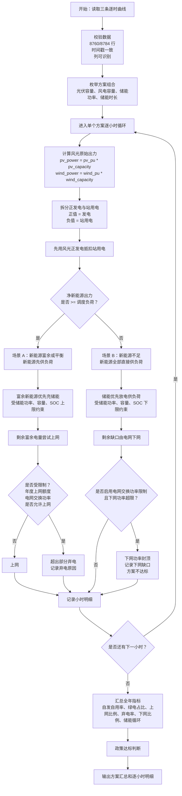

# 产品打磨记录

## 记录原则

- 记录用户提出的问题和建议。
- 记录讨论后形成的产品决策。
- 标记状态：采纳、暂缓、拒绝、已完成。
- 说明原因，沉淀后续可复用的产品/工程经验。

## 当前版本的计算逻辑

本章节记录截至 2026-05-16 的当前版本计算口径，作为后续开发和复核的基准。

### 1. 输入数据口径

- 负荷曲线使用真实功率值，单位为万千瓦。
- 光伏曲线使用标幺值。
- 风电曲线使用标幺值。
- 光伏、风电标幺值允许出现负值。
- 光伏、风电负值不作为异常，也不自动截断。
- 光伏、风电大于 1 的标幺值允许参与计算，但 UI 会提示出现点数，供用户复核。
- 支持 8760 小时普通年和 8784 小时闰年。
- 三条曲线必须行数一致、时间戳一致。

### 2. 风光出力与站用电

每小时先根据容量计算风光原始出力：

```text
pv_power = pv_pu * pv_capacity
wind_power = wind_pu * wind_capacity
```

其中 `pv_power` 和 `wind_power` 可以为负。

当前版本将原始出力拆分为正发电出力和站用电：

```text
pv_generation_power = max(pv_power, 0)
wind_generation_power = max(wind_power, 0)

pv_station_use_power = max(-pv_power, 0)
wind_station_use_power = max(-wind_power, 0)

renewable_generation_power = pv_generation_power + wind_generation_power
station_use_power = pv_station_use_power + wind_station_use_power
```

每小时先用风光正发电抵扣站用电：

```text
net_renewable_power = renewable_generation_power - station_use_power
renewable_power = max(net_renewable_power, 0)
station_use_deficit_power = max(-net_renewable_power, 0)
```

解释：

- `renewable_generation_power` 是新能源总可用发电功率，用于统计新能源总可用发电量。
- `station_use_power` 是风光站用电功率。
- `renewable_power` 是抵扣站用电后的净新能源出力，用于后续供负荷、充储、上网。
- 如果站用电超过当小时风光正发电，则超出部分并入下网需求。

### 3. 负荷与下网需求

用户负荷功率为：

```text
load_power
```

实际参与电网平衡的负荷缺口口径为：

```text
dispatch_load_power = load_power + station_use_deficit_power
```

也就是说，当风光站用电无法由当小时风光正发电覆盖时，缺口会计入下网功率。

汇总中：

```text
total_load_energy = sum(load_power)
grid_import_energy = sum(grid_import_power)
grid_import_rate = grid_import_energy / total_load_energy
```

注意：

- `total_load_energy` 仍表示用户侧总用电量，不包含站用电。
- `grid_import_energy` 表示从电网下网电量，可能包含用户负荷缺口，也可能包含站用电缺口。

### 4. 储能调度逻辑

当前版本采用逐小时贪心调度策略，不做经济性优化。

当净新能源出力大于等于调度负荷时：

```text
direct_self_use = dispatch_load
surplus = renewable_power - dispatch_load
```

富余新能源优先给储能充电：

```text
bess_charge = min(
    surplus,
    bess_power * dt,
    (soc_max * bess_energy - bess_energy_start) / eta_charge
)
```

储能电量更新：

```text
bess_energy_end = bess_energy_start + bess_charge * eta_charge
```

储能充电后剩余电量进入上网或弃电判断。

当净新能源出力小于调度负荷时：

```text
direct_self_use = renewable_power
deficit = dispatch_load - renewable_power
```

储能优先放电：

```text
bess_discharge = min(
    deficit,
    bess_power * dt,
    (bess_energy_start - soc_min * bess_energy) * eta_discharge
)
```

储能电量更新：

```text
bess_energy_end = bess_energy_start - bess_discharge / eta_discharge
```

储能放电后剩余缺口由电网下网，若启用电网交换功率限制，则受该限制约束。

储能约束：

- 储能只能由富余新能源充电。
- 储能不能从电网充电。
- 储能不能同小时充电和放电。
- 储能不能放电上网。
- 储能放电只用于补足调度负荷缺口。
- SOC 逐小时滚动。
- SOC 不得低于 `soc_min`，不得高于 `soc_max`。
- 充放电受储能功率和容量约束。
- 充放电效率参与计算。

### 5. 上网比例硬约束

当前版本默认启用年度上网比例硬约束：

```text
export_control_mode = annual_cap_runtime
```

年度允许上网电量为：

```text
export_cap_energy = total_renewable_generation * export_rate_max
```

默认：

```text
export_rate_max = 20%
```

逐小时计算时累计上网电量：

```text
cumulative_export += grid_export
```

当年度累计上网电量未达到额度时，富余新能源可以上网。

当年度累计上网电量达到额度后，后续富余新能源不能再上网，只能弃电。

因此：

```text
export_rate = grid_export_energy / total_renewable_generation
```

在硬约束模式下，理论上不会超过 `export_rate_max`。

结果中单独记录：

```text
curtail_due_to_export_cap_energy
```

用于表示因年度上网比例额度用完导致的弃电量。

如果用户关闭年度硬约束，则进入后验校核模式：

```text
export_control_mode = post_check
```

该模式下逐小时先正常上网，最后检查：

```text
export_rate <= export_rate_max
```

若超过，则方案不达标。

### 6. 与电网交换功率限制

当前版本支持可选的“与电网交换功率限制”：

```text
grid_exchange_power_limit
```

默认值为 `null`，表示无限制。

用户勾选并输入限制值后，该限制同时作用于上网功率和下网功率。

#### 6.1 上网侧

上网功率不得超过交换功率限制：

```text
grid_export_power <= grid_exchange_power_limit
```

若富余新能源超过可上网功率，则超出部分弃电。

结果中记录：

```text
curtail_due_to_exchange_limit_power
curtail_due_to_exchange_limit_energy
```

#### 6.2 下网侧

下网功率也不得超过交换功率限制：

```text
grid_import_power <= grid_exchange_power_limit
```

当负荷缺口较大时，储能会优先放电降低下网功率。

如果储能能力不足，仍超过交换功率限制，则：

```text
grid_import_power = grid_exchange_power_limit
exchange_import_shortfall_power = 原始下网需求 - grid_exchange_power_limit
```

结果中记录：

```text
exchange_import_shortfall_power
exchange_import_shortfall_energy
```

出现下网缺口时，方案判定为不达标。

### 7. 自发自用与政策指标

新能源自发自用电量口径：

```text
self_use_energy = direct_self_use_energy + bess_discharge_to_load
```

其中：

- `direct_self_use_energy` 为净新能源直接供调度负荷电量。
- `bess_discharge_to_load` 为储能放电供调度负荷电量。
- 储能放电电量只来自此前富余新能源充电。

政策指标：

```text
self_use_rate = self_use_energy / total_renewable_generation
green_load_rate = self_use_energy / total_load_energy
export_rate = grid_export_energy / total_renewable_generation
curtail_rate = curtail_energy / total_renewable_generation
grid_import_rate = grid_import_energy / total_load_energy
```

默认达标条件：

```text
self_use_rate >= 60%
green_load_rate >= 30%
export_rate <= 20%
```

如果启用电网交换功率限制，还要求不能出现下网缺口。

### 8. 储能损耗与循环

储能损耗：

```text
bess_loss_energy
= bess_charge_energy
- bess_discharge_to_load
- (final_bess_energy - initial_bess_energy)
```

年等效循环次数：

```text
annual_equivalent_cycles = bess_discharge_to_load / bess_energy
```

若 `bess_energy = 0`，则循环次数为 0。

预计更换年份：

```text
replacement_year = cycle_life / annual_equivalent_cycles
```

若循环次数为 0，则为无穷大。

### 9. 当前版本不做的事项

当前版本不做经济性评价，包括：

- LCOE；
- IRR；
- NPV；
- 投资回收期；
- 电价优化；
- 储能套利；
- 现货市场收益。

当前版本也不做数学优化，只做批量枚举和逐小时技术测算。

## 当前版本计算流程图与场景说明

本章节把当前版本的计算逻辑整理成“流程图 + 场景表 + 公式说明”，用于人工复核、需求讨论和后续重构。

### 1. 总体流程图



### 2. 每小时输入与中间变量

| 变量 | 含义 | 公式 / 说明 |
|---|---|---|
| `load_power` | 用户负荷功率 | 输入曲线，单位：万千瓦 |
| `pv_pu` | 光伏标幺值 | 输入曲线，可为负 |
| `wind_pu` | 风电标幺值 | 输入曲线，可为负 |
| `pv_power` | 光伏原始出力 | `pv_pu * pv_capacity`，可为负 |
| `wind_power` | 风电原始出力 | `wind_pu * wind_capacity`，可为负 |
| `pv_generation_power` | 光伏正发电功率 | `max(pv_power, 0)` |
| `wind_generation_power` | 风电正发电功率 | `max(wind_power, 0)` |
| `pv_station_use_power` | 光伏站用电功率 | `max(-pv_power, 0)` |
| `wind_station_use_power` | 风电站用电功率 | `max(-wind_power, 0)` |
| `renewable_generation_power` | 新能源总可用发电功率 | `pv_generation_power + wind_generation_power` |
| `station_use_power` | 风光站用电功率 | `pv_station_use_power + wind_station_use_power` |
| `net_renewable_power` | 抵扣站用电后的净新能源 | `renewable_generation_power - station_use_power` |
| `renewable_power` | 参与负荷平衡的净新能源功率 | `max(net_renewable_power, 0)` |
| `station_use_deficit_power` | 站用电缺口功率 | `max(-net_renewable_power, 0)` |
| `dispatch_load_power` | 调度口径负荷 | `load_power + station_use_deficit_power` |

解释：

- `renewable_generation_power` 用于统计新能源总可用发电量。
- `renewable_power` 用于逐小时能量平衡。
- 当风光负值产生站用电时，优先由当小时风光正发电抵扣。
- 如果站用电不能完全抵扣，缺口进入下网需求。

### 3. 场景 A：净新能源大于等于调度负荷

触发条件：

```text
renewable_power >= dispatch_load_power
```

处理流程：

```text
direct_self_use_power = dispatch_load_power
surplus_power = renewable_power - dispatch_load_power
```

储能充电：

```text
bess_charge_power = min(
    surplus_power,
    bess_power,
    (soc_max * bess_energy - bess_energy_start) / eta_charge / dt
)
```

储能电量更新：

```text
bess_energy_end = bess_energy_start + bess_charge_power * dt * eta_charge
```

储能充电后的富余电量：

```text
surplus_after_charge_power = surplus_power - bess_charge_power
```

之后进入上网与弃电判断。

#### 场景 A 的小时标签

| `hour_case` | 触发情况 | 处理逻辑 |
|---|---|---|
| `GEN_BALANCED` | 新能源刚好等于调度负荷 | 全部直接自用，无储能充放电，无上网弃电 |
| `GEN_SURPLUS_CHARGE_BESS` | 有富余新能源，且全部用于充储能 | 储能充电，剩余富余为 0 |
| `GEN_SURPLUS_DIRECT_EXPORT` | 有富余新能源，无储能充电，且全部上网 | 上网，不弃电 |
| `GEN_SURPLUS_CHARGE_EXPORT` | 富余新能源先充储，剩余上网 | 充储 + 上网，不弃电 |
| `GEN_SURPLUS_CHARGE_EXPORT_CURTAIL` | 富余新能源先充储，部分上网，部分弃电 | 充储 + 上网 + 弃电 |
| `GEN_SURPLUS_CURTAIL` | 富余新能源不能上网或上网受限，剩余弃电 | 弃电 |

说明：

- 当前 `hour_case` 是主场景标签。
- 具体弃电原因需要结合以下字段复核：
  - `curtail_due_to_export_cap_power`
  - `curtail_due_to_exchange_limit_power`
  - `curtail_power`

### 4. 上网与弃电判断

富余电量在充储后尝试上网。

如果不允许上网：

```text
grid_export_power = 0
curtail_power = surplus_after_charge_power
```

如果允许上网，则先考虑电网交换功率限制：

```text
exchange_export_limit_power =
    grid_exchange_power_limit if configured else infinity
```

再考虑最大上网功率限制。当前 UI 暂不暴露单独的最大上网功率限制，但底层保留 `export_power_max`：

```text
export_power_limit =
    min(exchange_export_limit_power, export_power_max or infinity)
```

年度上网比例硬约束下：

```text
annual_export_cap_energy = total_renewable_generation * export_rate_max
remaining_export_cap_energy = annual_export_cap_energy - cumulative_export_energy
```

每小时实际上网：

```text
grid_export_energy = min(
    surplus_after_charge_energy,
    export_power_limit * dt,
    remaining_export_cap_energy
)
```

弃电：

```text
curtail_energy = surplus_after_charge_energy - grid_export_energy
```

因年度上网比例额度导致的弃电：

```text
curtail_due_to_export_cap_energy =
    max(export_before_annual_cap_energy - grid_export_energy, 0)
```

因电网交换功率限制导致的弃电：

```text
curtail_due_to_exchange_limit_energy =
    max(surplus_after_charge_energy - min(surplus_after_charge_energy, exchange_limit_energy), 0)
```

解释：

- 年度上网比例硬约束决定“全年最多能上网多少电量”。
- 电网交换功率限制决定“每小时最多能上网多少功率”。
- 两者都可能导致弃电。

### 5. 场景 B：净新能源小于调度负荷

触发条件：

```text
renewable_power < dispatch_load_power
```

处理流程：

```text
direct_self_use_power = renewable_power
deficit_power = dispatch_load_power - renewable_power
```

储能放电：

```text
bess_discharge_power = min(
    deficit_power,
    bess_power,
    (bess_energy_start - soc_min * bess_energy) * eta_discharge / dt
)
```

储能电量更新：

```text
bess_energy_end = bess_energy_start - bess_discharge_power * dt / eta_discharge
```

储能放电后的原始下网需求：

```text
raw_grid_import_power = deficit_power - bess_discharge_power
```

若未启用电网交换功率限制：

```text
grid_import_power = raw_grid_import_power
exchange_import_shortfall_power = 0
```

若启用电网交换功率限制：

```text
grid_import_power = min(raw_grid_import_power, grid_exchange_power_limit)
exchange_import_shortfall_power =
    raw_grid_import_power - grid_import_power
```

如果 `exchange_import_shortfall_power > 0`，说明即使储能已放电，系统仍无法在电网交换功率限制下满足负荷，该方案不达标。

#### 场景 B 的小时标签

| `hour_case` | 触发情况 | 处理逻辑 |
|---|---|---|
| `NO_RENEWABLE_GRID_IMPORT` | 无净新能源，且储能不放电 | 负荷由电网下网 |
| `GEN_SHORT_GRID_IMPORT` | 新能源不足，储能不放电 | 新能源直接供一部分负荷，剩余下网 |
| `GEN_SHORT_BESS_DISCHARGE` | 新能源不足，储能放电后完全覆盖缺口 | 新能源 + 储能满足调度负荷 |
| `GEN_SHORT_BESS_DISCHARGE_AND_GRID_IMPORT` | 新能源不足，储能放电后仍需下网 | 新能源 + 储能 + 电网下网 |

说明：

- 若启用电网交换功率限制，仍需查看 `exchange_import_shortfall_power`。
- 出现下网缺口时，小时标签仍可能是 `GEN_SHORT_BESS_DISCHARGE_AND_GRID_IMPORT`，但方案汇总会记录缺口并判为不达标。

### 6. 储能状态滚动

每小时开始：

```text
soc_start = bess_energy_start / bess_energy
```

每小时结束：

```text
soc_end = bess_energy_end / bess_energy
```

下一小时：

```text
soc_start[t + 1] = soc_end[t]
```

无储能方案：

```text
bess_power = 0
bess_energy = 0
bess_charge_power = 0
bess_discharge_power = 0
soc_start = 0
soc_end = 0
```

### 7. 程序考虑的约束场景汇总

| 约束场景 | 触发条件 | 程序处理 | 记录字段 |
|---|---|---|---|
| 风光负值 | `pv_power < 0` 或 `wind_power < 0` | 按站用电处理 | `pv_station_use_power`、`wind_station_use_power` |
| 站用电超过正发电 | `station_use_power > renewable_generation_power` | 超出部分进入下网需求 | 体现在 `grid_import_power` |
| 储能充电功率受限 | `surplus_power > bess_power` | 充电功率不超过 `bess_power` | `bess_charge_power` |
| 储能充电容量受限 | SOC 接近上限 | 充电不超过剩余可充空间 | `soc_end`、`bess_energy_end` |
| 储能放电功率受限 | `deficit_power > bess_power` | 放电功率不超过 `bess_power` | `bess_discharge_power` |
| 储能放电容量受限 | SOC 接近下限 | 放电不低于 `soc_min` | `soc_end`、`bess_energy_end` |
| 年度上网比例额度用完 | 累计上网达到 `export_cap_energy` | 后续富余新能源弃电 | `curtail_due_to_export_cap_power` |
| 上网交换功率受限 | 富余电力超过 `grid_exchange_power_limit` | 超出部分弃电 | `curtail_due_to_exchange_limit_power` |
| 下网交换功率受限 | 缺口超过 `grid_exchange_power_limit` | 储能先放电，仍不足则记录下网缺口 | `exchange_import_shortfall_power` |
| 不允许上网 | `allow_export = false` | 富余电力弃电 | `curtail_power` |
| 无储能方案 | `bess_power = 0` 或 `bess_energy = 0` | 不充不放，SOC 为 0 | `bess_*` 字段为 0 |

### 8. 汇总指标公式

| 指标 | 公式 | 解释 |
|---|---|---|
| `total_load_energy` | `sum(load_power * dt)` | 用户总用电量，不含站用电 |
| `total_renewable_generation` | `sum(renewable_generation_power * dt)` | 风光正发电总量 |
| `pv_station_use_energy` | `sum(pv_station_use_power * dt)` | 光伏站用电 |
| `wind_station_use_energy` | `sum(wind_station_use_power * dt)` | 风电站用电 |
| `station_use_energy` | `pv_station_use_energy + wind_station_use_energy` | 风光站用电合计 |
| `direct_self_use_energy` | `sum(direct_self_use_power * dt)` | 新能源直接供调度负荷 |
| `bess_discharge_to_load` | `sum(bess_discharge_power * dt)` | 储能放电供调度负荷 |
| `self_use_energy` | `direct_self_use_energy + bess_discharge_to_load` | 新能源自发自用电量 |
| `grid_import_energy` | `sum(grid_import_power * dt)` | 下网电量 |
| `grid_import_rate` | `grid_import_energy / total_load_energy` | 下网电量占用户总用电量比例 |
| `grid_export_energy` | `sum(grid_export_power * dt)` | 上网电量 |
| `export_rate` | `grid_export_energy / total_renewable_generation` | 上网比例 |
| `export_cap_energy` | `total_renewable_generation * export_rate_max` | 年度允许上网电量 |
| `curtail_energy` | `sum(curtail_power * dt)` | 弃电量 |
| `curtail_rate` | `curtail_energy / total_renewable_generation` | 弃电率 |
| `curtail_due_to_export_cap_energy` | `sum(curtail_due_to_export_cap_power * dt)` | 因年度上网额度导致的弃电 |
| `curtail_due_to_exchange_limit_energy` | `sum(curtail_due_to_exchange_limit_power * dt)` | 因交换功率上限导致的弃电 |
| `exchange_import_shortfall_energy` | `sum(exchange_import_shortfall_power * dt)` | 因下网交换功率限制导致的供电缺口 |
| `bess_charge_energy` | `sum(bess_charge_power * dt)` | 储能充电电量 |
| `bess_loss_energy` | `bess_charge_energy - bess_discharge_to_load - (final_bess_energy - initial_bess_energy)` | 储能损耗 |
| `annual_equivalent_cycles` | `bess_discharge_to_load / bess_energy` | 年等效循环次数 |

### 9. 达标判断

方案达标需要满足：

```text
self_use_rate >= self_use_rate_min
green_load_rate >= green_load_rate_min
export_rate <= export_rate_max
```

如果不允许上网：

```text
grid_export_energy == 0
```

如果启用电网交换功率限制：

```text
exchange_import_shortfall_energy == 0
```

不达标原因可能包括：

- 自发自用率不足；
- 绿电占用电比例不足；
- 上网比例超限；
- 不允许上网但出现上网；
- 最大上网功率超限；
- 电网交换功率限制导致下网缺口。

## 2026-05-16 UI 与复核体验优化

### 1. 储能时长选项中的 0 不直观

用户反馈：

- “储能时长为什么要有个 0？我没搞懂。”

讨论结论：

- `0` 的技术含义是“无储能方案”，用于生成纯风光基准方案。
- 但业务用户不应被迫理解这个编码。
- UI 应改为“包含无储能方案”勾选框，默认选中。
- 储能时长选项只展示真实储能时长，如 `2,4`。

状态：已完成。

经验：

- UI 中的特殊数值编码要转译成业务语言，避免让用户猜系统内部约定。

### 2. 自动识别时间列和数值列

用户反馈：

- 输入文件用户通常已经处理好。
- 软件至少应自动识别时间列，另一个数值列自动作为负荷/光伏/风电数值列。
- 不应要求用户每次手动选择。

讨论结论：

- 优先识别时间列名：`时间`、`timestamp`、`time`、`日期时间` 等。
- 排除时间列后，如果只有一个候选数值列，自动使用。
- 只有存在多个候选列或无法识别时，才显示手动选择。

状态：已完成。

经验：

- 能自动识别的输入，不要强迫用户手动操作。
- 手动选择应作为兜底，而不是主流程。

### 3. 批量测算需要进度条

用户反馈：

- 已经有方案数量预估，应在测算过程中用进度条显示当前进度。

讨论结论：

- 批量运行器增加进度回调。
- UI 显示 `已完成 / 总方案数` 和当前方案编号。

状态：已完成。

经验：

- 长耗时任务必须有过程反馈，否则用户无法判断程序是否卡住。

### 4. 数据状态与数据质量提示

用户反馈：

- 除方案数量外，应显示数据加载状态，例如负荷/光伏/风电各有多少小时。
- 对光伏标幺值大于 1 的情况，应提示数量。
- 但本阶段不要自动处理输入曲线，例如小负值不应被软件自动截断。

讨论结论：

- UI 增加数据状态面板，展示行数、时间范围、编码、数值异常提示。
- 保留“大于 1”提示。
- 小负值不再自动截断为 0，本阶段直接报错，由用户在外部处理数据。

状态：已完成。

经验：

- 技术测算软件应帮助用户确认“传入的数据是什么”，但不应在未经用户明确授权时修改输入数据。

### 5. 结果筛选和排序不足

用户反馈：

- “只看达标方案”不够。
- 至少应支持按绿电占比、弃电率、自发自用率、上网比例排序。
- 应支持按方案类型筛选：无储能、纯光伏、纯风电、光储、风储等。
- 勾选和排序应是 AND 关系。

讨论结论：

- 筛选条件之间采用 AND 关系。
- 排序只改变当前筛选结果的显示顺序。
- 增加方案类型筛选。

状态：已完成。

经验：

- 结果表不是只给机器看的输出，还要支持人的复核路径。

### 6. 补充下网电量与下网电量比例

用户反馈：

- 已有负荷总用电量，但缺少下网电量和下网电量比例。
- 电量单位使用万千瓦时，不保留小数。
- CSV 暂时可继续打磨，后续希望输出阅读体验更好的格式。

讨论结论：

- 下网电量等同当前 `grid_import_energy`。
- 新增更直观字段：
  - `grid_import_rate = grid_import_energy / total_load_energy`
- UI 展示中电量按万千瓦时、不保留小数格式化。
- CSV/Excel 格式化输出体验后续继续打磨。

状态：已完成。

经验：

- 输出字段既要满足算法口径，也要贴近业务复核语言。

### 7. 持续更新产品打磨记录

用户反馈：

- 问题解决或用更好的方案解决后，应及时更新 `PRODUCT_POLISH_LOG.md`。

讨论结论：

- 本文档作为产品打磨决策记录持续维护。
- 每轮 UI/算法口径讨论后更新状态。

状态：采纳，进行中。

经验：

- 产品打磨过程本身是可复用资产，可为未来 skill 设计提供素材。

### 8. Codex 内置浏览器中无法下载方案汇总 Excel

用户反馈：

- 在 Codex 中运行程序，方案汇总 Excel 无法下载。

初步判断：

- 当前全局下载按钮位置靠后，可能被大表格和逐小时明细淹没。
- Streamlit rerun 或临时目录生命周期也可能影响下载体验。

讨论结论：

- 将方案汇总 Excel 和全部逐小时 ZIP 下载按钮提前到汇总区。
- 生成下载文件时使用稳定的内存字节，不依赖用户点击后临时文件仍存在。
- 保留单方案 CSV 下载在明细区域。

状态：已完成。

解决方案：

- 下载按钮已移动到汇总指标下方、结果表上方。
- Excel 和 ZIP 下载数据在按钮渲染前转为稳定的内存字节，避免临时目录生命周期影响点击下载。
- 单方案 CSV 下载仍保留在逐小时明细区域。

验证记录：

- `python -m pytest` 通过，44 个测试全部通过。
- 使用干净模拟数据导出 `outputs/scenario_summary_20260516_175415.xlsx`，文件大小 11440 字节。

## 2026-05-16 风光负值曲线与站用电口径修正

### 1. 风电/光伏标幺曲线负值不应视为异常

用户反馈：

- 风电、光伏曲线出现负值是正常的。
- 可理解为新能源电源在不发电时需要用电。
- 这些负值应正常参与计算，并统计到风、光的“站用电”列。

修正结论：

- 风电/光伏标幺曲线负值不再报错，也不自动截断。
- 每小时将风光出力拆分为：
  - 原始出力：`pv_power`、`wind_power`，可为负；
  - 正发电出力：`pv_generation_power`、`wind_generation_power`；
  - 站用电：`pv_station_use_power`、`wind_station_use_power`；
  - 合计站用电：`station_use_power`。
- 调度逻辑为：
  - 先用当小时风光正发电抵扣站用电；
  - 抵扣后的净新能源再供用户负荷、充储、上网；
  - 如果站用电超过当小时正发电，缺口计入下网电量。
- 汇总新增：
  - `pv_station_use_energy`
  - `wind_station_use_energy`
  - `station_use_energy`

状态：已完成。

验证记录：

- `python -m pytest` 通过，46 个测试全部通过。

经验：

- 数据“负值”不一定是错误，技术软件必须先理解业务含义。
- 对输入数据的处理策略应区分“异常数据清洗”和“业务口径计算”。

## 2026-05-16 电网交换功率限制与运行服务重启问题

### 1. Streamlit 旧进程导致新代码未生效

用户反馈：

- 页面测算时报错：`run_batch() got an unexpected keyword argument 'progress_callback'`。

判断：

- 源码中的 `run_batch` 已经包含 `progress_callback` 参数。
- 报错说明当前浏览器连接的 Streamlit 服务仍在使用旧版本代码。
- 仅刷新浏览器不一定能让旧 Python 进程加载新代码，尤其是服务启动在代码修改之前。

结论：

- 修改代码后，应先停止旧 Streamlit 进程，再重新启动。

状态：已说明，待用户按重启步骤验证。

经验：

- 本地 Web 工具调试时，浏览器刷新和服务进程重启是两个动作。

### 2. 新增“与电网交换功率限制”

用户需求：

- 上网政策约束中增加“与电网交换功率限制”。
- 默认无限制。
- 用户勾选并输入值后，系统逐时不得出现下网功率或上网功率超过该值。
- 触及上网限制时，新能源需要弃电。
- 触及下网限制时，应尽量通过储能放电降低下网功率。

实现结论：

- 新增政策参数：`grid_exchange_power_limit`。
- UI 中新增：
  - `设置与电网交换功率限制`
  - `与电网交换功率限制（万千瓦）`
- 上网侧：
  - `grid_export_power` 不超过限制；
  - 超出部分计入 `curtail_power`；
  - 同时记录 `curtail_due_to_exchange_limit_power` 和汇总 `curtail_due_to_exchange_limit_energy`。
- 下网侧：
  - 储能按原有规则优先放电降低下网；
  - 若储能能力不足，`grid_import_power` 封顶在限制值；
  - 未满足部分记录为 `exchange_import_shortfall_power` 和汇总 `exchange_import_shortfall_energy`；
  - 出现下网缺口时方案不达标，原因包含“电网交换功率限制导致下网缺口”。

状态：已完成。

验证记录：

- `python -m pytest` 通过，50 个测试全部通过。

经验：

- “强约束”既要限制结果不越界，也要记录限制造成的代价。
- 上网受限的代价是弃电；下网受限且储能不足的代价是供电缺口，应单独展示并判定方案不可行。

## 2026-05-16 批量上传与导入路径稳定性

### 1. UI 代码更新但参数模型仍是旧版本

用户反馈：

- 仍然报错：`PolicyParams.__init__() got an unexpected keyword argument 'grid_exchange_power_limit'`。

判断：

- UI 页面已经显示新版内容，但导入 `green_direct.models.params` 时可能拿到了环境中旧的已安装包，而不是当前项目 `src` 下的源码。
- 原因是 Streamlit 执行脚本时，`sys.path` 未必总是把项目 `src` 放在第一位。

解决方案：

- 在 `src/green_direct/ui/app.py` 顶部强制把项目 `src` 路径插入 `sys.path` 第一位。
- 避免 UI 文件使用当前源码，而模型/批量/算法模块却混入旧包。

状态：已完成，需重启 Streamlit 后生效。

经验：

- 本地项目若采用 `src/` 布局，Streamlit 脚本入口要显式保证源码路径优先。
- 否则容易出现“页面是新的，导入模块是旧的”的错配问题。

### 2. 批量上传并按文件名自动识别曲线类型

用户建议：

- 数据上传区域希望能一次选择多个文件。
- 软件根据文件名自动识别：
  - 含 `负荷`、`load`、`用电` 的文件作为负荷曲线；
  - 含 `光伏`、`pv`、`solar` 的文件作为光伏标幺曲线；
  - 含 `风电`、`wind` 的文件作为风电标幺曲线。

实现方案：

- 增加“批量上传曲线 CSV”入口，支持一次选择多个 CSV。
- 自动按文件名关键字分配到负荷、光伏、风电。
- 若识别失败或识别冲突，给出提示。
- 保留单独上传入口作为人工覆盖。

状态：已完成。

经验：

- 上传入口应优先支持真实用户的一次性操作习惯。
- 自动识别必须保留人工覆盖，避免文件名不规范时卡死流程。

## 2026-05-16 储能放电上网口径与性能优化

### 1. 储能默认不能放电上网

用户问题：

- 当前计算逻辑是否存在储能放电上网的场景？
- 方案汇总表是否统计储能放电量？
- 默认应为储能不能放电上网。

核查结论：

- 当前调度逻辑不存在储能放电上网。
- 储能只在 `renewable_power < dispatch_load_power` 时放电。
- 储能放电用于补足调度负荷缺口。
- 当 `renewable_power >= dispatch_load_power` 时，储能只可能充电，不会放电。
- 汇总表中的储能放电字段是 `bess_discharge_to_load`，含义为“储能放电供负荷电量”。

加固措施：

- 在“当前版本的计算逻辑”中明确写入“储能不能放电上网”。
- 新增测试：`test_bess_discharge_never_exports_to_grid`，确保储能放电时 `grid_export_energy = 0`。

状态：已完成。

### 2. 批量计算和界面筛选速度优化

用户反馈：

- 计算速度不到 120 个方案/分钟。
- 汇总表生成较慢但还能接受。
- 一旦按规则筛选，界面变灰并长时间等待。
- 未来方案数量可能达到成千上万条。

问题定位：

- 单方案逐小时计算使用 pandas `iterrows()`，每个方案 8760/8784 次逐行构造 dict，性能较低。
- UI 在每次筛选/排序时会重新生成 Excel 和全部逐小时 ZIP 下载数据。
- UI 每次筛选时会对完整结果表做字符串格式化并渲染，方案数大时卡顿明显。

已完成优化：

- 单方案计算改为 NumPy 数组预分配 + 索引循环，避免 `iterrows()` 和逐行 dict append。
- 下载文件使用 `st.session_state` 缓存，只在新测算结果产生后准备一次。
- 筛选/排序时不再重复生成 Excel/ZIP。
- 方案类型从逐行 `apply` 改为向量化赋值。
- 结果表默认只显示筛选后的前 500 行，用户可调整最多显示行数。

状态：已完成第一轮优化。

后续可选优化：

- 批量测算时先只保留汇总表，不保存所有方案逐小时明细。
- 用户点击某个方案后，再按需重算该方案逐小时明细。
- 对大批量方案使用多进程并行。
- 将核心逐小时循环进一步迁移到 `numba` 或 Cython。
- 将结果表分页，避免一次渲染上万行。

验证记录：

- `python -m pytest` 通过，51 个测试全部通过。

经验：

- 大批量技术测算要区分“批量筛选所需数据”和“单方案复核所需明细”。
- UI 卡顿不一定来自计算本身，下载文件准备、全表格式化和全表渲染也可能是主要瓶颈。

经验：

- 下载入口应靠近结果汇总，并使用稳定的数据载体，减少 UI rerun 对下载的影响。

## 2026-05-16 建立软件总览与接口文档

用户问题：

- 当前 V0.1 技术测算模块准备先告一段落。
- 后续还要开发图表制作、经济性评价、报告等下游模块。
- 虽然希望各模块保持独立，但需要一份软件介绍或接口说明，保证后续模块能接得上。

产品判断：

- 需要建立一份稳定的“系统总览 + 模块接口契约”文档。
- `PRODUCT_POLISH_LOG.md` 继续记录产品打磨和决策过程。
- 新文档应放在 `docs/` 下，作为后续模块开发的基线，而不是混在过程日志里。

已完成：

- 新增 `docs/SOFTWARE_OVERVIEW_AND_INTERFACE.md`。
- 文档内容覆盖：
  - 软件定位与当前边界；
  - 总体架构和模块依赖方向；
  - 标准输入数据契约；
  - 参数模型、方案模型、单方案仿真、批量测算、导出接口；
  - 当前计算口径；
  - 汇总结果和逐小时明细字段；
  - 图表、经济性、报告模块接入建议；
  - 接口稳定性规则；
  - 测试与运行基线。

状态：已完成。

经验：

- 当一个模块即将成为其他模块的上游时，需要把“当前口径”从讨论日志中提炼成接口契约。
- 过程日志适合记录为什么这么做，接口文档适合记录后续必须怎么接。

## 2026-05-19 架构重定向：从批量枚举工具到方案策划推荐平台

### 1. 用户对对标软件的判断

用户提供了一组“绿电直连 / 微电网项目策划平台”的对标截图。经过讨论后形成判断：

- 对标软件真正有价值的不是 UI 表象，而是背后的项目策划工作流；
- 用户不希望软件只是枚举大量风光储容量组合，然后展示一张巨大的结果表；
- 枚举仍然可以作为内部搜索手段，但前台应展示经过筛选、排序、解释的几个代表性方案；
- 图表、报告和后续分析应围绕推荐方案展开，而不是围绕全部枚举方案展开；
- AI 助手短期内不是重点。

状态：采纳。

### 2. 新的产品方向

项目方向从：

```text
绿电直连风光储多方案批量测算工具
```

调整为：

```text
绿电直连 / 微电网项目方案策划与推荐平台
```

新的主流程应为：

```text
项目输入
-> 输入审查
-> 生成候选方案池
-> 技术仿真
-> 政策合规筛选
-> 经济性排序
-> 代表方案推荐
-> 图表、报告、导出
```

状态：采纳。

### 3. 经济性排序提前进入

用户提出：在枚举方案基础上至少有两个约束或排序维度：

1. 是否满足政策要求，包括自发自用、上网、绿电占比；
2. 经济性排序。

讨论结论：

- 经济性应提前进入推荐逻辑；
- 但第一阶段不必做完整财务评价；
- 可先实现轻量经济性排序，用于方案筛选和推荐；
- 完整 NPV、IRR、多年现金流、税费、融资等可后续扩展；
- 经济性评价必须读取技术仿真结果，不应反向改变技术调度。

状态：采纳，待设计实现。

### 4. 柴油发电进入方案逻辑

用户提出：加入柴发后，方案计算模块可更好适配离网场景；并网模式下接柴发较少但也存在，不冲突。

讨论结论：

- 柴发应作为明确资产建模，而不是混入电网下网；
- 柴发需要独立出力、油耗、成本、排放和运行状态字段；
- 离网、并网、并网加备用应作为项目模式或调度策略表达；
- 柴发调度策略需要专门研究；
- 柴发是否允许给储能充电是关键口径问题，初期建议谨慎处理；
- 如果未来允许非新能源给储能充电，必须做能源来源追踪，避免污染绿电指标。

状态：采纳，待专家审查。

### 5. 约束文档更新

用户担心旧 `AGENTS.md`、`CLAUDE.md` 和 V0.1 文档会限制后续开发。

讨论结论：

- 当前项目文件夹继续使用；
- 现有 V0.1 内核和测试作为基线保留；
- 旧 V0.1 文档不删除，但不再作为最终产品边界；
- 更新 `AGENTS.md` 和 `CLAUDE.md`，允许经济性排序、柴发、离网、推荐引擎等后续方向；
- 新增专家审查材料目录：`notes/architecture_reframe_20260519/`。

状态：已完成。

新增文档：

- `notes/architecture_reframe_20260519/01_EXPERT_REVIEW_BRIEF.md`
- `notes/architecture_reframe_20260519/02_TARGET_ARCHITECTURE_AND_CALCULATION_LOGIC.md`
- `notes/architecture_reframe_20260519/03_MIGRATION_AND_POLISH_PLAN.md`

更新文档：

- `AGENTS.md`
- `CLAUDE.md`
- `ROADMAP.md`

### 6. 后续开发经验

- 旧代码和旧文档不一定是负担，关键是把它们降级为“基线资产”，而不是继续作为未来边界。
- 架构调整前先更新 agent 指令文件，否则后续 Codex / Claude Code 很容易按旧规则开发。
- 推荐引擎应先独立于 UI 做出来，避免把产品逻辑写死在 Streamlit 页面里。
- 柴发和经济性都不应直接塞入现有函数，而应通过资产模型、调度策略、经济评价层逐步进入。

## 2026-05-19 切换电脑前补充：图表模块降级为可替换原型

### 1. 用户对当前图表模块的判断

用户反馈：

- 当前已经开发出来的图表模块很不理想；
- 甚至可以丢弃；
- 现阶段不应继续围绕图表模块投入主要精力；
- 应优先把方案逐时计算、风光储规模配置逻辑、简化经济性排序逻辑等搞清楚并实现。

讨论结论：

- 现有图表模块降级为早期原型，不作为近期重点资产；
- 后续开发可以替换或重做图表模块；
- 图表和报告应等核心计算、推荐、经济性排序稳定后再重新设计；
- 近期重点转为：
  1. 逐小时能量平衡和能源台账；
  2. 风光储规模配置 / 候选方案生成；
  3. 政策合规筛选；
  4. 轻量经济性排序；
  5. 代表方案推荐。

状态：采纳。

经验：

- 图表不是底层架构，不应让不满意的展示模块牵制核心计算和推荐逻辑。
- 技术软件应先把“算得对、筛得清、推荐得有理由”做好，再打磨可视化。

## 2026-05-21 经济性评价 V1 口径确认

用户和 AI 讨论后确认：经济性模块可以进入代码实现，但必须先按 V1 简化年度现金流口径落地，不引入贷款和复杂财务模型。

### 1. 模型定位

- V1 是不考虑贷款的项目投资现金流模型，不计算还本付息、资本金 IRR 或复杂融资结构。
- 年度现金流详表是主输出，FNPV、FIRR、静态回收期、动态回收期必须能追溯到年度明细。
- Year 0 为建设期，发生初始投资现金流出；运营期默认 25 年，各年收入、成本、税费和储能更换默认在年末发生。
- FIRR 不使用用户输入折现率；折现率只用于 FNPV、折现净现金流和动态回收期。
- 经济性评价只读取技术 `summary` / `hourly_detail`，不改变逐小时调度、SOC、上网、下网、弃电或储能充放电结果。

### 2. 已确认默认输入

| 输入项 | 默认值 | 口径 |
|---|---:|---|
| 运营期 | 25 年 | 风电、光伏整体按同一运营期处理 |
| 风电单位造价 | 4500 元/kW，含税 | 乘 `wind_capacity` |
| 光伏单位造价 | 2500 元/kW，含税 | 需提示与光伏曲线容量基准匹配 |
| 储能单位造价 | 900 元/kWh，含税 | 乘 `bess_energy` |
| 其他固定资产投资 | 0 万元，含税 | 可选 |
| 建设投资进项税率 | 10% | 可改 |
| 风电运维成本 | 50 元/kW/年 | 无进项税 |
| 光伏运维成本 | 25 元/kW/年 | 无进项税 |
| 储能运维成本 | 18 元/kW/年 | 按 `bess_power`，无进项税 |
| 上网电价 | 0.25 元/kWh，含税 | 产生销项税 |
| 自发自用电价 | 0.40 元/kWh，含税 | 产生销项税；提示不含过网费 |
| 储能更换投资比例 | 50% | 按初始储能投资比例 |
| 储能更换进项税率 | 13% | 外购设备材料 |
| 销项税率 | 13% | 电费收入拆税 |
| 城建税地区 | 县城、镇 5% | 可选市区 7%、其他 1% |
| 企业所得税率 | 25% | 可选 15% 或自定义 |
| 折现率 | 6% | 用于 FNPV、动态回收期 |

### 3. 税费和现金流口径

- 用户输入的投资、电价、收入和成本默认是含税金额。
- 利润表使用不含税收入、不含税成本、折旧、附加税费和企业所得税。
- 现金流表使用实际含税现金收付，并单独扣减实际缴纳增值税、附加税费和企业所得税。
- 建设投资进项税在 Year 0 形成留抵，进入运营期后有销项再抵扣。
- 运行成本简化为内部运维，不考虑进项税。
- 储能更换属于外购设备材料，发生当年产生进项税，可抵扣或形成留抵。
- 进项税不直接作为现金流入，只通过减少实际缴纳增值税或形成留抵体现。

### 4. 储能更换口径

- 储能更换由循环寿命达到时间触发，建议使用 `replacement_year` 或 `annual_equivalent_cycles` 推导。
- 更换现金流出 = 初始储能投资含税金额 × 更换投资比例。
- 更换当年计算可抵扣进项税。
- 后续储能更换不追加折旧，不计算残值，不计算旧电池处置。
- 若更换触发在运营期最后一年或之后，例如默认 25 年项目到第 25 年才触发，则默认不再更换。

### 5. 其他经营收入

- 其他经营收入支持多项输入，单位为万元/年，含税。
- 支持发生规则：每年、前 20 年、前 25 年、指定年份。
- 允许输入负值。负值默认不产生进项税，作为经营性收入抵减或额外经营性支出进入现金流。

### 6. 文档精简

用户不希望项目文档继续膨胀。本轮将 `docs/references/economic_evaluation/` 精简为：

- `00_README_使用说明.md`
- `经济性评价V1计算口径_合并版.md`
- `99_官方来源清单.md`

旧的分章节草稿已合并进权威合并版。后续经济性口径变化优先更新合并版和本日志，避免新增平行文档。

状态：V1 口径已确认。

### 7. 初版实现记录

本轮已完成经济性 V1 的第一版代码实现：

- 新增 `src/green_direct/economy/economic_inputs.py`，定义 `EconomicParams` 和 `OtherOperatingRevenueItem`；
- 新增 `src/green_direct/economy/economic_evaluator.py`，实现单方案和批量年度现金流评价；
- 输出年度现金流明细表和 FNPV、FIRR、静态投资回收期、动态投资回收期等指标；
- 实现 Year 0 建设投资留抵、运营期增值税抵扣、附加税、企业所得税、20 年直线折旧、储能更换现金流和进项税；
- 储能更换若触发在运营期最后一年或之后，默认不更换；
- 运行成本进项税为 0；
- 其他经营收入负值不产生进项税；
- 在 Streamlit 结果区加入轻量“经济性评价 V1”试用入口，可输入参数、查看经济性汇总和单方案年度明细并导出 Excel。

验证记录：

- `pytest` 通过，83 个测试全部通过。

后续建议：

- 用户先用 V1 入口试算几个典型方案，重点检查年度现金流详表、增值税留抵和储能更换年份；
- 暂不把经济性排序强行并入推荐组合，等用户确认 V1 现金流表可信后再接推荐引擎；
- 当前 UI 入口只是试用入口，后续 UI 大改时应围绕推荐方案和用户加入对比方案重做。

## 2026-05-21 浏览器批注：UI 主流程和信息层级问题

用户在 Streamlit 试用页做了一组浏览器批注。核心判断是：当前 UI 仍然像“把所有中间表摊开给用户看的技术调试页”，不符合实际方案策划工作流。主界面应该把展示位留给重点信息，表格和明细更多作为下载或高级复核入口。

### 1. 已确认的 UI 问题

- 原始枚举结果表过于繁杂，主界面不应默认展示纯大表。
- 下载方案总表、下载全部逐小时明细、方案类型筛选、排序方式、显示行数、逐小时方案详表等应默认收起，由用户勾选或展开后出现。
- 数据状态不应默认展示详细表格，应先给颜色和一句话结论，详情点击展开。
- 逐小时明细不适合在软件中直接大表查看，应只提供 CSV 下载。
- 经济性年度现金流详表不需要默认展示，应提供下载按钮，并确保与其他模块接口衔接。
- UI 表头应使用中文名，英文原名默认隐藏；点击展开后可查看中文名和英文原名对应关系。该对应关系必须全局统一。
- 图表模块现阶段效果差，后续应只围绕默认推荐方案和用户指定加入对比的方案制图，而不是围绕全量枚举表制图。
- 当前标题仍带 “V0.1 批量测算工具”，与新的方案策划平台方向不一致。

### 2. 计算速度判断

用户反馈计算速度慢，并询问多线程/并行是否能提速。当前判断：

- Python 多线程对 CPU 密集型逐小时仿真不一定有效，受 GIL 影响较大。
- 多进程并行理论上能提速，但要处理 Windows/Streamlit 下进程启动、数据复制、进度回调、错误收集和内存占用。
- 更优先的性能方向是区分“批量筛选所需汇总”和“少数方案复核所需逐小时明细”：批量阶段可先只保留汇总和推荐所需明细，用户查看或导出指定方案时再按需生成逐小时明细。
- 后续可再评估多进程、Numba 或更深的向量化。

### 3. 本轮低风险 UI 收纳

本轮先做不影响底层计算的 UI 收纳：

- 数据状态改为一句话结论 + 详情展开。
- 方案总表下载、全部逐小时 ZIP、筛选排序、行数设置、结果大表、单方案逐小时 CSV 下载收进“高级：结果表、筛选与下载”。
- 取消 UI 中直接展示逐小时明细大表，仅提供当前方案逐小时 CSV 下载。
- 当前方案逐小时 CSV 下载改用中文表头。
- 经济性年度现金流明细不再默认展示，仅提供经济性结果 Excel 下载。
- 新增统一 UI 字段中文名映射，用于表格显示和用户侧下载；英文原名通过“字段对应关系”展开查看。
- 页面标题改为“绿电直连风光储方案策划与测算平台”。

### 4. 后续 UI 重构方向

后续 UI 不应继续沿着“输入 -> 全量枚举大表 -> 用户自己找结果”的结构发展。更合理的工作流是：

```text
项目输入
-> 数据诊断一句话结论
-> 候选方案计算
-> 政策筛选和经济性评价
-> 推荐方案组合
-> 用户加入指定方案对比
-> 围绕少数方案展示图表、年度经济性、逐小时审查和导出
```

对标软件参考图可继续放在 `samples/对标软件/小红书/` 下作为视觉和工作流参考，但实现时应优先保证计算口径和推荐逻辑稳定。

## 2026-05-21 图表模块重构：对标参考图的第一版方案图谱

用户再次批注确认：旧“图表分析 / 单方案诊断”模块不适合继续修补，核心问题不是缺少几张图，而是用户不知道当前看的是哪个方案，且图表没有围绕实际方案策划流程组织。

本轮按 `samples/对标软件/小红书/` 的参考图先重做 Streamlit 图表入口，但只作为展示层读取 `BatchResult.summary`、`BatchResult.hourly_details` 和经济性 V1 结果，不修改调度、政策或经济性计算口径。

### 已调整

- 将旧“单方案诊断 / 典型日 / 热力图 / 储能与电网 / 多方案对比”结构替换为“方案图谱”结构。
- 系统先自动选取少数代表方案：推荐方案、高消纳备选、低弃电备选、低储能备选。
- 用户可手动加入指定方案参与图表对比，满足“想看心目中方案差在哪里”的需求。
- 图表区顶部明确显示“当前图表对应方案”，避免不知道当前页面对应哪个 `scenario_id`。
- 已实现四个可用页签：
  - 方案总览：代表方案卡片、当前方案关键指标、多方案雷达图；
  - 能量流向：新能源发电构成环图、年度能源流向 Sankey；
  - 运行时序：四季典型日 24h 运行策略图、折叠的 8760h 曲线；
  - 经济性分析：读取经济性 V1 汇总，展示 FNPV、FIRR、回收期和多方案经济性对比。
- 图表模块现在会读取 `st.session_state["economy_v1_result"]`，经济性图表和推荐优先级可在计算经济性后联动。

### 暂不强行实现

- 参考图中的碳排放页需要确认电网排放因子、柴油/备用电源边界和碳减排口径，当前 V1 暂不生成。
- 经济敏感性分析需要确认敏感变量、扰动幅度和是否重算年度现金流，当前先不伪造。
- 这次只重构展示层，后续推荐引擎仍应抽到独立模块，不要把推荐规则长期写死在 UI。

验证记录：

- `python -m py_compile src/green_direct/visualization/chart_ui.py src/green_direct/ui/app.py` 通过。
- `pytest` 通过，83 个测试全部通过。
