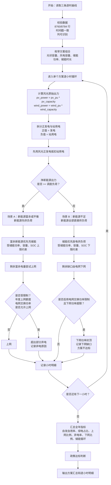

# 产品打磨记录

## 记录原则

- 记录用户提出的问题和建议。
- 记录讨论后形成的产品决策。
- 标记状态：采纳、暂缓、拒绝、已完成。
- 说明原因，沉淀后续可复用的产品/工程经验。

## 当前版本的计算逻辑

本章节记录截至 2026-05-16 的当前版本计算口径，作为后续开发和复核的基准。

### 1. 输入数据口径

- 负荷曲线使用真实功率值，单位为万千瓦。
- 光伏曲线使用标幺值。
- 风电曲线使用标幺值。
- 光伏、风电标幺值允许出现负值。
- 光伏、风电负值不作为异常，也不自动截断。
- 光伏、风电大于 1 的标幺值允许参与计算，但 UI 会提示出现点数，供用户复核。
- 支持 8760 小时普通年和 8784 小时闰年。
- 三条曲线必须行数一致、时间戳一致。

### 2. 风光出力与站用电

每小时先根据容量计算风光原始出力：

```text
pv_power = pv_pu * pv_capacity
wind_power = wind_pu * wind_capacity
```

其中 `pv_power` 和 `wind_power` 可以为负。

当前版本将原始出力拆分为正发电出力和站用电：

```text
pv_generation_power = max(pv_power, 0)
wind_generation_power = max(wind_power, 0)

pv_station_use_power = max(-pv_power, 0)
wind_station_use_power = max(-wind_power, 0)

renewable_generation_power = pv_generation_power + wind_generation_power
station_use_power = pv_station_use_power + wind_station_use_power
```

每小时先用风光正发电抵扣站用电：

```text
net_renewable_power = renewable_generation_power - station_use_power
renewable_power = max(net_renewable_power, 0)
station_use_deficit_power = max(-net_renewable_power, 0)
```

解释：

- `renewable_generation_power` 是新能源总可用发电功率，用于统计新能源总可用发电量。
- `station_use_power` 是风光站用电功率。
- `renewable_power` 是抵扣站用电后的净新能源出力，用于后续供负荷、充储、上网。
- 如果站用电超过当小时风光正发电，则超出部分并入下网需求。

### 3. 负荷与下网需求

用户负荷功率为：

```text
load_power
```

实际参与电网平衡的负荷缺口口径为：

```text
dispatch_load_power = load_power + station_use_deficit_power
```

也就是说，当风光站用电无法由当小时风光正发电覆盖时，缺口会计入下网功率。

汇总中：

```text
total_load_energy = sum(load_power)
grid_import_energy = sum(grid_import_power)
grid_import_rate = grid_import_energy / total_load_energy
```

注意：

- `total_load_energy` 仍表示用户侧总用电量，不包含站用电。
- `grid_import_energy` 表示从电网下网电量，可能包含用户负荷缺口，也可能包含站用电缺口。

### 4. 储能调度逻辑

当前版本采用逐小时贪心调度策略，不做经济性优化。

当净新能源出力大于等于调度负荷时：

```text
direct_self_use = dispatch_load
surplus = renewable_power - dispatch_load
```

富余新能源优先给储能充电：

```text
bess_charge = min(
    surplus,
    bess_power * dt,
    (soc_max * bess_energy - bess_energy_start) / eta_charge
)
```

储能电量更新：

```text
bess_energy_end = bess_energy_start + bess_charge * eta_charge
```

储能充电后剩余电量进入上网或弃电判断。

当净新能源出力小于调度负荷时：

```text
direct_self_use = renewable_power
deficit = dispatch_load - renewable_power
```

储能优先放电：

```text
bess_discharge = min(
    deficit,
    bess_power * dt,
    (bess_energy_start - soc_min * bess_energy) * eta_discharge
)
```

储能电量更新：

```text
bess_energy_end = bess_energy_start - bess_discharge / eta_discharge
```

储能放电后剩余缺口由电网下网，若启用电网交换功率限制，则受该限制约束。

储能约束：

- 储能只能由富余新能源充电。
- 储能不能从电网充电。
- 储能不能同小时充电和放电。
- 储能不能放电上网。
- 储能放电只用于补足调度负荷缺口。
- SOC 逐小时滚动。
- SOC 不得低于 `soc_min`，不得高于 `soc_max`。
- 充放电受储能功率和容量约束。
- 充放电效率参与计算。

### 5. 上网比例硬约束

当前版本默认启用年度上网比例硬约束：

```text
export_control_mode = annual_cap_runtime
```

年度允许上网电量为：

```text
export_cap_energy = total_renewable_generation * export_rate_max
```

默认：

```text
export_rate_max = 20%
```

逐小时计算时累计上网电量：

```text
cumulative_export += grid_export
```

当年度累计上网电量未达到额度时，富余新能源可以上网。

当年度累计上网电量达到额度后，后续富余新能源不能再上网，只能弃电。

因此：

```text
export_rate = grid_export_energy / total_renewable_generation
```

在硬约束模式下，理论上不会超过 `export_rate_max`。

结果中单独记录：

```text
curtail_due_to_export_cap_energy
```

用于表示因年度上网比例额度用完导致的弃电量。

如果用户关闭年度硬约束，则进入后验校核模式：

```text
export_control_mode = post_check
```

该模式下逐小时先正常上网，最后检查：

```text
export_rate <= export_rate_max
```

若超过，则方案不达标。

### 6. 与电网交换功率限制

当前版本支持可选的“与电网交换功率限制”：

```text
grid_exchange_power_limit
```

默认值为 `null`，表示无限制。

用户勾选并输入限制值后，该限制同时作用于上网功率和下网功率。

#### 6.1 上网侧

上网功率不得超过交换功率限制：

```text
grid_export_power <= grid_exchange_power_limit
```

若富余新能源超过可上网功率，则超出部分弃电。

结果中记录：

```text
curtail_due_to_exchange_limit_power
curtail_due_to_exchange_limit_energy
```

#### 6.2 下网侧

下网功率也不得超过交换功率限制：

```text
grid_import_power <= grid_exchange_power_limit
```

当负荷缺口较大时，储能会优先放电降低下网功率。

如果储能能力不足，仍超过交换功率限制，则：

```text
grid_import_power = grid_exchange_power_limit
exchange_import_shortfall_power = 原始下网需求 - grid_exchange_power_limit
```

结果中记录：

```text
exchange_import_shortfall_power
exchange_import_shortfall_energy
```

出现下网缺口时，方案判定为不达标。

### 7. 自发自用与政策指标

新能源自发自用电量口径：

```text
self_use_energy = direct_self_use_energy + bess_discharge_to_load
```

其中：

- `direct_self_use_energy` 为净新能源直接供调度负荷电量。
- `bess_discharge_to_load` 为储能放电供调度负荷电量。
- 储能放电电量只来自此前富余新能源充电。

政策指标：

```text
self_use_rate = self_use_energy / total_renewable_generation
green_load_rate = self_use_energy / total_load_energy
export_rate = grid_export_energy / total_renewable_generation
curtail_rate = curtail_energy / total_renewable_generation
grid_import_rate = grid_import_energy / total_load_energy
```

默认达标条件：

```text
self_use_rate >= 60%
green_load_rate >= 30%
export_rate <= 20%
```

如果启用电网交换功率限制，还要求不能出现下网缺口。

### 8. 储能损耗与循环

储能损耗：

```text
bess_loss_energy
= bess_charge_energy
- bess_discharge_to_load
- (final_bess_energy - initial_bess_energy)
```

年等效循环次数：

```text
annual_equivalent_cycles = bess_discharge_to_load / bess_energy
```

若 `bess_energy = 0`，则循环次数为 0。

预计更换年份：

```text
replacement_year = cycle_life / annual_equivalent_cycles
```

若循环次数为 0，则为无穷大。

### 9. 当前版本不做的事项

当前版本不做经济性评价，包括：

- LCOE；
- IRR；
- NPV；
- 投资回收期；
- 电价优化；
- 储能套利；
- 现货市场收益。

当前版本也不做数学优化，只做批量枚举和逐小时技术测算。

## 当前版本计算流程图与场景说明

本章节把当前版本的计算逻辑整理成“流程图 + 场景表 + 公式说明”，用于人工复核、需求讨论和后续重构。

### 1. 总体流程图



### 2. 每小时输入与中间变量

| 变量 | 含义 | 公式 / 说明 |
|---|---|---|
| `load_power` | 用户负荷功率 | 输入曲线，单位：万千瓦 |
| `pv_pu` | 光伏标幺值 | 输入曲线，可为负 |
| `wind_pu` | 风电标幺值 | 输入曲线，可为负 |
| `pv_power` | 光伏原始出力 | `pv_pu * pv_capacity`，可为负 |
| `wind_power` | 风电原始出力 | `wind_pu * wind_capacity`，可为负 |
| `pv_generation_power` | 光伏正发电功率 | `max(pv_power, 0)` |
| `wind_generation_power` | 风电正发电功率 | `max(wind_power, 0)` |
| `pv_station_use_power` | 光伏站用电功率 | `max(-pv_power, 0)` |
| `wind_station_use_power` | 风电站用电功率 | `max(-wind_power, 0)` |
| `renewable_generation_power` | 新能源总可用发电功率 | `pv_generation_power + wind_generation_power` |
| `station_use_power` | 风光站用电功率 | `pv_station_use_power + wind_station_use_power` |
| `net_renewable_power` | 抵扣站用电后的净新能源 | `renewable_generation_power - station_use_power` |
| `renewable_power` | 参与负荷平衡的净新能源功率 | `max(net_renewable_power, 0)` |
| `station_use_deficit_power` | 站用电缺口功率 | `max(-net_renewable_power, 0)` |
| `dispatch_load_power` | 调度口径负荷 | `load_power + station_use_deficit_power` |

解释：

- `renewable_generation_power` 用于统计新能源总可用发电量。
- `renewable_power` 用于逐小时能量平衡。
- 当风光负值产生站用电时，优先由当小时风光正发电抵扣。
- 如果站用电不能完全抵扣，缺口进入下网需求。

### 3. 场景 A：净新能源大于等于调度负荷

触发条件：

```text
renewable_power >= dispatch_load_power
```

处理流程：

```text
direct_self_use_power = dispatch_load_power
surplus_power = renewable_power - dispatch_load_power
```

储能充电：

```text
bess_charge_power = min(
    surplus_power,
    bess_power,
    (soc_max * bess_energy - bess_energy_start) / eta_charge / dt
)
```

储能电量更新：

```text
bess_energy_end = bess_energy_start + bess_charge_power * dt * eta_charge
```

储能充电后的富余电量：

```text
surplus_after_charge_power = surplus_power - bess_charge_power
```

之后进入上网与弃电判断。

#### 场景 A 的小时标签

| `hour_case` | 触发情况 | 处理逻辑 |
|---|---|---|
| `GEN_BALANCED` | 新能源刚好等于调度负荷 | 全部直接自用，无储能充放电，无上网弃电 |
| `GEN_SURPLUS_CHARGE_BESS` | 有富余新能源，且全部用于充储能 | 储能充电，剩余富余为 0 |
| `GEN_SURPLUS_DIRECT_EXPORT` | 有富余新能源，无储能充电，且全部上网 | 上网，不弃电 |
| `GEN_SURPLUS_CHARGE_EXPORT` | 富余新能源先充储，剩余上网 | 充储 + 上网，不弃电 |
| `GEN_SURPLUS_CHARGE_EXPORT_CURTAIL` | 富余新能源先充储，部分上网，部分弃电 | 充储 + 上网 + 弃电 |
| `GEN_SURPLUS_CURTAIL` | 富余新能源不能上网或上网受限，剩余弃电 | 弃电 |

说明：

- 当前 `hour_case` 是主场景标签。
- 具体弃电原因需要结合以下字段复核：
  - `curtail_due_to_export_cap_power`
  - `curtail_due_to_exchange_limit_power`
  - `curtail_power`

### 4. 上网与弃电判断

富余电量在充储后尝试上网。

如果不允许上网：

```text
grid_export_power = 0
curtail_power = surplus_after_charge_power
```

如果允许上网，则先考虑电网交换功率限制：

```text
exchange_export_limit_power =
    grid_exchange_power_limit if configured else infinity
```

再考虑最大上网功率限制。当前 UI 暂不暴露单独的最大上网功率限制，但底层保留 `export_power_max`：

```text
export_power_limit =
    min(exchange_export_limit_power, export_power_max or infinity)
```

年度上网比例硬约束下：

```text
annual_export_cap_energy = total_renewable_generation * export_rate_max
remaining_export_cap_energy = annual_export_cap_energy - cumulative_export_energy
```

每小时实际上网：

```text
grid_export_energy = min(
    surplus_after_charge_energy,
    export_power_limit * dt,
    remaining_export_cap_energy
)
```

弃电：

```text
curtail_energy = surplus_after_charge_energy - grid_export_energy
```

因年度上网比例额度导致的弃电：

```text
curtail_due_to_export_cap_energy =
    max(export_before_annual_cap_energy - grid_export_energy, 0)
```

因电网交换功率限制导致的弃电：

```text
curtail_due_to_exchange_limit_energy =
    max(surplus_after_charge_energy - min(surplus_after_charge_energy, exchange_limit_energy), 0)
```

解释：

- 年度上网比例硬约束决定“全年最多能上网多少电量”。
- 电网交换功率限制决定“每小时最多能上网多少功率”。
- 两者都可能导致弃电。

### 5. 场景 B：净新能源小于调度负荷

触发条件：

```text
renewable_power < dispatch_load_power
```

处理流程：

```text
direct_self_use_power = renewable_power
deficit_power = dispatch_load_power - renewable_power
```

储能放电：

```text
bess_discharge_power = min(
    deficit_power,
    bess_power,
    (bess_energy_start - soc_min * bess_energy) * eta_discharge / dt
)
```

储能电量更新：

```text
bess_energy_end = bess_energy_start - bess_discharge_power * dt / eta_discharge
```

储能放电后的原始下网需求：

```text
raw_grid_import_power = deficit_power - bess_discharge_power
```

若未启用电网交换功率限制：

```text
grid_import_power = raw_grid_import_power
exchange_import_shortfall_power = 0
```

若启用电网交换功率限制：

```text
grid_import_power = min(raw_grid_import_power, grid_exchange_power_limit)
exchange_import_shortfall_power =
    raw_grid_import_power - grid_import_power
```

如果 `exchange_import_shortfall_power > 0`，说明即使储能已放电，系统仍无法在电网交换功率限制下满足负荷，该方案不达标。

#### 场景 B 的小时标签

| `hour_case` | 触发情况 | 处理逻辑 |
|---|---|---|
| `NO_RENEWABLE_GRID_IMPORT` | 无净新能源，且储能不放电 | 负荷由电网下网 |
| `GEN_SHORT_GRID_IMPORT` | 新能源不足，储能不放电 | 新能源直接供一部分负荷，剩余下网 |
| `GEN_SHORT_BESS_DISCHARGE` | 新能源不足，储能放电后完全覆盖缺口 | 新能源 + 储能满足调度负荷 |
| `GEN_SHORT_BESS_DISCHARGE_AND_GRID_IMPORT` | 新能源不足，储能放电后仍需下网 | 新能源 + 储能 + 电网下网 |

说明：

- 若启用电网交换功率限制，仍需查看 `exchange_import_shortfall_power`。
- 出现下网缺口时，小时标签仍可能是 `GEN_SHORT_BESS_DISCHARGE_AND_GRID_IMPORT`，但方案汇总会记录缺口并判为不达标。

### 6. 储能状态滚动

每小时开始：

```text
soc_start = bess_energy_start / bess_energy
```

每小时结束：

```text
soc_end = bess_energy_end / bess_energy
```

下一小时：

```text
soc_start[t + 1] = soc_end[t]
```

无储能方案：

```text
bess_power = 0
bess_energy = 0
bess_charge_power = 0
bess_discharge_power = 0
soc_start = 0
soc_end = 0
```

### 7. 程序考虑的约束场景汇总

| 约束场景 | 触发条件 | 程序处理 | 记录字段 |
|---|---|---|---|
| 风光负值 | `pv_power < 0` 或 `wind_power < 0` | 按站用电处理 | `pv_station_use_power`、`wind_station_use_power` |
| 站用电超过正发电 | `station_use_power > renewable_generation_power` | 超出部分进入下网需求 | 体现在 `grid_import_power` |
| 储能充电功率受限 | `surplus_power > bess_power` | 充电功率不超过 `bess_power` | `bess_charge_power` |
| 储能充电容量受限 | SOC 接近上限 | 充电不超过剩余可充空间 | `soc_end`、`bess_energy_end` |
| 储能放电功率受限 | `deficit_power > bess_power` | 放电功率不超过 `bess_power` | `bess_discharge_power` |
| 储能放电容量受限 | SOC 接近下限 | 放电不低于 `soc_min` | `soc_end`、`bess_energy_end` |
| 年度上网比例额度用完 | 累计上网达到 `export_cap_energy` | 后续富余新能源弃电 | `curtail_due_to_export_cap_power` |
| 上网交换功率受限 | 富余电力超过 `grid_exchange_power_limit` | 超出部分弃电 | `curtail_due_to_exchange_limit_power` |
| 下网交换功率受限 | 缺口超过 `grid_exchange_power_limit` | 储能先放电，仍不足则记录下网缺口 | `exchange_import_shortfall_power` |
| 不允许上网 | `allow_export = false` | 富余电力弃电 | `curtail_power` |
| 无储能方案 | `bess_power = 0` 或 `bess_energy = 0` | 不充不放，SOC 为 0 | `bess_*` 字段为 0 |

### 8. 汇总指标公式

| 指标 | 公式 | 解释 |
|---|---|---|
| `total_load_energy` | `sum(load_power * dt)` | 用户总用电量，不含站用电 |
| `total_renewable_generation` | `sum(renewable_generation_power * dt)` | 风光正发电总量 |
| `pv_station_use_energy` | `sum(pv_station_use_power * dt)` | 光伏站用电 |
| `wind_station_use_energy` | `sum(wind_station_use_power * dt)` | 风电站用电 |
| `station_use_energy` | `pv_station_use_energy + wind_station_use_energy` | 风光站用电合计 |
| `direct_self_use_energy` | `sum(direct_self_use_power * dt)` | 新能源直接供调度负荷 |
| `bess_discharge_to_load` | `sum(bess_discharge_power * dt)` | 储能放电供调度负荷 |
| `self_use_energy` | `direct_self_use_energy + bess_discharge_to_load` | 新能源自发自用电量 |
| `grid_import_energy` | `sum(grid_import_power * dt)` | 下网电量 |
| `grid_import_rate` | `grid_import_energy / total_load_energy` | 下网电量占用户总用电量比例 |
| `grid_export_energy` | `sum(grid_export_power * dt)` | 上网电量 |
| `export_rate` | `grid_export_energy / total_renewable_generation` | 上网比例 |
| `export_cap_energy` | `total_renewable_generation * export_rate_max` | 年度允许上网电量 |
| `curtail_energy` | `sum(curtail_power * dt)` | 弃电量 |
| `curtail_rate` | `curtail_energy / total_renewable_generation` | 弃电率 |
| `curtail_due_to_export_cap_energy` | `sum(curtail_due_to_export_cap_power * dt)` | 因年度上网额度导致的弃电 |
| `curtail_due_to_exchange_limit_energy` | `sum(curtail_due_to_exchange_limit_power * dt)` | 因交换功率上限导致的弃电 |
| `exchange_import_shortfall_energy` | `sum(exchange_import_shortfall_power * dt)` | 因下网交换功率限制导致的供电缺口 |
| `bess_charge_energy` | `sum(bess_charge_power * dt)` | 储能充电电量 |
| `bess_loss_energy` | `bess_charge_energy - bess_discharge_to_load - (final_bess_energy - initial_bess_energy)` | 储能损耗 |
| `annual_equivalent_cycles` | `bess_discharge_to_load / bess_energy` | 年等效循环次数 |

### 9. 达标判断

方案达标需要满足：

```text
self_use_rate >= self_use_rate_min
green_load_rate >= green_load_rate_min
export_rate <= export_rate_max
```

如果不允许上网：

```text
grid_export_energy == 0
```

如果启用电网交换功率限制：

```text
exchange_import_shortfall_energy == 0
```

不达标原因可能包括：

- 自发自用率不足；
- 绿电占用电比例不足；
- 上网比例超限；
- 不允许上网但出现上网；
- 最大上网功率超限；
- 电网交换功率限制导致下网缺口。

## 2026-05-16 UI 与复核体验优化

### 1. 储能时长选项中的 0 不直观

用户反馈：

- “储能时长为什么要有个 0？我没搞懂。”

讨论结论：

- `0` 的技术含义是“无储能方案”，用于生成纯风光基准方案。
- 但业务用户不应被迫理解这个编码。
- UI 应改为“包含无储能方案”勾选框，默认选中。
- 储能时长选项只展示真实储能时长，如 `2,4`。

状态：已完成。

经验：

- UI 中的特殊数值编码要转译成业务语言，避免让用户猜系统内部约定。

### 2. 自动识别时间列和数值列

用户反馈：

- 输入文件用户通常已经处理好。
- 软件至少应自动识别时间列，另一个数值列自动作为负荷/光伏/风电数值列。
- 不应要求用户每次手动选择。

讨论结论：

- 优先识别时间列名：`时间`、`timestamp`、`time`、`日期时间` 等。
- 排除时间列后，如果只有一个候选数值列，自动使用。
- 只有存在多个候选列或无法识别时，才显示手动选择。

状态：已完成。

经验：

- 能自动识别的输入，不要强迫用户手动操作。
- 手动选择应作为兜底，而不是主流程。

### 3. 批量测算需要进度条

用户反馈：

- 已经有方案数量预估，应在测算过程中用进度条显示当前进度。

讨论结论：

- 批量运行器增加进度回调。
- UI 显示 `已完成 / 总方案数` 和当前方案编号。

状态：已完成。

经验：

- 长耗时任务必须有过程反馈，否则用户无法判断程序是否卡住。

### 4. 数据状态与数据质量提示

用户反馈：

- 除方案数量外，应显示数据加载状态，例如负荷/光伏/风电各有多少小时。
- 对光伏标幺值大于 1 的情况，应提示数量。
- 但本阶段不要自动处理输入曲线，例如小负值不应被软件自动截断。

讨论结论：

- UI 增加数据状态面板，展示行数、时间范围、编码、数值异常提示。
- 保留“大于 1”提示。
- 小负值不再自动截断为 0，本阶段直接报错，由用户在外部处理数据。

状态：已完成。

经验：

- 技术测算软件应帮助用户确认“传入的数据是什么”，但不应在未经用户明确授权时修改输入数据。

### 5. 结果筛选和排序不足

用户反馈：

- “只看达标方案”不够。
- 至少应支持按绿电占比、弃电率、自发自用率、上网比例排序。
- 应支持按方案类型筛选：无储能、纯光伏、纯风电、光储、风储等。
- 勾选和排序应是 AND 关系。

讨论结论：

- 筛选条件之间采用 AND 关系。
- 排序只改变当前筛选结果的显示顺序。
- 增加方案类型筛选。

状态：已完成。

经验：

- 结果表不是只给机器看的输出，还要支持人的复核路径。

### 6. 补充下网电量与下网电量比例

用户反馈：

- 已有负荷总用电量，但缺少下网电量和下网电量比例。
- 电量单位使用万千瓦时，不保留小数。
- CSV 暂时可继续打磨，后续希望输出阅读体验更好的格式。

讨论结论：

- 下网电量等同当前 `grid_import_energy`。
- 新增更直观字段：
  - `grid_import_rate = grid_import_energy / total_load_energy`
- UI 展示中电量按万千瓦时、不保留小数格式化。
- CSV/Excel 格式化输出体验后续继续打磨。

状态：已完成。

经验：

- 输出字段既要满足算法口径，也要贴近业务复核语言。

### 7. 持续更新产品打磨记录

用户反馈：

- 问题解决或用更好的方案解决后，应及时更新 `PRODUCT_POLISH_LOG.md`。

讨论结论：

- 本文档作为产品打磨决策记录持续维护。
- 每轮 UI/算法口径讨论后更新状态。

状态：采纳，进行中。

经验：

- 产品打磨过程本身是可复用资产，可为未来 skill 设计提供素材。

### 8. Codex 内置浏览器中无法下载方案汇总 Excel

用户反馈：

- 在 Codex 中运行程序，方案汇总 Excel 无法下载。

初步判断：

- 当前全局下载按钮位置靠后，可能被大表格和逐小时明细淹没。
- Streamlit rerun 或临时目录生命周期也可能影响下载体验。

讨论结论：

- 将方案汇总 Excel 和全部逐小时 ZIP 下载按钮提前到汇总区。
- 生成下载文件时使用稳定的内存字节，不依赖用户点击后临时文件仍存在。
- 保留单方案 CSV 下载在明细区域。

状态：已完成。

解决方案：

- 下载按钮已移动到汇总指标下方、结果表上方。
- Excel 和 ZIP 下载数据在按钮渲染前转为稳定的内存字节，避免临时目录生命周期影响点击下载。
- 单方案 CSV 下载仍保留在逐小时明细区域。

验证记录：

- `python -m pytest` 通过，44 个测试全部通过。
- 使用干净模拟数据导出 `outputs/scenario_summary_20260516_175415.xlsx`，文件大小 11440 字节。

## 2026-05-16 风光负值曲线与站用电口径修正

### 1. 风电/光伏标幺曲线负值不应视为异常

用户反馈：

- 风电、光伏曲线出现负值是正常的。
- 可理解为新能源电源在不发电时需要用电。
- 这些负值应正常参与计算，并统计到风、光的“站用电”列。

修正结论：

- 风电/光伏标幺曲线负值不再报错，也不自动截断。
- 每小时将风光出力拆分为：
  - 原始出力：`pv_power`、`wind_power`，可为负；
  - 正发电出力：`pv_generation_power`、`wind_generation_power`；
  - 站用电：`pv_station_use_power`、`wind_station_use_power`；
  - 合计站用电：`station_use_power`。
- 调度逻辑为：
  - 先用当小时风光正发电抵扣站用电；
  - 抵扣后的净新能源再供用户负荷、充储、上网；
  - 如果站用电超过当小时正发电，缺口计入下网电量。
- 汇总新增：
  - `pv_station_use_energy`
  - `wind_station_use_energy`
  - `station_use_energy`

状态：已完成。

验证记录：

- `python -m pytest` 通过，46 个测试全部通过。

经验：

- 数据“负值”不一定是错误，技术软件必须先理解业务含义。
- 对输入数据的处理策略应区分“异常数据清洗”和“业务口径计算”。

## 2026-05-16 电网交换功率限制与运行服务重启问题

### 1. Streamlit 旧进程导致新代码未生效

用户反馈：

- 页面测算时报错：`run_batch() got an unexpected keyword argument 'progress_callback'`。

判断：

- 源码中的 `run_batch` 已经包含 `progress_callback` 参数。
- 报错说明当前浏览器连接的 Streamlit 服务仍在使用旧版本代码。
- 仅刷新浏览器不一定能让旧 Python 进程加载新代码，尤其是服务启动在代码修改之前。

结论：

- 修改代码后，应先停止旧 Streamlit 进程，再重新启动。

状态：已说明，待用户按重启步骤验证。

经验：

- 本地 Web 工具调试时，浏览器刷新和服务进程重启是两个动作。

### 2. 新增“与电网交换功率限制”

用户需求：

- 上网政策约束中增加“与电网交换功率限制”。
- 默认无限制。
- 用户勾选并输入值后，系统逐时不得出现下网功率或上网功率超过该值。
- 触及上网限制时，新能源需要弃电。
- 触及下网限制时，应尽量通过储能放电降低下网功率。

实现结论：

- 新增政策参数：`grid_exchange_power_limit`。
- UI 中新增：
  - `设置与电网交换功率限制`
  - `与电网交换功率限制（万千瓦）`
- 上网侧：
  - `grid_export_power` 不超过限制；
  - 超出部分计入 `curtail_power`；
  - 同时记录 `curtail_due_to_exchange_limit_power` 和汇总 `curtail_due_to_exchange_limit_energy`。
- 下网侧：
  - 储能按原有规则优先放电降低下网；
  - 若储能能力不足，`grid_import_power` 封顶在限制值；
  - 未满足部分记录为 `exchange_import_shortfall_power` 和汇总 `exchange_import_shortfall_energy`；
  - 出现下网缺口时方案不达标，原因包含“电网交换功率限制导致下网缺口”。

状态：已完成。

验证记录：

- `python -m pytest` 通过，50 个测试全部通过。

经验：

- “强约束”既要限制结果不越界，也要记录限制造成的代价。
- 上网受限的代价是弃电；下网受限且储能不足的代价是供电缺口，应单独展示并判定方案不可行。

## 2026-05-16 批量上传与导入路径稳定性

### 1. UI 代码更新但参数模型仍是旧版本

用户反馈：

- 仍然报错：`PolicyParams.__init__() got an unexpected keyword argument 'grid_exchange_power_limit'`。

判断：

- UI 页面已经显示新版内容，但导入 `green_direct.models.params` 时可能拿到了环境中旧的已安装包，而不是当前项目 `src` 下的源码。
- 原因是 Streamlit 执行脚本时，`sys.path` 未必总是把项目 `src` 放在第一位。

解决方案：

- 在 `src/green_direct/ui/app.py` 顶部强制把项目 `src` 路径插入 `sys.path` 第一位。
- 避免 UI 文件使用当前源码，而模型/批量/算法模块却混入旧包。

状态：已完成，需重启 Streamlit 后生效。

经验：

- 本地项目若采用 `src/` 布局，Streamlit 脚本入口要显式保证源码路径优先。
- 否则容易出现“页面是新的，导入模块是旧的”的错配问题。

### 2. 批量上传并按文件名自动识别曲线类型

用户建议：

- 数据上传区域希望能一次选择多个文件。
- 软件根据文件名自动识别：
  - 含 `负荷`、`load`、`用电` 的文件作为负荷曲线；
  - 含 `光伏`、`pv`、`solar` 的文件作为光伏标幺曲线；
  - 含 `风电`、`wind` 的文件作为风电标幺曲线。

实现方案：

- 增加“批量上传曲线 CSV”入口，支持一次选择多个 CSV。
- 自动按文件名关键字分配到负荷、光伏、风电。
- 若识别失败或识别冲突，给出提示。
- 保留单独上传入口作为人工覆盖。

状态：已完成。

经验：

- 上传入口应优先支持真实用户的一次性操作习惯。
- 自动识别必须保留人工覆盖，避免文件名不规范时卡死流程。

## 2026-05-16 储能放电上网口径与性能优化

### 1. 储能默认不能放电上网

用户问题：

- 当前计算逻辑是否存在储能放电上网的场景？
- 方案汇总表是否统计储能放电量？
- 默认应为储能不能放电上网。

核查结论：

- 当前调度逻辑不存在储能放电上网。
- 储能只在 `renewable_power < dispatch_load_power` 时放电。
- 储能放电用于补足调度负荷缺口。
- 当 `renewable_power >= dispatch_load_power` 时，储能只可能充电，不会放电。
- 汇总表中的储能放电字段是 `bess_discharge_to_load`，含义为“储能放电供负荷电量”。

加固措施：

- 在“当前版本的计算逻辑”中明确写入“储能不能放电上网”。
- 新增测试：`test_bess_discharge_never_exports_to_grid`，确保储能放电时 `grid_export_energy = 0`。

状态：已完成。

### 2. 批量计算和界面筛选速度优化

用户反馈：

- 计算速度不到 120 个方案/分钟。
- 汇总表生成较慢但还能接受。
- 一旦按规则筛选，界面变灰并长时间等待。
- 未来方案数量可能达到成千上万条。

问题定位：

- 单方案逐小时计算使用 pandas `iterrows()`，每个方案 8760/8784 次逐行构造 dict，性能较低。
- UI 在每次筛选/排序时会重新生成 Excel 和全部逐小时 ZIP 下载数据。
- UI 每次筛选时会对完整结果表做字符串格式化并渲染，方案数大时卡顿明显。

已完成优化：

- 单方案计算改为 NumPy 数组预分配 + 索引循环，避免 `iterrows()` 和逐行 dict append。
- 下载文件使用 `st.session_state` 缓存，只在新测算结果产生后准备一次。
- 筛选/排序时不再重复生成 Excel/ZIP。
- 方案类型从逐行 `apply` 改为向量化赋值。
- 结果表默认只显示筛选后的前 500 行，用户可调整最多显示行数。

状态：已完成第一轮优化。

后续可选优化：

- 批量测算时先只保留汇总表，不保存所有方案逐小时明细。
- 用户点击某个方案后，再按需重算该方案逐小时明细。
- 对大批量方案使用多进程并行。
- 将核心逐小时循环进一步迁移到 `numba` 或 Cython。
- 将结果表分页，避免一次渲染上万行。

验证记录：

- `python -m pytest` 通过，51 个测试全部通过。

经验：

- 大批量技术测算要区分“批量筛选所需数据”和“单方案复核所需明细”。
- UI 卡顿不一定来自计算本身，下载文件准备、全表格式化和全表渲染也可能是主要瓶颈。

经验：

- 下载入口应靠近结果汇总，并使用稳定的数据载体，减少 UI rerun 对下载的影响。

## 2026-05-16 建立软件总览与接口文档

用户问题：

- 当前 V0.1 技术测算模块准备先告一段落。
- 后续还要开发图表制作、经济性评价、报告等下游模块。
- 虽然希望各模块保持独立，但需要一份软件介绍或接口说明，保证后续模块能接得上。

产品判断：

- 需要建立一份稳定的“系统总览 + 模块接口契约”文档。
- `PRODUCT_POLISH_LOG.md` 继续记录产品打磨和决策过程。
- 新文档应放在 `docs/` 下，作为后续模块开发的基线，而不是混在过程日志里。

已完成：

- 新增 `docs/SOFTWARE_OVERVIEW_AND_INTERFACE.md`。
- 文档内容覆盖：
  - 软件定位与当前边界；
  - 总体架构和模块依赖方向；
  - 标准输入数据契约；
  - 参数模型、方案模型、单方案仿真、批量测算、导出接口；
  - 当前计算口径；
  - 汇总结果和逐小时明细字段；
  - 图表、经济性、报告模块接入建议；
  - 接口稳定性规则；
  - 测试与运行基线。

状态：已完成。

经验：

- 当一个模块即将成为其他模块的上游时，需要把“当前口径”从讨论日志中提炼成接口契约。
- 过程日志适合记录为什么这么做，接口文档适合记录后续必须怎么接。

## 2026-05-19 架构重定向：从批量枚举工具到方案策划推荐平台

### 1. 用户对对标软件的判断

用户提供了一组“绿电直连 / 微电网项目策划平台”的对标截图。经过讨论后形成判断：

- 对标软件真正有价值的不是 UI 表象，而是背后的项目策划工作流；
- 用户不希望软件只是枚举大量风光储容量组合，然后展示一张巨大的结果表；
- 枚举仍然可以作为内部搜索手段，但前台应展示经过筛选、排序、解释的几个代表性方案；
- 图表、报告和后续分析应围绕推荐方案展开，而不是围绕全部枚举方案展开；
- AI 助手短期内不是重点。

状态：采纳。

### 2. 新的产品方向

项目方向从：

```text
绿电直连风光储多方案批量测算工具
```

调整为：

```text
绿电直连 / 微电网项目方案策划与推荐平台
```

新的主流程应为：

```text
项目输入
-> 输入审查
-> 生成候选方案池
-> 技术仿真
-> 政策合规筛选
-> 经济性排序
-> 代表方案推荐
-> 图表、报告、导出
```

状态：采纳。

### 3. 经济性排序提前进入

用户提出：在枚举方案基础上至少有两个约束或排序维度：

1. 是否满足政策要求，包括自发自用、上网、绿电占比；
2. 经济性排序。

讨论结论：

- 经济性应提前进入推荐逻辑；
- 但第一阶段不必做完整财务评价；
- 可先实现轻量经济性排序，用于方案筛选和推荐；
- 完整 NPV、IRR、多年现金流、税费、融资等可后续扩展；
- 经济性评价必须读取技术仿真结果，不应反向改变技术调度。

状态：采纳，待设计实现。

### 4. 柴油发电进入方案逻辑

用户提出：加入柴发后，方案计算模块可更好适配离网场景；并网模式下接柴发较少但也存在，不冲突。

讨论结论：

- 柴发应作为明确资产建模，而不是混入电网下网；
- 柴发需要独立出力、油耗、成本、排放和运行状态字段；
- 离网、并网、并网加备用应作为项目模式或调度策略表达；
- 柴发调度策略需要专门研究；
- 柴发是否允许给储能充电是关键口径问题，初期建议谨慎处理；
- 如果未来允许非新能源给储能充电，必须做能源来源追踪，避免污染绿电指标。

状态：采纳，待专家审查。

### 5. 约束文档更新

用户担心旧 `AGENTS.md`、`CLAUDE.md` 和 V0.1 文档会限制后续开发。

讨论结论：

- 当前项目文件夹继续使用；
- 现有 V0.1 内核和测试作为基线保留；
- 旧 V0.1 文档不删除，但不再作为最终产品边界；
- 更新 `AGENTS.md` 和 `CLAUDE.md`，允许经济性排序、柴发、离网、推荐引擎等后续方向；
- 新增专家审查材料目录：`notes/architecture_reframe_20260519/`。

状态：已完成。

新增文档：

- `notes/architecture_reframe_20260519/01_EXPERT_REVIEW_BRIEF.md`
- `notes/architecture_reframe_20260519/02_TARGET_ARCHITECTURE_AND_CALCULATION_LOGIC.md`
- `notes/architecture_reframe_20260519/03_MIGRATION_AND_POLISH_PLAN.md`

更新文档：

- `AGENTS.md`
- `CLAUDE.md`
- `ROADMAP.md`

### 6. 后续开发经验

- 旧代码和旧文档不一定是负担，关键是把它们降级为“基线资产”，而不是继续作为未来边界。
- 架构调整前先更新 agent 指令文件，否则后续 Codex / Claude Code 很容易按旧规则开发。
- 推荐引擎应先独立于 UI 做出来，避免把产品逻辑写死在 Streamlit 页面里。
- 柴发和经济性都不应直接塞入现有函数，而应通过资产模型、调度策略、经济评价层逐步进入。

## 2026-05-19 切换电脑前补充：图表模块降级为可替换原型

### 1. 用户对当前图表模块的判断

用户反馈：

- 当前已经开发出来的图表模块很不理想；
- 甚至可以丢弃；
- 现阶段不应继续围绕图表模块投入主要精力；
- 应优先把方案逐时计算、风光储规模配置逻辑、简化经济性排序逻辑等搞清楚并实现。

讨论结论：

- 现有图表模块降级为早期原型，不作为近期重点资产；
- 后续开发可以替换或重做图表模块；
- 图表和报告应等核心计算、推荐、经济性排序稳定后再重新设计；
- 近期重点转为：
  1. 逐小时能量平衡和能源台账；
  2. 风光储规模配置 / 候选方案生成；
  3. 政策合规筛选；
  4. 轻量经济性排序；
  5. 代表方案推荐。

状态：采纳。

经验：

- 图表不是底层架构，不应让不满意的展示模块牵制核心计算和推荐逻辑。
- 技术软件应先把“算得对、筛得清、推荐得有理由”做好，再打磨可视化。

## 2026-05-21 经济性评价 V1 口径确认

用户和 AI 讨论后确认：经济性模块可以进入代码实现，但必须先按 V1 简化年度现金流口径落地，不引入贷款和复杂财务模型。

### 1. 模型定位

- V1 是不考虑贷款的项目投资现金流模型，不计算还本付息、资本金 IRR 或复杂融资结构。
- 年度现金流详表是主输出，FNPV、FIRR、静态回收期、动态回收期必须能追溯到年度明细。
- Year 0 为建设期，发生初始投资现金流出；运营期默认 25 年，各年收入、成本、税费和储能更换默认在年末发生。
- FIRR 不使用用户输入折现率；折现率只用于 FNPV、折现净现金流和动态回收期。
- 经济性评价只读取技术 `summary` / `hourly_detail`，不改变逐小时调度、SOC、上网、下网、弃电或储能充放电结果。

### 2. 已确认默认输入

| 输入项 | 默认值 | 口径 |
|---|---:|---|
| 运营期 | 25 年 | 风电、光伏整体按同一运营期处理 |
| 风电单位造价 | 4500 元/kW，含税 | 乘 `wind_capacity` |
| 光伏单位造价 | 2500 元/kW，含税 | 需提示与光伏曲线容量基准匹配 |
| 储能单位造价 | 900 元/kWh，含税 | 乘 `bess_energy` |
| 其他固定资产投资 | 0 万元，含税 | 可选 |
| 建设投资进项税率 | 10% | 可改 |
| 风电运维成本 | 50 元/kW/年 | 无进项税 |
| 光伏运维成本 | 25 元/kW/年 | 无进项税 |
| 储能运维成本 | 18 元/kW/年 | 按 `bess_power`，无进项税 |
| 上网电价 | 0.25 元/kWh，含税 | 产生销项税 |
| 自发自用电价 | 0.40 元/kWh，含税 | 产生销项税；提示不含过网费 |
| 储能更换投资比例 | 50% | 按初始储能投资比例 |
| 储能更换进项税率 | 13% | 外购设备材料 |
| 销项税率 | 13% | 电费收入拆税 |
| 城建税地区 | 县城、镇 5% | 可选市区 7%、其他 1% |
| 企业所得税率 | 25% | 可选 15% 或自定义 |
| 折现率 | 6% | 用于 FNPV、动态回收期 |

### 3. 税费和现金流口径

- 用户输入的投资、电价、收入和成本默认是含税金额。
- 利润表使用不含税收入、不含税成本、折旧、附加税费和企业所得税。
- 现金流表使用实际含税现金收付，并单独扣减实际缴纳增值税、附加税费和企业所得税。
- 建设投资进项税在 Year 0 形成留抵，进入运营期后有销项再抵扣。
- 运行成本简化为内部运维，不考虑进项税。
- 储能更换属于外购设备材料，发生当年产生进项税，可抵扣或形成留抵。
- 进项税不直接作为现金流入，只通过减少实际缴纳增值税或形成留抵体现。

### 4. 储能更换口径

- 储能更换由循环寿命达到时间触发，建议使用 `replacement_year` 或 `annual_equivalent_cycles` 推导。
- 更换现金流出 = 初始储能投资含税金额 × 更换投资比例。
- 更换当年计算可抵扣进项税。
- 后续储能更换不计算残值，不计算旧电池处置。原“储能更换不追加折旧”口径已被 2026-05-23 新口径取代：储能更换作为运营期新增可折旧投资，从更换次年至运营期最后一年线性折旧，残值 0。
- 若更换触发在运营期最后一年或之后，例如默认 25 年项目到第 25 年才触发，则默认不再更换。

### 5. 其他经营收入

- 其他经营收入支持多项输入，单位为万元/年，含税。
- 支持发生规则：每年、前 20 年、前 25 年、指定年份。
- 允许输入负值。负值默认不产生进项税，作为经营性收入抵减或额外经营性支出进入现金流。

### 6. 文档精简

用户不希望项目文档继续膨胀。本轮将 `docs/references/economic_evaluation/` 精简为：

- `00_README_使用说明.md`
- `经济性评价V1计算口径_合并版.md`
- `99_官方来源清单.md`

旧的分章节草稿已合并进权威合并版。后续经济性口径变化优先更新合并版和本日志，避免新增平行文档。

状态：V1 口径已确认。

### 7. 初版实现记录

本轮已完成经济性 V1 的第一版代码实现：

- 新增 `src/green_direct/economy/economic_inputs.py`，定义 `EconomicParams` 和 `OtherOperatingRevenueItem`；
- 新增 `src/green_direct/economy/economic_evaluator.py`，实现单方案和批量年度现金流评价；
- 输出年度现金流明细表和 FNPV、FIRR、静态投资回收期、动态投资回收期等指标；
- 实现 Year 0 建设投资留抵、运营期增值税抵扣、附加税、企业所得税、20 年直线折旧、储能更换现金流和进项税；
- 储能更换若触发在运营期最后一年或之后，默认不更换；
- 运行成本进项税为 0；
- 其他经营收入负值不产生进项税；
- 在 Streamlit 结果区加入轻量“经济性评价 V1”试用入口，可输入参数、查看经济性汇总和单方案年度明细并导出 Excel。

验证记录：

- `pytest` 通过，83 个测试全部通过。

后续建议：

- 用户先用 V1 入口试算几个典型方案，重点检查年度现金流详表、增值税留抵和储能更换年份；
- 暂不把经济性排序强行并入推荐组合，等用户确认 V1 现金流表可信后再接推荐引擎；
- 当前 UI 入口只是试用入口，后续 UI 大改时应围绕推荐方案和用户加入对比方案重做。

## 2026-05-21 浏览器批注：UI 主流程和信息层级问题

用户在 Streamlit 试用页做了一组浏览器批注。核心判断是：当前 UI 仍然像“把所有中间表摊开给用户看的技术调试页”，不符合实际方案策划工作流。主界面应该把展示位留给重点信息，表格和明细更多作为下载或高级复核入口。

### 1. 已确认的 UI 问题

- 原始枚举结果表过于繁杂，主界面不应默认展示纯大表。
- 下载方案总表、下载全部逐小时明细、方案类型筛选、排序方式、显示行数、逐小时方案详表等应默认收起，由用户勾选或展开后出现。
- 数据状态不应默认展示详细表格，应先给颜色和一句话结论，详情点击展开。
- 逐小时明细不适合在软件中直接大表查看，应只提供 CSV 下载。
- 经济性年度现金流详表不需要默认展示，应提供下载按钮，并确保与其他模块接口衔接。
- UI 表头应使用中文名，英文原名默认隐藏；点击展开后可查看中文名和英文原名对应关系。该对应关系必须全局统一。
- 图表模块现阶段效果差，后续应只围绕默认推荐方案和用户指定加入对比的方案制图，而不是围绕全量枚举表制图。
- 当前标题仍带 “V0.1 批量测算工具”，与新的方案策划平台方向不一致。

### 2. 计算速度判断

用户反馈计算速度慢，并询问多线程/并行是否能提速。当前判断：

- Python 多线程对 CPU 密集型逐小时仿真不一定有效，受 GIL 影响较大。
- 多进程并行理论上能提速，但要处理 Windows/Streamlit 下进程启动、数据复制、进度回调、错误收集和内存占用。
- 更优先的性能方向是区分“批量筛选所需汇总”和“少数方案复核所需逐小时明细”：批量阶段可先只保留汇总和推荐所需明细，用户查看或导出指定方案时再按需生成逐小时明细。
- 后续可再评估多进程、Numba 或更深的向量化。

### 3. 本轮低风险 UI 收纳

本轮先做不影响底层计算的 UI 收纳：

- 数据状态改为一句话结论 + 详情展开。
- 方案总表下载、全部逐小时 ZIP、筛选排序、行数设置、结果大表、单方案逐小时 CSV 下载收进“高级：结果表、筛选与下载”。
- 取消 UI 中直接展示逐小时明细大表，仅提供当前方案逐小时 CSV 下载。
- 当前方案逐小时 CSV 下载改用中文表头。
- 经济性年度现金流明细不再默认展示，仅提供经济性结果 Excel 下载。
- 新增统一 UI 字段中文名映射，用于表格显示和用户侧下载；英文原名通过“字段对应关系”展开查看。
- 页面标题改为“绿电直连风光储方案策划与测算平台”。

### 4. 后续 UI 重构方向

后续 UI 不应继续沿着“输入 -> 全量枚举大表 -> 用户自己找结果”的结构发展。更合理的工作流是：

```text
项目输入
-> 数据诊断一句话结论
-> 候选方案计算
-> 政策筛选和经济性评价
-> 推荐方案组合
-> 用户加入指定方案对比
-> 围绕少数方案展示图表、年度经济性、逐小时审查和导出
```

对标软件参考图可继续放在 `samples/对标软件/小红书/` 下作为视觉和工作流参考，但实现时应优先保证计算口径和推荐逻辑稳定。

## 2026-05-21 图表模块重构：对标参考图的第一版方案图谱

用户再次批注确认：旧“图表分析 / 单方案诊断”模块不适合继续修补，核心问题不是缺少几张图，而是用户不知道当前看的是哪个方案，且图表没有围绕实际方案策划流程组织。

本轮按 `samples/对标软件/小红书/` 的参考图先重做 Streamlit 图表入口，但只作为展示层读取 `BatchResult.summary`、`BatchResult.hourly_details` 和经济性 V1 结果，不修改调度、政策或经济性计算口径。

### 已调整

- 将旧“单方案诊断 / 典型日 / 热力图 / 储能与电网 / 多方案对比”结构替换为“方案图谱”结构。
- 系统先自动选取少数代表方案：推荐方案、高消纳备选、低弃电备选、低储能备选。
- 用户可手动加入指定方案参与图表对比，满足“想看心目中方案差在哪里”的需求。
- 图表区顶部明确显示“当前图表对应方案”，避免不知道当前页面对应哪个 `scenario_id`。
- 已实现四个可用页签：
  - 方案总览：代表方案卡片、当前方案关键指标、多方案雷达图；
  - 能量流向：新能源发电构成环图、年度能源流向 Sankey；
  - 运行时序：四季典型日 24h 运行策略图、折叠的 8760h 曲线；
  - 经济性分析：读取经济性 V1 汇总，展示 FNPV、FIRR、回收期和多方案经济性对比。
- 图表模块现在会读取 `st.session_state["economy_v1_result"]`，经济性图表和推荐优先级可在计算经济性后联动。

### 暂不强行实现

- 参考图中的碳排放页需要确认电网排放因子、柴油/备用电源边界和碳减排口径，当前 V1 暂不生成。
- 经济敏感性分析需要确认敏感变量、扰动幅度和是否重算年度现金流，当前先不伪造。
- 这次只重构展示层，后续推荐引擎仍应抽到独立模块，不要把推荐规则长期写死在 UI。

验证记录：

- `python -m py_compile src/green_direct/visualization/chart_ui.py src/green_direct/ui/app.py` 通过。
- `pytest` 通过，83 个测试全部通过。

## 2026-05-21 项目文件夹清理记录

用户提出项目文件夹体量过大、文档和生成物积累过多，需要做一次彻底清理和梳理。清理前已先提交 Git 检查点：

```text
535ee78 Checkpoint before repository cleanup
```

### 已清理

- 删除可再生打包产物和缓存：
  - `release/`
  - `dist/`
  - `build/`
  - `outputs/`
  - `.pytest_cache/`
  - 各级 `__pycache__/`
- 删除本地编辑器状态目录 `.obsidian/`。
- `.gitignore` 增加 `.obsidian/` 和 `outputs/`，避免本地状态和导出文件再次进入版本库。
- 删除旧图表模块讨论稿和提示词文档：
  - `docs/PRD_CHART_MODULE.md`
  - `docs/CHART_MODULE_CONTRACT.md`
  - `docs/CHART_MODULE_DEMO_GUIDE.md`
  - `docs/CODEX_START_PROMPT_CHART_MODULE.md`
  - `docs/CODEX_TASK_CHART_MODULE.md`
  - `notes/CHART_MODULE_AI_PROMPT.md`
- 删除历史导出样例文件：
  - `outputs/config_snapshot_20260516_120000.json`
  - `outputs/hourly_detail_S0001_20260516_120000.csv`
  - `outputs/hourly_details_20260516_120000.zip`
  - `outputs/scenario_summary_20260516_120000.xlsx`
  - `outputs/scenario_summary_20260516_175415.xlsx`

### 已保留

- `src/`、`tests/`、`docs/references/economic_evaluation/`、`notes/architecture_reframe_20260519/`、`samples/` 均保留。
- V0.1 基线文档继续保留，作为回归和口径参考。
- `samples/对标软件/` 保留，作为 UI / 图表 / 工作流对标参考。

### 梳理结果

- README 已更新为当前“方案策划与测算平台”定位。
- 用户快速指南已更新为当前 UI：高级结果下载、经济性 V1、方案图谱。
- 项目根目录最大体量从打包产物主导转为少量源码、样例和文档，后续清理重点不再是大文件，而是继续压缩重复文档和把权威口径集中到少数文件中。

## 2026-05-22 经济性 V1：FIRR 多次变号误判修复

用户在 Streamlit 页面检查经济性汇总时发现：部分方案 FNPV 为正、静态/动态回收期也可计算，但 FIRR 为空，状态提示“现金流存在多次变号或变号结构不稳定”。复核年度现金流后确认，这类方案通常是 Year 0 建设投资为负、运营期为正、储能更换年份短暂转负、后续再转正。多次变号会带来多重 IRR 风险，但不必然意味着 IRR 不可计算。

本次修复口径：
- FIRR 不再因现金流多次变号而直接返回空值；
- 先扫描 NPV 曲线并定位 IRR 根；
- 如果仅找到一个稳定根，正常返回 FIRR；
- 如果找到多个 IRR 解、没有有效正负现金流、或找不到稳定求解区间，才返回“IRR 无法可靠计算”状态。

已同步更新经济性 V1 计算口径文档，并新增测试覆盖“储能更换造成临时现金流转负但只有唯一 IRR 根”和“确实存在多个 IRR 根”两类情况。

验证记录：
- `python -m pytest tests\test_economy_v1.py` 通过，13 个测试全部通过。
- `python -m pytest` 通过，85 个测试全部通过。

## 2026-05-22 经济性 V1：储能更换寿命口径更新

用户补充确认：集中式储能站不应只按循环寿命判断电池更换，V1 应引入电池日历寿命，默认 15 年。储能更换时间取循环寿命与日历寿命先到者；每次更换后循环次数和日历寿命重新开始计算。

本次更新口径：
- `EconomicParams` 新增 `bess_calendar_life_years`，默认 15 年；
- 储能更换年份由 `min(循环寿命 / 年等效循环次数, 日历寿命)` 推导；
- 更换后按同一寿命间隔继续滚动触发，运营期最后一年及之后触发的更换默认不发生；
- 经济性汇总保留 `bess_replacement_operation_year` 作为首次更换年，并新增 `bess_replacement_operation_years` 和 `bess_replacement_count`；
- Streamlit 经济性参数区新增“储能电池日历寿命（年）”输入，默认 15 年。

该变化会影响 FNPV、FIRR、静态/动态回收期和年度现金流明细。尤其是原来循环寿命在 20 年以后才触发的储能方案，现在通常会在第 15 年发生更换。

## 2026-05-22 UI 数值显示格式统一

用户检查页面时提出：网站中表格、图表的小数位应统一；电量单位均为万千瓦时，显示时不需要保留小数；百分比最多保留 2 位小数。

本次调整：
- 新增统一显示格式工具，表格显示层对电量类字段保留 0 位小数、比例/FIRR/SOC 保留 2 位百分比、金额和回收期保留 2 位小数；
- 经济性汇总表增加方案类型、光伏容量、风电容量、储能容量，便于判断 FIRR 不可计算是否来自无新能源/无储能或无有效投资现金流方案；
- 方案图谱、经济性图表、能量流向图、旧图表构建器的坐标轴和部分悬浮提示同步使用统一格式；
- 下载文件仍保留原始数值，避免显示格式影响后续复核和二次分析。

## 2026-05-22 经济性 V1：IRR 状态解释和方案总表导出调整

用户指出前一轮对“现金流缺少有效正负变号”的解释不准确。复现默认样例后确认：这类方案主要是“仅储能、无光伏、无风电”方案，而不是无储能方案。当前基线储能不能从电网充电，也没有新能源给储能补能，项目有储能投资和运维成本，但没有形成正向净现金流，因此现金流全为非正值，IRR 没有定义。

本次调整：
- FIRR 状态文案拆分为“现金流全为0”“现金流全为非正值，项目没有形成正向净现金流”“现金流全为非负值，项目缺少初始投资流出”，避免笼统提示“缺少有效正负变号”；
- 经济性汇总表默认隐藏到高级折叠区，不再作为主输出；
- 经济性测算完成后，方案总表 Excel 下载会在原方案总表后追加 `*_economy` 经济性字段，保持一个方案总表文件；所选方案年度现金流仍可在高级区单独下载；
- 显示格式按用户要求改为：百分比 1 位小数，万元金额 0 位小数，回收期 1 位小数，容量/功率若为整数则不显示小数、若有小数则最多显示 2 位。

验证记录：
- `python -m pytest tests\test_economy_v1.py tests\test_export.py tests\test_visualization_smoke.py tests\test_ui_import.py` 通过。
- `python -m pytest` 通过，89 个测试全部通过。

## 2026-05-22 候选方案生成：排除无绿电来源方案

用户进一步确认：无风也无光的组合不应作为绿电直连/微电网规划候选方案。即使配置了储能，在当前基线策略下储能只能由富余新能源充电，不能从电网充电；没有风电或光伏来源时，方案既没有绿电来源，也会污染后续经济性、筛选和推荐结果。

本次调整口径：
- 在 `generate_scenarios` 候选方案生成层直接跳过 `pv_capacity <= 0` 且 `wind_capacity <= 0` 的组合；
- 因此批量候选池不再包含“无新能源无储能方案”和“仅储能方案”；
- 底层单方案仿真器仍可用于手工构造极端回归工况，避免破坏 V0.1 技术基线测试能力；
- Streamlit 方案数量预估为 0 时，提示至少需要配置光伏或风电容量。

## 2026-05-22 项目文件夹瘦身：历史资料降级归档

用户在准备搭建推荐引擎前，确认希望先处理项目文件夹瘦身问题。讨论后形成判断：当前文件夹的主要问题不是大文件体量，而是活文档、历史快照、AI 构建提示词、软著材料和对标资料混在活跃路径里，容易干扰后续开发判断。

本次处理原则：
- 重要产品和计算口径继续沉淀到 `notes/PRODUCT_POLISH_LOG.md`，这是项目最重要的长期记忆文件之一；
- 历史资料采用“降级归档”而不是直接删除，避免丢失早期构建脉络；
- V0.1 基线文档继续保留在根目录，作为算法回归和口径复核资产；
- 软著资料暂不整理，继续保留原位置，不作为后续开发参考入口；
- 推荐引擎模块本轮不讨论、不实现，避免把文件夹整理和新业务模块混在一起。

已归档到 `archive/20260522_historical_build_materials/`：
- `prompts/` 早期 AI 分阶段构建提示词；
- `REVIEW_REPORT.md`、`ACCEPTANCE_CHECKLIST.md`、`PROJECT_STRUCTURE.md`；
- `docs/DISPATCH_CORE_STATUS_V0_2.md`；
- `docs/AI_HANDOFF_DISPATCH_STRATEGY_ROADMAP.md`；
- `docs/CODEX_RESTRAINED_REVIEW_PROMPT_GRID_CONNECTED_ECONOMY.md`。

已清理：
- `.pytest_cache/`；
- `src/` 和 `tests/` 下的 `__pycache__/`；
- `outputs/` 下的运行日志，保留 `outputs/.gitkeep`。

后续经验：
- 新增一次性提示词、评审草稿或状态快照时，应优先放入 `archive/` 或 `docs/review/` 等明确非活跃路径；
- 当前活跃开发入口仍以 `AGENTS.md`、`CLAUDE.md`、`notes/HANDOFF_FOR_NEW_MACHINE.md`、`docs/SOFTWARE_OVERVIEW_AND_INTERFACE.md`、`notes/PRODUCT_POLISH_LOG.md` 和架构重定向文档为主；
- 等推荐引擎第一版落地后，再考虑把架构重定向材料提炼成更短的 `docs/ARCHITECTURE.md`，不要在推荐引擎开工前做大规模文档合并。

## 2026-05-22 推荐引擎讨论：先区分投资主体结构

用户在准备推荐引擎前纠正了一个关键前提：绿电直连项目不能只用单一“经济最优”口径排序，必须先区分项目投资主体结构。

当前形成的领域判断：
- 同一主体结构：电源和负荷属于同一投资主体或同一经济决策边界，绿电直连更像增量投资经济性分析，关注新增投资相对于基准用能方案带来的全局收益最大化；
- 不同主体结构：电源侧和负荷侧是两个主体，应拆开看收益。电源侧投资方关注风、光、储和接入线路等资产投资收益；负荷侧用户关注用了多少绿电、绿电结算价格相对电网购电价格的变化，以及可选的绿证、碳相关或其他环境权益收益；
- 当前经济性 V1 更接近电源侧投资方视角，而不是同一主体全局增量收益或负荷侧收益；
- 绿证、碳相关收益暂不强行命名为“碳税”等固定术语，先作为可选的“环境权益收益 / 环境价值收益”高级参数，后续再按适用政策和用户场景精确定义。

已新增 `CONTEXT.md`，记录 `Project Investment Structure`、`Single-Entity Structure`、`Two-Entity Structure`、`Power-Side Investor`、`Load-Side User`、`Incremental Green Direct Power Investment`、`Environmental-Value Benefit` 等术语。

后续推荐引擎不应把所有项目都压成一个排序口径。推荐入口应先识别或让用户选择主体结构，再决定经济性视角和推荐标签。

补充修正：
- 推荐引擎默认入口不要求用户先选择投资主体结构；
- 系统默认应给出多视角推荐组合，把同一主体全局增量收益、电源侧投资收益、负荷侧用能 / 环境价值收益等视角下值得看的方案都列出来；
- 针对某一特定视角查看最优、次优、次次优方案，应作为高级的“按推荐视角专项排序”能力；
- 第 1 类同一主体全局增量收益和第 3 类负荷侧收益是重要工作，第一版推荐引擎可以先预留模型和标签位置，但不得在文档和代码结构中遗忘。

推荐标签术语补充：
- “高消纳”一词过于模糊，后续推荐标签不应单独使用；
- 应拆分为“高自发自用方案”（最大化 `self_use_rate`）、“高绿电占比方案”（最大化 `green_load_rate`）和“低弃电方案”（最小化 `curtail_rate`）；
- 低弃电不等于高自发自用，但在绿电直连默认上网比例不超过 20% 的政策约束下，两者高度相关，不能用“通过大量上网降低弃电”来解释二者差异；
- 更准确的差异是：高自发自用关注新能源最终供给负荷的比例；低弃电关注可用新能源没有被浪费的比例。即使上网受限，储能损耗、年末 SOC、允许上网额度内的上网电量、不同容量组合导致的可发电量分母变化，仍可能让两个标签选出不同方案；
- 第一版推荐组合应加入“政策达标最小投资方案”：在满足政策和可行性约束的方案中，选择初始建设投资最低的方案。该方案对同一主体、电源侧和负荷侧都有参考价值。

第一版默认推荐组合草案：
1. 同一主体全局增量收益方案：先预留席位，后续建立相对基准供能方案的增量收益口径；
2. 电源侧投资收益最佳方案：第一版可使用当前经济性 V1 结果，默认按电源侧 FIRR 优先筛选，FNPV 和回收期作为辅助展示 / tie-break 指标；
3. 负荷侧收益方案：先预留席位，后续补充绿电结算价格、负荷侧电网购电基准价格和可选环境权益收益；
4. 政策达标最小投资方案：满足政策和可行性约束下初始建设投资最低；
5. 高绿电占比方案：`green_load_rate` 最高；
6. 高自发自用方案：`self_use_rate` 最高；
7. 低弃电方案：`curtail_rate` 最低；
8. 低储能方案：先作为可选 / 辅助标签保留，后续通过实际推荐结果观察是否常与最小投资方案重合，再决定是否占默认席位。

政策达标最小投资方案口径：
- 第一版投资口径可使用经济性 V1 的建设期现金流出 `construction_cash_outflow`，但经济性 V1 需要补充独立的送出线路工程投资字段；
- 送出线路工程投资不能长期归入“其他固定资产投资”，因为它是绿电直连项目的刚性建设边界之一，通常随电源与负荷 / 接入点距离显著变化；
- 送出线路工程投资和其他固定资产投资均在 Year 0 建设期发生；
- “其他固定资产投资”仍可保留为用户输入的杂项总额，用于升压、计量、通信、管理用设施等未单列项目，但不应吞掉送出线路这一关键成本驱动项。
- 第一版送出线路工程投资输入方式确定为：用户直接输入“送出线路工程投资总额（万元，含税）”，暂不展开线路长度、单位造价、电压等级、架空 / 电缆等细项；
- Year 0 全部初始投资中可抵扣增值税的部分统一按 10% 建设投资进项税率计，包括风电、光伏、储能、送出线路工程投资和其他固定资产投资。

价格口径预留：
- 当前经济性 V1 中，上网电价和自发自用电价按全年平均固定价格计算，这是第一版简化，不应写死为长期边界；
- 后续电源侧收益应支持 8760 逐小时上网结算价格和自发自用结算价格；
- 负荷侧收益应支持固定电网购电价格作为第一版简化，并预留 8760 逐小时甚至 15min 电网购电价格曲线；
- 这些价格曲线应作为经济性和推荐层读取的时序价格输入，不应反向改变当前基线技术调度。若未来引入按电价优化储能充放电，必须作为新的显式调度策略另行命名。

电源侧排序口径补充：
- 用户确认第一版电源侧投资收益最佳方案更倾向以 FIRR 作为默认主排序指标；
- 原因是绿电直连尚不是成熟稳定模式，特别是在不同主体结构下，电源侧投资方通常更关注快速收回投资和项目抗风险能力；
- FNPV 仍应保留展示，并可作为 FIRR 接近时的辅助排序指标，但不作为默认主指标。
- 已确认第一版排序链：先筛政策达标且 FIRR 可可靠计算的方案；主排 FIRR 从高到低；辅助排序依次为静态回收期更短、动态回收期更短、FNPV 更高。

## 2026-05-23 经济性 V1：补充送出线路工程投资

用户确认：绿电直连项目的送出线路工程投资是 Year 0 建设期必需成本，不能长期混入“其他固定资产投资”。第一版直接由用户输入“送出线路工程投资总额（万元，含税）”，暂不拆分线路长度、单位造价、电压等级、架空 / 电缆等细项。

本次实现：
- `EconomicParams` 新增 `dedicated_connection_line_investment_with_vat`；
- 经济性 V1 建设投资现金流出新增送出线路工程投资；
- Year 0 初始投资可抵扣增值税继续统一按建设投资进项税率计算，默认 10%；
- 年度现金流新增 `dedicated_connection_line_depreciation`，按 20 年直线折旧并与风电、光伏、储能、其他固定资产折旧并列；
- 经济性汇总保留 `dedicated_connection_line_investment_with_vat`，便于推荐引擎和报告读取；
- Streamlit 经济性参数区新增“送出线路工程投资（万元，含税）”输入，并在经济性汇总表展示。

验证记录：
- `python -m pytest tests\test_economy_v1.py tests\test_ui_import.py` 通过，18 个测试全部通过。
- `python -m pytest` 通过，90 个测试全部通过。

## 2026-05-23 推荐与经济性口径继续澄清

### 1. 折旧口径

用户再次澄清折旧原则：
- Year 0 初始投资统一按 20 年、残值 0、直线法折旧；
- 运营期发生的新增可折旧投资，从发生年度的下一年开始，到运营期最后一年线性折旧，残值 0；
- 该口径会影响储能更换：储能更换当年仍作为现金流出并产生进项税，折旧从更换次年开始至运营期最后一年。

本次实现：
- 年度现金流新增 `bess_replacement_depreciation`；
- 储能更换折旧计入利润总额和所得税计算；
- 更新经济性 V1 口径文档，删除“储能更换不追加折旧”的旧口径。

验证记录：
- `python -m pytest tests\test_economy_v1.py tests\test_ui_import.py` 通过，19 个测试全部通过；
- `python -m pytest` 通过，91 个测试全部通过。

### 2. 运营期与光伏衰减

当前软件默认风电、光伏、储能经济评价运营期为 25 年。用户提出后续可考虑让用户分别定义风电、光伏运营期，但如果风光运营期不同，会导致 Year 21 以后自发自用、上网、弃电等技术电量不再等同于前 20 年，进而需要多年逐时或多年年度技术结果。

当前判断：
- 第一版不建议在方案遍历技术仿真中引入光伏组件线性衰减；
- 可在后续经济性或高级参数中预留年度发电衰减 / 年度电量修正口径；
- 若未来允许风电、光伏运营期不同，不能只改现金流年限，还必须定义不同年份技术电量如何变化；
- 储能经济评价运营期可先跟随项目最长运营期。

依据参考：
- NREL 资料显示，光伏组件常见退化通常缓慢，研究中位退化率约 0.5%/年，但不同气候、系统和组件条件下会变化；
- IEA PVPS Task 13 资料也将组件退化和寿命评估作为长期发电量预测问题，而不是必须混入每一次容量组合遍历的硬约束。

因此第一版可暂不在候选方案遍历中考虑光伏衰减，但需要在报告中说明“技术仿真使用代表年出力，不含逐年组件衰减”；后续可在经济性 V2 中通过年度衰减系数修正收入和电量。

### 3. CSV / Excel 优先原则

用户补充底层原则：有些数据处理如果在 CSV 或 Excel 表中更方便、更清晰、更可审查，就不必强行放进网页 UI。后续新增输入、参数推导或数据清洗功能时，必须先判断该逻辑适合放在网页控件中，还是更适合由用户在模板表中准备。

已同步到 `AGENTS.md` 和 `CONTEXT.md`。

### 4. 推荐模型席位优先级

用户确认第一版推荐组合的默认优先级：
1. 同一主体 FIRR 最优；
2. 电源侧 FIRR 最优；
3. 负荷侧综合用能收益最优（2026-05-24 修正：负荷侧不承担初始投资时不计算 FIRR）；
4. 工程代表方案：从政策达标最小投资、高绿电占比、高自发自用、低弃电中选一个，默认低弃电。

前三个席位是经济主体视角；第四个席位是工程特征视角。第一版同一主体和负荷侧可以先预留席位与接口，但不得在推荐模型中遗忘。

### 5. 推荐的下一步节奏

当前不建议继续扩散讨论或直接大规模实现推荐引擎。建议节奏：
1. 先把经济性 V1 当前状态作为 git checkpoint，保存送出线路工程投资、储能更换折旧、推荐席位和 CSV / Excel 优先原则；
2. 暂不开放风电、光伏分别设置运营期，继续采用项目统一默认运营期 25 年；
3. 方案遍历技术仿真暂不考虑光伏逐年衰减，继续使用代表年 8760 / 8784 结果；后续可在经济性 V2 中增加年度衰减系数，对收入和电量做年度修正；
4. 推荐引擎第一版应开独立小分支，实现独立 `recommendation/` 模块，先不碰调度；
5. 把 `visualization/chart_ui.py` 中临时代表方案选择逻辑迁移到推荐模块；
6. 推荐组合先实现可计算席位，不能完整计算的同一主体 FIRR 和负荷侧综合用能收益席位先保留结构、状态和说明。

## 2026-05-24 推荐席位计算口径与价格曲线草案

用户补充确认：负荷侧不承担新增初始投资时，不应把负荷侧推荐席位命名为“负荷侧 FIRR 最优”。该席位应改为“负荷侧综合用能收益最优”或“负荷侧节费最优”，核心比较绿电直连自发自用电量相对电网购电的节费，并可叠加用户自定义的环境价值收益。

已形成推荐席位口径草案，沉淀到：

- `docs/references/recommendation_engine/推荐引擎V1计算口径草案.md`

当前推荐组合口径修正为：

1. 同一主体 FIRR 最优：按绿电直连相对基准供能方案的增量投资收益分析，主排序 FIRR；
2. 电源侧 FIRR 最优：沿用当前经济性 V1 的电源侧投资收益视角，主排序 FIRR；
3. 负荷侧综合用能收益最优：负荷侧无初始投资时不算 FIRR，主排序年度综合用能收益或节费；
4. 工程代表方案：默认低弃电，可切换政策达标最小投资、高绿电占比、高自发自用。

负荷侧固定价口径暂定为：

```text
负荷侧年度综合用能收益 =
  self_use_energy
  * (
      grid_purchase_price_with_vat
      - green_power_settlement_price_with_vat
      + environmental_value_per_kwh
    )
```

其中环境价值收益作为高级选项在 V1 预留并可实现，默认值为 0；暂不强行命名为绿证、碳税或碳减排收益。两部制电价 V1 暂不计算，默认容量电费不因方案变化。

价格术语纠偏：

- 当前代码中的 `self_use_price_with_vat` 在推荐语境中更准确应称为“绿电结算价”：电源侧看作收入，负荷侧看作购电成本，同一主体下不能作为内部收入重复计算；
- 负荷侧和同一主体还需要补充“电网购电价格”输入，用于计算节省购电成本；
- 上网电价、绿电结算价、电网购电价格应在推荐 V1 支持 8760 / 8784 逐时曲线；15min 曲线后续再支持；
- 价格曲线只作为经济性和推荐层输入，不反向改变当前基线技术调度。

当时未决问题，随后已部分确认：

1. 是否正式将 UI 和文档中的“自发自用电价”统一改名为“绿电结算价”；
2. 同一主体 FIRR 中，节省购电成本的增值税和所得税处理如何简化；
3. 环境价值高级选项是否同时进入同一主体席位和负荷侧席位，还是 V1 先只进入负荷侧；
4. 逐时价格曲线第一版是否只接受 CSV/Excel 模板上传。

补充确认：

- 正式将“自发自用电价”重命名为“绿电结算价”，计算字段统一使用 `green_power_settlement_price_with_vat`。现有 `self_use_price_with_vat` 只能作为迁移期旧字段，不应作为推荐引擎的长期计算字段；
- UI 中可以解释“绿电结算价”就是自发自用绿电的结算电价；
- 所有推荐席位默认先在政策达标候选集中排序，政策不达标方案不参与默认推荐，只进入诊断或失败原因说明；
- 环境价值高级选项采用固定单价 `environmental_value_per_kwh`，暂不设计时间价值曲线；
- 环境价值高级选项适用于同一主体席位和负荷侧席位，但实际项目中负荷侧通常不一定能享受，必须由用户显式启用，默认 0；
- 逐时价格曲线第一版支持 8760 / 8784 小时，后续再支持 15min；
- 价格曲线模板必须采用 CSV/Excel 上传，不做网页逐项录入。对于这类呆板、重复、表格化的数据准备，网页逐项录入不符合项目的输入边界原则；
- 负荷侧综合用能收益不必只做固定价。由于它本质上是逐时自发自用电量与价差的加权求和，V1 可以直接支持固定价和 8760 / 8784 曲线两种模式。

此前剩余未决问题集中在同一主体 FIRR 的税费口径：自发自用少购电是否应体现少取得购电增值税进项、是否存在内部结算销项税、节省购电成本在所得税现金流中如何简化处理。2026-05-25 已形成 V1 税前简化口径，见下一节。

## 2026-05-25 同一主体购电节费与税前 FIRR 口径确认

用户提供《绿电直连同一主体购电节费与税费简化建模说明_讨论沉淀稿》后，复核确认：该算法可以在当前项目基础上实现，且不改变现有风光储技术调度逻辑。它应作为独立的“同一主体税前增量现金流模型”进入经济性和推荐层，不应混入当前 `evaluate_scenario_economy()`。

已沉淀文档：

- `docs/references/recommendation_engine/同一主体购电节费与税前FIRR口径.md`

关键结论：

- 同一主体合并口径下，内部绿电结算价不是项目整体新增收益来源，不参与同一主体 FIRR；
- 自发自用收益来自少向外部电网购电形成的净节费；
- 不能直接用总电费除以总电量计算 FIRR 节费；V1 默认用外部购电净成本单价，或按电费清单中的电能量/市场购电价格、上网环节线损费用、系统运行费用、输配电价、政府性基金及附加组价，并对含税项目价税分离；
- 同一主体 V1 主排序采用税前 FIRR，不默认计算所得税；
- 价格曲线模板在项目内不需要 `load_kwh`，因为自发自用电量来自技术仿真的 `hourly_detail`；
- 当前项目支持 8760 / 8784 小时输入，15min 后续需要同步扩展 `TimeParams.supported_hours`、输入校验、UI 和导出。

与现有经济性 V1 的边界：

- 现有经济性 V1 仍保留为电源侧投资收益模型；
- 同一主体模型应新增 `electricity_saving.py` / `single_entity_evaluator.py` 等独立模块；
- 当前代码中的 `self_use_price_with_vat` 长期应迁移为 `green_power_settlement_price_with_vat`，但同一主体模型不使用该字段计算整体收益；
- 同一主体税前 FIRR 建议使用扣除可抵扣增值税后的投资和成本基准，同时保留含税现金支出作为辅助展示；若未来要模拟真实含税现金流与增值税留抵，应作为高级税务现金流模型。

## 2026-05-25 同一主体税前 FIRR 第一版实现

本次进入推荐引擎 V1 的第一段实现，先完成“同一主体 FIRR 最优”席位需要的底层经济性评价，不直接实现 UI 推荐卡片。

实现边界：

- 新增 `AvoidedGridPurchaseParams`，只承载同一主体可复用的外部购电节费参数。默认使用一个固定值 `net_avoided_grid_cost_price`；组价模式才使用电能量/市场购电价格、上网环节线损费用、系统运行费用、输配电价、政府性基金及附加、购电增值税率等字段；
- 新增 `electricity_saving.py`，用于计算被替代外部购电净成本单价、自发自用节费、环境价值和上网不含税收入；
- 新增 `single_entity_evaluator.py`，生成同一主体税前年度现金流和 `single_entity_firr_pre_tax`、`single_entity_fnpv_pre_tax`、静态/动态回收期等指标；
- 原 `evaluate_scenario_economy()` 不改，继续作为电源侧投资收益近似模型，避免把同一主体节费口径混入电源侧经济性；
- 同一主体模型复用中性参数和工具：风光储/送出线路/其他固定资产投资、运维成本、储能更换年限、上网电价、折现率和 IRR 求解；
- 同一主体模型不使用 `self_use_price_with_vat`，也不生成 `self_use_revenue_with_vat` 字段；内部绿电结算价不作为同一主体整体收益。

验证记录：

- `python -m pytest tests\test_single_entity_economy.py tests\test_economy_v1.py` 通过，23 个测试全部通过；
- `python -m pytest` 通过，96 个测试全部通过。

## 2026-05-25 经济性逐年明细与视角分离

用户进一步确认：技术方案概览表只展示技术指标，不把经济性视角的 FIRR/FNPV 混入技术总览。几个经济性视角的指标也不能简单并排塞入同一个“概览表”，因为同一主体、电源侧、负荷侧的评价对象和现金流口径不同。后续若设计总视图，应在推荐席位都形成后再讨论。

本次实现调整：

- Streamlit 的“方案汇总 Excel”恢复为纯技术指标下载，不再因已计算经济性而自动追加经济性字段；
- 电源侧经济性 V1 在经济性区域单独展示和下载汇总表，并继续支持所选方案 Year 0-Year N 年度现金流 Excel；
- 同一主体税前经济性作为正式软件高级测算项接入 UI，用户可启用后默认输入 `net_avoided_grid_cost_price`；需要复核电费清单时再勾选“按电费清单组价”，按电能量/市场购电价格、上网环节线损费用、系统运行费用、输配电价、政府性基金及附加、购电增值税率等字段组价；
- 同一主体税前经济性在经济性区域单独展示和下载汇总表，并支持所选方案 Year 0-Year N 年度现金流 Excel；
- UI 中将原“自发自用电价”显示名改为“绿电结算价”，但底层旧字段 `self_use_price_with_vat` 暂作为迁移期字段保留；
- 经济性逐年明细不是临时复核包，而是正式软件的可审计输出能力。后续电源侧、同一主体、负荷侧和推荐席位相关经济性结果均应提供逐年详表或等价明细导出，避免黑箱化。

验证记录：

- `python -m pytest tests\test_ui_import.py tests\test_single_entity_economy.py` 通过，6 个测试全部通过；
- `python -m pytest` 通过，96 个测试全部通过。

## 2026-05-25 经济性参数分组纠偏

用户复核 UI 输入后指出：不能把通用经济参数塞进“同一主体高级参数”区，也不能用“可节省 / 不可节省 / 非增值税部分”等抽象命名让用户反向理解电费清单。该问题已作为后续开发规则沉淀。

纠偏原则：

- 参数按归属分组：技术调度参数、通用经济参数、视角专用经济参数必须分开。储能更换投资比例、储能更换进项税率、电池日历寿命等参数是通用经济参数，不属于同一主体口径；
- 电池循环寿命属于储能技术参数，当前用于技术结果中的年等效循环和按循环寿命估算更换年；电池日历寿命当前不参与小时调度，只在经济性中与循环寿命共同决定储能更换年份，因此 UI 放在储能参数区并明确说明；
- 用户侧电费输入应优先对应电费清单科目。默认模式只给一个“外部购电净成本单价”输入；需要复核或拆分时，再勾选“按电费清单组价”；
- 组价字段采用：电能量/市场购电价格、上网环节线损费用、系统运行费用、输配电价、政府性基金及附加。容需量电费和力调电费 V1 默认不参与节费或增费测算，并在 UI 中说明原因；
- 百分比类输入用百分数展示，默认不显示小数，例如折现率 6、企业所得税率 25、销项税率 13；内部仍转换为 decimal；
- 造价、投资、运维成本等金额类输入默认不显示小数，但用户输入小数时应支持。

本次实现调整：

- 经济性 UI 改用文本数字输入，使默认值不显示多余小数，同时保留用户输入小数的能力；
- “同一主体税前经济性（高级）”仅保留同一主体视角所需的外部购电净成本/组价和环境价值输入；
- 储能更换投资比例、储能更换进项税率移入通用经济参数区；
- 电池日历寿命移入侧边栏“储能参数”，并说明当前只影响经济性更换、不参与小时调度；
- `AvoidedGridPurchaseParams` 改为默认净成本单价 + 可选电费清单组价字段，废弃面向用户不友好的 `non_avoidable_*` / `avoidable_non_vat_fee` 命名。

## 2026-05-26 经济性年度明细表可复核性增强

用户复核 `single_entity_pre_tax_annual_cashflow_S0165` 后指出：年度现金流表不能只给方案编号和一组程序字段，否则用户无法直接判断方案规模、政策指标和字段计算关系。

已确认的详表规则：

- 所选方案年度现金流 Excel 应包含方案上下文，至少包括风电、光伏、储能功率、储能容量、主要政策指标、关键电量和经济性汇总；
- 年度现金流表头应带序号，方便在表内说明计算关系；
- 应提供字段说明表，逐项解释字段含义和计算公式，例如“自发自用购电节费 = 自发自用电量 × 被替代外部购电净成本单价”；
- 含义相近但口径不同的字段必须说明差异。例如“自发自用购电节费”是进入税前 FIRR 的净成本口径收益，“少付电网电费现金额”是现金辅助展示口径，不进入税前 FIRR；
- 储能更换字段必须解释含税现金流出和评价基础的关系：含税现金流出是实际含税支出展示口径；评价基础默认扣除可抵扣进项税后进入税前 FIRR。

本次实现：

- 同一主体年度现金流下载改为三张工作表：`方案说明`、`年度现金流`、`字段说明`；
- `方案说明` 展示方案类型、风光储规模、政策指标、电量指标和同一主体关键经济性指标；
- `年度现金流` 使用编号表头；
- `字段说明` 对每个编号字段给出含义或计算关系；
- 新增 UI 测试确认同一主体年度现金流工作簿包含三张工作表、编号表头、储能容量信息和计算说明。

## 2026-05-27 经济性输入入口再次纠偏

用户指出：推荐席位肯定要计算，因此不应把同一主体或负荷侧所需的固定价输入藏在“启用某视角”之后。经济性测算应当是一次点击后计算当前已实现的所有经济性视角，后续推荐席位也应沿用这个入口思路。

已确认规则：

- 固定价参数默认展示并提供默认值，例如 `外部购电净成本单价（元/kWh）`、`绿电结算价（元/kWh，含税）`；
- 价格曲线才作为高级参数处理，后续通过 CSV/Excel 上传，不做网页逐项录入；
- `绿电结算价（元/kWh，含税）` 的 UI 说明必须强调：它不是用户到户电价，不含输配电价、政府基金及附加、系统运行费和容需量电费等；
- 经济性参数按 `基本参数`、`成本费用`、`收入和税金` 等分区组织，暂不做资金来源/贷款，因为当前 V1 不考虑贷款；
- `基本参数` 不是只放运营期和折现率，也应包含 Year 0 建设投资相关参数：风电、光伏、储能单位造价，送出线路工程投资，其他固定资产投资，以及建设投资进项税率；
- `成本费用` 主要针对运营期费用。风光储运维、其他运行成本和运营期储能更换放在这里；储能更换作为小区单独展示，并说明“发生年份以日历寿命和循环寿命哪个先到为准”；
- 电费清单拆分字段不宜归入 `收入和税金` 或 `成本费用`，建议新增 `电费构成参数` 分区，用于承载电能量/市场购电价格、线损费用、输配电价、系统运行费、政府基金及附加等账单科目；
- 点击经济性测算时，应一次计算当前已实现的经济性视角。目前实现为电源侧经济性 V1 + 同一主体税前经济性；负荷侧综合用能收益是下一步讨论和实现对象。

本次实现调整：

- 移除“启用同一主体税前经济性测算”开关；
- 将 Year 0 建设投资参数移入 `基本参数` 的 Year 0 建设投资小区，建设投资进项税率随之放入该小区；
- 将运营期运维和储能更换保留在 `成本费用`，并补充储能更换触发说明；
- 将 `外部购电净成本单价` 默认放入 `收入和税金` 分区，与 `绿电结算价`、`上网电价`、环境价值等固定价参数并列；
- 将 `其他经营收入` 归入 `收入和税金` 分区下的高级折叠区。一般项目没有其他经营收入，默认不应占用主输入界面；
- 新增 `电费构成参数` 分区；“按电费清单组价覆盖外部购电净成本单价”和价格曲线说明放入该分区的高级折叠区；
- 将两个按钮合并为 `计算经济性 V1（当前已实现视角）`，一次计算电源侧和同一主体经济性结果。

术语补充：

- `外部购电净成本单价` 用于同一主体口径，表示每 1 kWh 自发自用绿电替代外部购电带来的税前净节费。它应等于原外部购网电电量类成本，扣除绿电直连自发自用仍需缴纳的费用；容需量电费、力调电费等非电量费用本阶段默认不参与；
- 它不同于负荷侧比较绿电结算价时使用的“电能量全电价”或到户电量电费口径。负荷侧节费要比较的是原购网电账单中会随绿电替代而减少的电量类费用，与绿电结算及仍需承担的输配、基金等费用之间的差额；
- 组价模式下，建议在 UI 和导出说明中同时展示公式：

```text
外部购电净成本单价 =
  原外部购网电电量类成本单价
  - 绿电直连自发自用仍需缴纳费用单价
```

展开为：

```text
原外部购网电电量类成本单价 =
  (电能量/市场购电价格 + 线损费用 + 系统运行费用 + 输配电价)
  ÷ (1 + 电网购电增值税率)
  + 政府性基金及附加

绿电直连自发自用仍需缴纳费用单价 =
  绿电仍缴输配电价 ÷ (1 + 电网购电增值税率)
  + 绿电仍缴政府性基金及附加
```

其中政府性基金及附加按无增值税电量附加处理，不参与价税分离。1192 号文系统运行费暂按下网电量缴纳，自发自用绿电不作为“绿电仍缴系统运行费用”扣减；若当前项目口径认为自发自用绿电仍缴输配电价和政府性基金及附加，则这两项不能算作节省；
- 在用户和绿电的结算价格为“绿电结算价 + 输配电费 + 政府基金及附加”的简化情形下，负荷侧节约电费可按：

```text
节约电费单价 =
  (电量电价 + 线损 + 输配 + 系统运行 + 政府基金及附加)
  - (绿电结算价 + 输配 + 政府基金及附加)
```

若输配和政府基金两边口径一致，可在差额中抵消；逐时价格版本则按每个时间步分别计算价差后乘以逐时自发自用电量。

## 2026-05-27 负荷侧可成交收益席位口径

用户指出：若负荷侧席位只按“综合用能收益绝对值最大”排序，在绿电到户价低于电网购电价时，会天然偏向更大的风光储规模和更多自发自用电量，可能推荐出电源侧完全不赚钱、交易无法成立的方案。

修正决策：

- 第三个默认推荐席位命名为 `负荷侧可成交收益最优`，不再用“纯负荷侧综合用能收益最大”作为默认推荐；
- 新增基础参数 `电源侧最低可接受 FIRR`，默认 7%，字段建议为 `min_power_side_acceptable_firr`。该参数放在基本参数区，不作为高级参数；
- 若用户清空该参数，则不对负荷侧可成交收益席位进行默认排序，并在推荐结果处提示“缺少电源侧最低可接受 FIRR，无法判断可成交性”；
- V1 暂不反算绿电结算价。推荐引擎只在用户给定绿电结算价、上网电价和费用参数条件下排序；反算绿电结算价属于价格谈判或均衡求解模型，后续版本再研究。

默认筛选链：

```text
政策达标
负荷侧年度综合用能收益 > 0
电源侧 FIRR 可可靠计算
电源侧 FIRR >= 电源侧最低可接受 FIRR
```

默认排序链：

```text
负荷侧年度综合用能收益从高到低
电源侧 FIRR 更高
电源侧静态回收期更短
初始投资更低
绿电占比更高
弃电率更低
```

高级或诊断模式可以保留 `纯负荷侧收益最大` 作为谈判边界参考，但必须提示电源侧 FIRR 未达标或交易不可成立风险。

## 2026-05-27 推荐方案 V1 试用实现

已实现四个默认推荐席位的第一版试用，并修正一次实现偏差：推荐引擎不能只显示负荷侧和工程代表两个席位；完成经济性评价后，应同时构造同一主体、电源侧、负荷侧和工程代表四个默认席位。同一 `scenario_id` 命中多个席位时合并标签，不硬凑重复卡片。

- `同一主体 FIRR 最优`：读取同一主体税前经济性汇总，只在政策达标且 `single_entity_firr_status == ok` 的候选集中排序，主排 `single_entity_firr_pre_tax` 从高到低，辅助看静态/动态回收期、FNPV、初始投资等；
- `电源侧 FIRR 最优`：读取电源侧经济性汇总，只在政策达标且 `firr_status == ok` 的候选集中排序，主排 `firr` 从高到低，辅助看静态/动态回收期、FNPV、建设投资等；
- `负荷侧可成交收益最优`：固定价版本。读取技术汇总、电源侧经济性汇总和当前经济性输入；先筛政策达标、负荷侧年度综合用能收益为正、电源侧 FIRR 可可靠计算且不低于 `电源侧最低可接受 FIRR`，再按负荷侧年度综合用能收益排序；
- `工程代表方案`：读取技术汇总，默认 `低弃电工程代表`，可切换 `政策达标最小投资`、`高绿电占比`、`高自发自用`；
- 推荐组合去重已实现：同一 `scenario_id` 命中多个席位时合并推荐标签，不硬凑重复卡片；
- 页面新增 `推荐方案 V1（试用）` 区域，并提供推荐组合 Excel 下载。下载工作簿包含推荐组合、电源侧经济性汇总、同一主体经济性汇总和负荷侧明细表，可复核排序依据、节约电费单价、负荷侧收益、电源侧 FIRR 门槛和可成交状态；
- `电源侧最低可接受 FIRR（%）` 放入经济性 `基本参数`，默认 7%。留空时负荷侧可成交收益席位不参与默认排序并提示缺少可成交性约束；
- V1 仍不反算绿电结算价。推荐只在用户给定价格和费用参数下排序。

纠偏补丁：

- 推荐组合去重合并不能只合并标签和推荐理由；若同一方案命中多个席位，最终展示行还必须合并后续席位带来的关键指标，例如负荷侧年度综合用能收益、负荷侧节约电费单价、电源侧 FIRR、同一主体 FIRR 等；
- 否则会出现“标签显示命中了负荷侧席位，但负荷侧指标为空或缺失”的误导性推荐表；
- 已增加回归测试，确保重复席位合并后保留后命中席位的指标。

实现文件：

- `src/green_direct/recommendation/recommendation_engine.py`
- `src/green_direct/recommendation/__init__.py`
- `tests/test_recommendation_v1.py`
- `src/green_direct/ui/app.py`
- `src/green_direct/ui/field_labels.py`

## 2026-05-25 方案遍历试用程序独立包装

用户提出希望先把“方案遍历计算并输出方案概览、方案详表”的能力单独包装成低门槛试用程序，发给其他同事试用，以便更快发现数据、计算口径、枚举范围和导出体验问题。

产品判断：

- 该试用入口应保持窄边界，只包装当前 V0.1 风光储技术遍历和导出能力，不把完整 Streamlit、图表、经济性评价和推荐引擎一起发出去；
- 试用程序输出全量枚举结果是为了内部试算和问题发现，不代表长期主产品体验会回到“全量枚举表优先”；
- 对外试用材料必须同时包含使用说明、调度策略和计算原理说明，避免同事把导出表误读为推荐结论。

本次实现：

- 新增 `src/green_direct/services/batch_trial_runner.py`，封装三条 CSV 读取、方案遍历、现有批量仿真和概览/详表导出；
- 新增 `src/green_direct/ui/batch_trial_gui.py`，提供 Tkinter 桌面试用入口；
- 新增 `packaging/pyinstaller/run_batch_trial_tool.py`、`GreenDirectBatchTrial.spec` 和 `scripts/build_batch_trial_exe.ps1`；
- 新增 `docs/BATCH_TRIAL_TOOL_USER_GUIDE.md` 和 `docs/BATCH_TRIAL_DISPATCH_AND_CALCULATION.md`；
- 更新 `docs/PACKAGING_NOTES.md`，区分完整 Streamlit 便携包和独立方案遍历试用程序。

边界说明：

- 本入口不改变核心调度策略；
- 本入口不新增经济性计算；
- 本入口默认仍输出全部逐小时明细 ZIP，方案数大时文件会很大，试用阶段建议先用较粗步长。

## 2026-05-27 经济性评价与推荐 V1 全局复核

用户提出需要对整个经济性评价模块做一次全局复核，使第一次接触项目的人能够快速看明白参数、口径、推荐席位和计算链路。

本次复核结论：

- 新增导览文档 `docs/ECONOMY_RECOMMENDATION_V1_MAP.md`，把经济性参数、技术 summary 字段、三类经济视角、四个推荐席位、代码入口和测试入口串成一张地图；
- 确认当前经济性 V1 分为三类视角：电源侧项目投资现金流、同一主体税前增量现金流、负荷侧可成交收益明细；
- 确认同一主体税前 FIRR 不使用绿电结算价作为整体收益，使用 `net_avoided_grid_cost_price` 计算自发自用购电节费；
- 修正一个重要口径风险：简化固定价模式下，负荷侧可减少购网费用单价不再从同一主体 `net_avoided_grid_cost_price` 间接推导，而是作为独立 UI 输入 `load_side_avoided_charge_price` 传入推荐引擎；
- 组价模式下，仍可由电费清单字段推导同一主体净节费单价和负荷侧现金口径单价，但文档中明确两者含义不同；
- 修正工程代表方案排序健壮性：缺少部分辅助排序列时不应因排序列和升降序长度不一致而崩溃。

后续建议：

- 继续把 Streamlit 中的经济性和推荐编排抽成服务层，形成更清楚的 `StudyResult` / `RecommendationPortfolio` 返回对象；
- 为负荷侧可减少购网费用单价补充更完整的组价导出说明；
- 价格曲线仍应通过 CSV/Excel 模板输入，不应在网页中逐项录入。

## 2026-05-28 价格口径、推荐默认席位与 UI 工作流复核

用户进一步追问三个口径和体验问题：

1. 同一主体 FIRR 的“外部购电净成本单价”和负荷侧可成交收益的“负荷侧可减少购网费用单价”有什么区别，是否可以减少输入；
2. “负荷侧可减少购网费用单价”和“负荷侧节约电费单价”有什么区别；
3. 同一主体 FIRR 最优、电源侧 FIRR 最优、低弃电工程代表经常重合，是否说明负荷侧指标有问题，是否应调整同一主体和工程代表席位。

本次结论：

- `net_avoided_grid_cost_price` 是同一主体税前净节费口径；`load_side_avoided_charge_price` 是负荷侧支付绿电结算价之前可减少的购网费用现金口径；两者不只是“多减一道绿电结算价”的关系，还存在税前/现金口径差异；
- `load_side_saving_price` 不是输入，而是计算结果：`load_side_avoided_charge_price - green_power_settlement_price_with_vat`；
- 为减少默认输入，固定价模式下 UI 默认只让用户填写“外部购电净成本单价”，并内部推导负荷侧筛选价；需要精确区分时，可启用电费清单组价或高级覆盖负荷侧可减少购网费用单价；
- 同一主体席位保留 FIRR 默认视角，同时支持切换为“动态回收期最短”，用于观察更偏快速回收的方案；
- 工程代表方案默认从“低弃电工程代表”调整为“政策达标最小投资”，低弃电保留为可切换视角；
- 新增价格曲线模板草案：`docs/templates/price_curves/price_curve_template.csv` 和 `docs/templates/price_curves/README.md`；
- 新增 UI/在线化重构草案：`docs/WEB_APP_WORKFLOW_AND_UI_RESTRUCTURE.md`。判断是不急于完整前后端重写，先把当前 Streamlit 拆成欢迎页、技术仿真、经济性评价、推荐方案与详细分析的工作流，再抽服务层和 ResultStore。

后续建议：

- 下一步先在 Streamlit 内做工作流拆分和服务层抽取，不直接开始完整在线化重写；
- 图表模块应围绕推荐方案和用户钉选方案重做，重点解决典型日、全年 8760 曲线缩放、多曲线指标分组和按需加载；
- 价格曲线模板先请用户确认字段，再接入读取、校验和计算。

## 2026-05-28 Streamlit 工作流 Phase 1 落地

在不改动技术仿真和经济性计算内核的前提下，已先把当前 Streamlit 从“一页到底”的体验拆成四个阶段：

- `欢迎页`：展示当前测算状态、方案数量和建议使用路径；
- `技术仿真`：保留曲线上传、方案遍历、储能参数、政策约束和技术结果高级下载；完成后提示进入经济性评价；
- `经济性评价`：只负责经济参数、经济性计算和经济性结果下载，不再顺手渲染推荐和图表；
- `推荐方案与详细分析`：集中展示推荐组合、用户指定方案和图表分析。

实现细节：

- `src/green_direct/ui/app.py` 新增 `WORKFLOW_PAGES`、`_render_workflow_navigation()`、`_render_welcome_page()`、`_render_recommendation_analysis_page()`；
- 经济性计算成功后保存 `recommendation_v1_inputs`，推荐页读取上一次经济性计算对应的价格、门槛和经济参数，避免推荐席位脱离经济性输入；
- 新增 `src/green_direct/services/study_runner.py`，提供 `run_economic_study()`、`build_recommendation_study()` 和 `RecommendationInputSnapshot`，让 UI 不再直接承担全部经济性与推荐编排；
- `src/green_direct/visualization/chart_ui.py` 的运行时序拆成 `典型季节日`、`关键运行日`、`全年8760曲线` 三个子视图；全年曲线支持范围滑块和多曲线开关；
- 全量枚举表和逐小时明细仍保留为高级展开和下载，不作为主页面默认输出。

验证结果：

- 2026-05-28 使用系统 Python 执行 `pytest`，114 项测试全部通过。

后续建议：

- 下一步抽出服务层和 `StudyResult`，否则 Streamlit 页面仍承担过多编排逻辑；
- 图表模块下一轮应直接消费推荐组合，减少 `chart_ui.py` 内部自选代表方案的临时逻辑；
- 在接入价格曲线模板前，先让用户确认 CSV 字段是否贴近实际电费清单。
