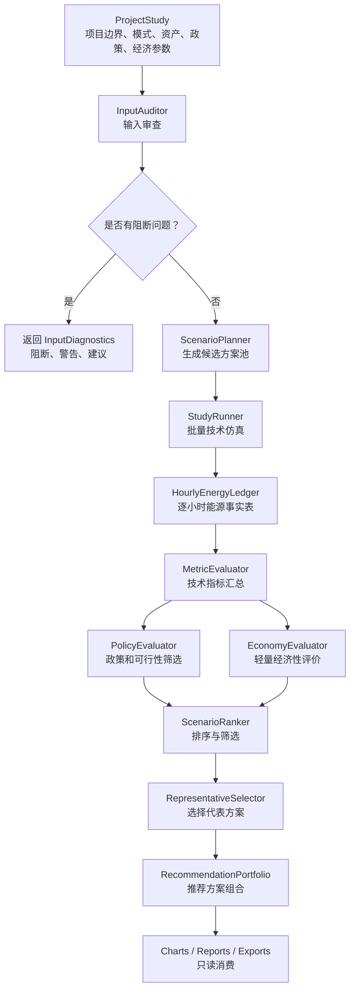

# 目标架构与计算逻辑说明

日期：2026-05-19  
状态：架构重定向草案  
目标：指导后续 Codex / Claude Code 开发，并供专家审查内部逻辑

## 1. 架构重定向目标

当前软件已经能完成 V0.1 风光储批量技术测算，但它的核心输出仍偏向“所有枚举方案的结果表”。新的目标是把系统升级为：

```text
项目方案策划与推荐平台
```

目标不是马上推翻当前代码，而是在保留 V0.1 技术基线的前提下，逐步补齐：

- 项目上下文；
- 输入诊断；
- 统一能源台账；
- 柴发资产；
- 多调度策略；
- 政策筛选；
- 经济性排序；
- 代表方案推荐；
- 大批量结果存储；
- 面向报告和图表的稳定接口。

## 2. 目标主流程



核心原则：

```text
技术仿真是事实基础。
政策、经济、图表、报告、推荐都应读取事实基础，不应悄悄改变事实基础。
```

## 3. 关键领域对象

### 3.1 ProjectStudy

`ProjectStudy` 是一次项目测算任务的顶层上下文。

建议字段：

```text
study_id
project_name
project_mode
time_params
input_curves
asset_boundary
scenario_generation_config
bess_params
grid_params
diesel_params
policy_params
economy_params
recommendation_params
```

`project_mode` 建议枚举：

```text
GRID_CONNECTED
GRID_CONNECTED_WITH_DIESEL_BACKUP
OFF_GRID
WEAK_GRID
CUSTOM
```

说明：

- 并网、离网、弱网不应仅靠 `allow_export` 或 `grid_exchange_power_limit` 间接表达；
- 项目模式会影响调度策略、政策指标、可靠性指标和经济口径；
- 当前 V0.1 可映射为 `GRID_CONNECTED`。

### 3.2 InputDiagnostics

输入审查应成为一等对象，不应只是异常字符串。

建议结构：

```text
DiagnosticIssue
  severity: blocker / warning / info
  source: load_curve / pv_curve / wind_curve / scenario_grid / policy / economy / diesel
  code: INVALID_LENGTH / TIME_MISMATCH / NEGATIVE_LOAD / MISSING_PRICE / ...
  message: 给用户看的中文说明
  location: 行号、列名、参数名，可为空
  suggestion: 建议如何处理
```

好处：

- UI 可展示“阻断 / 警告 / 提示”；
- CLI 可输出统一检查报告；
- 报告可附带输入审查页；
- AI 或专家审查可快速知道数据质量状态。

### 3.3 AssetBoundary

资产边界应从简单容量字段升级为可扩展资产模型。

建议初期资产：

```text
LoadAsset
PVAsset
WindAsset
BessAsset
GridConnection
DieselGenerator
```

#### LoadAsset

```text
load_curve
critical_load_ratio 可选
shedding_allowed 可选
unserved_load_penalty 可选
```

#### PVAsset / WindAsset

```text
capacity
pu_curve
station_use_handling
```

站用电口径沿用当前产品打磨结果：负值按站用电处理。

#### BessAsset

```text
power_capacity
energy_capacity
soc_initial
soc_min
soc_max
eta_charge
eta_discharge
cycle_life
allowed_charge_sources
allowed_discharge_sinks
```

当前基线：

```text
allowed_charge_sources = [renewable_surplus]
allowed_discharge_sinks = [load]
```

未来若允许柴油或电网给储能充电，必须增加能源来源追踪。

#### GridConnection

```text
allow_import
allow_export
import_power_limit
export_power_limit
exchange_power_limit
annual_export_rate_cap
export_control_mode
purchase_price_profile 可选
export_price_profile 可选
```

当前 `grid_exchange_power_limit` 可演进为更明确的上网 / 下网 / 双向限制。

#### DieselGenerator

建议初期字段：

```text
enabled
capacity
min_output
max_output
min_stable_output 可选
fuel_consumption_mode
fuel_consumption_rate
fuel_price
variable_om_cost
emission_factor
startup_cost 可选
min_runtime 可选
```

初期可采用简单线性油耗：

```text
fuel_liter = diesel_generation_energy * fuel_liter_per_kwh
```

后续可扩展为带空载油耗的曲线：

```text
fuel_liter = a * running_hours + b * diesel_generation_energy
```

专家需确认初期应采用哪种模型。

### 3.4 CandidateScenario

候选方案不应只包括风光储容量。

建议结构：

```text
scenario_id
scenario_family
pv_capacity
wind_capacity
bess_power
bess_energy
diesel_capacity
grid_limit
dispatch_strategy_id
tags
```

`scenario_family` 可用于解释方案来源：

```text
GRID_ENUMERATION
USER_PINNED
LOW_STORAGE
NO_EXPORT
HIGH_GREEN_SHARE
OFFGRID_BACKUP
DIESEL_SENSITIVITY
```

### 3.5 HourlyEnergyLedger

统一逐小时能源台账是目标架构的核心。

当前逐小时表已经接近这个目标，但未来需要扩展为“事实表”。

建议字段分组如下。

#### 基础索引

```text
study_id
scenario_id
timestamp
hour_index
dt_hours
```

#### 负荷与资源

```text
load_power
critical_load_power
pv_power
wind_power
pv_generation_power
wind_generation_power
renewable_generation_power
pv_station_use_power
wind_station_use_power
station_use_power
renewable_power
```

#### 负荷供给来源

```text
direct_renewable_to_load_power
bess_to_load_power
grid_to_load_power
diesel_to_load_power
unserved_load_power
```

#### 富余新能源去向

```text
renewable_to_bess_power
renewable_to_grid_power
renewable_curtail_power
```

#### 储能状态

```text
bess_charge_power
bess_discharge_power
bess_energy_start
bess_energy_end
soc_start
soc_end
bess_loss_power
```

如果未来允许不同来源给储能充电，建议增加：

```text
bess_charge_from_renewable_power
bess_charge_from_grid_power
bess_charge_from_diesel_power
bess_discharge_green_component_power
bess_discharge_non_green_component_power
```

这对于绿电口径非常关键。

#### 电网交互

```text
grid_import_power
grid_export_power
grid_exchange_power
grid_import_shortfall_power
grid_export_limited_curtail_power
```

#### 柴发

```text
diesel_power
diesel_generation_energy
diesel_fuel_consumption
diesel_fuel_cost
diesel_variable_om_cost
diesel_emission
diesel_running_flag
```

#### 场景与诊断

```text
hour_case
constraint_flags
warning_codes
```

### 3.6 TechnicalSummary

年度技术汇总由 `HourlyEnergyLedger` 汇总得到。

建议包含：

```text
total_load_energy
total_renewable_generation
self_use_energy
green_load_rate
self_use_rate
grid_import_energy
grid_export_energy
export_rate
curtail_energy
curtail_rate
bess_charge_energy
bess_discharge_to_load
bess_loss_energy
annual_equivalent_cycles
diesel_generation_energy
diesel_fuel_consumption
diesel_share_of_load
unserved_load_energy
unserved_load_rate
loss_of_load_hours
max_unserved_load_power
final_soc
```

离网或柴发场景必须增加可靠性指标，否则无法评价方案可行性。

### 3.7 PolicyEvaluation

政策判断不应散落在 summary 里，应形成结构化结果。

建议结构：

```text
scenario_id
pass_policy
pass_reliability
pass_grid_constraints
fail_reasons
metric_checks
```

`metric_checks` 示例：

```text
[
  {
    "metric": "self_use_rate",
    "actual": 0.65,
    "operator": ">=",
    "threshold": 0.60,
    "passed": true
  }
]
```

### 3.8 EconomicEvaluation

经济性评价初期作为排序层。

建议结构：

```text
scenario_id
capex_total
capex_pv
capex_wind
capex_bess_power
capex_bess_energy
capex_diesel
capex_grid_connection
fixed_om_cost
variable_om_cost
grid_purchase_cost
diesel_fuel_cost
diesel_om_cost
export_revenue
annual_net_cost
lcoe_like
simple_payback
warnings
```

完整财务模型后续再扩展：

```text
npv
irr
payback_period
cashflow_table
tax
depreciation
financing
residual_value
```

### 3.9 RecommendationPortfolio

推荐组合是面向用户的主结果。

建议结构：

```text
RecommendationPortfolio
  study_id
  generated_at
  selected_scenarios: list[RecommendedScenario]
  ranking_basis
  warnings
```

```text
RecommendedScenario
  label
  scenario_id
  scenario_family
  capacities
  technical_metrics
  policy_evaluation
  economic_metrics
  recommendation_reason
  tradeoff_notes
  chart_ready
  report_ready
```

推荐引擎需要避免重复推荐高度相似方案。例如“推荐方案”和“低成本方案”如果完全相同，应合并标签或说明同一方案同时满足多个代表性角色。

### 3.10 StudyResult

`StudyResult` 应成为未来 UI、CLI、报告、导出的统一上层返回对象。

建议结构：

```text
StudyResult
  study_id
  input_diagnostics
  scenario_count
  all_summary
  policy_results
  economic_results
  recommendation_portfolio
  selected_hourly_ledgers
  result_store_refs
  config_snapshot
  warnings
  errors
```

`BatchResult` 可以作为底层技术结果保留，但不应长期作为唯一顶层接口。

## 4. 调度策略设计

当前风光储逻辑实际上是一种默认调度策略：

```text
RenewableFirstGridBackupStrategy
```

加入柴发后，应显式建立 `DispatchStrategy`。

### 4.1 并网无柴发：基线策略

```text
新能源供负荷
-> 富余新能源充储能
-> 富余上网或弃电
-> 新能源不足时储能放电
-> 剩余缺口电网下网
```

适用：

- 当前 V0.1；
- 并网绿电直连项目；
- 不考虑柴发。

### 4.2 并网加柴发备用

可能策略 A：柴发最后兜底

```text
新能源供负荷
-> 储能放电
-> 电网下网
-> 若电网受限或不可用，柴发补足
-> 仍不足则 unserved_load
```

适用：

- 柴发用于备用；
- 正常情况下不希望柴油运行；
- 电网存在但可能有交换功率限制。

可能策略 B：柴油替代高价下网

```text
新能源供负荷
-> 储能放电
-> 比较柴油边际成本和电网购电价格
-> 低成本者供电
```

适用：

- 有分时电价或高电价时段；
- 柴油允许经济性运行；
- 这已接近经济调度，建议后续再做。

初期建议：

```text
优先实现策略 A，不要过早引入经济调度。
```

### 4.3 离网风光储柴

推荐初期策略：

```text
新能源供负荷
-> 富余新能源充储能
-> 富余弃电
-> 新能源不足时储能放电
-> 柴发补足剩余缺口
-> 柴发能力不足则记录 unserved_load
```

待专家确认的问题：

- 柴发是否应先启动并带一定最小出力，再用富余给储能充电？
- 柴发最小稳定负荷是否必须纳入？
- 离网场景是否允许电池充自柴油？

### 4.4 柴发给储能充电的问题

这是最敏感的口径问题。

如果柴油给储能充电，储能后续放电就不再天然属于绿电。因此必须追踪储能内部电量来源。

可选方案：

1. 初期禁止柴油给储能充电；
2. 允许柴油给储能充电，但储能内部做“绿电 / 非绿电”分账；
3. 允许柴油给储能充电，但所有储能放电均按非绿电处理；
4. 根据先进先出或比例混合模型追踪储能来源。

建议初期采用方案 1，除非专家认为离网可靠性必须允许柴发充电。

如果未来采用方案 2 或 4，需要新增字段：

```text
bess_green_energy_start
bess_non_green_energy_start
bess_green_energy_end
bess_non_green_energy_end
bess_discharge_green_power
bess_discharge_non_green_power
```

## 5. 方案生成与推荐

### 5.1 候选方案生成

当前是笛卡尔积枚举：

```text
pv_range x wind_range x bess_power_range x bess_duration_options
```

未来应抽象为多种策略：

```text
GridEnumerationStrategy
UserPinnedScenarioStrategy
BaselineScenarioStrategy
NoExportScenarioStrategy
HighGreenShareStrategy
LowCurtailmentStrategy
DieselSensitivityStrategy
OffgridReliabilityStrategy
```

这些策略都输出 `CandidateScenario`，后续统一进入仿真。

### 5.2 筛选顺序

建议方案池处理顺序：

```text
全部候选方案
-> 计算技术结果
-> 去除计算失败方案
-> 政策 / 可行性硬筛选
-> 经济性评价
-> 多目标排序
-> 选择代表方案
```

对于不同模式，硬筛选条件不同：

并网：

- 自发自用率；
- 绿电占比；
- 上网比例；
- 电网交换功率限制；
- 不允许下网缺口。

离网：

- 不允许或限制缺供；
- 柴发出力不超限；
- SOC 不越界；
- 柴油消耗、弃电、储能循环作为排序因素。

### 5.3 排序指标

建议支持多个排序视角：

```text
policy_first_then_cost
lowest_annual_net_cost
highest_green_load_rate
highest_self_use_rate
lowest_export_rate
lowest_curtail_rate
lowest_bess_energy
lowest_diesel_consumption
lowest_unserved_load
balanced_score
```

综合评分需要谨慎，不应让用户误以为它是唯一真理。建议展示“为什么推荐”，而不是只展示一个黑箱分数。

## 6. 大批量结果存储

当前 `BatchResult` 会保存所有方案的逐小时 DataFrame。这个方式简单，但大批量方案会占用大量内存。

目标方式：

```text
summary 常驻内存
selected_hourly_ledgers 常驻内存
all_hourly_ledgers 按需保存到文件
```

建议 `ResultStore`：

```text
outputs/runs/{study_id}/
  config_snapshot.json
  diagnostics.json
  summary.parquet 或 summary.csv
  policy_results.parquet
  economic_results.parquet
  recommendations.json
  hourly/
    {scenario_id}.parquet 或 csv
```

UI 逻辑：

- 默认展示推荐组合；
- 用户点选方案时加载或重算该方案逐小时台账；
- 导出报告只包含被选中的代表方案明细；
- 全量明细导出作为高级选项。

## 7. 当前代码到目标架构的映射

| 当前模块 | 当前职责 | 目标演进 |
|---|---|---|
| `io/read_curves.py` | CSV 读取和标准化 | 继续保留，增加结构化 diagnostics |
| `io/validators.py` | 输入校验 | 演进为 `InputAuditor` |
| `models/params.py` | 参数 dataclass | 拆出资产、项目、策略参数 |
| `models/scenario.py` | 风光储容量方案 | 扩展为 `CandidateScenario` |
| `core/bess_dispatch.py` | 小时级储能调度 | 演进为 dispatch strategy 的一部分 |
| `core/single_scenario_simulator.py` | 单方案仿真 | 演进为 `SimulationEngine` |
| `core/metrics.py` | 汇总和政策判断 | 拆为 `MetricEvaluator` 和 `PolicyEvaluator` |
| `batch/scenario_generator.py` | 网格枚举 | 演进为 `ScenarioPlanner` |
| `batch/batch_runner.py` | 批量运行 | 演进为 `StudyRunner` |
| `export/` | Excel/CSV 导出 | 增加推荐结果和专家审查包导出 |
| `visualization/` | 图表 | 只读消费 `StudyResult` / `EnergyLedger` |
| `ui/app.py` | Streamlit | 调用 `StudyRunner`，避免承担业务编排 |
| `economy/` | 预留 | 实现轻量经济性排序 |

## 8. 测试策略

目标架构必须保留当前核心测试，并增加以下测试：

### 8.1 现有基线回归

- 储能只从新能源充电；
- 储能不放电上网；
- SOC 滚动；
- 8760 / 8784 校验；
- 年度上网比例硬约束；
- 电网交换功率限制；
- 风光负值站用电。

### 8.2 推荐引擎测试

- 政策不达标方案不会被标为推荐综合方案；
- 经济最优方案和高绿电方案可能不同；
- 代表方案去重；
- 推荐理由包含排序依据。

### 8.3 经济性测试

- capex 分项正确；
- 下网购电成本来自 `grid_import_energy`；
- 上网收入来自 `grid_export_energy`；
- 柴油燃料成本来自 `diesel_generation_energy` 或 fuel consumption；
- 经济性不修改技术结果。

### 8.4 柴发测试

- 离网缺口由储能后再由柴发补足；
- 柴发功率不超过容量；
- 柴发不足时记录 `unserved_load_power`；
- 柴发发电不计入新能源自发自用；
- 若禁止柴油充储能，则不会出现 `bess_charge_from_diesel_power`。

## 9. 待专家确认的关键设计决策

1. 轻量经济性排序的第一阶段字段是否足够？
2. 柴发初期是否需要最小稳定出力和启停逻辑？
3. 离网策略是否应允许柴油给储能充电？
4. 并网加柴发是否只作为备用，还是允许经济性运行？
5. 绿电自发自用口径在柴油、储能混合后如何追踪最合理？
6. 代表方案分类是否符合工程决策习惯？
7. 是否需要早期引入优化算法，还是继续以枚举 + 筛选为主？

