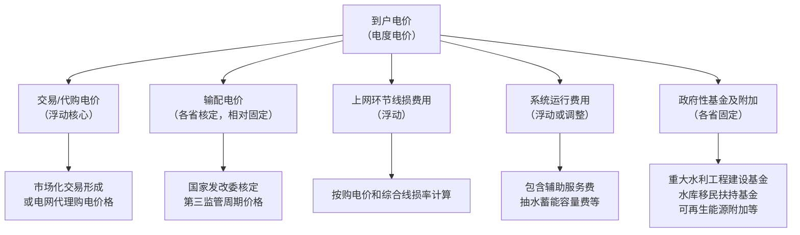

大工业用电的电费单就像一份详细的账单，主要由**基本电费、电度电费、力调电费（功率因数调整电费）** 三部分组成。其中，一部分是固定费用，一部分随市场波动，还有一部分各省标准不同。

### ⚡️ 基本电费：企业用电的"固定月租"
这部分是**固定**的，类似于电话的月租费，反映的是电网为企业随时可用而预留的容量成本，与实际用电量多少无关。

*   **计算方式（二选一）**：
    1.  **按变压器容量计算**：每月固定费用 = 变压器容量 (kVA) × 容量电价 (元/kVA·月)。
    2.  **按最大需量计算**：每月固定费用 = 当月实际最大用电功率 (kW) × 需量电价 (元/kW·月)。
*   **价格标准**：**全国各省自行核定，差异巨大**。例如，同一档电压等级下，北京的容量电价曾为32元/kVA·月，而天津仅为17元/kVA·月。

### 📈 电度电费：随行就市的"通话费"
这部分是**完全浮动**的，也是最核心的部分，根据你的实际用电度数来计算。对于参与市场交易的用户，这部分单价完全由市场供需决定，由下图中的多个子项构成。

具体构成如下：

*   **交易/代购电价**：这是电度电价中**最主要的浮动部分**。
    *   **市场化交易用户**：电价通过中长期交易、现货市场等方式与发电企业直接协商形成，**完全随市场供需波动**。
    *   **非市场化交易用户**：电价由电网公司代理购电，按月公布，也会根据市场情况变化。
*   **输配电价**：这笔费用是**各省固定，全国不同**。它相当于电网的"过路费"，用于弥补电网的输配电成本。国家发改委为每个省分电压等级核定不同的输配电价，例如，在第三监管周期，安徽两部制35千伏用户的电度输配电价为0.1144元/千瓦时，而黑龙江35千伏大工业用户为0.2615元/千瓦时。这反映了不同地区电网建设和运营成本的差异。
*   **上网环节线损费用**：这笔费用是**浮动**的，用于补偿电力传输过程中的损耗。它按实际购电价格乘以一个综合线损率来计算，因此会随购电成本的变化而波动。
*   **系统运行费用**：这笔费用是**浮动或周期性调整**的，用于支付保障电力系统安全稳定运行所必需的辅助服务。例如，为保证电网瞬时平衡而预留的调峰、调频等辅助服务费用，以及抽水蓄能电站的容量电费等。这些费用会根据系统实际运行需要和国家的政策调整而变化。
*   **政府性基金及附加**：这笔费用是**各省固定**的，属于政策性成本，"代收代缴"用于国家重大水利工程建设、水库移民后期扶持以及支持可再生能源发展等特定公共事业。它看似固定，但**主要按各省标准征收，差异很大**。例如，重大水利工程建设基金在江苏高达14.91厘/千瓦时，而在西部大部分省份仅4厘/千瓦时。
*   **峰谷分时电价**：在上述各项费用的基础上，很多省份还实行**峰谷分时电价**，即用电高峰时段价格高，低谷时段价格低。具体的**峰谷时段划分和浮动系数，由各省根据本地电力供需情况自主制定**，因此各省差异显著。例如，广东、山东等地的峰谷价差通常较大，而甘肃、云南等地相对较小。市场化用户的分时电价还与交易合同挂钩，机制更为复杂。

### 💡 力调电费：用电效率的"奖惩单"
*   **性质**：**浮动**
*   这笔费用是根据你用电的"效率"（即功率因数）高低而收取的奖励或罚款，目的是鼓励大家提高用电效率。
*   **计算方法**：力调电费 = (基本电费 + 电度电费) × 力调系数。
*   当你的功率因数高于国家标准时，力调系数为负，就会**减收**总电费；反之，则会**加收**电费。

---

### 💎 总结

大工业电价的复杂性在于它像一个精密的仪表，同时监测着企业用电的"容量"、"电量"和"效率"。简单来说：

*   **固定部分**：**基本电费**（保底），和本省标准绑定。
*   **浮动部分**：**电度电费**（大头），取决于市场交易和峰谷时段；**力调电费**，取决于你的用电效率。
*   **各省固定部分**：**输配电价**和**政府性基金及附加**，这些构成了电价的地域差异。
