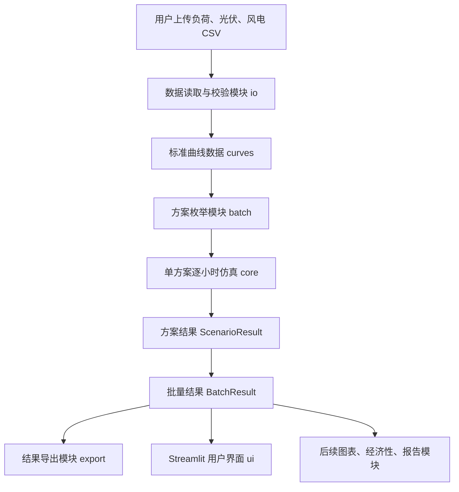
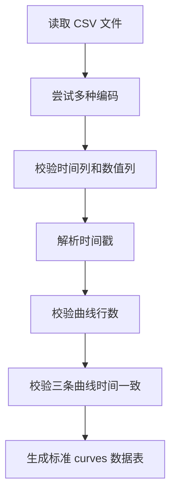
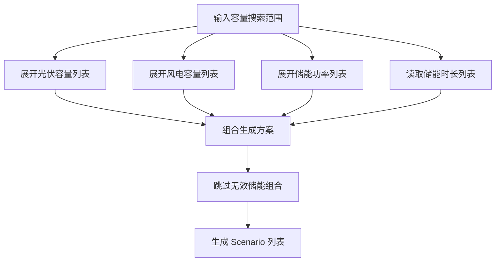
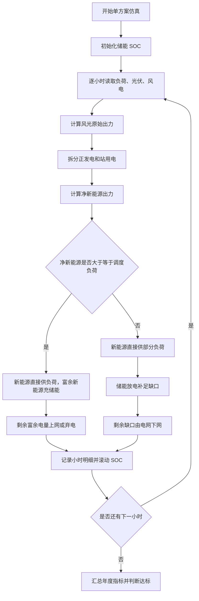
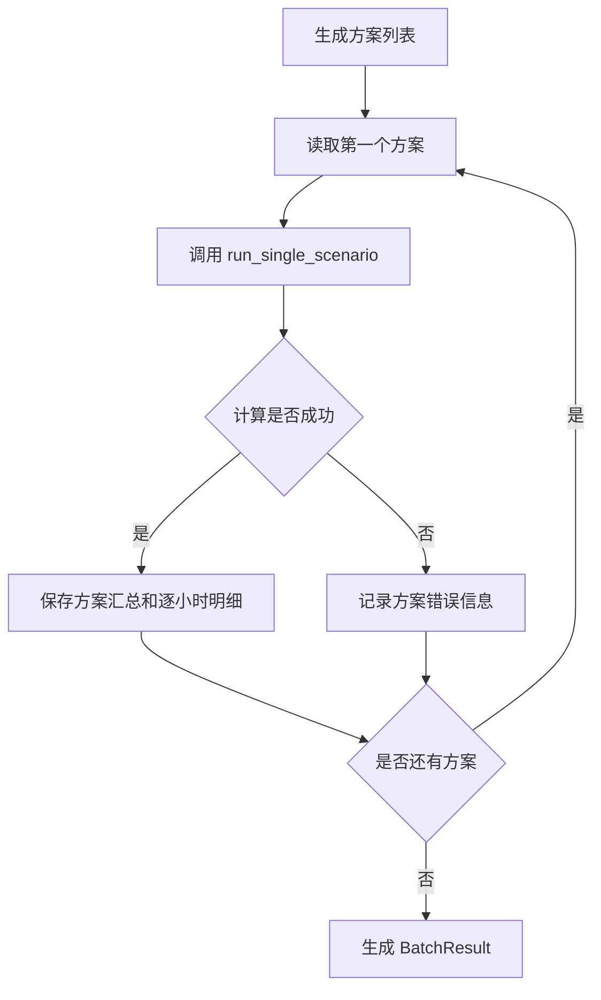

# 绿电直连风光储协同容量测算与达标评估系统 V1.0 设计说明书

## 1. 软件概述

绿电直连风光储协同容量测算与达标评估系统 V1.0 是一款面向绿电直连项目的技术测算与政策达标评估软件。软件围绕负荷、光伏、风电逐小时曲线，批量枚举风电、光伏、储能容量组合，对每个方案执行逐小时能量平衡、储能 SOC 滚动计算、上网与下网约束处理、政策指标计算和结果导出。

本软件适用于绿电直连项目前期方案编制、设计院技术测算、咨询单位方案筛选、企业内部风光储配置复核等场景。当前版本的重点是技术测算和政策达标筛选，不包含 LCOE、IRR、NPV、投资回收期、电价优化、储能套利等经济性评价内容。

软件全称：绿电直连风光储协同容量测算与达标评估系统  
版本号：V1.0  
开发语言：Python  
主要运行方式：本地 Streamlit Web 界面  
主要输出：方案汇总 Excel、逐小时明细 CSV/ZIP、配置快照 JSON

## 2. 设计目标

软件设计目标包括：

1. 支持负荷、光伏、风电逐小时曲线导入，并完成编码、时间戳、行数和数值校验。
2. 支持 8760 小时普通年和 8784 小时闰年。
3. 支持光伏容量、风电容量、储能功率、储能时长等方案组合批量枚举。
4. 对每个方案执行逐小时能量平衡计算。
5. 储能 SOC 必须逐小时滚动，并受 SOC 上下限、储能功率、储能容量和充放电效率约束。
6. 储能只能由富余新能源充电，不能从电网充电，不能同小时充电和放电，不能放电上网。
7. 支持风光负值标幺曲线按站用电参与计算。
8. 支持年度上网比例硬约束和可选电网交换功率限制。
9. 输出年度汇总指标和逐小时明细，便于用户人工复核。
10. 保留后续图表、经济性评价、报告生成模块的接口边界。

## 3. 总体设计结构

软件采用模块化结构组织，核心目录位于 `src/green_direct/`。各模块职责如下：

| 模块 | 目录 | 主要职责 |
|---|---|---|
| 数据读取与校验模块 | `io/` | CSV 编码识别、曲线读取、时间列解析、数值校验、三条曲线合并 |
| 参数与结果模型模块 | `models/` | 储能参数、政策参数、时间参数、方案模型、结果对象 |
| 核心测算模块 | `core/` | 单小时储能调度、单方案逐小时仿真、技术指标和达标判断 |
| 批量测算模块 | `batch/` | 容量组合枚举、批量运行、进度回调、错误记录 |
| 结果导出模块 | `export/` | 汇总 Excel、逐小时 CSV、明细 ZIP、配置快照导出 |
| 经济性接口预留模块 | `economy/` | 保留后续经济性评价扩展边界，当前版本不实现经济计算 |
| 用户界面模块 | `ui/` | Streamlit 页面、文件上传、参数输入、结果展示和下载 |

总体结构图如下：



## 4. 数据设计

### 4.1 输入数据

软件核心测算使用标准化后的 `curves` 数据表。字段如下：

| 字段 | 类型 | 说明 |
|---|---|---|
| `timestamp` | datetime | 小时时间戳 |
| `load_power` | float | 用户负荷功率，单位为万千瓦 |
| `pv_pu` | float | 光伏标幺曲线，可为负 |
| `wind_pu` | float | 风电标幺曲线，可为负 |

数据要求：

1. 负荷、光伏、风电三条曲线行数必须一致。
2. 时间戳必须逐行一致。
3. 行数支持 8760 或 8784。
4. 负荷功率不能为负。
5. 光伏和风电标幺值允许为负，负值按站用电处理。
6. 光伏和风电标幺值大于 1 时允许参与计算，但界面提示用户复核。

### 4.2 参数数据

储能参数由 `BessParams` 表示：

| 字段 | 说明 |
|---|---|
| `soc_initial` | 初始 SOC |
| `soc_min` | 最小 SOC |
| `soc_max` | 最大 SOC |
| `eta_charge` | 充电效率 |
| `eta_discharge` | 放电效率 |
| `cycle_life` | 循环寿命 |

政策参数由 `PolicyParams` 表示：

| 字段 | 说明 |
|---|---|
| `self_use_rate_min` | 自发自用率下限 |
| `green_load_rate_min` | 绿电占用户用电比例下限 |
| `export_rate_max` | 上网比例上限 |
| `allow_export` | 是否允许上网 |
| `export_power_max` | 最大上网功率限制 |
| `grid_exchange_power_limit` | 与电网交换功率限制 |
| `export_control_mode` | 上网比例控制模式 |

方案数据由 `Scenario` 表示：

| 字段 | 说明 |
|---|---|
| `scenario_id` | 方案编号 |
| `pv_capacity` | 光伏容量，万千瓦 |
| `wind_capacity` | 风电容量，万千瓦 |
| `bess_power` | 储能功率，万千瓦 |
| `bess_energy` | 储能容量，万千瓦时 |

### 4.3 输出数据

方案汇总表主要字段包括：

| 字段 | 说明 |
|---|---|
| `scenario_id` | 方案编号 |
| `pv_capacity` | 光伏容量 |
| `wind_capacity` | 风电容量 |
| `bess_power` | 储能功率 |
| `bess_energy` | 储能容量 |
| `total_load_energy` | 用户总用电量 |
| `total_renewable_generation` | 新能源总可用发电量 |
| `self_use_energy` | 新能源自发自用电量 |
| `grid_import_energy` | 下网电量 |
| `grid_export_energy` | 上网电量 |
| `curtail_energy` | 弃电量 |
| `self_use_rate` | 自发自用率 |
| `green_load_rate` | 绿电占用户用电比例 |
| `export_rate` | 上网比例 |
| `curtail_rate` | 弃电率 |
| `annual_equivalent_cycles` | 储能年等效循环次数 |
| `pass_policy` | 是否达标 |
| `fail_reasons` | 不达标原因 |

逐小时明细表主要字段包括：

| 字段 | 说明 |
|---|---|
| `timestamp` | 小时时间 |
| `load_power` | 用户负荷 |
| `pv_power` | 光伏原始出力 |
| `wind_power` | 风电原始出力 |
| `renewable_generation_power` | 新能源总可用发电功率 |
| `station_use_power` | 风光站用电 |
| `renewable_power` | 抵扣站用电后的净新能源 |
| `direct_self_use_power` | 新能源直接供负荷 |
| `bess_charge_power` | 储能充电功率 |
| `bess_discharge_power` | 储能放电功率 |
| `grid_import_power` | 下网功率 |
| `grid_export_power` | 上网功率 |
| `curtail_power` | 弃电功率 |
| `soc_start` | 小时初 SOC |
| `soc_end` | 小时末 SOC |
| `hour_case` | 小时场景 |

## 5. 功能模块设计

### 5.1 数据读取与校验模块

数据读取与校验模块负责将用户上传的 CSV 文件转换成标准曲线数据。模块支持多种中文常见编码，避免用户因文件编码不同无法读取。读取完成后，软件校验时间列、数值列、行数、时间戳对齐和数值合法性。

核心函数：

| 函数 | 功能 |
|---|---|
| `read_csv_auto_encoding` | 自动尝试 UTF-8、UTF-8-SIG、GBK、GB18030 读取 CSV |
| `read_load_curve` | 读取并标准化负荷曲线 |
| `read_pu_curve` | 读取并标准化光伏或风电标幺曲线 |
| `read_curve_set` | 读取三条曲线并合并为统一数据表 |
| `validate_required_columns` | 校验必要列是否存在 |
| `parse_timestamp_column` | 解析时间列 |
| `validate_supported_length` | 校验 8760 或 8784 行 |
| `validate_aligned_curves` | 校验三条曲线时间戳一致 |

数据校验流程如下：



### 5.2 方案枚举模块

方案枚举模块根据用户输入的容量范围生成候选方案。光伏容量、风电容量、储能功率通过起始值、结束值、步长生成；储能容量由储能功率和储能时长计算。

核心函数：

| 函数 | 功能 |
|---|---|
| `values_from_range` | 将范围参数展开为数值列表 |
| `parse_scenario_grid` | 解析方案网格配置 |
| `generate_scenarios` | 生成 `Scenario` 列表 |
| `estimate_scenario_count` | 估算方案数量 |

方案枚举逻辑如下：



### 5.3 单方案逐小时测算模块

单方案测算模块是软件核心。它对一个风光储容量方案执行逐小时循环，计算风光出力、站用电、净新能源、负荷缺口、储能充放电、上网、弃电、下网和 SOC。

核心函数：

| 函数 | 功能 |
|---|---|
| `run_single_scenario` | 执行单方案全年逐小时仿真 |
| `dispatch_hour` | 执行单小时储能调度和上网/下网处理 |
| `calculate_summary` | 根据逐小时明细汇总年度指标 |
| `evaluate_policy` | 根据政策参数判断方案是否达标 |

单方案测算流程如下：



### 5.4 储能调度模块

储能调度模块负责单小时内的充放电决策。软件采用技术测算型贪心策略，不做电价套利和经济性最优。

当净新能源大于等于调度负荷时：

```text
direct_self_use = load_energy
surplus = renewable_energy - load_energy
bess_charge = min(
    surplus,
    bess_power * dt,
    (soc_max * bess_energy - bess_energy_start) / eta_charge
)
bess_energy_end = bess_energy_start + bess_charge * eta_charge
```

当净新能源小于调度负荷时：

```text
direct_self_use = renewable_energy
deficit = load_energy - renewable_energy
bess_discharge = min(
    deficit,
    bess_power * dt,
    (bess_energy_start - soc_min * bess_energy) * eta_discharge
)
bess_energy_end = bess_energy_start - bess_discharge / eta_discharge
```

储能运行约束：

1. 只能由富余新能源充电。
2. 不能从电网充电。
3. 不能同小时充电和放电。
4. 不能放电上网。
5. 放电只用于补足负荷或站用电缺口。
6. SOC 不低于 `soc_min`，不高于 `soc_max`。
7. 充放电受储能功率和储能容量约束。
8. 充放电效率参与电量更新。

### 5.5 风光站用电处理模块

光伏、风电标幺曲线可能出现负值。当前版本将负值解释为电源站用电，不直接判为异常。

每小时处理方式如下：

```text
pv_power = pv_pu * pv_capacity
wind_power = wind_pu * wind_capacity

pv_generation_power = max(pv_power, 0)
wind_generation_power = max(wind_power, 0)

pv_station_use_power = max(-pv_power, 0)
wind_station_use_power = max(-wind_power, 0)

renewable_generation_power = pv_generation_power + wind_generation_power
station_use_power = pv_station_use_power + wind_station_use_power

net_renewable_power = renewable_generation_power - station_use_power
renewable_power = max(net_renewable_power, 0)
station_use_deficit_power = max(-net_renewable_power, 0)
dispatch_load_power = load_power + station_use_deficit_power
```

该设计保证风光负值不会被简单丢弃，同时在逐小时明细和汇总指标中保留站用电口径。

### 5.6 政策达标评估模块

软件根据年度汇总指标判断方案是否达标。主要指标包括：

```text
self_use_rate = self_use_energy / total_renewable_generation
green_load_rate = self_use_energy / total_load_energy
export_rate = grid_export_energy / total_renewable_generation
curtail_rate = curtail_energy / total_renewable_generation
grid_import_rate = grid_import_energy / total_load_energy
```

默认达标条件：

1. 自发自用率不低于设定下限。
2. 绿电占用户用电比例不低于设定下限。
3. 上网比例不高于设定上限。
4. 若不允许上网，则上网电量必须为 0。
5. 若设置电网交换功率限制，则不能出现下网缺口。

不达标原因由软件明确列出，便于用户筛选和复核。

### 5.7 批量测算模块

批量测算模块对方案列表逐一调用单方案测算函数。单个方案失败不会中断整批计算，失败信息会进入错误表。

批量运行流程如下：



### 5.8 结果导出模块

结果导出模块用于将测算结果保存为用户可使用的文件。

核心函数：

| 函数 | 功能 |
|---|---|
| `export_summary_excel` | 导出方案汇总 Excel |
| `export_hourly_detail_csv` | 导出单方案逐小时 CSV |
| `export_hourly_details_zip` | 打包导出全部逐小时 CSV |
| `export_config_snapshot` | 导出测算配置快照 JSON |

Excel 文件包含以下工作表：

1. `Summary`：全部方案汇总。
2. `Policy_Passed`：达标方案。
3. `Policy_Failed`：不达标方案。
4. `Top_By_Green_Load_Rate`：按绿电占比排序。
5. `Top_By_Low_Curtail_Rate`：按低弃电率排序。
6. `Config`：配置快照。
7. `Warnings`：警告信息。

### 5.9 用户界面模块

用户界面模块基于 Streamlit 实现。用户可在浏览器中完成文件上传、参数设置、方案测算、结果查看和下载。

界面主要区域：

1. 数据上传区：支持批量上传或分别上传负荷、光伏、风电 CSV。
2. 数据状态区：展示小时数、时间范围、编码、负值点、大于 1 点等提示。
3. 容量搜索范围区：设置光伏容量、风电容量、储能功率和储能时长。
4. 储能参数区：设置 SOC、效率和循环寿命。
5. 政策约束区：设置自发自用率、绿电占比、上网比例、年度硬约束和交换功率限制。
6. 计算结果区：展示方案数量、达标方案数、最高绿电占比、最低弃电率等指标。
7. 筛选排序区：支持只看达标方案、方案类型筛选和技术指标排序。
8. 明细查看区：选择单个方案查看逐小时明细。
9. 下载区：下载方案汇总 Excel、全部逐小时 ZIP 和单方案 CSV。

## 6. 接口设计

### 6.1 数据读取接口

```python
read_curve_set(
    load_source,
    pv_source,
    wind_source,
    load_time_col,
    load_value_col,
    pv_time_col,
    pv_value_col,
    wind_time_col,
    wind_value_col,
    cleaning=None,
    time_params=None,
) -> CurveSet
```

接口说明：读取三条曲线文件，输出标准曲线数据、警告信息和编码信息。

### 6.2 单方案测算接口

```python
run_single_scenario(
    curves,
    scenario,
    bess_params=None,
    policy_params=None,
    dt_hours=1.0,
) -> ScenarioResult
```

接口说明：输入标准曲线数据和单个容量方案，输出方案汇总、逐小时明细和警告信息。

### 6.3 批量测算接口

```python
run_batch(
    curves,
    scenario_grid,
    bess_params=None,
    policy_params=None,
    performance_params=None,
    dt_hours=1.0,
    progress_callback=None,
) -> BatchResult
```

接口说明：输入标准曲线数据和方案搜索范围，输出批量方案汇总、逐小时明细、错误表、警告信息和方案数量。

### 6.4 导出接口

```python
export_summary_excel(summary, output_dir, config_snapshot=None, warnings=None) -> Path
export_hourly_detail_csv(hourly, output_dir, scenario_id=None) -> Path
export_hourly_details_zip(hourly_details, output_dir) -> Path
export_config_snapshot(config_snapshot, output_dir) -> Path
```

接口说明：将批量测算结果和配置快照导出为 Excel、CSV、ZIP 和 JSON 文件。

## 7. 函数名称与功能

| 函数或类 | 所属文件 | 功能说明 |
|---|---|---|
| `DataCleaningParams` | `models/params.py` | 定义风光标幺曲线清洗参数 |
| `BessParams` | `models/params.py` | 定义储能 SOC、效率和寿命参数 |
| `PolicyParams` | `models/params.py` | 定义政策达标阈值和上网约束 |
| `Scenario` | `models/scenario.py` | 表示单个风光储容量方案 |
| `ScenarioResult` | `models/results.py` | 表示单方案结果 |
| `CurveData` | `io/read_curves.py` | 表示单条标准化曲线 |
| `CurveSet` | `io/read_curves.py` | 表示三条曲线合并后的标准数据 |
| `read_csv_auto_encoding` | `io/read_curves.py` | 自动识别 CSV 编码 |
| `read_curve_set` | `io/read_curves.py` | 读取并合并负荷、光伏、风电曲线 |
| `DataValidationError` | `io/validators.py` | 用户友好的数据校验异常 |
| `clean_pu_values` | `io/validators.py` | 清洗和提示光伏、风电标幺值 |
| `validate_aligned_curves` | `io/validators.py` | 校验三条曲线时间一致 |
| `DispatchStep` | `core/bess_dispatch.py` | 表示单小时调度结果 |
| `dispatch_hour` | `core/bess_dispatch.py` | 执行单小时储能充放电和上网下网处理 |
| `run_single_scenario` | `core/single_scenario_simulator.py` | 执行单方案全年逐小时仿真 |
| `calculate_summary` | `core/metrics.py` | 计算方案年度汇总指标 |
| `evaluate_policy` | `core/metrics.py` | 判断方案是否满足政策约束 |
| `generate_scenarios` | `batch/scenario_generator.py` | 根据容量范围生成方案列表 |
| `run_batch` | `batch/batch_runner.py` | 批量运行所有方案 |
| `export_summary_excel` | `export/excel_exporter.py` | 导出方案汇总 Excel |
| `export_hourly_details_zip` | `export/csv_exporter.py` | 导出全部逐小时明细 ZIP |
| `main` | `ui/app.py` | Streamlit 界面入口 |

## 8. 核心算法设计

### 8.1 时间尺度

当前版本默认 `dt_hours = 1.0`，即按小时计算。代码保留时间步长参数，便于后续扩展到 15 分钟或其他时间尺度。

### 8.2 新能源优先供负荷

在每小时内，软件先计算可用于调度的净新能源出力。净新能源优先满足调度负荷，调度负荷包括用户负荷以及未被风光正发电覆盖的站用电缺口。

### 8.3 富余新能源优先充储能

若净新能源大于调度负荷，则富余部分优先为储能充电。可充电量取以下三者最小值：

1. 富余新能源电量。
2. 储能功率上限对应电量。
3. SOC 上限对应的剩余可充空间。

### 8.4 储能不足时由电网下网

若净新能源小于调度负荷，则储能优先放电供负荷。可放电量取以下三者最小值：

1. 负荷缺口。
2. 储能功率上限对应电量。
3. SOC 下限以上可释放电量。

储能仍不足的部分由电网下网。如果设置电网交换功率限制，则下网功率不得超过限制值，超出部分记为供电缺口。

### 8.5 上网与弃电

富余新能源在储能充电后仍有剩余时，软件按是否允许上网、最大上网功率、电网交换功率限制和年度上网比例额度判断上网电量。不能上网的剩余电量计入弃电，并记录弃电原因。

### 8.6 政策达标判断

软件在年度汇总后计算政策指标，判断方案是否达标，并输出不达标原因。这样用户既能看到通过筛选的候选方案，也能知道不达标方案的原因。

## 9. 运行设计

### 9.1 本地运行流程

软件运行流程如下：

```text
安装依赖 -> 启动 Streamlit -> 上传 CSV -> 设置参数 -> 开始测算 -> 查看结果 -> 导出文件
```

启动命令：

```powershell
python -m streamlit run src/green_direct/ui/app.py
```

### 9.2 错误处理

软件对普通用户常见错误给出中文提示，包括：

1. CSV 编码无法识别。
2. 必要列不存在。
3. 时间列无法解析。
4. 行数不是 8760 或 8784。
5. 三条曲线时间戳不一致。
6. 负荷存在负值。
7. 方案数量过大可能导致计算较慢。
8. 单个方案计算失败时记录错误，不中断整批计算。

### 9.3 性能设计

单方案测算使用 NumPy 数组预分配和索引循环，减少逐行构造数据的开销。批量测算提供进度回调，界面展示已完成方案数量。结果下载数据使用会话缓存，避免用户筛选结果表时反复生成 Excel 和 ZIP。

### 9.4 可扩展设计

当前版本预留以下扩展方向：

1. 图表模块：基于汇总结果和逐小时明细生成典型技术图表。
2. 经济性模块：读取技术测算结果，计算投资收益指标，不反向修改技术结果。
3. 报告模块：基于配置快照、汇总表、明细表和图表生成 Word 或 PDF 报告。
4. 大批量模式：未来可改为只保存汇总，按需重算单方案逐小时明细。

## 10. 测试设计

测试代码位于 `tests/` 目录，覆盖以下内容：

| 测试文件 | 覆盖内容 |
|---|---|
| `test_data_validation.py` | CSV 读取、编码、行数、时间戳和数值校验 |
| `test_bess_dispatch.py` | 储能充放电、SOC 约束、上网下网限制 |
| `test_single_scenario.py` | 单方案逐小时能量平衡和站用电口径 |
| `test_metrics.py` | 指标计算和安全除法 |
| `test_batch_runner.py` | 方案枚举、批量运行和错误记录 |
| `test_export.py` | Excel、CSV、ZIP 和配置快照导出 |
| `test_ui_import.py` | Streamlit 界面模块可导入性 |
| `test_project_structure.py` | 项目结构完整性 |

测试命令：

```powershell
python -m pytest
```

## 11. 版本边界

V1.0 当前包含：

1. 逐小时能量平衡。
2. 储能 SOC 滚动计算。
3. 风光储容量方案批量枚举。
4. 政策合规指标计算。
5. Excel/CSV/ZIP 导出。
6. 基础 Streamlit 界面。
7. 站用电、年度上网硬约束、电网交换功率限制等当前口径。

V1.0 当前不包含：

1. 经济性评价。
2. 电价时段优化。
3. 储能套利。
4. 数学规划优化。
5. 自动生成可研报告。
6. 完整离网型源网荷储可靠性分析。

## 12. 材料一致性说明

本设计说明书中的软件名称、版本号、功能范围和申请表信息保持一致：

软件全称：绿电直连风光储协同容量测算与达标评估系统  
版本号：V1.0  
著作权人：陈川洪、曾子涵  
开发完成日期：2026-05-20  
首次发表状态：未发表
